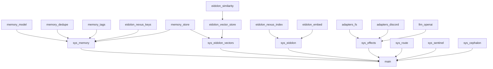

# Decisions

## 2026-02-03T01:52:30Z Task: Phase 1 migration order
Adopted user-provided dependency-aware wave ordering (pure/leaf libs first, then in-memory libs, then IO, then systems, then wiring).

Wave 1: Planning + Contracts
- Redis RPC envelope schema + tests
- Test utilities + mocks
- Align npm deps in services/cephalon-cljs (openai, discord.js, chokidar)

Wave 2: Pure core libs (fast unit tests, no IO)
- memory/model.cljs
- memory/dedupe.cljs
- memory/tags.cljs
- contracts/markdown_frontmatter.cljs
- eidolon/similarity.cljs
- eidolon/nexus_keys.cljs

Wave 3: Stateful but in-memory libs
- memory/store.cljs
- eidolon/nexus_index.cljs
- eidolon/vector_store.cljs
- eidolon/embed.cljs

Wave 4: IO adapters + LLM
- adapters/fs.cljs
- adapters/discord.cljs
- llm/openai.cljs

Wave 5: Systems
- sys/route.cljs
- sys/memory.cljs
- sys/eidolon.cljs
- sys/eidolon_vectors.cljs
- sys/sentinel.cljs
- sys/effects.cljs
- sys/cephalon.cljs

Wave 6: Wire + E2E
- main.cljs wiring (preserve TS bridge)
- E2E workflow tests

Mermaid dependency map (Obsidian friendly):

Redis RPC envelope fields (schema only, no transport yet):
- :rpc/v (int, start 1)
- :rpc/id (uuid string)
- :rpc/ts (ms)
- :rpc/kind (:req | :res)
- :rpc/op (keyword)
- :rpc/payload (map)
- :rpc/meta (map, optional)
- responses: :rpc/ok true + :rpc/result OR :rpc/ok false + :rpc/error {:code keyword :message string :data map?}

2026-02-02T00:00:00Z - Audit: dependency graph for packages/cephalon-cljs/src/promethean/ analyzed; Phase 1 Wave 1 migration order draft.
Phase 1 Wave 1 migration order (topological):
1) promethean.llm.openai
2) promethean.contracts.markdown-frontmatter
3) promethean.eidolon.similarity
4) promethean.nexus_index
5) promethean.nexus_keys
6) promethean.memory.model
7) promethean.memory.dedupe
8) promethean.memory.tags
9) promethean.memory.store
10) promethean.adapters.fs
11) promethean.adapters.discord
12) promethean.eidolon.embed
13) promethean.eidolon.vector-store
14) promethean.normalization.discord-message
15) promethean.policy.types
16) promethean.policy.loader
17) promethean.sys.memory
18) promethean.sys.eidolon
19) promethean.sys.eidolon-vectors
20) promethean.sys.cephalon
21) promethean.sys.route
22) promethean.sys.sentinel
23) promethean.sys.effects
24) bridge/cephalon-ts
25) promethean.main

Notes:
- Phase 1 Wave 1 focuses on foundational modules; Phase 2 will introduce integration points (sys.* and main) with validated dependencies.
- Naming conformance: nexus-index vs nexus_index and vector-store vs vector_store flagged for review when mapping to file paths.
