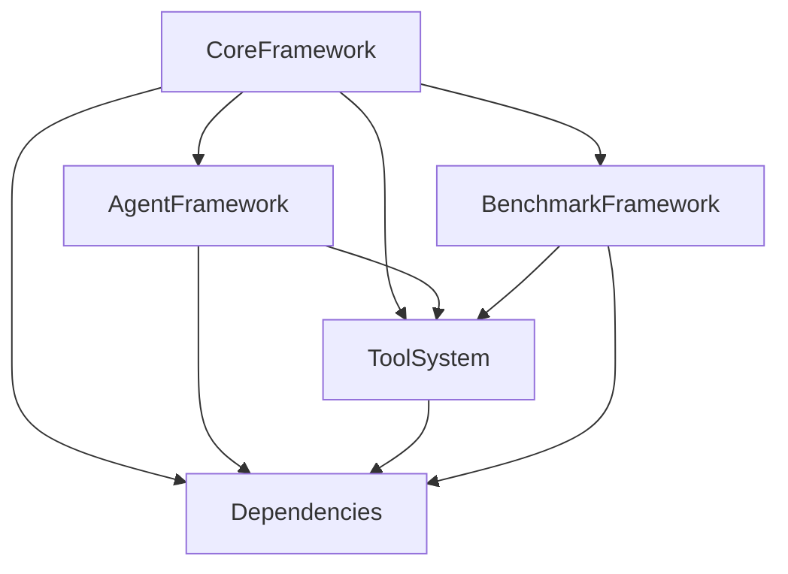

# Dependencies Specification

**Status**: DRAFT  
**Version**: 0.1.0  
**Last Updated**: 2026-01-25  
**Dependencies**: None (Foundation specification)

## Overview

This specification defines cross-spec relationships between core framework components, ensuring proper integration and dependency management across the entire system.

## Dependency Graph

## Core Dependencies

### Core Framework Foundation
- **Ollama Client**: HTTP client for model communication
- **Event System**: JSONL logging and event sourcing
- **Message Bus**: Inter-component communication
- **Configuration Management**: Centralized configuration with validation

### Agent Framework Dependencies
- **Core Framework**: Foundation services (registry, lifecycle, resources)
- **Tool System**: Tool registration, validation, and execution
- **Dependencies**: Agent communication and resource arbitration

### Tool System Dependencies
- **Core Framework**: Foundation services (registry, validation, configuration)
- **Dependencies**: None (Leaf dependency for tool execution)

### Benchmark Framework Dependencies
- **Core Framework**: Foundation services (configuration, events, resources)
- **Agent Framework**: Agent execution and coordination
- **Tool System**: Tool definitions and execution engine

## Version Compatibility Matrix

| Component | Min Core | Agent Framework | Tool System | Benchmark Framework |
|-----------|-------------|----------------|--------------|-------------------|
| Core 0.1.x | ✓ | ✓ | ✓ | ✓ | ✓ |
| Agent 0.1.x | ✓ | ✓ | ✓ | ✓ |
| Tool 0.1.x | ✓ | ✓ | ✓ | ✓ |
| Benchmark 0.1.x | ✓ | ✓ | ✓ | ✓ |

## Integration Points

### Core → Agent Framework
- **Agent Registry**: Agents register with core framework
- **Resource Management**: Agents use core resource allocation and locking
- **Event Communication**: Agent lifecycle events logged to core event system
- **Tool Access**: Agents access tools through core tool registry
- **Configuration**: Agents inherit core configuration with overrides

### Core → Tool System
- **Tool Registration**: Tools register with core framework
- **Schema Validation**: Tools use core validation services
- **Execution Engine**: Tools use core execution context and monitoring
- **Resource Limits**: Tools respect core resource constraints
- **Event Logging**: Tool execution events logged to core event system

### Agent Framework → Tool System
- **Tool Assignment**: Agents receive tool assignments from agent framework
- **Capability Matching**: Tool access based on agent capabilities and requirements
- **Delegation**: Agents delegate tasks to other agents with appropriate tools
- **Security**: Tool access controlled by agent permissions and core security policies

### Benchmark Framework → Tool System
- **Tool Registry**: Benchmarks access tool definitions from core registry
- **Test Generation**: Benchmarks generate test cases using tool schemas
- **Execution Integration**: Benchmarks execute tools through core execution engine
- **Performance Analysis**: Benchmarks collect tool execution metrics through core monitoring

## Change Management

### Version Coordination
- **Semantic Versioning**: All components use SemVer (MAJOR.MINOR.PATCH)
- **Backward Compatibility**: Minimum one minor version of backward compatibility
- **Depreciation Policy**: Minimum 3 minor versions with clear migration paths
- **Breaking Changes**: Major version increments with migration requirements

### Compatibility Testing
- **Interface Contracts**: All public interfaces tested for compliance
- **Integration Testing**: End-to-end workflow testing across component boundaries
- **Regression Testing**: Automated test suites to prevent functionality loss
- **Migration Testing**: Version upgrade and migration path validation

## Security Dependencies

### Trust Boundaries
- **Core Framework**: Foundation of trust for all components
- **Agent Permissions**: Hierarchical permissions managed by core framework
- **Tool Access Control**: Tool access mediated by core security policies
- **Data Flow**: All data flows respect security boundaries and validation

### Isolation Requirements
- **Agent Isolation**: Each agent operates in controlled environment
- **Tool Isolation**: Tool execution in sandboxed environments
- **Network Isolation**: Controlled external API access through core framework
- **File System Isolation**: File access restricted per agent permissions

## Data Flow Dependencies

### Event Dependencies
- **Agent Events**: Agent lifecycle depends on core event system
- **Tool Events**: Tool execution depends on core event system
- **Benchmark Events**: Benchmark execution depends on core event system
- **Dependency Chain**: Event ordering and causality preservation

### Configuration Dependencies
- **Agent Config**: Inherits core configuration with domain-specific overrides
- **Tool Config**: Tool-specific settings managed through core configuration
- **Benchmark Config**: Benchmark parameters managed through core configuration