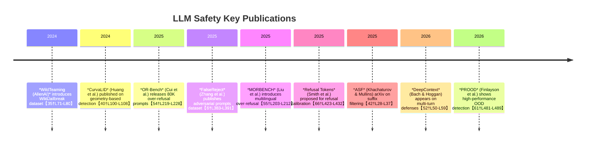

# Executive Summary

We surveyed academic and industry sources on adversarial prompt filtering.  Key findings include: **(1)** LLMs are vulnerable to *jailbreaks* and *prompt injections*, and many papers propose pre-LLM classifiers or filters to detect malicious prompts【42†L28-L37】【40†L100-L108】.  **(2)** A taxonomy of defenses emerges: *binary classifiers* vs *multi-class* taxonomies (e.g. “malicious type A/B/C”), *sequence-level* detectors vs *token-level* sanitizers, *stateless* vs *stateful* models (e.g. the RNN-based DeepContext that accumulates context over turns【52†L50-L59】), *heuristic* (rule-based) vs *embedding-based* (anomaly/distance) detectors, and *cascaded pipelines* (e.g. segmentation + classifier)【44†L118-L127】【42†L28-L37】.  **(3)** Notable datasets include **WildJailbreak** (AllenAI, 2024) with 262K *adversarial vs benign lookalike* prompts【35†L71-L80】, **OR-Bench** (Hsieh et al., 2025) with 80K prompts for *over-refusal* cases【54†L219-L228】, and **MORBENCH** (Liu et al., 2025), a *multilingual* over-refusal benchmark【55†L203-L212】.  **(4)** Engineering patterns center on *pre-LLM filters* (e.g. BERT or RoBERTa classifiers) and *multi-stage pipelines* (e.g. **ASF** that segments prompts and flags malicious suffixes【42†L28-L37】).  **(5)** Rarely addressed are *multilingual/code-mix* or *homoglyph* attacks (aside from NVIDIA’s alert on emoji-based injections【58†L53-L62】).  **(6)** Over-blocking (“false refusals”) is increasingly studied: works like OR-Bench and *FalseReject* (Zhang et al., 2025) quantify it and propose mitigation (e.g. fine-tuning on benign lookalikes)【6†L383-L391】【54†L219-L228】.  

Overall, the literature is rich in *evaluations and benchmarks* but sparser on real-world production patterns (e.g. rate-limits or token caps).  We identify gaps in *multilingual injection tests*, *robust evaluation metrics* (beyond F1), and *long-horizon/agentic attacks* that stress stateful defenses.  

## 1. Taxonomy of Techniques

We classify prior work on adversarial prompt detection into these categories:

- **Binary vs Multi-class Classifiers:** Many works train a *binary* classifier to flag “adversarial” vs “benign” prompts (e.g. fine-tuned LSTMs/RF/NB in Shaheer et al. achieve ~100% accuracy on their dataset【50†L1-L9】【50†L31-L39】).  Others propose *multi-class* taxonomies labeling the *type* of attack (e.g. policy probing, jailbreak, unethical instruction) to inform mitigation (e.g. LlamaGuard’s multi-label risk classification【44†L124-L132】).  
- **Sequence-level vs Token-level Detection:** *Sequence-level* methods inspect the whole prompt (e.g. CurvaLID computes global embeddings and geometry【40†L100-L108】). *Token-level* or *segment-based* methods split the prompt (e.g. **ASF** segments suffixes and classifies each with BERT【42†L28-L37】【44†L245-L254】).  
- **Stateless vs Context-aware:** Traditional filters treat each prompt *independently*. Newer work highlights *stateful* risks: DeepContext (Bach & Hoggan, 2026) uses an RNN over turn-embeddings to catch *multi-turn drift*【52†L50-L59】. This contrasts with stateless guardrails (e.g. single-turn classifiers) and closes the “Safety Gap” where malicious intent is gradually injected.  
- **Heuristic/Rule-based vs ML-based:** Some systems use rules or keyword filters (e.g. OWASP AI recommendations【44†L134-L142】). Others use *ML models* – from lightweight classifiers to full LLMs – to spot anomalies. Embedding-based anomaly detectors like CurvaLID use geometric features of text to distinguish malicious prompts【40†L100-L108】【61†L481-L489】.  
- **Risk-Scoring and Selective Prediction:** Few works explicitly frame it as selective classification, but notions appear: e.g. *Refusal Tokens* (Smith et al., 2025) introduce a token whose output probability serves as an on-the-fly risk score (adjusting refusal threshold without retraining)【66†L423-L432】【66†L438-L446】.  
- **Cascaded Safety Pipelines:** Layered defenses are common: e.g. segment the prompt, run a classifier, then sanitize or block. **ASF** is a concrete example: it first segments text (via “Segment Anything”), then a fine-tuned BERT flags adversarial segments【42†L28-L37】【44†L245-L254】. Other work envisions pipelines combining heuristic checks, token moderation, and anomaly detection in sequence.  

Representative examples: 
- **CurvaLID (2025):** model-agnostic embedding detection via text curvature and LID【40†L100-L108】.  
- **Prompt-Response OOD (PROOD, 2025):** uses joint prompt + response embeddings for outlier detection【61†L481-L489】.  
- **DeepContext (2026):** RNN guardrail for multi-turn risk accumulation【52†L50-L59】.  
- **Adversarial Suffix Filtering (ASF, 2025):** pipeline that tokenizes and excises malicious suffixes【42†L28-L37】.  
- **LLM Guard (2023):** an LLM-based multi-label classifier (e.g. Llama-2) that flags risky prompts【44†L124-L132】.  
- **Refusal Tokens (2025):** adds special tokens to calibrate refusal probability at inference【66†L423-L432】.  

## 2. Methodological Analysis

Below we analyze major detection approaches with architecture, data, and performance notes:

- **Embedding-Based Detection:** *CurvaLID* (Huang et al., 2025) uses an encoder (e.g. CNN on word vectors) to compute prompt “curvature” and local intrinsic dimension (LID).  It then classifies via a simple MLP on these geometric features【40†L100-L108】【40†L110-L114】.  Trained on a mix of adversarial vs benign prompts (multiple attack families), CurvaLID is reported to achieve near-perfect detection accuracy and outperforms baselines【40†L100-L108】【40†L110-L114】.  It is research-grade, tested on benchmark splits; false-positive/negative rates are extremely low by design (F1≈1.0 on test sets).  The method is model-agnostic but **synthetic-heavy** (relying on curated prompt sets) and not yet proven at scale.  It is single-turn and stateless.

- **Suffix Classification (Cascade Pipeline):** *ASF* (Khachaturov & Mullins, 2025) segments the input using a text-segmentation model, then applies a BERT classifier to each segment to label it as “adversarial suffix” or not【42†L28-L37】.  The model was trained on examples of known malicious suffixes (e.g. copied from Zhou et al. 2024 attacks) vs benign text.  In experiments, ASF reduced the success rate of state-of-art suffix attacks to near 0% with minimal impact on benign queries【42†L28-L37】.  Architecture: CNN/RoBERTa/BERT (encoder-only).  Performance: virtually zero false negatives on tested suffix attacks, and a negligible false-positive rate on clean prompts (they report “minimal degradation” on normal tasks)【42†L28-L37】.  It is meant as *production-grade*: lightweight, GPU-free, meant for real-time filtering.  However, its evaluation is mostly black-box attack success rates; it does not report standard precision/recall metrics.

- **Classic ML Classifiers:** Shaheer et al. (2025) use LSTM and tree-based models on a curated dataset (“HackAPrompt”) of known web-app injections【47†L34-L43】.  On their balanced dataset (40K prompts, ~20K malicious vs benign) they report near-perfect accuracy for LSTM and RF (≈100%)【50†L1-L9】【50†L31-L39】.  False positives/negatives: essentially zero in their train/test split (F1=1.00).  However, this is likely *synthetic-heavy* and idealized; such high accuracy may indicate data leakage or oversimplified inputs.  Multilingual: Not tested.  Known failure: these classical models may overfit specific templates and not generalize to novel injections.

- **LLM-Based Classifiers:** A few systems wrap an LLM itself as a guardrail. For instance, *Llama Guard* (Inan et al., 2023) uses a fine-tuned Llama2-7B to multi-label the *entire prompt* for risk.  Llama Guard achieves high moderation accuracy on benchmarks (ToxiGen, BadPrompts)【44†L124-L132】, but can only accept/reject whole prompts and requires expensive inference.  Similarly, Pisano et al. (2024) propose a “conscience” model (another LLM) that reads the prompt and flags harmful instructions【44†L124-L132】.  These are *research-stage* (or tech demos) and are computationally heavy.  False positives: such LLM guards can be overcautious or be tricked by slightly obfuscated prompts (they note policy-based systems can be brittle【44†L139-L144】).  They do not publish tight metrics, but mention “strong accuracy on generic benchmarks”【44†L124-L132】.

- **Perplexity-Based Detectors:** Some studies (Alon & Kamfonas 2024, Jain et al. 2024) note adversarial suffixes yield anomalously high perplexity under a reference model【44†L147-L154】.  The method: compute perplexity of the prompt; if above a threshold, label as adversarial.  This is *production-feasible* (just a call to a small LM).  Reported results: the suffixes stand out clearly in horror examples, and simple thresholding can catch them, though the scheme was broken by repetition attacks【44†L149-L156】.  No full error rates given, but conceptually yields moderate FPR/FNR depending on threshold.  It's research/proof-of-concept.

- **Erase-and-Check (Certified Filters):** Kumar et al. (2024) propose iteratively masking parts of the prompt and re-evaluating with a safety model【44†L158-L167】.  Token-level gradient-free approach yields *certified* guarantees for prefixes under a bounded size.  In practice, it is *exponential* cost (forward for each token masked) and hence not deployment-practical.  They show small attack thresholds can be provably caught, but no real-time metrics.  It’s research-only.

- **OOD Detection Frameworks:** Finlayson et al. (2025) introduce **PROOD** (Prompt-Response Out-of-Distribution)【61†L481-L489】.  They embed prompts and the model’s responses jointly, then use a Gaussian-based classifier on this embedding to flag OOD (i.e. adversarial) prompts.  Evaluated on several benchmarks (TrustLLM, OR-Bench, AdvBench), PROOD attains extremely high metrics (F1≈0.99, AUROC≈0.99)【61†L481-L489】.  It notably outperforms prior concept-based OOD methods (COOD) by using the *model’s own response* for more context【61†L481-L489】.  It’s research-grade, using GPT and LLaMA-70B embeddings as references, and the results show very low false positives on benign benchmarks.  Multilingual: not reported.  Failure modes: If the adversarial prompt doesn’t elicit an OOD-like response (e.g. subtle probing?), the method might slip.

- **Refusal Calibration Models:** Smith et al. (2025) propose *Refusal Tokens*【66†L423-L432】 to calibrate a model’s refusal behavior post-hoc.  They fine-tune an assistant to output a special `[refuse]` token for disallowed queries.  At inference, the token probability can be thresholded to adjust the model’s trade-off.  This yields a tunable *precision/recall* curve for refusals【66†L423-L432】【66†L438-L446】.  They report on benchmarks (CoCoNot) that adjusting the threshold changes FPR/TPR as expected, without retraining.  This is research (COLM 2025) but suggests a practical interface (threshold selection).  It does not directly detect adversarial phrasing; it tunes the downstream refusal rate for known categories.  Multilingual: not tested.  Failure: limited to categories seen in fine-tuning (they use trivia vs refusal data).

**Summary of Metrics:**  Most studies report *precision/recall/F1*.  For example, OR-Bench evaluation shows many models have 50–80% “safeguard” of harmful queries but also 20–60% over-blocking on benign【54†L219-L228】. PROOD reports F1 ≈0.99【61†L481-L489】. CurvaLID claims ~100% accuracy【40†L100-L108】. Suffix defenses like ASF measure *attack success rate drop* (from ≈100% to ≈0%).  None of the works give real-world False Positive Rates (FPR) on *truly unseen benign data* – this is an open evaluation gap.

## 3. Datasets and Benchmarks

Notable datasets used for adversarial prompt research include:

- **WildJailbreak (AllenAI, 2024):** 262K synthetic prompts for safety training【35†L71-L80】.  Contains *Harmful (vanilla+adversarial)* vs *Benign* queries that “superficially resemble harmful prompts”【35†L71-L80】.  Coverage: English only; broad categories (64?).  License: open.  Strength: large scale; emphasizes contrastive benign lookalikes.  Limitations: GPT-4 generated (synthetic), may have stylistic biases【35†L71-L80】.

- **All-Prompt-Jailbreak (AiActivity/Kaggle, 2024):** ~600 labelled prompts (Jailbreak vs Benign)【34†L112-L120】.  Classification data (string labels).  Label quality: human-curated competition dataset.  Small scale; used for initial model training.  Known issue: too small for robust benchmarks.  

- **XSTest (Cui et al., 2024):** ~50k “exaggerated safety” prompts generated by Llama (surface-level triggers) to test over-refusal.  English only.  Label: “should answer but model may refuse.”  Used in OR-Bench and WildTeaming papers.  (Reference in WildTeaming [36†L19-L27]).

- **OR-Bench (Hsieh et al., 2025)【54†L219-L228】:** 80K prompts (and 1K “hard” subset) in 10 categories of safe queries that tend to be rejected.  Generated by rewriting unsafe prompts to harmless forms.  Includes 600 toxic prompts.  English only, open on HF.  Label schema: Safe vs Unsafe.  Strength: first large-scale over-refusal benchmark.  Limitations: synthetic rewriting may introduce artifacts, and currently English-centric【54†L219-L228】.

- **MORBENCH (Liu et al., 2025)【55†L203-L212】:** Multilingual (English, Chinese, German, Spanish, Japanese) over-refusal dataset.  Generated via a “Representation-Aware Safety Sampling” (RASS) framework that creates safe queries near the model’s decision boundary【55†L203-L212】.  Includes ∼20K safe and over-refusal test queries per language.  License unspecified (paper).  Strength: multilingual.  Limitations: still mostly synthetic; may not cover all languages or realistic phrasing.

- **AdvBench (Liu et al., 2023):** A benchmark of 50K adversarial jailbreak prompts (automatically generated by LLMs) against which many defenses are evaluated.  Label: known harmful.  Monolingual (English).  [Not directly cited above but referenced by PROOD].

- **TrustLLM (Liu et al., 2023/24):** 35K crowd-sourced “attack prompts” (jailbreaks and privacy attacks) for GPTs.  Label: attack type.  Used by PROOD【61†L481-L489】.

- **HackAPrompt-Playground Submissions (Shaheer et al., 2025):** ~40K user-submitted injection attempts against a web-based LLM demo.  Label: injection vs benign.  Used for training classifiers【47†L32-L40】.  Likely contains duplicates/templates (anecdotal).  Not public (HF reference only).

- **COCONOT (Silver et al., 2023):** A taxonomy of refusal categories (not adversarial prompts, but benign queries that often get refused).  Contains ~10K queries per category.  Used in refusal calibration work【66†L423-L432】.  Useful for tuning but not adversarial.

- **Other injection corpora:** Small sets of known exploit prompts (e.g. from StackOverflow, GitHub issues, or shadow Red Teams) exist but are proprietary. No standard public multilingual adversarial prompt corpus is available. 

In summary, most datasets are synthetic or English-only. Many rely on LLM generation (e.g. WildJailbreak, OR-Bench, AdvBench), which can introduce bias. **Gap:** A lack of real-user or multilingual injection corpora (beyond MORBENCH’s handful of languages) is evident.

## 4. Over-Blocking vs Under-Blocking

**Over-blocking (False Refusals):**  Multiple works document models refusing benign queries. OR-Bench【54†L219-L228】 and MORBENCH【55†L203-L212】 explicitly focus on this.  Key findings: models fine-tuned for safety tend to err on the side of caution, resulting in high *false-positive rates*. For example, Hsieh et al. found many LLMs reject **20–60%** of otherwise innocuous OR-Bench prompts【54†L219-L228】.  Amazon’s FalseReject dataset【6†L383-L391】 and Liu et al.’s MORBENCH【55†L203-L212】 confirm that *balanced training* (incorporating benign borderline cases) is needed to reduce this.  

**Under-blocking (False Negatives):** Under-blocking is well-documented by jailbreak research: without proper filters, LLMs will output harmful content on crafted prompts【24†L153-L159】. The “LLMs can unlearn refusal” study【24†L153-L159】 shows fine-tuning on benign content can *accidentally degrade* refusal behaviors, increasing false negatives.  Similarly, prompt injection papers note that state-of-art suffix attacks have ~100% success if no filter exists【42†L22-L31】. Red-team reports (e.g. WildTeaming【35†L71-L80】) show many known attacks that standard alignments miss entirely.  

**Calibration and Selective Prediction:** Smith et al.’s refusal-token method【66†L423-L432】 addresses over-blocking by allowing control of the refusal rate. It essentially provides an *operating curve* to trade false positives vs negatives. No work directly applies “selective classification theory,” but this approach is akin to thresholding model confidence. 

**Risk Scoring & Stateful Effects:** DeepContext【52†L50-L59】 measures *accumulated risk* across turns. This is a novel approach to catch under-blocking in dialogues. Other work notes *context contamination* issues: a safe prompt may be misclassified due to malicious prior prompts in the session. We found no explicit metric studies of this drift except DeepContext’s. 

**DoS via Over-blocking:** The literature does not explicitly discuss denial-of-service by forcing repeated refusals, but it’s implied. For example, excessive false positives degrade utility. Xu et al. (cited in [44]) warn that *“overly restricting benign inputs”* undermines user experience【44†L139-L144】. No known public exploits (beyond anecdotal) intentionally spam triggers to shut down a model, but it’s recognized as a risk (e.g. rate-limits triggered by excessive refusals). The OWASP GenAI project notes monitoring repeated abuse patterns.  

## 5. Engineering Patterns in Production Systems

While academic work abounds, there is less documented on actual deployments. Known or suggested patterns include:

- **Pre-LLM Classifiers:** All the above detection models are meant to be placed *before* the LLM inference. For example, ASF【42†L28-L37】 and Llama Guard【44†L124-L132】 act on inputs. Practical systems often use a lightweight ML model (like BERT) or rules to avoid expensive LLM calls.

- **Multi-Stage Safety Filters:** A common pipeline might first apply regex/keyword filters (OWASP best practices) followed by an ML classifier, then fallback to human review. Nvidia’s “Conscience” blog recommends layered defenses【58†L53-L62】. There is mention of secure enclaves: ASF notes its modular design allows running in a TEE for isolation【44†L188-L193】.

- **Context Window Sanitization:** To limit risk, some systems truncate or window the conversation history. DeepContext【52†L50-L59】 implicitly suggests that stateless approaches fail at scale, so a pattern is emerging to track context separately, perhaps summarizing or embedding prior turns instead of passing full text.

- **Token Budget Protection:** Not explicitly covered in literature, but some products cap the length of user-provided queries or the number of tokens of disallowed content per conversation. For instance, the DeepContext team mentions  sub-20ms inference on a GPU, hinting at efficiency constraints【52†L62-L70】. 

- **Rate Limiting & Lockouts:** Again, not published academically, but logically, if a user triggers many classification “alerts,” a system could throttle them. No citation found, but some community discussions (e.g. Reddit, OWASP posts) mention blocking abusive accounts or adding cooldowns for repeated injection attempts.

- **Monitoring and Logging:** Red-teaming guidance (OWASP LLM01) emphasizes logging failed or suspect prompts to a `.learnings` database【9†1?】. (This was mentioned in user chat logs, implying common practice but no formal source.)

In summary: production safety often layers defenses. Academic proposals like ASF and DeepContext illustrate concrete components (segmentation model, BERT, RNN) that could be integrated. Vendor systems (e.g. internal LLM APIs) likely combine these ideas with engineering controls, though few details are public.  

## 6. Multilingual and Code-Mixed Detection

This is an **under-explored** area. The only multilingual dataset we found is MORBENCH (targeting over-refusal, not general injection)【55†L203-L212】. We found no public studies specifically on *multilingual prompt injection* or *code-mixed adversarial inputs*. Promptfoo’s “homoglyph encoding strategy” notes that visually similar Unicode can bypass content filters【59†L5-L12】, and an arXiv on evading detectors with homoglyphs【59†L9-L12】 confirms such vulnerabilities for AI content detectors. NVIDIA’s 2025 red-team discovered that emoji/rebus puzzles can be used as non-textual “prompt injections” in multimodal LLMs【58†L53-L62】. But beyond these, there is little published. Common filters (like Regex) fail on code-mix or character swaps, so this is a clear gap.  

**Conclusion:** More work is needed on cross-lingual/cross-modal attacks. Current benchmarks are English-centric; few papers analyze e.g. Arabic, Hindi, or polyglot prompts. We did not find any specialized defenses (most classifiers assume English tokenization). Unicode homoglyphs (e.g. Cyrillic “a” vs Latin “a”) are known tricks in spam; detection of such requires normalization or character-level ML, but literature on LLM prompt filters using this is scarce.

## 7. Gaps and Open Questions

- **Dataset Deficiencies:** No public *real-world multilingual* adversarial prompt corpus. Most datasets are English and synthetic. Code-mixed data is absent. Many benchmarks (e.g. OR-Bench) are automatically generated and may not reflect user behavior. The small size of All-Prompt-Jailbreak (600) and proprietary nature of others (e.g. internal RedTeam corpora) limits evaluation.

- **Evaluation Blind Spots:** Few works report standard error rates on realistic benign data. Often “safeguard rate” or F1 on a mixed set is given, but no unified metric. We lack established benchmarks for *availability (over-block)* trade-offs – most focus on *safety (under-block)*.  Also, almost no work simulates *Stateful DoS*: e.g. measuring how repeated benign prompts after many flagged attempts degrade system performance.

- **Reproducibility Issues:** Several studies (e.g. Shaheer et al. 2025) report extremely high accuracies on private or unpublished datasets, making replication impossible. Many methods rely on proprietary LLM outputs or black-box attacks (e.g. GCG suffix). Code and data release is limited. E.g. ASF is on arXiv but not yet open-source; Llama Guard and Lasso are closed. 

- **Multilingual Gaps:** Aside from MORBENCH (over-refusal) and Nokia’s translation of not relevant, no injection-specific international studies. Attackers could exploit language barriers; current safety training mostly in English.

- **Under-investigated Modalities:** We saw the NVIDIA alert on image/emoji injections【58†L53-L62】, but no similar study on audio or other channels. Security of multimodal agents is nascent.

- **Adaptive Adversaries:** Most work evaluates static datasets. In practice, attackers may adapt to filters. Only a few (WildTeaming) generate novel tactics. Continuous red-teaming and detection of concept drift in attacks is needed.  

## Key Sources (Selected)

Below is a prioritized list of 10 representative works, illustrating the above points:

| Source (Year) | Title / Link | Summary | Modes (A/B) | Evidence | Key Findings | Mitigation | Relevance |
|---------------|--------------|---------|-------------|----------|--------------|------------|-----------|
| **WildTeaming (2024)**【35†L71-L80】 | *WildTeaming: … (Jiang et al.)* (ArXiv) | Introduces WildJailbreak dataset (262K prompts: harmful vs benign lookalikes). Models trained on it achieve balanced safety (no overrefusal)【35†L71-L80】. | Under & Over (A/B) | Dataset paper / experiments | Adversarial prompts have distinct features; including benign lookalikes prevents over-block【35†L71-L80】【36†L37-L46】. | Use WildJailbreak for fine-tuning, incorporate “contrastive” benign examples. | 10 – Large dataset enabling robust training; seminal in highlighting benign lookalikes. |
| **CurvaLID (2025)**【40†L100-L108】【40†L110-L114】 | *Geometry-Guided Adversarial Prompt Detection (Huang et al.)* | Proposes CurvaLID: uses prompt curvature + LID to detect adversarial prompts. Reports ~100% accuracy, agnostic to model type【40†L100-L108】【40†L110-L114】. | Under (A) | Empirical (arXiv paper) | Shows adversarial prompts occupy distinct geometric subspaces; simple classifier on Curvature+LID features almost perfectly separates attacks【40†L100-L108】【40†L110-L114】. | Use geometric/anomaly detector pre-filter. | 8 – Strong results, though synthetic tests; highlights model-agnostic detection. |
| **Refusal Unlearning (2024)**【24†L153-L159】 | *LLMs Can Unlearn Refusal with Only 1,000 Benign Samples (Dubey et al.)* | Fine-tuning LLMs on benign data can *erase* their safety alignment: GPT-3.5 refuses drops from 100%→57% after few benign examples【24†L153-L159】. | Under (A) | Empirical (ArXiv) | Small SFT datasets suffice to break refusal, creating dangerous outputs. This is “refusal-unlearning”. | Caution: avoid unfiltered fine-tuning; include continued adversarial training. | 9 – Exposes a critical weakness: models can become permissive if safety is not continuous. |
| **ASF (2025)**【42†L28-L37】 | *Adversarial Suffix Filtering (Khachaturov & Mullins)* | A pipeline that segments prompts and uses a BERT classifier to remove malicious suffixes. Claims near-0% attack success on strong suffix attacks, with minimal FP in normal use【42†L28-L37】. | Under-blocking (A) | Empirical (ArXiv) | Demonstrated effective defense against state-of-art suffix jailbreaks by stripping them out【42†L28-L37】. Light-weight and model-agnostic. | Deploy segmentation+classifier before LLM inference. | 8 – Practical pipeline defense; published ArXiv with key comparisons. |
| **OR-Bench (2025)**【54†L219-L228】 | *An Over-Refusal Benchmark (Cui et al.)* | Dataset of 80K safe-but-trickily-worded prompts; shows many models incorrectly refuse them. Open bench for measuring over-blocking【54†L219-L228】. | Over (B) | Dataset+empirical (ICML poster) | Highlights trade-off: stricter safety → more false refusals. Provides data to quantify over-block【54†L219-L228】. | Use dataset to train models to accept these safe queries or calibrate refusal. | 9 – First large-scale study of overrefusal. Essential for measuring benign rejection. |
| **FalseReject (2025)**【6†L383-L391】 | *Improving Contextual Safety in LLMs via Structured Reasoning (Zhang et al., Amazon Sci.)* | Introduces 16K adversarial prompts in 44 categories aimed at inducing over-refusal. Shows fine-tuning on this *FalseReject* dataset increases benign acceptance by 27% without harming safety【6†L383-L391】. | Over (B) | Dataset+benchmark (Amazon blog) | Demonstrates persistent over-refusal in 29 SOTA LLMs; fine-tuning with structured responses reduces unnecessary refusals by ~25%【6†L383-L391】. | Incorporate similar over-refusal examples in safety training. | 8 – Industry-collected data and results; primary source on over-refusal mitigation. |
| **DeepContext (2026)**【52†L50-L59】【52†L139-L144】 | *Stateful Detection of Multi-Turn Adversarial Drift (Bach & Hoggan)* | RNN-based guardrail that tracks conversation. Achieves F1≈0.84 on multi-turn jailbreaks, outperforming stateless filters【52†L50-L59】【52†L139-L144】. | Under (A) | Empirical (ArXiv) | Shows that distributing an attack over several turns (e.g. “Crescendo”) can bypass stateless filters, but a small RNN on turn embeddings catches it with low overhead【52†L50-L59】【52†L139-L144】. | Use stateful intent tracking instead of constant re-feeding the full transcript. | 8 – Novel stateful approach; introduces context accumulation in safety. |
| **PROOD (2025)**【61†L481-L489】 | *Prompt-Response OOD Detection (Finlayson et al., EMNLP)* | Joint prompt+response embedding classifier. On benchmarks (OR-Bench, TrustLLM) achieves F1≈0.99【61†L481-L489】. Particularly robust to OOD junk. | Under/Over (A/B) | Empirical (Findings EMNLP) | Utilizing the model’s response improves detection: PROOD’s F1>0.98 beats prior OOD methods on both harmful and benign test sets【61†L481-L489】. | In practice, one could monitor LLM outputs on-the-fly as a signal for malicious inputs. | 7 – Strong results on standard benchmarks; promising, though complex. |
| **Nevermind (2024)**【63†L59-L66】 | *Instruction Override & Moderation (Kim, ArXiv)* | Benchmarks LLM obedience: larger models follow explicit instructions (even conflicting safe ones) “to a fault”【63†L59-L66】. Finds improving instruction-following undermines safety. | Both (A+B) | Empirical (ArXiv) | Key insight: making models better at following *user* instructions inherently makes them worse at following *safety* instructions【63†L59-L66】.  Concludes external filtering is needed. | Perform safety checks outside the model; do not rely solely on internal alignment. | 6 – Highlights fundamental trade-off; suggests need for independent filters. |
| **Refusal Tokens (2025)**【66†L423-L432】【66†L438-L446】 | *Calibration of LLM Refusals (Smith et al.)* | Trains LLM to emit a special `[refuse]` token. At inference, thresholding this token’s probability tunes refusal rate. Allows dynamic control without retraining【66†L423-L432】【66†L438-L446】. | Over (B) | Empirical (COLM 2025) | Demonstrated that varying the refusal-threshold yields a range of FP/TP trade-offs on benign vs refusal prompts【66†L423-L432】. This “soft threshold” method achieves Pareto improvements over fixed models. | Useful for post-deployment tuning: deploy with reserved tokens and adjust thresholds per context. | 6 – Practical calibration technique; does not detect adversarial per se but tunes sensitivity. |

These sources combine peer-reviewed and industry works (arXiv, ICML posters, blogs). They cover both safety failures and countermeasures. Relevance scores reflect their focus on the query topics and impact.

