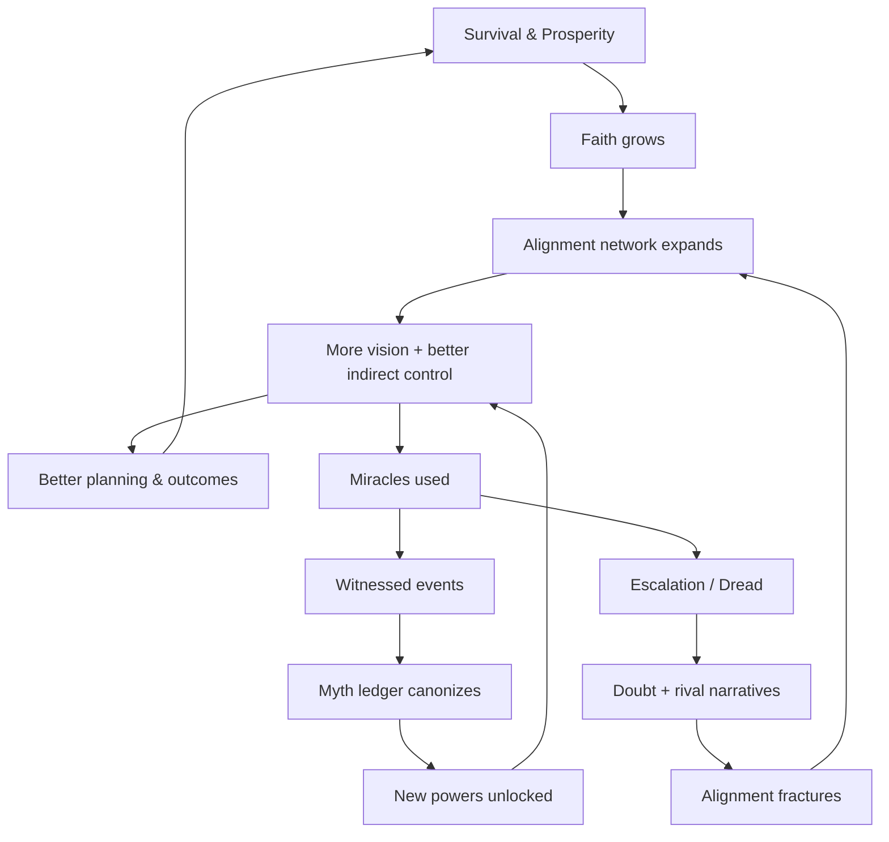

# Fantasia — tightening what you have (and making it *gamey*)

You’ve got the right bones. The main thing now is: **define the “physics” of agency + faith** so your two modes feel inevitable instead of arbitrary.

---

## Champion: make “agency loss” feel like the world taking the wheel

Right now you’ve got: *unmet needs reduce agency → reduces ability to control the champion*. That can become a really unique feel if it’s not just “can’t click”.

### 1) Define agency as a continuous control budget

Think of **Agency** as a scalar (A \in [0,1]) that modulates *how much your inputs override autopilot*.

* (A=1.0): full manual control
* (A=0.6): inputs work, but champion auto-corrects toward “safe + needs”
* (A=0.3): you can “suggest”, champion often refuses/misinterprets
* (A=0.0): full autopilot (panic / collapse / survival mode)

A simple model:

$$
A = \text{clamp}\Big(1 - (w_s d_s + w_w d_w + w_f d_f),, 0,, 1\Big)
$$

Where each deficit (d_x) is normalized (0..1) (0 = satisfied, 1 = critical).

**Important:** don’t just reduce movement speed. Reduce **authority**.

### 2) Concrete “what changes when A drops”

Pick a few levers (not too many):

* **Input override strength:** champion blends your direction with their autopilot intent
* **Command bandwidth:** fewer queued commands / shorter range of “go do”
* **Context switching:** you can’t rapidly flip tasks (champion “tunnels” on needs)
* **Risk tolerance:** champion refuses dangerous paths even if you click them
* **Social output:** champion can’t give long speeches / complex orders when exhausted

This makes needs *feel* like embodied limits, not UI punishment.

### 3) Champion autonomy: make it predictable, not mysterious

Since the champion is autonomous when you’re not issuing commands, you want clear rules:

* Champion has a **standing intent** chosen by priorities (work / guard / explore / rest)
* Manual input temporarily creates a **high-priority local intent**
* Autopilot can interrupt manual intent when:

  * needs go critical
  * immediate threat detected
  * pantheon compels (if aligned)

That’s easy to teach and feels fair.

### 4) The map + LoS: “stale intel” is your friend

You already have the perfect constraint:

* Map shows **revealed geometry**
* Only LoS gives **real-time entities**

Add one more concept: **timestamps**.

* Last-seen positions stay as “ghost markers” with time-since-seen
* Reports from allies update the map as *non-real-time intel* (“scout saw wolves here 2h ago”)

This lets day mode be strategic without breaking your POV rule.

### 5) Ghost placement: make it the champion’s “commander tool”

Ghosts are your Factorio/RimWorld bridge. Two suggestions:

* Ghosts have **required roles** + **required tools** + **access constraints**
* Agents claim jobs based on:

  * global priorities
  * proximity
  * role skill
  * morale/faith alignment toward champion/pantheon

You’ll get emergent behavior without micromanagement.

---

## Champions vs Colonists: parity is good — but make “conduit” explicit

Your parity rule is strong: no hidden combat advantages.

So your differentiation should be **metaphysical + social**, not “chosen one stats”.

### 1) Champion as “conduit” not “super-soldier”

Give the champion one unique axis:

* **Bond** (or **Covenant**) with the patron deity

That bond changes:

* which miracles can target them
* how strongly they can *carry* divine intent into the physical world
* how much their actions generate faith (legend-building)

### 2) Colonists prioritizing champion needs becomes a real system

Tie it to 3 numbers per colonist:

* **Morale:** willingness to help anyone
* **Alignment:** willingness to follow *your faction*
* **Faith in patron:** willingness to privilege *the champion as conduit*

So you get believable outcomes:

* low morale: nobody helps anyone
* high morale but low alignment: they’ll help, but not obey risky orders
* high faith: they’ll guard the champion’s sleep aggressively

---

## Needs: use *thresholds* + *failure modes* (not linear debuffs)

Instead of “unmet needs reduce agency”, make it staged:

* **Satisfied → Strained → Critical → Collapse**

Each stage triggers a *different* kind of loss:

* Strained: shorter command queue, worse social output
* Critical: autopilot interrupts, refuses risky actions
* Collapse: forced sleep / forced drink / blackout

This gives your day/night cycle teeth: *you can’t “willpower” your way past biology.*

---

# Pantheon: faith as a network, not a mana bar

You’ve got a really cool “miracles become powers only if attested + believed.” To make that playable, you need a loop the player can steer.

## 1) The Faith Network

Model faith as a graph:

* Nodes: colonists, shrines, temples, relics, storytellers
* Edges: communication + social influence

Pantheon vision becomes:

> You see through **aligned LoS**, but alignment itself is strengthened by **ritual + story + survival**.

That means your “omniscience” is earned by culture + infrastructure.

## 2) Direct command: limit it hard and make it thematic

“Draft/directly command the most faithful” is dangerous (can become RTS god-mode).

Make direct control:

* **rare**
* **short**
* **costly**
* **socially visible** (people notice possession/compulsion)

Mechanics:

* You have a small number of **Manifestations** per night
* You can “ride along” with a faithful agent for 30–90 seconds
* Doing it too often increases **Dread** (a counterforce that breeds doubt or attracts rival gods)

So direct control is a clutch tool, not your default.

## 3) Indirect control: the real “god game”

This is where you shine. Give the pantheon tools that shape intent:

* **Edicts:** global priority shifts (food, defense, expansion)
* **Vows:** constraints that generate faith if followed (e.g., “never waste water”)
* **Omens:** informational pings (threat warnings, opportunity highlights)
* **Blessings:** buff categories (craft speed, courage, fertility)
* **Curses:** targeted debuffs (fear, rot, confusion) — but ethically costly / escalatory

---

# Miracles → Powers: make “attestation” a system players can cultivate

Right now: “Miracles can be attested to a deity which become a power.”

Make this a three-step pipeline:

1. **Event happens** (you spend favor / trigger a miracle)
2. **Witnessing** (who saw it? how many? how credible?)
3. **Narrativization** (does the culture adopt the explanation?)

And doubting can attack any step.

### The Myth Ledger (UI/feature idea)

A night-mode screen that shows:

* recent extraordinary events
* who witnessed them
* competing explanations (“storm patterns”, “the rival god”, “luck”)
* chance of canonization into a named miracle

Then the player can invest:

* appoint priests/storytellers
* build shrines at miracle sites
* host festivals
* preserve relics
* suppress rival narratives (dangerous, creates backlash)

That makes belief-management into gameplay, not flavor text.

---

## Doubt: don’t make it “your mana goes down” — make it *political*

Doubt should create **factions inside your faction**:

* skeptics reduce alignment → shrink your vision network
* heretics route faith to rival gods → empower enemies
* cynics still work, but stop privileging champion needs

So losing faith doesn’t just weaken miracles — it changes society.

---

## A belief loop diagram (this is the heart of your pantheon mode)

---

# Two sharp design choices to lock next (so everything else aligns)

## 1) What *exactly* is “alignment”?

Pick one (or combine carefully):

* **Alignment = belief** (religious commitment)
* **Alignment = loyalty** (political faction)
* **Alignment = bond** (personal relationship to champion)

If you mix, be explicit: e.g. alignment is a vector ((loyalty, faith, trust)).

## 2) What is the pantheon’s “resource economy”?

You can keep it simple:

* **Favor** (spend nightly)
* **Faith** (long-term capacity / unlocks)
* **Dread** (risk meter)

If you want, I can propose numbers/costs so it’s tunable.

---

# A small next step that will clarify a ton

Write 6 example miracles as *events*, not abilities.

Format:

* **Trigger:** what you do / what it costs
* **Effect:** what changes in the sim
* **Witnessing:** who can see it
* **Counter-narrative:** how doubt explains it
* **Canonization reward:** what power it might unlock

If you paste 2–3 you’ve got in mind, I’ll help you turn them into a consistent “miracle → myth → power” ladder that matches your day/night rhythm.

#game-design #fantasia #pantheon #agency #colony-sim
