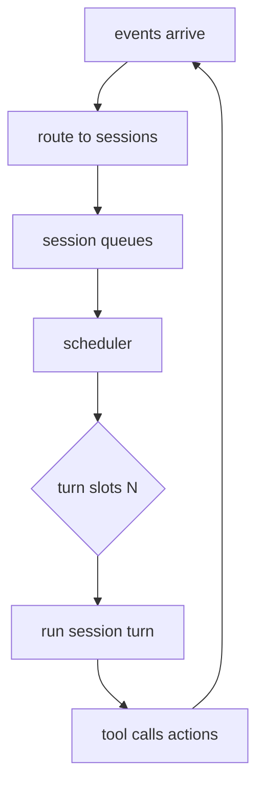

# Concrete specs: normalize + near-dupe + schemas + compaction policy + scheduler #cephalon #mvp

## 1) `normalize_discord_message()` spec (deterministic + configurable)

### 1.1 Inputs

* `event`: `{guild_id, channel_id, message_id, author_id, author_is_bot, content, embeds[], attachments[]}`
* `policy`: normalization + dedupe settings (per guild/channel optional overrides)

### 1.2 Outputs

* `normalized_text` (string)
* `signature` (object used for exact-dupe key)
* `features` (object used for near-dupe + classification)

### 1.3 Normalization steps (strict order)

#### Step A — Canonical whitespace + unicode

* `text = unicode_nfkc(content)`
* `text = text.replace("\r\n", "\n")`
* collapse runs of spaces/tabs: `text = text.replace(/[ \t]+/g, " ")`
* trim each line + drop empty tail lines
* global trim

#### Step B — Remove “volatile tokens” (configurable)

Apply a list of regex rewrites. Keep them in policy so you can tune without code changes.

**Recommended defaults (safe-ish):**

* ISO-ish timestamps:

  * `/\b\d{4}-\d{2}-\d{2}[ T]\d{2}:\d{2}(:\d{2})?\b/g` → `<ts>`
* time-only:

  * `/\b\d{1,2}:\d{2}(:\d{2})?\s?(AM|PM)?\b/gi` → `<time>`
* long integers (often snowflakes, build ids, etc):

  * `/\b\d{15,}\b/g` → `<id>`
* hex-ish hashes:

  * `/\b[0-9a-f]{7,}\b/gi` → `<hex>`

**Channel-specific “bot spam” rewrites (only if you’re confident):**

* counters:

  * `/\(#\d+\)/g` → `(#<n>)`
* “run=12345”, “job=987”:

  * `/\b(run|job|build|attempt|retry)\s*=\s*\d+\b/gi` → `$1=<n>`

#### Step C — Mentions canonicalization

* `<@123>` → `<@user>`
* `<@!123>` → `<@user>`
* `<@&123>` → `<@role>`
* `<#123>` → `<#channel>`
* `@everyone` / `@here` → keep literal (these matter)

#### Step D — URL canonicalization

Extract URLs and normalize them; replace each URL in text with a canonical token.

Canonical token format:

* `<url host/path ?qkeys=...>`

Rules:

* lowercase scheme + host
* remove `utm_*`, `fbclid`, `gclid`, `ref`, `si`, `mc_cid`, `mc_eid`
* keep *only* whitelisted query keys if you have them (per domain), else keep none
* drop fragment by default

Then replace all URLs in `text` with their canonical tokens (stable across re-posts).

#### Step E — Embeds + attachments signature (don’t inline noise)

Compute:

* `attachment_sig = {count, types[], size_buckets[]}`
* `embed_sig = {count, primary_url_token?, title_hash?, desc_hash?}`

Don’t paste raw embed text into normalized_text unless you explicitly want it indexed.

### 1.4 Exact-dupe key

Create a deterministic hash input:

```
dup_key_input = [
  author_is_bot ? "bot" : "human",
  channel_id,
  normalized_text,
  attachment_sig,
  embed_sig
]
dup_key = sha256(json_canonical(dup_key_input))
```

> Include `channel_id` so identical spam in different channels doesn’t collapse unless you want cross-channel aggregation.

---

## 2) Near-duplicate detection (SimHash) that’s actually useful for bot spam

### 2.1 Tokenization (stable, cheap)

* lowercase
* split on non-alphanum: `/[^a-z0-9]+/`
* drop tokens length < 2
* remove a tiny stoplist: `["the","and","or","to","of","in","a"]` *(optional)*
* keep top N tokens by frequency (e.g. N=64) to prevent huge spam walls from dominating

### 2.2 SimHash (64-bit)

Pseudo (JS-ish, deterministic):

```js
function simhash64(tokens) {
  const v = new Int32Array(64);
  for (const t of tokens) {
    const h = murmur3_128(t); // or xxhash; just be consistent
    // take 64 bits from h
    for (let i = 0; i < 64; i++) {
      const bit = (h64(h) >>> BigInt(i)) & 1n;
      v[i] += bit ? 1 : -1;
    }
  }
  let out = 0n;
  for (let i = 0; i < 64; i++) if (v[i] > 0) out |= (1n << BigInt(i));
  return out;
}

function hamming64(a, b) {
  let x = a ^ b;
  let c = 0;
  while (x) { x &= (x - 1n); c++; }
  return c;
}
```

### 2.3 Near-dupe rule (MVP)

Within a rolling window per channel (say 10 minutes):

* compute `simhash`
* lookup candidate families by LSH-ish buckets (e.g. 4 buckets of 16 bits)
* if any candidate has `hamming <= 6`, treat as same family

Store:

* `family_id`
* `first_seen_at`, `last_seen_at`
* `dup_count`
* `example_ids[]` (cap 10)
* `family_simhash` (maybe median/first)

---

## 3) Dedupe state machine (what gets stored vs indexed)

### 3.1 Event always stored

You always store the raw event (for audit), but you don’t always create a memory / embedding.

### 3.2 Memory creation rule

* **human message**: create memory unless it’s an obvious exact-duplicate repeat spam (rare)
* **bot message**:

  * if exact dup → aggregate only (no new memory)
  * if near dup → aggregate under family (no new memory)
  * else create memory (and maybe embed) depending on channel policy

### 3.3 Aggregates become memories (optional)

For spam cleanup, I’d index **aggregates**, not the raw repeated messages.

Aggregate memory content example (small, retrievable):

* “Bot spam family detected”
* normalized example line
* counts + time range
* recognition signals

This makes the system better over time (it can learn what to filter without drowning in junk).

---

## 4) Two-phase compaction (summary then delete) with hard safety rails

### 4.1 Compaction phases

1. **plan**: select candidate memories + grouping
2. **summarize**: produce structured summary JSON
3. **commit**: write summary memory + tombstones + delete originals

### 4.2 Why two-phase matters

* you can validate the summary output
* you can abort safely
* you can rate-limit deletion

### 4.3 Tombstones (minimal, non-retrievable)

Keep:

* `source_id`
* `deleted_at`
* `summary_id`
* `content_hash` (hash only, no content)

This prevents broken references and enables debugging without keeping the data.

---

## 5) JSON Schemas (validation is how 2B becomes reliable)

### 5.1 Tool-call envelope schema (single pattern)

```json
{
  "type": "object",
  "required": ["type", "name", "args"],
  "properties": {
    "type": {"const": "tool_call"},
    "name": {"type": "string"},
    "args": {"type": "object"}
  },
  "additionalProperties": false
}
```

### 5.2 Summary output schema (json_v1)

```json
{
  "type": "object",
  "required": ["topic","time_range","summary","source_ids"],
  "properties": {
    "topic": {"type":"string","minLength":1},
    "time_range": {
      "type":"object",
      "required":["start","end"],
      "properties":{
        "start":{"type":"integer"},
        "end":{"type":"integer"}
      },
      "additionalProperties": false
    },
    "summary": {
      "type":"array",
      "items":{"type":"string"},
      "minItems":1,
      "maxItems":40
    },
    "spam_patterns": {
      "type":"array",
      "items":{
        "type":"object",
        "required":["pattern","signals"],
        "properties":{
          "pattern":{"type":"string"},
          "count_estimate":{"type":"integer"},
          "signals":{"type":"array","items":{"type":"string"}}
        },
        "additionalProperties": false
      }
    },
    "decisions":{"type":"array","items":{"type":"string"}},
    "open_loops":{"type":"array","items":{"type":"string"}},
    "entities":{"type":"array","items":{"type":"string"}},
    "source_ids":{"type":"array","items":{"type":"string"}}
  },
  "additionalProperties": false
}
```

**Validator behavior**

* reject if any required field missing
* reject if `source_ids` empty
* reject if `time_range.start > time_range.end`
* reject if summary contains hallucinated counts unless marked as estimate (you can enforce by convention)

---

## 6) Compaction policy file (EDN, because you’ll like editing it)

Call it: `cephalon.compaction.edn`

```clojure
{:compaction
 {:interval-minutes 360
  :age-min-days 14

  ;; use exponential decay access score
  :access
  {:tau-days 21
   :threshold 0.8}

  ;; group candidates before summarizing
  :grouping
  {:max-source-count 200
   :max-source-tokens 60000
   :by [:channel-id :day]}

  ;; what is allowed to be deleted
  :locks
  {:never-delete-kinds #{:system :developer :admin}
   :never-delete-tags #{:pinned :critical}}

  ;; summary constraints
  :summary
  {:format :json_v1
   :max-bullets 25
   :max-patterns 10
   :index-summary? true}

  ;; spam handling
  :spam
  {:dedupe
   {:exact-ttl-seconds 3600
    :near-window-seconds 600
    :simhash-hamming-threshold 6}

   :channels
   {"367156652140658699" {:embed-aggregates? true
                          :embed-raw-bot-messages? false}
    "343299242963763200" {:embed-aggregates? true
                          :embed-raw-bot-messages? false}}}}}
```

This gives you “ops knobs” without redeploy.

---

## 7) Scheduler for many sessions with limited concurrency

### 7.1 Model

* sessions are **queues**
* scheduler assigns **turn slots**
* you can have thousands queued, but only N running

### 7.2 Priorities (simple + effective)

Compute a per-session priority score:

* `forced-channel activity` boosts
* `admin commands` boosts
* `staleness` boosts (aging)
* `spam-janitor` session can be rate-limited

Then do **weighted fair queuing**:

* prevents one busy channel from starving everything
* still reacts quickly to important events

### 7.3 Mermaid scheduler diagram



---

## 8) Context assembly rules that prevent “related eats the world”

### 8.1 Hard invariants

* never include the same memory twice in one prompt
* `related_tokens >= recent_tokens * 1.5` (your stated preference)
* but cap `related_tokens <= window * 0.55` unless you explicitly override
* if dedupe aggregates exist, prefer them over raw bot messages

### 8.2 Assembly algorithm (deterministic)

1. allocate token budgets from window
2. add system/developer/session headers
3. add persistent (priority order)
4. add recent (most recent first, then trim to fit)
5. build query from: recent + current event + session goal
6. retrieve related (score with similarity * recency)
7. drop low-score related until fit
8. if still too large: replace clusters with newest summaries

---

## 9) The “summary prompt” (contract-style, small-model friendly)

You want this to be rigid enough that the 2B doesn’t freestyle.

**Instruction core:**

* output JSON only
* do not invent facts
* if uncertain, use `"unknown"`
* keep bullets short
* include spam recognition signals if applicable
* include `source_ids` exactly as provided

**Input pack:**

* metadata + *small* content snippets
* for spam families: stats + 3–5 examples, not 500 messages

This yields summaries that are:

* indexable
* safe
* actionable (filters/patterns)

