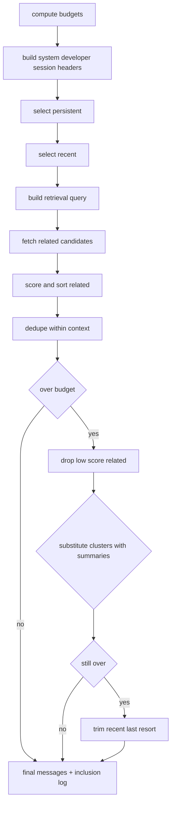

# Context assembly implementation (token accounting + summary substitution) #cephalon #context

This continues with **(1) Context assembly implementation**: how to deterministically pack `[persistent, recent, related]` into a variable context window (64k/128k/256k), while deduping and swapping clusters for summaries when needed.

---

## 1) Inputs / outputs

### Inputs

* `windowTokens` (e.g. 65536 / 131072 / 262144)
* `policy` (your EDN knobs)
* `sessionId`, `cephalonId`
* `currentEvent` (or “tick intent”)
* pools:

  * `persistent[]` (pinned memories)
  * `recent[]` (session ring buffer, last N events as memories)
  * `relatedCandidates[]` (retrieval results)

### Output

* `messages[]` for the provider call, already ordered and token-fit
* `contextLog` with `(memory_id, tokensIncluded)` for access tracking

---

## 2) Deterministic token budgeting

### 2.1 Compute budgets (percentage + clamps)

Budgets should be stable and **monotonic** with window size.

```js
function computeBudgets(windowTokens, budgetsPct, invariants) {
  const sys = Math.floor(windowTokens * budgetsPct.systemDevPct);
  const persistent = Math.floor(windowTokens * budgetsPct.persistentPct);
  const recent = Math.floor(windowTokens * budgetsPct.recentPct);

  // related wants to be bigger than recent
  let related = Math.floor(windowTokens * budgetsPct.relatedPct);
  const minRelated = Math.floor(recent * invariants.relatedGteRecentMult);
  if (related < minRelated) related = minRelated;

  // safety margin so truncation doesn't thrash
  const safety = Math.max(1024, Math.floor(windowTokens * 0.03));

  return { sys, persistent, recent, related, safety };
}
```

### 2.2 Budget enforcement order (your preference)

If you overflow, trim in this order:

1. `related` (drop lowest score)
2. swap clusters to summaries (related first, then recent)
3. trim `recent` (last resort)
4. trim `persistent` only if policy allows (generally: no)

---

## 3) In-context dedupe (don’t waste tokens)

You want two dedupe passes:

* **semantic/system** (same `memory_id` appears twice)
* **content** (same normalized content across different IDs)

### 3.1 Dedupe within assembled context

```js
function dedupeContextItems(items) {
  const seenIds = new Set();
  const seenContent = new Set();
  const out = [];

  for (const it of items) {
    if (seenIds.has(it.memory_id)) continue;
    seenIds.add(it.memory_id);

    const contentKey = it.normalized_hash || it.content_hash;
    if (contentKey) {
      if (seenContent.has(contentKey)) continue;
      seenContent.add(contentKey);
    }
    out.push(it);
  }
  return out;
}
```

> For bot spam, `normalized_hash` is what matters; for human messages, you might only dedupe by `memory_id` unless repeats are a real problem.

---

## 4) Summary substitution (cluster → summary when over budget)

This is the core of your “GC concept”, but used *live* during context packing too.

### 4.1 Cluster definition

A “cluster” is any coherent group that *can* be replaced by a summary:

* `cluster.key = (channel_id, day)` or `thread_id`
* or `spam_family_id`
* or “embedding cluster id” (later)

Each memory knows:

* `cluster_id`
* `summary_id?` (if previously compacted)
* `summary_candidates[]` (optional list)

### 4.2 Replacement rule

When you need to shrink:

* find clusters contributing the most tokens
* replace their members with **the newest summary** that covers them
* if no summary exists: optionally create an *ephemeral* on-the-fly summary (only if you allow it)

### 4.3 Replacement algorithm (deterministic)

```js
function substituteClustersWithSummaries(items, tokenBudget, getBestSummaryForCluster) {
  // items already ordered by priority; each item has estimated_tokens
  let total = items.reduce((s, x) => s + x.estimated_tokens, 0);
  if (total <= tokenBudget) return items;

  // group by cluster
  const clusters = new Map();
  for (const it of items) {
    const cid = it.cluster_id;
    if (!cid) continue;
    if (!clusters.has(cid)) clusters.set(cid, { cid, items: [], tokens: 0 });
    const c = clusters.get(cid);
    c.items.push(it);
    c.tokens += it.estimated_tokens;
  }

  // sort clusters by token impact desc, stable tie-breaker on cid
  const ranked = [...clusters.values()]
    .sort((a, b) => (b.tokens - a.tokens) || (a.cid < b.cid ? -1 : 1));

  const itemById = new Map(items.map(it => [it.memory_id, it]));
  const replacedIds = new Set();

  for (const c of ranked) {
    if (total <= tokenBudget) break;

    const summary = getBestSummaryForCluster(c.cid);
    if (!summary) continue;

    // compute savings: remove members, add summary once
    const membersTokens = c.tokens;
    const summaryTokens = summary.estimated_tokens;
    const savings = membersTokens - summaryTokens;
    if (savings <= 0) continue;

    // mark all members for removal
    for (const it of c.items) replacedIds.add(it.memory_id);

    // remove members from total, add summary
    total -= membersTokens;
    total += summaryTokens;

    // inject summary as a synthetic item (cluster-preserving)
    itemById.set(summary.memory_id, summary);
  }

  // rebuild ordered list: keep original order, skipping replaced,
  // and inserting summaries when encountered or at the cluster boundary
  const out = [];
  const added = new Set();

  for (const it of items) {
    if (replacedIds.has(it.memory_id)) continue;

    if (!added.has(it.memory_id)) {
      out.push(it);
      added.add(it.memory_id);
    }

    // optional: if this item has a cluster summary, you could insert it here
    // (but easiest is to rely on itemById additions + a second pass)
  }

  // ensure any inserted summaries are present
  for (const [id, it] of itemById.entries()) {
    if (!added.has(id) && it.kind === "summary") {
      out.push(it);
      added.add(id);
    }
  }

  return out;
}
```

**Key properties**

* deterministic (stable sorting + stable tie-breakers)
* always prefers *existing summaries*
* doesn’t hallucinate new summaries mid-flight unless you explicitly add that feature

---

## 5) Context assembly flow (end-to-end)



---

## 6) Retrieval query building (so “related > recent” stays sane)

You want multiple related memories per recent query. Do that by creating *multiple query embeddings*:

* `q1`: current event text + session goal
* `q2`: last 1–3 recent human messages
* `q3`: last assistant action / tool result (if any)
* `q4`: “spam janitor focus” (for janitor session only)

Then union results, score them with your similarity*recency function, and take top K until `relatedBudget`.

---

## 7) Full assembly pseudocode (provider-ready)

```js
async function assembleContext({
  windowTokens,
  policy,
  session,
  currentEvent,
  pools,
  tokenizer,
  retrieveRelated,          // (queries[]) -> candidates[]
  getBestSummaryForCluster  // (cluster_id) -> summaryMemoryItem|null
}) {
  const budgets = computeBudgets(windowTokens, policy.context.budgets, policy.context.invariants);

  // 1) headers (system/developer/session)
  const headers = buildHeaders(session, policy); // returns message objects
  const headerTokens = estimateMessagesTokens(headers, tokenizer);

  // 2) persistent
  let persistentItems = rankPersistent(pools.persistent, policy);
  persistentItems = fitByTokens(persistentItems, budgets.persistent, tokenizer);

  // 3) recent
  let recentItems = rankRecent(pools.recent, policy);
  recentItems = fitByTokens(recentItems, budgets.recent, tokenizer);

  // 4) build retrieval queries from current + recent
  const queries = buildQueries(currentEvent, recentItems, session, policy);

  // 5) related retrieval + scoring
  let related = await retrieveRelated(queries);
  related = scoreAndSortRelated(related, queries, policy);
  related = fitByTokens(related, budgets.related, tokenizer);

  // 6) dedupe across pools
  persistentItems = dedupeContextItems(persistentItems);
  recentItems = dedupeContextItems(recentItems);
  related = dedupeContextItems(related);

  // 7) if still over (because headers + safety), do shrink steps
  let allItems = [...persistentItems, ...related, ...recentItems]; // order here is your policy choice
  allItems = dedupeContextItems(allItems);

  const tokenLimit = windowTokens - budgets.safety - headerTokens;
  let totalTokens = estimateItemsTokens(allItems, tokenizer);

  if (totalTokens > tokenLimit) {
    // step 1: drop low score related (never drop persistent first)
    const { kept, dropped } = dropLowScoreRelated(allItems, tokenLimit, tokenizer);
    allItems = kept;
    totalTokens = estimateItemsTokens(allItems, tokenizer);
  }

  if (totalTokens > tokenLimit) {
    // step 2: substitute cluster groups -> summaries
    allItems = substituteClustersWithSummaries(allItems, tokenLimit, getBestSummaryForCluster);
    allItems = dedupeContextItems(allItems);
    totalTokens = estimateItemsTokens(allItems, tokenizer);
  }

  if (totalTokens > tokenLimit) {
    // step 3: trim recent (last resort)
    allItems = trimRecentItems(allItems, tokenLimit, tokenizer);
    totalTokens = estimateItemsTokens(allItems, tokenizer);
  }

  // 8) convert items -> provider messages
  const providerMessages = [
    ...headers,
    ...itemsToProviderMessages(allItems)
  ];

  // 9) inclusion log for access tracking
  const contextId = newContextId();
  const inclusionLog = buildInclusionLog(contextId, session.session_id, allItems, tokenizer);

  return { contextId, providerMessages, inclusionLog };
}
```

---

## 8) How the janitor benefits immediately

With this context assembler in place, the janitor session gets:

* aggregates instead of spam floods
* summaries instead of raw ancient history
* related retrieval that tends to pull “what spam patterns have we seen before?”

And because you log inclusion, you’ll *naturally* learn:

* which aggregates/summaries actually matter
* which can be compacted harder

