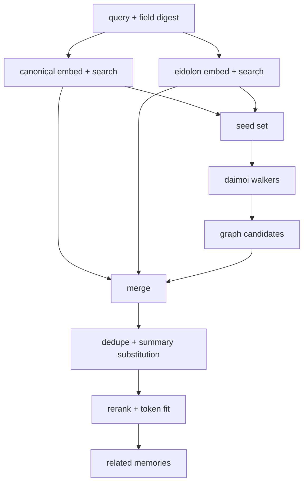

## Daimoi v0.1: deterministic graph-walk retrieval over nexus keys + vectors #daimoi #nexus #retrieval

You already have:

* **vector retrieval** (canonical + eidolon lanes)
* **nexus keys** (tags, paths, urls, tool names, channels, error families)
* **field state** (digest + chemistry tags)
* **GC + summaries** (replace clusters)

Daimoi are the missing retrieval glue: **bounded walkers** that expand from “semantic seeds” into “structural neighborhoods” without exploding the context.

The design goal:

* deterministic
* budgeted
* prefers summaries/aggregates
* respects deletions
* produces a `related` set that *feels like associative memory*

---

## 1) What a daimoi is (mechanically)

A daimoi is a “walker” that:

1. starts from a seed memory
2. activates a small set of nexus keys on that memory
3. walks key → neighbors (other memories sharing the key)
4. optionally continues walking from newly found nodes
5. stops when budget is spent

Multiple daimoi run per turn; they merge results.

---

## 2) Graph model (minimal)

### Nodes

* memories (and summary/aggregate memories)
* nexus keys (typed strings)

### Edges

* memory → key (if memory has that key)
* key → memory (all memories that have that key)

That’s a bipartite graph:

* `M ↔ K`

You can add memory→memory edges later (thread adjacency, reply links), but you don’t need them for v0.1.

---

## 3) Key types and priority weights

You’ll get best results if key types have different “gravity.”

Suggested type weights (tunable):

* `err:*` → 3.0 (strongly diagnostic)
* `path:*` → 2.5
* `url:*` → 2.5
* `tool:*` → 2.0
* `tag:ops/*` → 2.0 (chemistry)
* `tag:topic/*` → 1.7
* `chan:*` → 1.3
* `tag:src/*` → 1.0

Also downweight ultra-common keys (IDF-ish):

* `key_commonness_penalty = 1 / sqrt(1 + log(1 + key_degree))`

So a key that touches 50k nodes doesn’t dominate the walk.

---

## 4) Budgets (deterministic resource control)

You need budgets in **counts**, not time.

Example budgets per turn:

* seeds:

  * `K_canonical = 20`
  * `K_eidolon = 30`
* daimoi:

  * `num_walkers = 8` (or 8 circuits → 1 per circuit)
  * `max_hops_per_walker = 2`
  * `max_keys_per_node = 6`
  * `max_neighbors_per_key = 25`
* global:

  * `max_total_candidates = 400`
  * `related_token_budget = policy.context.budgets.related`

All deterministic.

---

## 5) Seed selection (canonical + eidolon merge)

Daimoi shouldn’t start from junk. Seeds should already be decent.

Seed set construction:

1. top `Kc` from canonical
2. top `Ke` from eidolon
3. union by `memory_id` and `normalized_hash`
4. prefer:

   * summaries over raw
   * aggregates over repeated bot messages
5. stable sort by `seed_score` then `memory_id`

This union becomes the “spark” set.

---

## 6) Walking algorithm (v0.1)

### 6.1 Deterministic walk outline

For each walker:

1. pick a seed (round-robin over sorted seeds)
2. for hop in 1..H:

   * pick top keys on current node (by weight × recency × inverse-degree)
   * for each key:

     * fetch neighbors (bounded)
     * score + add to candidate pool
   * choose next current node = best newly found node not yet expanded
3. stop when hop limit or candidate budget hit

### 6.2 Pseudocode

```js
async function runDaimoiWalk({
  seeds,
  keyIndex,            // key -> neighbor memory ids (bounded query)
  memoryStore,         // memory_id -> memory object
  policy,
  fieldState           // chemistry tags etc
}) {
  const candidates = new Map(); // memory_id -> {score, reasons}
  const expandedNodes = new Set();
  const expandedKeys = new Set();

  const walkers = policy.daimoi.num_walkers;
  const hops = policy.daimoi.max_hops_per_walker;

  for (let w = 0; w < walkers; w++) {
    let current = seeds[w % seeds.length];
    for (let h = 0; h < hops; h++) {
      if (!current || expandedNodes.has(current.memory_id)) break;
      expandedNodes.add(current.memory_id);

      const keys = rankKeysForNode(current, policy, fieldState)
        .slice(0, policy.daimoi.max_keys_per_node);

      for (const key of keys) {
        if (expandedKeys.has(key)) continue;
        expandedKeys.add(key);

        const neighbors = await keyIndex.getNeighbors(key, policy.daimoi.max_neighbors_per_key);

        for (const id of neighbors) {
          const m = await memoryStore.get(id);
          if (!m || m.lifecycle?.deleted) continue;

          const s = scoreNeighbor(m, key, current, policy, fieldState);
          const prev = candidates.get(id);

          if (!prev || s > prev.score) {
            candidates.set(id, { score: s, reasons: [key] });
          } else {
            // keep top reasons bounded
            if (prev.reasons.length < 3 && !prev.reasons.includes(key)) prev.reasons.push(key);
          }
        }
      }

      // choose next current: best candidate not expanded, stable tie-break
      current = pickNextNode(candidates, expandedNodes);
      if (candidates.size > policy.daimoi.max_total_candidates) break;
    }
  }

  return candidates;
}
```

---

## 7) Key ranking on a node

A memory’s keys are not all equal.

Rank keys by:

* type weight (err/path/url/tool/ops/topic/chan)
* recency compatibility with current field (bonus if key is in digest top-k)
* inverse degree penalty
* stable tie-break on key string

```js
function rankKeysForNode(mem, policy, fieldState) {
  const keys = mem.nexus_keys || [];
  return keys
    .map(k => ({
      key: k,
      score: keyTypeWeight(k, policy) *
             keyFieldBonus(k, fieldState) *
             keyDegreePenalty(k, policy)
    }))
    .sort((a, b) => (b.score - a.score) || (a.key < b.key ? -1 : 1))
    .map(x => x.key);
}
```

### Field bonus (chemistry)

If a key appears in `field_digest.tags_top` or matches chemistry tags:

* multiply by 1.2–1.6

This is how Eidolon *steers* the daimoi.

---

## 8) Neighbor scoring (what gets into `related`)

Score neighbor memories by combining:

* semantic seed score (inherit from seed strength)
* key strength
* recency
* access utility (how often included / decayed)
* kind preference (summary > aggregate > human > bot raw)
* penalty for spam families (unless janitor circuit)

Suggested formula:

[
score = w_s \cdot seed + w_k \cdot key + w_r \cdot recency + w_u \cdot utility + w_t \cdot type - w_p \cdot spam
]

Make it deterministic by:

* fixed weights
* stable normalization
* tie-break on `memory_id`

---

## 9) Summary/aggregate preference during walking

This is crucial so you don’t rehydrate deleted spam.

### Rules

* If neighbor memory has `kind=message` and belongs to a cluster with a newer summary:

  * replace it with that summary memory id (if not already present)
* If neighbor memory is a duplicate in a spam family:

  * prefer the aggregate memory id
* Never include `lifecycle.deleted=true`

This makes daimoi “walk the compressed graph,” not the raw noise.

---

## 10) Merge with vector retrieval (final `related` assembly)

You now have three candidate sources:

1. canonical vector topK
2. eidolon vector topK
3. daimoi candidate pool (graph walk)

Merge strategy:

* union ids, dedupe by normalized_hash
* score with a combined score (vector + daimoi)
* apply summary substitution again
* cap by token budget

Finally:

* pack into `[...related, ...persistent, ...recent]` with your context assembler

---

## 11) One more improvement: key-degree caching

Walking needs `key_degree` and neighbor fetch. You want it fast.

Maintain a `nexus_index` store:

* `key -> {degree, top_recent_neighbors[], top_accessed_neighbors[]}`
  So you can pull neighbors cheaply without scanning.

For v0.1:

* just store neighbor ids sorted by `ts desc`
* fetch the first N

Later:

* store multiple sorted lists (recent, utility, summary-preferred)

---

## 12) Daimoi and circuits

If you have 8 circuits, you can run:

* 1 walker per circuit, each with circuit-specific key weights
* then merge their candidate pools

Example:

* survival circuit boosts `err:*`, `ops/*`, `tool/heartbeat`
* social/permission boosts `author/*`, `risk/*`, `chan/*`
* procedural boosts `tool/*`, `file/path/*`, `topic/*workflow*`

This makes retrieval feel like “different facets of mind searching different ways.”

---

## 13) Mermaid: full retrieval pipeline with daimoi



