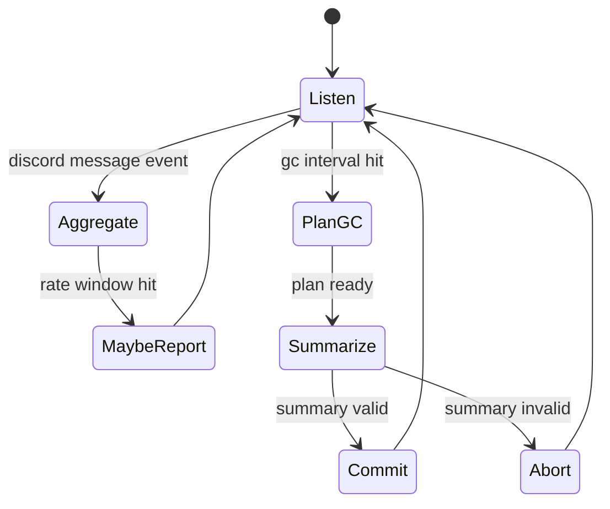

# MVP contracts (implementation-ready): minting rules, aggregates, GC queries, tools, janitor loop #cephalon #memory #gc #dedupe

## 1) Event → Memory minting rules (what becomes retrievable context)

### 1.1 Canonical event types

Use a small, explicit enum so policies stay simple:

* `discord.message.created`
* `discord.message.edited`
* `discord.message.deleted`
* `tool.call`
* `tool.result`
* `llm.assistant.message`
* `llm.think.trace` *(optional / low weight)*
* `system.tick`
* `admin.command`
* `memory.summary.created`
* `memory.compaction.deleted` *(tombstone emit)*

### 1.2 Minting matrix

Rule of thumb: **events are always logged**, but **only some events mint memories**, and **even fewer get embedded**.

| Event type                        | Log event |   Mint memory | Embed | Notes                                       |
| --------------------------------- | --------: | ------------: | ----: | ------------------------------------------- |
| `discord.message.created` (human) |         ✅ |             ✅ |     ✅ | Default: embed humans                       |
| `discord.message.created` (bot)   |         ✅ |            ⚠️ |    ⚠️ | Depends on channel policy + dedupe          |
| `discord.message.edited`          |         ✅ |            ⚠️ |     ❌ | Usually update event links; don’t re-embed  |
| `discord.message.deleted`         |         ✅ |             ❌ |     ❌ | Event only; may mark memory as deleted      |
| `tool.call`                       |         ✅ |             ✅ |     ❌ | Memory for audit, not retrieval             |
| `tool.result`                     |         ✅ |             ✅ |    ⚠️ | Embed only if “knowledge-bearing” result    |
| `llm.assistant.message`           |         ✅ |             ✅ |     ✅ | Assistant outputs are memories too          |
| `llm.think.trace`                 |         ✅ |            ⚠️ |     ❌ | Store optionally, retrieval weight low      |
| `admin.command`                   |         ✅ |             ✅ |     ❌ | Always memory; may pin/lock                 |
| `system.tick`                     |         ✅ |            ⚠️ |     ❌ | Usually no memory; only if it yields action |
| `memory.summary.created`          |         ✅ |             ✅ |     ✅ | Summary is high-signal, always embed        |
| `memory.compaction.deleted`       |         ✅ | ✅ (tombstone) |     ❌ | Never embed                                 |

**Bot messages**: mint a memory only if:

* it’s not an exact/near duplicate **or**
* it’s an *aggregate* record representing duplicates **or**
* the channel policy explicitly allows “raw bot memory”

---

## 2) Embedding & indexing policy (keep ANN clean)

### 2.1 Embed eligibility

Embed if **all** are true:

* `kind in #{message, summary, assistant_message}`
* not `deleted`
* not `kind in #{tool_call, tombstone}`
* passes channel policy gates
* `content_tokens <= EMBED_MAX_TOKENS` (else summarize first)

### 2.2 Embed preference order

When multiple representations exist:

1. **summary** (best)
2. **aggregate spam family** (good for cleanup)
3. **human message** (good)
4. **raw bot message** (last resort)

### 2.3 Retrieval preference order

During context assembly, prefer:

* summaries over raw
* aggregates over repeated bot spam
* newest-highest-score items first

---

## 3) Aggregate memory template (turn spam into a useful object)

### 3.1 Aggregate record (stored + optionally embedded)

This is what replaces thousands of repeated bot messages.

```json
{
  "kind": "aggregate",
  "aggregate_type": "discord.bot_spam_family",
  "topic": "ci-notify spam in memes",
  "time_range": {"start": 0, "end": 0},
  "channel_id": "367156652140658699",
  "author_kind": "bot",
  "fingerprints": {
    "exact_hash": "sha256...",
    "simhash64": "0x..."
  },
  "dup_count": 1234,
  "example_snippets": [
    "build=<n> failed on branch <id>",
    "job=<n> completed in <time>"
  ],
  "recognition_signals": [
    "contains token \"build=<n>\"",
    "contains canonical url <url github.com/...>",
    "attachment_count=0 embed_count=1"
  ],
  "actions_suggested": [
    "mute source bot in channel",
    "add rewrite rule for job=<n>"
  ],
  "source_event_ids_sample": ["...", "..."]
}
```

### 3.2 Aggregate memory content (what the LLM actually sees)

Keep it short and structured:

* what it is
* how often
* how to recognize
* what to do about it

This makes the “janitor” session effective without drowning the context.

---

## 4) GC candidate query + required indexes

### 4.1 Collections (minimal)

* `events` (append-only)
* `memories` (retrievable objects; includes summaries + aggregates)
* `memory_usage` (optional; you can fold into memories)
* `vector_index` (external / separate system)

### 4.2 Memory fields required for GC

* `created_at`
* `last_included_at`
* `included_count_decay`
* `pinned` / `locked_by_admin` / `locked_by_system`
* `deleted` (bool)
* `kind`
* `channel_id` / `source.type`

### 4.3 Candidate query (DB-agnostic)

Select:

* `created_at < now - AGE_MIN`
* `included_count_decay < ACCESS_THRESHOLD`
* `pinned == false`
* `locked_by_admin == false`
* `locked_by_system == false`
* `deleted == false`
* `kind in {message, assistant_message, tool_result}` *(exclude summaries/aggregates by default)*

Then **group** by:

* `(channel_id, day(created_at))` or thread id if you have it
* plus optionally `spam_family_id` if you’ve clustered

### 4.4 Mongo-style index suggestions (if you use MongoDB)

```js
// fast candidate scan
db.memories.createIndex({
  deleted: 1,
  pinned: 1,
  locked_by_admin: 1,
  locked_by_system: 1,
  kind: 1,
  created_at: 1,
  included_count_decay: 1
});

// fast retrieval filters
db.memories.createIndex({ channel_id: 1, created_at: -1 });
db.memories.createIndex({ "fingerprints.exact_hash": 1 });
db.memories.createIndex({ "fingerprints.simhash64": 1 });

// inclusion logs (if separate)
db.context_inclusions.createIndex({ context_id: 1 });
db.context_inclusions.createIndex({ memory_id: 1, included_at: -1 });
```

---

## 5) Tools list (tight schemas for 2B reliability)

### 5.1 Memory tools

**All tools use the same envelope:**

```json
{"type":"tool_call","name":"memory.tool_name","args":{}}
```

#### `memory.context_log_write`

Record what got included so access metrics work.

Args:

```json
{
  "context_id": "string",
  "session_id": "string",
  "items": [
    {"memory_id":"string","tokens":123}
  ],
  "timestamp": 0
}
```

#### `memory.gc_plan`

Build a compaction plan (no deletion).

Args:

```json
{
  "age_min_days": 14,
  "access_threshold": 0.8,
  "limit_source_tokens": 60000,
  "max_groups": 10
}
```

Returns:

* `plan_id`
* groups: `[{group_id, source_ids[], estimated_tokens, time_range, channel_id}]`

#### `memory.summarize`

Summarize a group to `json_v1` (no deletion).

Args:

```json
{"group_id":"string","source_ids":["..."],"format":"json_v1"}
```

Returns:

* summary JSON (must validate schema)

#### `memory.compact_commit`

Write summary memory + tombstones + delete originals + purge vectors.

Args:

```json
{
  "plan_id":"string",
  "group_id":"string",
  "summary_json": { },
  "source_ids":["..."]
}
```

Returns:

* `summary_memory_id`
* `deleted_count`

#### `memory.compact_abort`

Args:

```json
{"plan_id":"string","reason":"string"}
```

### 5.2 Discord tools (minimal for janitor)

#### `discord.send_message`

Args:

```json
{"channel_id":"string","content":"string"}
```

#### `discord.delete_message` *(optional, guarded)*

Args:

```json
{"channel_id":"string","message_id":"string"}
```

#### `discord.add_suppress_rule` *(optional, future)*

This is your “learned filter” hook.
Args:

```json
{
  "channel_id":"string",
  "rule": {
    "name":"string",
    "match": {"type":"exact_hash|simhash_family|regex","value":"string"},
    "action":"aggregate_only|drop_memory|drop_event"
  }
}
```

---

## 6) Janitor session behavior loop (spam cleanup as a first-class job)

### 6.1 Janitor session goals

* aggressively dedupe bot spam in forced channels
* produce aggregates
* report high-signal patterns + stats
* optionally propose suppress rules (admin review)

### 6.2 State machine (simple, robust)



### 6.3 Pseudocode (JS-first, deterministic control flow)

```js
async function janitorTurn(ctx) {
  // ctx contains: session_id, event, policy, stores, tools

  if (ctx.event?.type === "discord.message.created") {
    const norm = normalizeDiscordMessage(ctx.event, ctx.policy.normalize);
    const dedupe = await dedupeCheckAndAggregate(ctx, norm);

    if (dedupe.action === "aggregated") {
      // optionally mint/update an aggregate memory
      await maybeMintAggregateMemory(ctx, dedupe.aggregate);
      return;
    }

    // non-duplicate: mint memory depending on policy
    await mintMemoryFromDiscord(ctx, ctx.event, norm);
    return;
  }

  if (shouldRunReport(ctx)) {
    const report = await buildSpamReport(ctx);
    if (report.should_send) {
      await ctx.tools.discord.send_message({
        channel_id: ctx.policy.janitor.report_channel_id,
        content: formatReport(report)
      });
    }
    return;
  }

  if (shouldRunGC(ctx)) {
    const plan = await ctx.tools.memory.gc_plan(ctx.policy.compaction.plan_args);

    for (const group of plan.groups) {
      const summary = await ctx.tools.memory.summarize({
        group_id: group.group_id,
        source_ids: group.source_ids,
        format: "json_v1"
      });

      if (!validateSummaryJson(summary)) {
        await ctx.tools.memory.compact_abort({
          plan_id: plan.plan_id,
          reason: "summary_json_validation_failed"
        });
        continue;
      }

      await ctx.tools.memory.compact_commit({
        plan_id: plan.plan_id,
        group_id: group.group_id,
        summary_json: summary,
        source_ids: group.source_ids
      });
    }
  }
}
```

### 6.4 Reporting format (keeps Discord clean)

Post on an interval (e.g. 30–120 min), **not per message**:

* top 5 spam families by `dup_count`
* top 5 new signals (new patterns)
* compaction results: `summaries_created`, `memories_deleted`
* suggested suppress rules (if any)

---

## 7) Event → memory minting rules (concrete contract)

### 7.1 `mintMemoryFromDiscord`

* if human:

  * create memory with `kind: message`
  * embed unless too large → summarize first
* if bot:

  * if channel policy says `embed_raw_bot_messages? false`

    * still store event, maybe store *non-embedded* memory only if it’s unique and useful
  * else:

    * treat like human (but keep lower retrieval weight)

Memory content should include:

* `raw_content` (optional)
* `normalized_content`
* `source` metadata (channel_id, author_id, author_is_bot)
* links to `event_id`

### 7.2 `maybeMintAggregateMemory`

* update or create one memory per `family_id` per time slice (e.g. per day)
* embed aggregate memory (small)
* never embed raw duplicates

---

## 8) One file you can actually ship today: policy EDN (full replacement)

Save as `cephalon.policy.edn`:

```clojure
{:models
 {:actor {:name "qwen3-vl-2b"
          :max-context-tokens 262144
          :tool-call-strict? true}
  :fallbacks [{:name "qwen3-vl-4b" :max-context-tokens 131072}
              {:name "qwen3-vl-8b" :max-context-tokens 65536}]}

 :context
 {:budgets {:system-dev-pct 0.06
            :persistent-pct 0.08
            :recent-pct 0.18
            :related-pct 0.42}
  :invariants {:related-gte-recent-mult 1.6
               :dedupe-within-context? true}}

 :normalize
 {:volatile-rewrites
  [[#"\b\d{4}-\d{2}-\d{2}[ T]\d{2}:\d{2}(:\d{2})?\b" "<ts>"]
   [#"\b\d{1,2}:\d{2}(:\d{2})?\s?(AM|PM)?\b" "<time>"]
   [#"\b\d{15,}\b" "<id>"]
   [#"\b[0-9a-f]{7,}\b" "<hex>"]]
  :strip-tracking-params? true}

 :dedupe
 {:exact-ttl-seconds 3600
  :near-window-seconds 600
  :simhash-hamming-threshold 6
  :aggregate-bot-dupes? true}

 :channels
 {"343299242963763200" {:name "bots" :embed-raw-bot-messages? false :embed-aggregates? true}
  "450688080542695436" {:name "duck-bots" :embed-raw-bot-messages? true :embed-aggregates? true}
  "343179912196128792" {:name "general" :embed-raw-bot-messages? false :embed-aggregates? true}
  "367156652140658699" {:name "memes" :embed-raw-bot-messages? false :embed-aggregates? true}}

 :compaction
 {:interval-minutes 360
  :age-min-days 14
  :access {:tau-days 21 :threshold 0.8}
  :grouping {:by [:channel-id :day]
             :max-source-count 200
             :max-source-tokens 60000}
  :summary {:format :json_v1
            :max-bullets 25
            :max-patterns 10
            :index-summary? true}
  :locks {:never-delete-kinds #{:system :developer :admin :summary :aggregate}
          :never-delete-tags #{:pinned :critical}}}

 :janitor
 {:enabled? true
  :report-channel-id "450688080542695436"
  :report-interval-minutes 60
  :max-actions-per-hour 20
  :propose-suppress-rules? true}}
```

