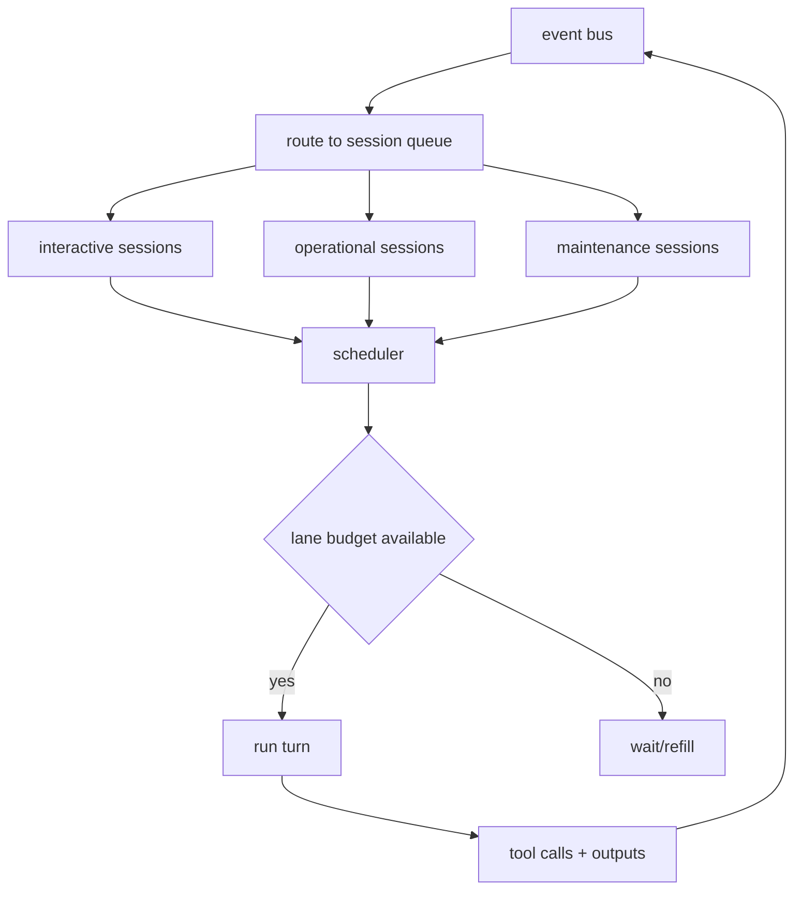
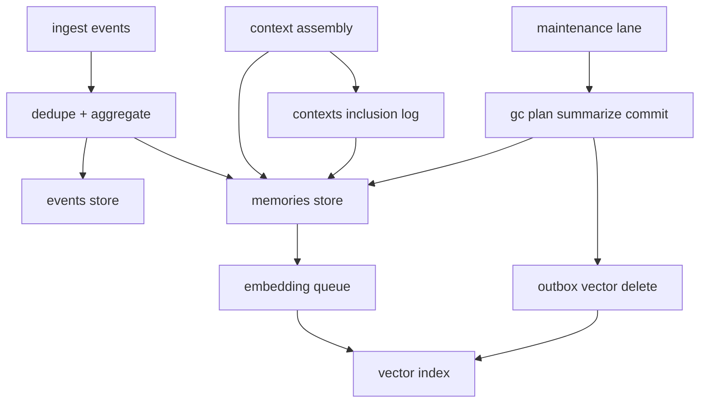

# Retention + compaction in a multi-session scheduler (no starvation, immediate benefits) #cephalon #scheduler #gc #retention

You’ve now got: **many queued sessions**, **limited concurrency**, **dedupe + aggregates**, **access-driven compaction**, and **variable context windows**. The missing piece is: *how do we run maintenance (GC/embeddings/outbox) without starving interactive sessions, while still letting every session benefit from compaction immediately?*

---

## 1) Split “work” into lanes (so GC can’t eat the brain)

Think of the runtime as **three lanes** sharing the same event bus + stores:

### Lane A — Interactive turns (high priority)

* human messages
* admin commands
* anything that might respond outward immediately

### Lane B — Operational turns (medium priority)

* janitor aggregation updates
* periodic reports
* subscription management

### Lane C — Maintenance jobs (low priority, budgeted)

* compaction planning + commit
* embedding generation
* outbox draining (vector deletes)
* retention cleanup (events payload redaction, etc.)

**Rule:** Lane C can *never* consume more than a configured share of compute / tool calls per unit time.

---

## 2) Scheduler: weighted fair queue with per-lane budgets

You want “many sessions can queue turns” but only N run at once. Make that deterministic:

### 2.1 Per-session queue

Each session has:

* `queue[]` of events to process
* `priority_class`: `interactive | operational | maintenance`
* `credits` (for fairness)

### 2.2 Global scheduler loop

* chooses next runnable session by:

  1. highest priority class with available lane budget
  2. highest credits (or oldest waiting time)
  3. tie-breaker: stable session id

After running a turn:

* decrement the lane’s budget (tokens, tool calls, or “turn cost”)
* decrement session credits proportional to cost
* refill credits over time (leaky bucket)

### 2.3 Obsidian-friendly mermaid



---

## 3) Compaction as a maintenance *service*, not a “chatty turn”

Even if you keep “janitor session” as a concept, compaction is best treated as **maintenance jobs** with strict budgets.

### 3.1 Maintenance job types

* `job.embed_memory(memory_id)`
* `job.aggregate_upsert(aggregate_id)`
* `job.gc_plan()`
* `job.gc_summarize(group_id)`
* `job.gc_commit(group_id)`
* `job.outbox_drain(batch_n)`
* `job.retention_redact_events(before_ts)`

### 3.2 Where jobs are queued from

* Interactive/operational turns can enqueue maintenance jobs (cheap)
* Maintenance lane drains jobs when budget allows

This keeps “mind ticks” responsive even when spam is high.

---

## 4) Immediate benefit: compaction changes retrieval *right away*

When compaction commits:

* you create a `summary` memory (embedded)
* mark sources deleted + tombstones
* enqueue vector deletes (eventual)

To make every session benefit immediately, you need:

### 4.1 Retrieval filters (hard)

Retrieval must exclude:

* `lifecycle.deleted == true`
* `embedding.status in {deleted}` (if you keep vectors around)

So even before vector deletes finish, the memory is logically gone.

### 4.2 Summary substitution (soft)

When assembling context:

* if a retrieved item belongs to a cluster with a newer summary, prefer the summary
* if you detect you’re pulling lots of “old low-access” stuff, you’ll naturally pull the summary instead

**Net effect:** compaction becomes *an acceleration* for future context assembly, not just storage cleanup.

---

## 5) Backpressure: when bot spam spikes, degrade gracefully

This matters because your first “real job” is spam cleanup.

### 5.1 Backpressure thresholds (examples)

* `events_ingest_rate > X/sec` in a channel
* dedupe family counts growing rapidly
* embedding queue length too large
* maintenance lane budget exhausted repeatedly

### 5.2 Degrade steps (in order)

1. **Aggregate-only mode** for that channel:

   * store events (metadata + hashes)
   * update aggregates
   * do *not* mint raw bot memories
2. **Skip embeddings** for aggregates until rate drops
3. **Increase dedupe TTL / window** temporarily
4. **Delay reports** (post less often)
5. **Drop event payload** earlier (keep hash + metadata)

This makes the system robust even if other projects go wild.

---

## 6) Retention policy interactions (events vs memories)

### 6.1 Events: retention is about audit + debugging

Retention is mostly:

* keep metadata longer
* optionally redact payload sooner for spam-heavy sources

### 6.2 Memories: retention is about context quality

Your rule is:

* low-access + old → summarize → delete sources

That has a nice emergent property:

* the system naturally converges to “what it actually uses”

### 6.3 Practical “retention tiers”

* `memories`: compact aggressively
* `summaries/aggregates`: keep long
* `events`: keep metadata long; payload shorter

---

## 7) Compaction safety in concurrent multi-session world

Multiple sessions might try to compact overlapping sets. Avoid that with **plan locking**.

### 7.1 Plan + group hash

When `gc_plan` emits a group, include:

* `group_id`
* `source_ids[]`
* `group_hash = sha256(sorted(source_ids) + newest_ts + total_tokens_est)`

### 7.2 Commit gate

`gc_commit` must verify:

* group still exists
* none of the sources were deleted already
* `group_hash` matches
  If mismatch → abort and re-plan.

### 7.3 Why this matters

It prevents:

* double deletion
* summary chaining weirdness
* races between janitor + maintenance sessions

---

## 8) Outbox drain scheduling (don’t let vector deletes lag forever)

If outbox grows, retrieval quality degrades (ghost vectors) and storage grows.

### 8.1 Give outbox a guaranteed trickle

Even under load, reserve a tiny lane budget:

* e.g., “at least 1 outbox batch per minute”
  So vector deletes eventually catch up.

### 8.2 Drain algorithm

* pick `pending` items oldest-first
* batch by embedding model / index shard for efficiency
* exponential backoff on failures
* mark `done` only after index confirms deletion

---

## 9) Metrics (what you graph to know it’s working)

Minimal set that tells the story:

* `tool_call_valid_rate` (actor)
* `repair_rate` (how often you need formatter)
* `guard_deny_rate` (bad tool intents)
* `dedupe_exact_hits` / `near_hits`
* `aggregate_count` and top families by `dup_count`
* `context_inclusion_count` distribution (power-law expected)
* `compaction_groups_committed/day`
* `memories_deleted/day` and `summaries_created/day`
* `outbox_pending` and `outbox_oldest_age`

These metrics become your “self improvement” loop later.

---

## 10) Policy additions for scheduler + maintenance budgets (EDN)

Add to your `cephalon.policy.edn`:

```clojure
{:scheduler
 {:concurrency 4

  ;; lane budgets per minute
  :lanes
  {:interactive {:turns 60 :tool-calls 120}
   :operational {:turns 30 :tool-calls 60}
   :maintenance {:turns 10 :tool-calls 20}}

  ;; fairness
  :credits
  {:refill-per-second 1.0
   :max 30
   :cost {:interactive 2 :operational 1 :maintenance 1}}}

 :maintenance
 {:outbox
  {:min-batches-per-minute 1
   :batch-size 50}

  :embeddings
  {:max-queue 5000
   :pause-on-backpressure? true}

  :retention
  {:events
   {:payload-keep-days 14
    :metadata-keep-days 180}}}

 :backpressure
 {:channels
  {"367156652140658699" {:max-events-per-minute 600
                         :degrade-to-aggregate-only? true}
   "343299242963763200" {:max-events-per-minute 300
                         :degrade-to-aggregate-only? true}}}}
```

---

## 11) Mermaid: the “whole machine” view



---

If you want to keep going, the next chunk I’d write is **how to represent “Eidolon shared state” as a small set of pinned, evolving memories** (so multiple sessions influence each other without flooding persistent), plus a clean “signals” mechanism that feels like shared body chemistry rather than chat messages.
