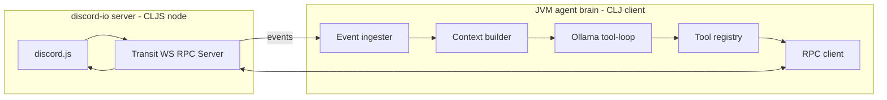
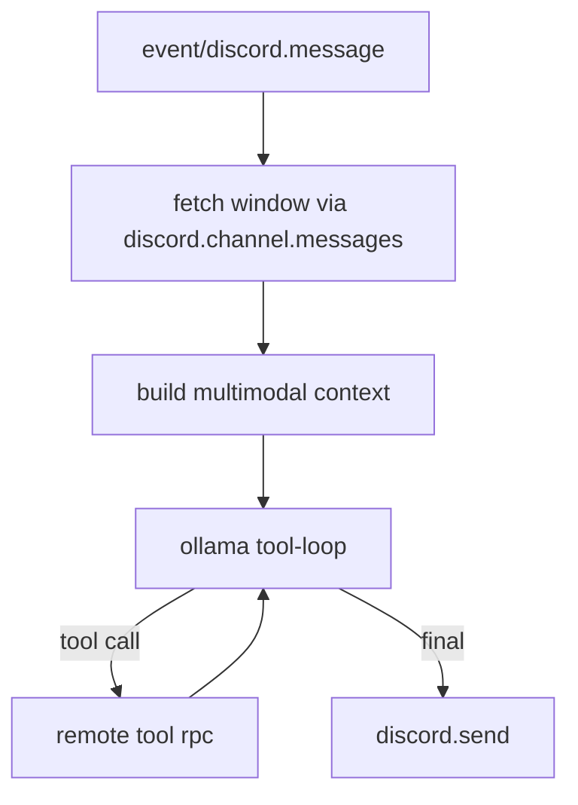

Alright—**Discord as a remote tool server** + **JVM as the Ollama/tool-loop client** is the “correct” shape if you want:

* the **LLM loop to drive behavior**
* Discord tools to be **real tools** (`def-tool`) the agent can call
* history/scroll/search to be tool-driven
* images to be injected into context *as multimodal content*, not just text

Below is a concrete design that plugs straight into what we already scaffolded.

---

# 1) Two processes, one protocol

## Discord-IO (CLJS/Node) — the server

* connects to Discord (discord.js)
* exposes a WS RPC surface: “Discord Tools”
* pushes Discord events to any connected brain clients

## Brain (JVM Clojure) — the client

* maintains agent state, routing, context building
* calls Ollama using **OpenAI-compatible chat-completions** (so tools + images work cleanly)
* executes “Discord tools” by calling the RPC server



---

# 2) RPC envelope + event envelope (`.cljc`)

Make the wire format dead-simple and stable.

```clojure
;; promethean/proto/wire.cljc
(ns promethean.proto.wire
  (:require [clojure.spec.alpha :as s]))

(s/def ::id string?)
(s/def ::op keyword?)
(s/def ::reply-to (s/nilable ::id))
(s/def ::payload map?)

(s/def ::msg (s/keys :req-un [::id ::op ::payload]
                     :opt-un [::reply-to]))

;; ops
;; :rpc/call     {:method kw :args map}
;; :rpc/ret      {:ok? bool :value any :error? map}
;; :event/discord.message {:message normalized-message}
```

### RPC call

```clojure
{:id "uuid"
 :op :rpc/call
 :payload {:method :discord/channel.messages
           :args {:channel-id "..." :limit 25}}}
```

### RPC return

```clojure
{:id "uuid2"
 :op :rpc/ret
 :reply-to "uuid"
 :payload {:ok? true
           :value {:messages [...]}}}
```

### Event push

```clojure
{:id "uuid"
 :op :event/discord.message
 :payload {:message <normalized-message>}}
```

---

# 3) Normalized message shape (attachments included)

The **server** normalizes discord.js objects into stable EDN-like maps.

```clojure
{:message-id "..."
 :channel-id "..."
 :guild-id "..."          ; nil for DM
 :author {:id "..." :name "..." :bot? false}
 :content "..."
 :ts "2026-01-27T21:04:11.123Z"
 :attachments
 [{:url "https://cdn.discordapp.com/..."
   :filename "x.png"
   :content-type "image/png"
   :width 512
   :height 512}]}
```

**Rule:** if `content-type` starts with `image/`, this attachment is eligible to be added to the agent’s multimodal context.

---

# 4) Discord tool map (channel + DM + search + mapping)

## Mapping tools (what “map channel level / DM level” means in practice)

### `discord.guilds`

List guilds visible to the bot.

* args: `{}`
* returns: `{:guilds [{:guild-id :name}]}`

### `discord.guild.channels`

List channels for a guild.

* args: `{:guild-id string :types [:text :thread ...]?}`
* returns: `{:channels [{:channel-id :name :type}]}`

### `discord.channel.info`

* args: `{:channel-id string}`
* returns: `{:channel {...}}`

## Retrieval tools

### `discord.channel.messages`

* args: `{:channel-id string :limit int :before? string :after? string :around? string}`
* returns: `{:messages [<normalized-message> ...] :paging {...}}`

### `discord.dm.messages`

* args: `{:user-id string :limit int :before? string}`
* returns: same shape as channel messages (but `guild-id=nil`)

## Search tools (windowed)

Since “true search” isn’t something I’d bet your system on, treat it as **best-effort**:

### `discord.search.window`

* args: `{:scope :channel|:dm :channel-id? :user-id? :query string :limit int :before? string}`
* returns: `{:messages [...] :scanned int}`

Implementation: fetch N pages using `before` pagination, filter client-side.

## Side-effect tools

### `discord.send`

* args: `{:channel-id string :text string :reply-to-message-id? string}`
* returns: `{:message-id string :ts string}`

### Optional for multimodal reliability

If the brain can’t access Discord CDN URLs from where Ollama runs:

#### `discord.attachment.base64`

* args: `{:url string}`
* returns: `{:content-type string :base64 string}`

---

# 5) Discord-IO server implementation (CLJS/Node)

## Method table + RPC dispatcher

The server should look like a tiny “MCP-ish” RPC service:

```clojure
;; discord-io/src/discord_io/rpc.cljs
(ns discord-io.rpc
  (:require [cljs.core.async :as a :refer [chan put! <! go-loop]]
            [promethean.transport.transit :as tr]))

(defn make-server-state []
  {:clients (atom #{})
   :handlers (atom {})})

(defn register! [st method handler]
  (swap! (:handlers st) assoc method handler)
  st)

(defn broadcast! [st msg]
  (doseq [ws @(:clients st)]
    (.send ws (tr/write-str msg))))

(defn handle-call! [{:keys [st ws ctx]} {:keys [id payload]}]
  (let [{:keys [method args]} payload
        h (get @(:handlers st) method)]
    (if-not h
      (.send ws (tr/write-str {:id (str (random-uuid))
                              :op :rpc/ret
                              :reply-to id
                              :payload {:ok? false
                                        :error {:type :unknown-method
                                                :method method}}}))
      (-> (h ctx args) ; handler returns promise or value
          (.then (fn [value]
                   (.send ws (tr/write-str {:id (str (random-uuid))
                                            :op :rpc/ret
                                            :reply-to id
                                            :payload {:ok? true
                                                      :value value}}))))
          (.catch (fn [err]
                    (.send ws (tr/write-str {:id (str (random-uuid))
                                             :op :rpc/ret
                                             :reply-to id
                                             :payload {:ok? false
                                                       :error {:type :exception
                                                               :message (.-message err)}}}))))))))
```

## WS server

Use `ws` in Node, parse Transit, dispatch:

```clojure
;; discord-io/src/discord_io/ws.cljs
(ns discord-io.ws
  (:require ["ws" :as ws]
            [promethean.transport.transit :as tr]
            [discord-io.rpc :as rpc]))

(defn start-ws! [{:keys [port st make-ctx]}]
  (let [wss (new (.-WebSocketServer ws) (clj->js {:port port}))]
    (.on wss "connection"
         (fn [socket]
           (swap! (:clients st) conj socket)
           (.on socket "close" (fn [] (swap! (:clients st) disj socket)))
           (.on socket "message"
                (fn [raw]
                  (let [m (tr/read-str raw)
                        ctx (make-ctx socket)]
                    (case (:op m)
                      :rpc/call (rpc/handle-call! {:st st :ws socket :ctx ctx} m)
                      nil))))))
    wss))
```

## Discord event → broadcast

On `messageCreate`, normalize and push:

```clojure
(rpc/broadcast! st {:id (str (random-uuid))
                    :op :event/discord.message
                    :payload {:message (normalize-message msg)}})
```

---

# 6) JVM side: “remote tools” that feel local (`def-tool`)

Add a macro that defines a tool whose impl is RPC.

```clojure
;; promethean/remote.clj (JVM)
(ns promethean.remote
  (:require [promethean.tool :refer [def-tool]]))

(defmacro def-remote-tool
  [sym {:keys [description inputSchema method proto hooks]}]
  `(def-tool ~sym
     {:proto ~proto
      :description ~description
      :inputSchema ~inputSchema
      :rpc/method ~method
      :tool/remote? true
      :tool/hooks ~hooks}
     (fn [{:keys [rpc]} args]
       (promethean.rpc.client/call! rpc ~method args))))
```

Now you can declare Discord tools like:

```clojure
(def-remote-tool discord.send
  {:proto proto/tool-base
   :method :discord/send
   :description "Send a message to a Discord channel"
   :inputSchema {:type "object"
                 :properties {:channel-id {:type "string"}
                              :text {:type "string"}
                              :reply-to-message-id {:type "string"}}
                 :required ["channel-id" "text"]}})
```

---

# 7) JVM RPC client (WS client) sketch

The client keeps a `pending` map from `call-id -> promise/chan`.

```clojure
(ns promethean.rpc.client
  (:require [promethean.transport.transit :as tr]
            [clojure.core.async :as a :refer [chan put! <! go-loop]]
            [org.httpkit.client :as http])) ; http-kit has ws client support

(defn connect! [{:keys [url]}]
  (let [pending (atom {})
        inbox (chan 256)
        ws (http/websocket-client url
             {:on-receive (fn [raw] (put! inbox (tr/read-str raw)))})]
    (go-loop []
      (when-let [m (<! inbox)]
        (when (= (:op m) :rpc/ret)
          (when-let [ch (get @pending (:reply-to m))]
            (swap! pending dissoc (:reply-to m))
            (put! ch m)))
        (recur))
    {:ws ws :pending pending}))

(defn call! [{:keys [ws pending]} method args]
  (let [id (str (java.util.UUID/randomUUID))
        ch (chan 1)]
    (swap! pending assoc id ch)
    (.send ws (tr/write-str {:id id :op :rpc/call :payload {:method method :args args}}))
    ;; simplistic blocking wait in async style: caller can <!! or <! in go
    ch))
```

Your tool impl can `(<!! (call! ...))` or stay core.async-native in your loop.

---

# 8) Updating the Ollama driver so images + tools are real

**This is the important part.** Your current Ollama adapter in the zip builds a big prompt string. That cannot do real multimodal tools cleanly.

Instead, implement a proper OpenAI-style call:

```clojure
POST /v1/chat/completions
{
  "model": "...",
  "messages": [...],
  "tools": [...],
  "tool_choice": "auto"
}
```

Then you get structured `tool_calls` back. This is exactly what you want.

### Message format for images

When you see an image attachment in context, add a content part:

```clojure
{:role "user"
 :content [{:type "text" :text "User posted an image:"}
           {:type "image_url" :image_url {:url "https://cdn.discordapp.com/...png"}}]}
```

If you need base64:

```clojure
{:type "image_url"
 :image_url {:url (str "data:image/png;base64," base64)}}
```

### Tool schema (OpenAI format)

Your existing `def-tool` already resembles this. Just ensure tools are exported as:

```clojure
{:type "function"
 :function {:name "discord.send"
            :description "..."
            :parameters {...json schema...}}}
```

---

# 9) Context builder: always tool-driven, no hidden magic

On `:event/discord.message`, the brain should:

1. Decide if it cares (keyword, mention, thread, channel allowlist, etc.)
2. If yes, call `discord.channel.messages` to build a context window
3. Inject any image attachments from that window as multimodal parts
4. Run Ollama tool-loop with Discord tools enabled
5. Execute tool calls (mostly `discord.send`, sometimes more history fetch)



---

# 10) Permissions + safety via tool hooks (this is where your mixins shine)

You already have hook machinery in the scaffold. Use it to enforce:

* max `limit` per history call
* deny DMs unless explicitly enabled
* deny searching certain channels
* rate limit tool calls

Example: clamp limit in a `:before` hook:

```clojure
{:before [(fn [ctx args]
            (let [limit (get args "limit" 25)
                  limit (min 50 (max 1 (long limit)))]
              {:ctx ctx :args (assoc args "limit" limit)}))]}
```

This keeps the model from “accidentally” requesting 10k messages.

---

# 11) What I’d build next (in order)

## A) Discord-IO server (CLJS)

* WS server + client registry
* Discord login
* push `event/discord.message`
* RPC:

  * `discord/send`
  * `discord/channel.messages`
  * `discord/guilds`
  * `discord/guild.channels`

## B) Brain client (JVM)

* connect to Discord-IO server
* event handler that:

  * fetches context window
  * calls Ollama (structured)
  * executes returned tool calls
* minimal “Duck prompt”

## C) Add images

* include attachment URLs as `image_url` parts
* optional base64 tool later

---

If you want, I can **write the exact CLJS normalization function** for discord.js Message → normalized map, and the **full tool method table** (method keyword → handler) for the discord-io server so it’s basically copy/paste into your new repo structure.
