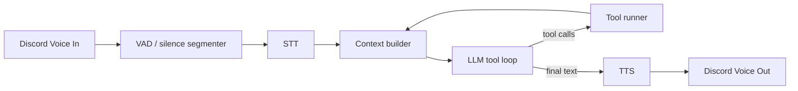

([Past chat][1])([Past chat][2])([Past chat][1])([Past chat][3])([Past chat][1])

Hell yeah. If the goal is **“Duck is live in Discord tonight”**, I’d go for a tight MVP that’s **stable + funny + low-latency**, and leave the deeper hierarchy/bench stuff for tomorrow.

## Tonight’s MVP: a performer Duck that can talk + do a few fun tools

### Core loop (what must work)

### Minimum “fun tools” (keep it small but expressive)

Pick like **5** tools max tonight (you can add more later):

* `play_sfx {name}`
* `say {text}` (forces TTS output even if the model tries to ramble)
* `persona_set {mode}` (e.g. `duckman`, `scrooge`, `narrator`, `gremlin`)
* `cooldown_set {ms}` (so you can hot-tune spam)
* `chat_send {channel, text}` (optional, for captions / punchlines)

Then give the LLM a **tool-calling protocol it can follow reliably**:

* JSON `{"tool_calls":[{"name":"play_sfx","arguments":{...}}]}`
* or a single-line `CALL play_sfx {"name":"rimshot"}`

And implement **arg repair** (like we scaffolded): map `msg|caption|prompt -> text`, coerce primitives, ignore extras.

## Practical “live bot” constraints you’ll want immediately

### 1) Barge-in (so it doesn’t talk over humans)

* If someone starts speaking while Duck is outputting TTS:

  * stop current playback
  * cancel any in-flight LLM request (AbortController)
  * drop queued replies (or keep only latest)

### 2) Output queue

* Single-file queue for TTS playback so it never overlaps itself.

### 3) Cooldowns + rate limit

* Global cooldown like 700–1500ms between tool calls
* Per-tool cooldown on `play_sfx` (people will spam bait it)

### 4) “Don’t tool-call when not needed”

Have a simple rule: if the user is just chatting, respond normally. Only tool-call for:

* soundboard moments
* explicit “do X” commands
* “persona” switches

## Concurrency tonight (simple but real)

Don’t build the full hierarchical agent tree tonight. Instead do **async workers** that feel like it:

* **Transcriber worker**: produces “utterance” events
* **Responder worker**: consumes utterances → runs LLM tool loop → emits actions + speech
* **SFX worker**: consumes `play_sfx` actions with cooldown
* (Optional) **Vision worker** later

Use a small event bus (Node `EventEmitter` or an async queue). That already gives you parallelism without a complicated orchestration system.

## How to make Duck feel alive fast

### Persona modes (one switch changes prompt + tool bias)

* **duckman**: aggressive jokes, fast interruptions, more SFX
* **scrooge**: greedy quips, counts “cost” of actions
* **narrator**: stream commentary, fewer SFX
* **gremlin**: chaotic but throttled

Implementation: a `persona.mode` string that swaps the system prompt *and* tool weights (cooldowns, chance to use SFX when novelty spikes).

### Novelty trigger (cheap version tonight)

* If last utterance differs a lot from prior (or keywords like “CLUTCH”, “WTF”, “NO WAY”):

  * allow `play_sfx` or a short punchline
* Otherwise, normal reply

## About vision + “gemma3-tools:4b” tonight

For live Discord **voice**, vision is optional unless you’re also streaming a screen somewhere.

If you *are* streaming gameplay/code:

* Tonight’s simplest “vision” is **manual screenshot tool**:

  * `screen_grab` tool returns a frame path or base64
  * LLM can request it occasionally
* Automatic vision routing (object detection, OCR, etc.) is tomorrow work.

Also: even if the model doesn’t have native tool calling, the **soft tool protocol** works fine for “a few tools here and there”.

## Quick checklist to ship tonight

* [ ] Duck joins voice channel reliably (reconnect on drop)
* [ ] VAD segments speech into utterances
* [ ] STT returns text quickly
* [ ] LLM tool-loop can:

  * output normal text
  * or call one tool
  * or call 2–3 tools max then final text
* [ ] TTS plays back in-channel without overlap
* [ ] Barge-in cancels Duck speech
* [ ] Cooldowns prevent spam
* [ ] One “admin command” to toggle persona/cooldowns live

## If you tell me 3 things, I’ll tailor the exact “tonight plan” to your stack

1. Are you using `discord.js` + `@discordjs/voice` already?
2. What’s your STT right now (Whisper local, NPU pipeline, external)?
3. What’s your TTS right now (Piper, ElevenLabs, something else)?

And if you want: I can sketch the **JS file layout** that mirrors the scaffold (tools registry, tool loop, bus, cooldown mixins) so you can drop it into Duck cleanly.

[1]: https://chatgpt.com/c/695c7863-bef0-832a-a4b1-a689e783f347 "Conversation about size"
[2]: https://chatgpt.com/c/69642e6b-aa14-832f-8c20-94374056d26c "Scam Advance Fee Breakdown"
[3]: https://chatgpt.com/c/69545a39-6204-8330-ae71-05abaee66fb1 "Rock Identification Guide"
