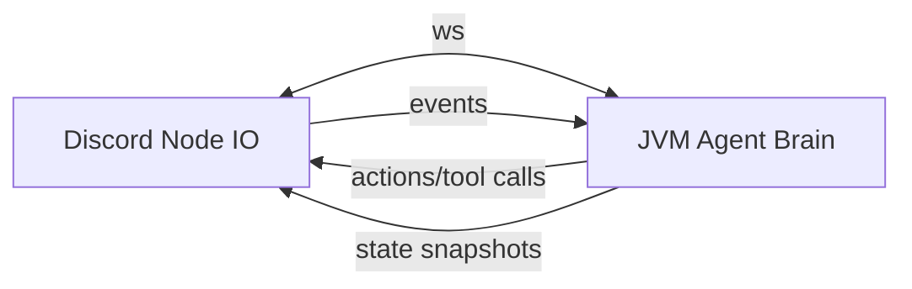

If you’re in **shadow-cljs** and you want to “reach out to JVM Clojure”, the smoothest mental model is:

> **ClojureScript cannot call JVM Clojure directly** (different runtimes), so you build a *boundary* — usually **WebSocket RPC** (or HTTP for simple calls).
> Then you share *protocol + validation* in **`*.cljc`** so both sides stay in lockstep.

Given your Discord plan (Node is king here), I’d do:

* **Node (discord.js or shadow-cljs :node target)** = IO adapter + realtime
* **JVM Clojure** = agent brain (tools, router, state, logging, benchmarks)
* **WebSocket** between them = events + tool calls + streaming



---

## Option A (recommended): WebSocket RPC + shared `cljc` protocol

### Why this is “smooth”

* Works for **streaming** (voice chunks, partial STT, frequent state updates)
* You can do **request/response** *and* **pub/sub** on one connection
* You can keep your **agent system authoritative** in JVM without blocking Node

### The key: define the protocol once (`cljc`)

Create `promethean/protocol.cljc`:

* message envelope
* op keywords
* `clojure.spec.alpha` validation (works in clj + cljs)

Example shape:

```clojure
;; promethean/protocol.cljc
(ns promethean.protocol
  (:require [clojure.spec.alpha :as s]))

(s/def ::id string?)
(s/def ::op keyword?)
(s/def ::reply-to (s/nilable ::id))
(s/def ::payload map?)

(s/def ::msg (s/keys :req-un [::id ::op ::payload]
                     :opt-un [::reply-to]))
```

Then both sides validate **incoming** messages with the same spec.

### Transport encoding

Pick one:

* **Transit** (best for keywordy Clojure data): great for clj + cljs; Node side can be cljs easily
* **JSON** (best if Node is TS/JS): simplest, but you’ll map keywords ↔ strings

For shadow-cljs Node builds, Transit is pretty painless.

---

## Option B: `taoensso/sente` if both ends are Clojure + ClojureScript

If your Discord process is **ClojureScript on Node**, Sente feels very “Clojure native” (ws + fallback + event router). If you’re mixing with TS/discord.js, raw WS + your own tiny RPC is usually simpler.

---

## What I’d implement for your agent boundary (minimal but powerful)

### Message ops

Keep them small and composable:

* `:io.discord/event` — message create, slash command, voice state, etc.
* `:io.audio/chunk` — optional (if you stream audio to JVM)
* `:agent/step` — “here’s new input, produce actions”
* `:tool/call` — tool requested by brain, executed by Node
* `:tool/result` — Node returns result to brain
* `:agent/state` — snapshots for UI/monitor
* `:log/event` — streaming report logging

### Request/response correlation

Use `:id` and `:reply-to`. That’s it. No fancy framework required.

### Tool execution location (important)

For Discord + “fun tools”, run tools **in Node**:

* play sfx
* send chat message
* TTS playback
* join voice channel

JVM keeps policy + planning, Node does side effects.

---

## “Shadow-cljs to Clojure” practicals

### If your Discord bot is *shadow-cljs :node*

You can:

* import npm libs (`discord.js`, `ws`)
* run a WS client
* share CLJC protocol/spec directly
* keep most of your agent glue as CLJS

### If your Discord bot is TS/JS

Still fine:

* WS boundary stays the same
* you validate on the JVM side with spec
* in TS you validate with zod/valibot *optionally*

---

## Concurrency model that won’t fight you tonight

* Node: **async/await + queues**
* JVM: **core.async channels** (event in, action out)

The WS connection is just two pumps:

* inbound → `event-ch`
* outbound ← `action-ch`

This also matches your “hierarchical agents later” idea (parent/child just becomes more message streams).

---

## TL;DR recommendation

Do this first:

1. JVM runs `ws://localhost:…/agent` and owns the agent loop
2. Node Discord bot connects, sends `:io.discord/event` messages
3. JVM replies with `:tool/call` / `:agent/state`
4. Node executes tools and replies with `:tool/result`

---

If you tell me **one thing** I can make this super concrete:

* Do you want the Discord process written in **TypeScript** (discord.js) or **ClojureScript** (shadow-cljs :node)?

Either way, I’ll sketch the exact namespaces + the DSL surface you’ll write in the Duck repo, and the minimal WS RPC layer that supports streaming + tool calls cleanly.
