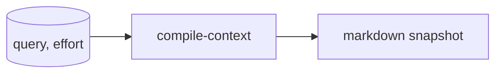
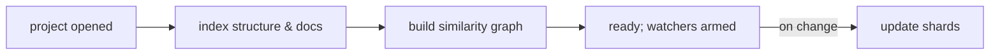

# Memory System Design

Below is a tight pass that **questions**, **refines**, **simplifies**, and **extends** your memory system. I’ve annotated concrete tie‑ins to your Promethean repo where it helps (citations inline). I also give drop‑in schemas, algorithms, and a short activation plan.

---

## TL;DR (what you really want)

* **Keep plaintext files** (they’re audit‑able, diff‑able, portable) **but** introduce a **write‑ahead log (WAL)** and a **two‑tier index**:

  * **Portable canonical log** → append‑only newline‑delimited JSON (NDJSON) files, chunked by date.
  * **Device‑local fast index** → SQLite (FTS5 + vector extension) or Lance/FAISS shards built from the log.
  * Ship a **tiny JSON “manifest”** + rolling **Bloom filter** (or Roaring bitmap) to know which segments to hydrate on a new machine.
* **Retrieval = fusion** of **dense** (embeddings) + **sparse** (keyword/TF-IDF/FTS) + **graph** (associative edges). Rank with a compact, explicit scoring function (below).
* **Consolidation** = background clustering of stale items → summarized “semantic memories” (with pointers back to originals). Hot→warm→cold tiers; nothing is lost, only made harder to retrieve.
* **Context compilation** = small iterative loop over the memory graph (beam search); prune near‑duplicates; promote strongly connected nodes; serialize final graph snapshot into Markdown.
* **Index once, update forever**: use file watchers already common in your workflow (mirrors the lsp watcher constraints you set in Emacs) to keep the index fresh.
* **Plug into Promethean** primitives you’ve already sketched:

  * *Event capture* → route opencode events through your **EventCapturePlugin** as the ingress into memory.
  * *Structures/Agents* → align with **Cephalon / Eidolon** as “organs,” and reuse your vector index notion (e.g., `repo-embeddings`).
  * *Data intake* → your `data/` pattern for audio→transcripts is an ingestion precedent you can reuse for other streams.
  * *Pseudo space* → treat this as living design in `pseudo/` per AGENT.md’s guidance.

---

## 1) Challenge the starting premise

> “There has to be a better way to persist memories than leaving a trail of markdown files.”

**Counter‑position:** Markdown is **excellent** as the public record: human‑readable, diff‑able, easy to back up and sign. The real friction is **readability for machines** (search, ranking) and **commit ergonomics** (lots of small files). So keep the Markdown, but **move “memory mechanics” into a WAL + index**. Files are the **artifact**; the **system** is the log & indices.

---

## 2) Minimal data model (portable → indexable)

Use a **canonical NDJSON log** (append‑only) plus Markdown artifacts when you want a nice narrative. Every memory event is one JSON object.

```json
{
  "id": "ulid-2025-11-10-...",

  "kind": "note|code|event|commit|doc|message|observation",
  "author": "agent|user|system",
  "ts": "2025-11-10T13:37:42Z",

  "meta": {
    "title": "short human title",
    "source": "opencode://events/...|git://...|web://...|file://...",
    "project": "promethean",
    "tags": ["#memory","#design"],
    "schema": "mem@1"
  },

  "content": {
    "text": "raw markdown or plain text (or code)",
    "sections": [
      {"h": "Context", "body": "..."},
      {"h": "Decision", "body": "..."}
    ],
    "attachments": [{"mime":"text/x-code","path":"...","lang":"ts"}]
  },

  "vector": null,           // filled by embedder
  "sparse": {"tokens": []}, // TF/keywords, populated by indexer
  "graph": {
    "links":[
      {"to":"id:...", "rel":"similar", "w":0.62},
      {"to":"id:...", "rel":"cites",   "w":0.35}
    ]
  },

  "ttl": {"hotUntil": "...", "warmUntil": "..."},
  "counters": {"reads": 3, "writes": 1, "evictions": 0}
}
```

> Your Emacs struct is close—here’s a more explicit shape that still maps to your `(store ...)` idea.

If you want an Emacs‑native mirror:

```elisp
(store
 (struct
  (meta (struct title description project tags schema))
  (content (struct text sections attachments))
  (graph (struct links))
  (ttl (struct hotUntil warmUntil))
  (counters (struct reads writes evictions))))
```

---

## 3) Storage + commit strategy (readable & “committable”)

**Files on disk:**

```text
memlog/
  2025-11/
    2025-11-10.ndjson        # canonical WAL (append-only)
    2025-11-10.idx.sqlite    # device-local fast index shard
    2025-11-10.vec.lance     # optional Lance/FAISS vector shard
  manifest.json              # list of segments, checksums, bloom
  bloom-rolling.bin          # helps fast cold-start checks
memdocs/
  2025.11.10.13.37.42.md     # narrative extracts ("context snapshots")
```

* **Commit ergonomics:** Commit **segment files** (few big files), not thousands of tiny ones.
* **Human‑first docs:** Keep selected context snapshots as Markdown in `memdocs/` using your **unique doc format** (already configured in `.dir-locals.el`) so filenames are collision‑free timestamps.
* **Device portability:** **manifest.json** lists segments & checksums. On a new machine: pull manifest → hydrate only the needed segments & rebuild a local index.
* **Why not “one giant JSON index”?** It bloats diffs and merges poorly. Segments + manifest keep Git happy and let you **compact** without churn.

---

## 4) Indexing (fast & portable)

**Dual index (hybrid retrieval):**

* **Dense**: embeddings per chunk (`vector`), ANN index (HNSW/FAISS/Lance).
* **Sparse**: SQLite FTS5 (or Tantivy/Lucene).
* **Graph**: adjacency lists stored in the WAL; materialize as a small sidecar table (`edges(src, dst, rel, w)`).

> You already model vector corpora (e.g., `repo-embeddings` using Chroma) in `pseudo/pil.hy`; the same pattern works for personal memory.

**Cold start**: Build from log segments.
**Steady state**: listeners/watchers append to WAL and **stream** updates into the local ANN + FTS shards.

---

## 5) Embedding flow (make “split‑semantically” concrete)

Chunking recipes:

* **Markdown & prose**: split on headings → paragraphs → sentences (keep ~512–800 token windows with 10–20% overlap).
* **Code**: **AST‑aware** where possible (functions/classes), else fold by braces/indent blocks; always keep symbol names as separate sparse terms.
* **Tabular/JSON**: preserve field names in sparse index; embed cell/field summaries.

**Flow:**

```mermaid
flowchart LR
A[WAL append] --> B[Chunker (md/ast/sentences)]
B --> C[Embed (batch)]
B --> D[Sparse terms]
C --> E[ANN shard]
D --> F[FTS shard]
E --> G[Segment manifest update]
F --> G
```

---

## 6) Retrieval + context compilation (explicit algorithm)

### Scoring

Combine similarity, recency, connectivity, and frequency.

$$
\mathrm{score}(m) = \alpha \cdot \cos(q, m) + \beta \cdot \mathrm{sparse}(q, m) + \gamma \cdot \mathrm{conn}(m, C) + \delta \cdot \mathrm{recency}(m) + \epsilon \cdot \mathrm{freq}(m)
$$

Typical weights: ($\alpha=0.45$, $\beta=0.25$, $\gamma=0.15$, $\delta=0.10$, $\epsilon=0.05$).

**Context loop (beam‑like):**

```pseudo
C0 = topK_fusion(query)               // from ANN ∪ FTS, K=64
for t in 1..T (effort levels):
  add strong-neighbors(Ct, thr=0.6, max=16)
  prune near-duplicates(Ct, sim>0.92) // keep highest query score
  update edge weights: +Δ for edges in Ct, -δ for edges to outside
  if no new strong neighbors: break
return serialize(Ct) // to Markdown from graph snapshot
```

Your description matches this; the important addition is **explicit thresholds**, beam size, and **symmetric pruning** (keep the item with stronger query affinity, count the pruned ones as “unrecalled” for decay).

**Mermaid (simplified):**

```mermaid
flowchart TD
Q[Query] --> R[ANN ∩ FTS fusion]
R --> C0[Seed Context]
C0 -->|expand| N[Add strong neighbors]
N -->|prune| P[Prune near-dupes]
P -->|update| U[Update edges (+/-)]
U -->|repeat until fixed-point or effort| C[Context]
C --> M[Markdown snapshot]
```

---

## 7) Memory consolidation (hot→warm→cold tiers)

Your policy in code:

```pseudo
on_memory_expire(m):
  if m.counters.reads >= READS_TO_PERSIST:
     persist(m)                 // keep as-is in WAL; raise warm TTL
  else:
     mark_for_consolidation(m)  // enqueue for clustering

if consolidation_queue.size >= N or elapsed >= τ:
  clusters = lsh_cluster(queue, k<=8, sim>=0.78)
  for cluster in clusters:
     summary = summarize(cluster)           // LLM or heuristic
     new_semantic = memory(summary, links=cluster.ids)
     write(new_semantic)                    // WAL append
     for x in cluster: demote_to_cold(x)    // keep! but cold
```

Nothing is deleted; “cold” means **harder to retrieve** unless the query or context makes it relevant.

**Your state machine** (tweaked names, fixed typos):

```mermaid
flowchart LR
A[In-Memory (hot)] -->|ttl expires| B{Should Persist?}
B -- yes --> W[Write WAL (persist as-is)]
B -- no --> X[Mark for Consolidation]
X -->|batch| Y[Cluster & Summarize]
Y --> Z[Write Semantic Memory + Link Back]
```

---

## 8) Event capture & “forming memories”

You said “Every event in opencode is intercepted.” You already have a natural home for this:

* **EventCapturePlugin**: “Comprehensive event capture and semantic search functionality.” Use it as ingress to the WAL.
* **AsyncSubAgentsPlugin**: good place to run background consolidation/summarization without blocking the main loop.
* **Cephalon** as the organ that “perceives/route/prompt” (fits the blackboard hub role).
* **Pandora/Eris**: thinker/prover pattern is already sketched via agents & profiles; fold your role list into profiles and budgets (see `pandora.dev.search.v1`).

---

## 9) Indexing projects (bootstrap + continuous)

* **Boot**: parse repo → build symbols (AST), docstrings, simple comments, similarity graph. You already imagine a **vector index over repo** (`repo-embeddings` with Chroma).
* **Continuous**: file watchers + commit hooks; mirror your LSP watcher thresholds (you’ve configured `lsp-file-watch-threshold` in Emacs) to avoid thrash.

For non‑code references (docs, tutorials), store: `source_url`, `fetch_date`, `project_affinity`, and keep only the **top‑N** by relevance to avoid bloat.

---

## 10) Social connections (multi‑agent roles → compact pattern)

Map your roles to a **blackboard + actors** pattern:

* **Thinker** (hypothesize) ↔ *Pandora* profile (discover/hypothesize)
* **Prover** (falsify) ↔ *Eris* adversarial profile (perturb/stress‑test)
* **Planner/Actor** ↔ Tasks/Messages/Messaging plugins (objectives→actions)
* **Observer/Sensor** ↔ EventCapturePlugin → Cephalon routing
* **Learner/Trainer** ↔ Profiles + telemetry (“learn-from-clicks t”), plus offline consolidation jobs.

Each tool call → **recompile the working context** (keep the last N graph nodes “sticky” so short‑term coherence is preserved).

---

## 11) Relating to your named ideas

* **Eidolon fields**: Treat *Eidolon* as the *semantic field* overlay (feature space + relation weights) backing the associative graph. You already list `Eidolon` as a structure used by *Pandora*—formalize it as **graph schema + similarity kernels** and store its tunables in `profile`s.
* **Nooi / Daimoi**: If “daimoi” = pluralized “daimon” (personas/spirits), model them as **profiles** + **memory scopes** that bias ranking/expansion differently per persona (you already have `profiles` with blends/budgets). “Nooi” can be the **collective** overlay across personas—i.e., an ensemble profile that aggregates clicks/edge reinforcements cross‑persona.
* **Enso protocol**: If this is your **event‑sourcing discipline**, make **WAL segments + manifest** your Enso “stream,” with **idempotent reducers** to rebuild local indices. If Enso is a network protocol, surface it as a **sink/source service** that ships segments and receives manifests (same outcome).

> If you mean something else by any of these, swap the label—this slotting stays valid.

---

## 12) Concrete scoring, TTL, and decay knobs

* **Recency**: ( \text{recency}(m)=e^{-\Delta t / \tau} ) with (\tau) per memory kind (e.g., code=7d, notes=14d, docs=30d).
* **Connectivity** to current context (C): ( \text{conn}(m,C)=\sum_{c\in C} w(m,c) \cdot \mathbb{1}[w(m,c)>\theta] ).
* **Frequency**: ( \log(1+\text{reads}) ).
* **Decay**: edges not touched in a compilation round: ( w \leftarrow w \cdot (1-\lambda) ).

---

## 13) “Readable & committable” UX fixes

* **Segment rollovers** daily/size‑based (e.g., 64 MB).
* **Single‑command chores**: `mem build`, `mem compact`, `mem verify` (use your bb/JS task runners; mirrors your `scripts/dev.mjs` pattern for multi‑package tasks).
* **Human snapshots**: auto‑render the compiled context graph → Markdown under `memdocs/` using your unique timestamp filenames.

---

## 14) Safety, provenance, and audit

* Keep **checksums** per segment (manifest).
* **Provenance** fields (`source`, `project`, `commit`) are mandatory.
* Attach **signatures** if you want tamper‑evident logs (optional).

---

## 15) Where it connects in your repo (evidence)

* **Event capture + async agents**: indexes/plugins you’ve defined for messaging/events/capture provide natural integration points.
* **Org/pseudo territory for design**: `pseudo/AGENT.md` explicitly invites speculative code scaffolds.
* **Structures**: `Cephalon` and `Eidolon` already exist conceptually as “organs”; treat `Cephalon` as router/blackboard and `Eidolon` as the field/graph layer.
* **Vector index precedent**: `repo-embeddings` definition (Chroma) shows the pattern to copy for personal memory indices.
* **Data intake pattern**: `data/README.md` shows your ingestion/deposition practice (e.g., transcripts) that can be generalized to memory streams.

---

## 16) Pseudocode you can paste today

**WAL append:**

```ts
async function appendMemory(event: MemoryEvent) {
  const segment = selectSegmentByDate(event.ts);
  await fs.appendFile(segment.log, JSON.stringify(event) + "\n");
  indexQueue.enqueue({segment, id: event.id});
}
```

**Index worker:**

```ts
for await (job of indexQueue) {
  const m = readFromLog(job.segment, job.id);
  const chunks = chunk(m.content);
  const embeds = await embed(chunks);
  fts.insert(m.id, sparseTerms(chunks));
  ann.upsert(m.id, pool(embeds));
  graph.upsertEdges(m.id, m.graph?.links ?? []);
}
```

**Context compile:**

```ts
function compileContext(q, effort=2) {
  let C = fusionTopK(q, 64);
  for (let t=0;t<effort;t++) {
    C = addStrongNeighbors(C, 0.6, 16);
    C = pruneNearDupes(C, 0.92);
    updateEdges(C, +0.05, -0.01);
    if (!hasNewNeighbors(C)) break;
  }
  return toMarkdown(C);
}
```

---

## 17) 10‑day activation plan

1. **Scaffold repo subpkg**: `packages/memory-core` (WAL, manifest, chunks).
2. **Implement WAL writer + manifest** (NDJSON segments + checksums).
3. **Local index**: SQLite (FTS5) + VSS/FAISS/Lance; add embedder adaptor.
4. **Event ingress**: wrap **EventCapturePlugin** to call `appendMemory`.
5. **Context compiler**: implement scoring + loop with tunables.
6. **Consolidation worker**: queue + LSH clustering + summarizer.
7. **CLI**: `mem add`, `mem query`, `mem compact`, `mem export-md`.
8. **Markdown snapshots**: render to `memdocs/` using your timestamp naming.
9. **Repo bootstrap**: run initial indexer over `packages/`, `services/`, `pseudo/` (use your `repo-embeddings` pattern).
10. **Telemetry**: flip `learn-from-clicks` style counters back into `counters.reads`.

---

## 18) Answering your original diagrams (cleaned)

**Remembering:**

```mermaid
flowchart LR
R[remember(details)] --> H{has-related-memory?}
H -- yes --> T[increase TTL / edge weights]
H -- no  --> N[create new memory (WAL append)]
```

**Recall effort → compile context:**



**Embedding flow (corrected typos):**


**Index lifecycle:**



---

## 19) What still needs decisions (the “holes”)

* **Exact embed model(s)** (text vs code vs multimodal) and dimensionality.
* **ANN tech** (FAISS/LanceDB/SQLite‑VSS) and shard rollover size.
* **Graph store** (sidecar SQLite table is fine early on).
* **Summarizer policy** (how aggressively to condense; budget caps).
* **Edge decay constants** and **effort levels** defaults.

None of these block the initial implementation—pick defaults and learn.

---

## 20) Final thought

You don’t need a brand‑new persistence substrate; you need a **disciplined log + index architecture** around the files you already value. The design above makes the memories **machine‑fast** while keeping them **human‑ownable**.

If you want, I can draft the exact `packages/memory-core` folder layout and first three modules next.
