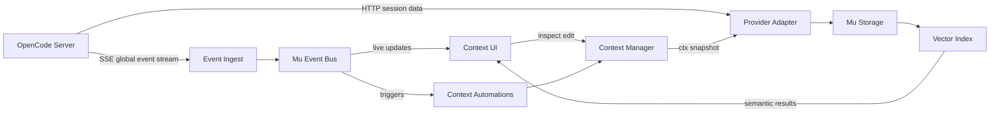

# Museeks opencode client — tightened spec + next steps

#museeks #mu #blanc #agents #opencode

You’ve already got the *right bones* here. Below is a sharpened version that makes the boundaries explicit:

* **Museeks** = the multi-provider client + UI + local index
* **Mu** = your canonical, provider-agnostic message + event format
* **Blanc** = the smallest provider/agent implementation to validate everything without coupling to OpenCode

---

## 1) The core idea (what you’re *really* building)

Museeks is a **local “agent session OS”** that:

1. Connects to one or more agent backends (starting with OpenCode server)
2. Normalizes everything into **Mu** (messages, sessions, events, contexts)
3. Stores it locally (per-user + per-project)
4. Builds a **semantic index** over *everything*
5. Lets humans (UI) and agents (tools) query history + context
6. Provides a **pub/sub event bus** so any consumer can react in real-time

This mirrors OpenCode’s own architecture (server is the source of truth, clients attach) but moves “the brain” (index + context management) into your own layer. ([OpenCode][1])

---

## 2) Mu format: make “message” and “event” separate on purpose

### Mu Message (what was *said*)

A message is a durable artifact you can store, search, and rehydrate.

```clojure
{:mu/type        :mu/message
 :mu/id          #uuid "..."
 :mu/ts          1700000000000
 :mu/provider    {:id :opencode
                  :session-id "sess_..."
                  :message-id "msg_..."}
 :mu/project     {:root "/path/to/repo"
                  :name "repo-name"}
 :mu/role        :user  ;; :assistant :system :tool
 :mu/parts       [{:type :text :text "Hello"}
                  {:type :tool-call
                   :tool "file.read"
                   :args {:path "src/app.clj"}}]
 :mu/meta        {:model "anthropic/claude-..."
                  :tags #{:prompt :interactive}}}
```

### Mu Event (what *happened*)

Events are *streams*, not state. They’re for realtime UI + automation.

```clojure
{:mu/type     :mu/event
 :mu/id       #uuid "..."
 :mu/ts       1700000000123
 :mu/topic    :session.message.part
 :mu/provider {:id :opencode :session-id "sess_..."}
 :mu/payload  {:part-id "part_..."
               :delta "new token chunk"}
 :mu/raw      {...}} ;; optional passthrough
```

**Rule of thumb**

* Messages are **replayable**
* Events are **observable**

---

## 3) Event taxonomy: align with OpenCode, then add your “Mu sugar”

OpenCode already exposes a rich event surface (sessions, tools, files, tui, etc.). ([OpenCode][2])
And the server exposes a **global SSE event stream** (`/global/event`) and the SDK exposes `event.subscribe()` for streaming. ([OpenCode][1])

### OpenCode → Mu mapping strategy

Instead of inventing brand new names, do this:

* **Keep OpenCode event types as `:mu/raw-type`**
* Emit a normalized `:mu/topic` that’s stable across providers

Example mapping:

| OpenCode event.type    | Mu topic                   |
| ---------------------- | -------------------------- |
| `session.created`      | `:session.created`         |
| `session.updated`      | `:session.updated`         |
| `session.deleted`      | `:session.deleted`         |
| `session.idle`         | `:session.idle`            |
| `message.updated`      | `:session.message.updated` |
| `message.part.updated` | `:session.message.part`    |
| `tool.execute.before`  | `:tool.execute.before`     |
| `tool.execute.after`   | `:tool.execute.after`      |
| `file.edited`          | `:file.edited`             |

So your original ideas like:

* `prompt.sent`
* `prompt.updated`
* `prompt.cleared`

…can become a **Mu-level semantic layer** emitted by the Museeks UI/client regardless of provider (and still backed by the raw OpenCode events).

---

## 4) Storage model: minimum tables that won’t paint you into a corner

### Local DB tables (per project)

You want *reliable joins* + *fast search* + *easy export*.

**Recommended minimal schema**

* `projects` (root, name, vcs info)
* `providers` (id, base-url, auth refs)
* `sessions` (provider-id, provider-session-id, title, status, created-at, updated-at)
* `messages` (session-id, role, ts, provider-message-id)
* `parts` (message-id, type, content-json, order)
* `events` (topic, ts, payload-json, provider ids)
* `assets` (files, commands, tool runs, logs)
* `embeddings` (asset-id, model, vector blob, metadata)

### Index strategy

Start dumb-but-solid:

* embed **message text**
* embed **tool outputs**
* embed **file chunks** (path + range)

Later:

* embed “context snapshots” as first-class objects

---

## 5) “Search Everything semantically” = one pipeline, many sources

Think of the indexer as “a document compiler”:

**Inputs**

* session messages
* tool outputs
* files (repo + notes + configs)
* context snapshots
* “agent skills” / rules-like artifacts

**Normalization**
Everything becomes a `MuSearchDoc`:

```clojure
{:doc/id      "..."
 :doc/type    :message ;; :file :tool-output :context :note
 :doc/title   "..."
 :doc/text    "..."
 :doc/refs    [{:kind :session :id "..."} {:kind :file :path "src/x.clj"}]
 :doc/meta    {...}}
```

**Outputs**

* vector index for similarity
* keyword index for exact matching
* backlinks graph (“why did this get pulled into context?”)

---

## 6) Context management: treat it like a build artifact

Instead of “context = implicit magic”, make it explicit:

### Context Snapshot

A snapshot is: *the exact thing you are about to send to the model*.

```clojure
{:ctx/id        #uuid "..."
 :ctx/session   "sess_..."
 :ctx/ts        1700000000999
 :ctx/model     {:provider "anthropic" :model "claude-..."}
 :ctx/messages  [#uuid "..." #uuid "..."] ;; selected messages
 :ctx/files     [{:path "src/core.clj" :mode :snippet :lines [10 80]}]
 :ctx/skills    ["skill://refactor" "skill://testing"]
 :ctx/notes     ["...freeform injected text..."]
 :ctx/tokens    {:estimated 12000 :limit 200000}
 :ctx/meta      {:reason :auto-relevant :score 0.78}}
```

### Context automations (your “compiler passes”)

* `select-relevant-history`
* `attach-related-files`
* `dedupe`
* `compress`
* `publish ctx.updated`

This is where Museeks becomes *better than* the stock provider clients.

---

## 7) Blanc: build a provider that proves the architecture

Your Blanc concept is perfect because it forces the right separations:

### Blanc “provider”

* sessions + message history
* context manager
* tool DSL
* zero network required

And its config structure (`.blanc/agents.edn`, `mcps.edn`, etc.) becomes your canonical **provider-independent config standard**, with OpenCode adapter simply mapping into it.

---

## 8) Suggested repo + config layout

### Global (user)

* `~/.mu/config.edn`
* `~/.mu/providers/opencode.edn`
* `~/.mu/plugins/`

### Project

* `./.mu/config.edn`
* `./.mu/index.sqlite`
* `./.mu/cache/embeddings/`
* `./.mu/contexts/`
* `./.mu/sessions/`

This matches your “global vs project” split cleanly, while letting search/index stay local-per-project.

---

## 9) Museeks architecture diagram



---

## 10) OpenCode integration specifics you can lean on immediately

These are “hard facts” you can wire your adapter to:

* OpenCode server exposes an OpenAPI spec at `/doc` and a global event SSE stream at `/global/event`. ([OpenCode][1])
* SDK shows the canonical event loop pattern: `client.event.subscribe()` and `for await` over `events.stream`. ([OpenCode][3])
* Plugins enumerate event types you can expect (session/message/tool/file/lsp/etc). ([OpenCode][2])
* Rules are sourced from `AGENTS.md` (OpenCode-style instruction injection). ([OpenCode][4])

That’s enough to build a **Clojure client without guessing**: you can generate types from `/doc` and stream events from `/global/event`.

---

## 11) Roadmap that stays “MVP-first” without corner-cutting

### Milestone A — Read-only OpenCode browser

* list sessions
* load messages
* store locally as Mu messages

### Milestone B — Live stream + local event bus

* connect `/global/event`
* emit Mu events
* UI live-updates on message.part changes

### Milestone C — Semantic index

* embed message text
* embed tool outputs
* query API: `mu.search`

### Milestone D — Context snapshots

* show exactly what context will be sent
* save snapshots
* publish `ctx.updated` events

### Milestone E — Blanc provider + tool DSL

* “fake agent backend” that proves provider abstraction
* plugins/hooks in clj

---

If you want a *single next step that unlocks everything*:
**build the OpenCode adapter that can (1) list sessions, (2) fetch messages, (3) consume `/global/event` and publish Mu events locally.** That immediately validates Museeks + Mu + pub/sub + storage.

If you drop your preferred stack choices (SQLite vs Postgres, Chroma vs embedded vectors, core.async vs manifold), I’ll turn this into a concrete `deps.edn` project skeleton + namespaces + a minimal SSE consumer in Clojure.

[1]: https://opencode.ai/docs/server/ "Server | OpenCode"
[2]: https://opencode.ai/docs/plugins/ "Plugins | OpenCode"
[3]: https://opencode.ai/docs/sdk/ "SDK | OpenCode"
[4]: https://opencode.ai/docs/rules/?utm_source=chatgpt.com "Rules"
