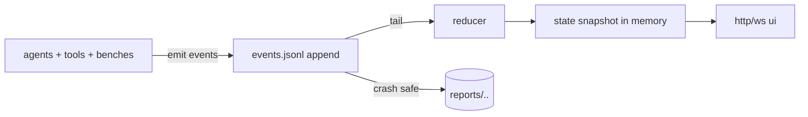
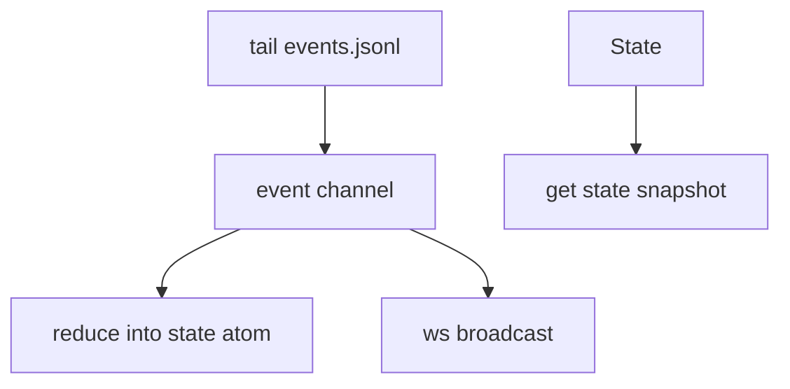

Yes. The next “make it real” step is **event streaming + reducers**.

Once you have that, everything else (async agents, locks, benchmarks, UI, resume-after-crash) becomes *plumbing around the same spine*.

---

# The spine: append-only event log ➜ deterministic reducer ➜ live UI



---

# 1) Event contract: boring on purpose (and stable forever)

### One event = one JSON object per line

Required keys:

* `:t` unix ms
* `:type` keyword string-ish (write as string in JSON)
* `:run/id` stable run folder id
* `:seq` monotonic event number per run (for resume + dedupe)

Recommended keys (by domain):

* `:agent/id`, `:agent/parent`, `:agent/depth`
* `:task/id`
* `:lock/path`, `:lock/owner`
* `:tool/name`, `:tool/call-id`
* `:bench/suite`, `:bench/case-id`, `:model`

Example events:

```json
{"t":1730000,"seq":1,"run/id":"run-2026-01-25T02-30-11Z","type":"agent/spawned","agent/id":"root","agent/depth":0,"model":"qwen3:70b"}
{"t":1730001,"seq":2,"run/id":"run-2026-01-25T02-30-11Z","type":"lock/acquired","lock/path":"frontend/src/App.tsx","lock/owner":"agent-1.2","lock/ttl-ms":60000}
{"t":1730002,"seq":3,"run/id":"run-2026-01-25T02-30-11Z","type":"tool/requested","tool/name":"fs/write","tool/call-id":"tc-9","agent/id":"agent-1.2"}
{"t":1730003,"seq":4,"run/id":"run-2026-01-25T02-30-11Z","type":"tool/result","tool/call-id":"tc-9","ok":true}
{"t":1730004,"seq":5,"run/id":"run-2026-01-25T02-30-11Z","type":"agent/status","agent/id":"agent-1.2","status":"blocked","reason":"lock-conflict"}
```

---

# 2) `promethean.agent.events` — crash-safe JSONL writer

This is the “never lose progress” primitive.

**`src/promethean/agent/events.clj`**

```clj
(ns promethean.agent.events
  (:require
    [cheshire.core :as json]
    [clojure.java.io :as io])
  (:import
    (java.io BufferedWriter FileWriter)
    (java.nio.channels FileChannel)
    (java.nio.file Paths StandardOpenOption)))

(defn now-ms [] (System/currentTimeMillis))

(defn- ensure-parent! [path]
  (io/make-parents path)
  path)

(defn open-writer!
  "Open a JSONL event writer for a run.

  opts:
    {:path \"reports/<suite>/<run-id>/events.jsonl\"
     :fsync? true    ;; safer, slower
     :flush? true}   ;; flush buffered writer on each emit

  returns {:emit! fn :close! fn :path ...}"
  [{:keys [path fsync? flush?]
    :or {fsync? true flush? true}}]
  (ensure-parent! path)
  ;; append writer
  (let [bw (BufferedWriter. (FileWriter. path true))
        ;; channel for fsync
        ch (when fsync?
             (FileChannel/open (Paths/get path (make-array String 0))
                               (into-array StandardOpenOption
                                           [StandardOpenOption/WRITE
                                            StandardOpenOption/CREATE])))

        !seq (atom 0)]
    {:path path
     :emit!
     (fn emit! [run-id ev]
       (let [e (assoc ev
                 :t (or (:t ev) (now-ms))
                 :run/id run-id
                 :seq (long (swap! !seq inc)))
             line (str (json/generate-string e) "\n")]
         (.write bw line)
         (when flush? (.flush bw))
         (when fsync? (.force ch true))
         e))
     :close!
     (fn close! []
       (try (.flush bw) (catch Throwable _))
       (try (.close bw) (catch Throwable _))
       (when ch (try (.close ch) (catch Throwable _))))}))

(defn run-id!
  "Simple run id helper."
  []
  (let [ts (java.time.Instant/now)]
    (str "run-" ts)))
```

That gives you:

* **append-only** durability
* **fsync** safety (optional)
* a stable `:seq` per run

---

# 3) Reducer: rebuild “world state” from events

You want state that the UI can show *and* supervisors can query.

### State shape that scales

```clj
{:run/id ...
 :agents {agent-id {:status ... :parent ... :children ... :model ...}}
 :locks {path {:owner ... :ttl-ms ... :since ...}}
 :tools {call-id {:tool ... :agent ... :status ...}}
 :bench {:cases {case-id {:status ... :score ...}}}
 :last/seq 123}
```

**`src/promethean/agent/reducer.clj`**

```clj
(ns promethean.agent.reducer
  (:require [clojure.set :as set]))

(defn empty-state [run-id]
  {:run/id run-id
   :agents {}
   :locks {}
   :tools {}
   :bench {:cases {}}
   :last/seq 0})

(defmulti apply-event
  (fn [_state ev] (keyword (:type ev))))

(defmethod apply-event :default [state ev]
  (assoc state :last/seq (:seq ev)))

(defmethod apply-event :agent/spawned [state ev]
  (let [aid (:agent/id ev)
        pid (:agent/parent ev)]
    (-> state
        (assoc-in [:agents aid]
                  (merge {:id aid
                          :parent pid
                          :children #{}
                          :status :spawned
                          :depth (:agent/depth ev)
                          :model (:model ev)}
                         (get-in state [:agents aid])))
        (cond-> pid (update-in [:agents pid :children] (fnil conj #{}) aid))
        (assoc :last/seq (:seq ev)))))

(defmethod apply-event :agent/status [state ev]
  (let [aid (:agent/id ev)
        status (keyword (:status ev))]
    (-> state
        (assoc-in [:agents aid :status] status)
        (assoc-in [:agents aid :status/reason] (:reason ev))
        (assoc :last/seq (:seq ev)))))

(defmethod apply-event :agent/message [state ev]
  ;; store only last N messages per agent unless you want full replay
  (let [aid (:agent/id ev)
        msg {:t (:t ev)
             :from (:from ev)
             :kind (:kind ev)
             :body (:body ev)}]
    (-> state
        (update-in [:agents aid :messages] (fnil conj []) msg)
        (update-in [:agents aid :messages]
                   (fn [xs] (vec (take-last 50 xs))))
        (assoc :last/seq (:seq ev)))))

(defmethod apply-event :lock/acquired [state ev]
  (let [p (:lock/path ev)]
    (-> state
        (assoc-in [:locks p]
                  {:path p
                   :owner (:lock/owner ev)
                   :since (:t ev)
                   :ttl-ms (:lock/ttl-ms ev)})
        (assoc :last/seq (:seq ev)))))

(defmethod apply-event :lock/released [state ev]
  (let [p (:lock/path ev)]
    (-> state
        (update :locks dissoc p)
        (assoc :last/seq (:seq ev)))))

(defmethod apply-event :tool/requested [state ev]
  (let [id (:tool/call-id ev)]
    (-> state
        (assoc-in [:tools id]
                  {:id id
                   :tool (:tool/name ev)
                   :agent (:agent/id ev)
                   :status :requested
                   :t (:t ev)})
        (assoc :last/seq (:seq ev)))))

(defmethod apply-event :tool/result [state ev]
  (let [id (:tool/call-id ev)]
    (-> state
        (update-in [:tools id] merge
                   {:status :done
                    :ok (:ok ev)
                    :t2 (:t ev)})
        (assoc :last/seq (:seq ev)))))

(defmethod apply-event :bench/case-start [state ev]
  (let [cid (:bench/case-id ev)]
    (-> state
        (assoc-in [:bench :cases cid]
                  {:id cid
                   :suite (:bench/suite ev)
                   :model (:model ev)
                   :status :running
                   :t (:t ev)})
        (assoc :last/seq (:seq ev)))))

(defmethod apply-event :bench/case-end [state ev]
  (let [cid (:bench/case-id ev)]
    (-> state
        (update-in [:bench :cases cid] merge
                   {:status :done
                    :score (:score ev)
                    :t2 (:t ev)})
        (assoc :last/seq (:seq ev)))))

(defn reduce-events
  "Pure reducer."
  [state events]
  (reduce apply-event state events))
```

This is the thing your UI consumes.
It’s also how you **resume from disk**.

---

# 4) Tailer: follow the JSONL file like `tail -f`

This makes the UI “live” and also enables “parent wakes up when child logs something”.

**`src/promethean/agent/tail.clj`**

```clj
(ns promethean.agent.tail
  (:require
    [cheshire.core :as json]
    [clojure.core.async :as a])
  (:import
    (java.io RandomAccessFile)))

(defn start-tail!
  "Tails a JSONL file and pushes parsed events into out-ch.

  opts:
    {:poll-ms 100
     :start-at :end|:beginning}

  Returns {:stop! fn}."
  [{:keys [path out-ch poll-ms start-at]
    :or {poll-ms 100 start-at :end}}]
  (let [stop-ch (a/chan)
        raf (RandomAccessFile. path "r")
        _ (when (= start-at :end)
            (.seek raf (.length raf)))]
    (a/go-loop []
      (let [[_ ch] (a/alts! [(a/timeout poll-ms) stop-ch] :priority true)]
        (if (= ch stop-ch)
          (do (.close raf) :stopped)
          (do
            (loop []
              (when-let [line (.readLine raf)]
                (try
                  (a/>! out-ch (json/parse-string line true))
                  (catch Exception _)
                  (recur))))
            (recur)))))
    {:stop! (fn [] (a/close! stop-ch))}))
```

Now you can:

* run a reducer that updates in-memory state live
* stream those events over websocket

---

# 5) “State server”: reducer loop + websocket broadcaster

You can keep this extremely small:

* one reducer process per run
* it keeps `{run-id -> state}` in memory
* it broadcasts new events to subscribers

### Minimal wiring diagram



Pseudo-implementation idea:

```clojure
(defonce !state (atom (empty-state run-id)))

(a/go-loop []
  (when-let [ev (a/<! ev-ch)]
    (swap! !state apply-event ev)
    (doseq [ws @!subscribers] (send! ws ev))
    (recur)))
```

You don’t need anything fancier until you want multi-run hosting.

---

# 6) How supervisors use this (sleep/wake without polling)

This is the nice part:

**supervisor doesn’t check children**
children **emit events**
supervisor **tails child-events channel**

You unify “progress” into the same pipeline.

Example: subagent reports progress → parent wakes:

```clojure
(emit! run-id {:type "agent/message"
               :agent/id parent-id
               :from child-id
               :kind "state"
               :body {:status :blocked :reason :lock-conflict}})
```

Parent’s inbox receives the same message.

---

# 7) Checkpointing (optional but it’s the next performance win)

JSONL replay is fine at first, but you’ll want **snapshots** for:

* long runs
* large agent swarms
* big benchmarks

Simple checkpoint contract:

```
events.jsonl
checkpoint.edn   ;; reduced state
checkpoint.seq   ;; last seq included
```

Every N events:

* write state to `checkpoint.edn`
* write last seq to `checkpoint.seq`

Then resume:

* load checkpoint
* skip older events (or fast-forward by seq)

---

# 8) Where locks + “special conflict threads” fit

Locks are just events + a small service.

When lock fails:

* emit `lock/blocked`
* open “conflict thread” (also just events)
* parent agent is the arbiter

Events you’ll want:

* `lock/blocked`
* `conflict/opened`
* `conflict/message`
* `conflict/resolved`

All of these reduce into UI state cleanly.

---

# 9) Benchmarks become *just another producer of events*

Your tool-choice benchmark runner should emit:

* `bench/suite-start`
* `bench/case-start`
* `tool/requested`
* `tool/result`
* `bench/case-end`
* `bench/suite-end`

…and you get a unified report UI for free.

---

# The “Agent OS” is now tangible

At this point you have:

✅ durable append-only progress
✅ resumable execution
✅ live UI stream
✅ a reducer that can represent *anything* (agents, tools, locks, benchmark cases)

From here the next “big win” is implementing:

* `promethean.agent.locks` (with TTL + conflict threads)
* then `promethean.agent.runtime.spawn!` (supervisor tree)
* then “coding-agent benchmark” inside containers

If you want, I’ll continue by sketching the **lock service** with TTL + heartbeats + conflict escalation *as events* (so it slots right into this spine).
