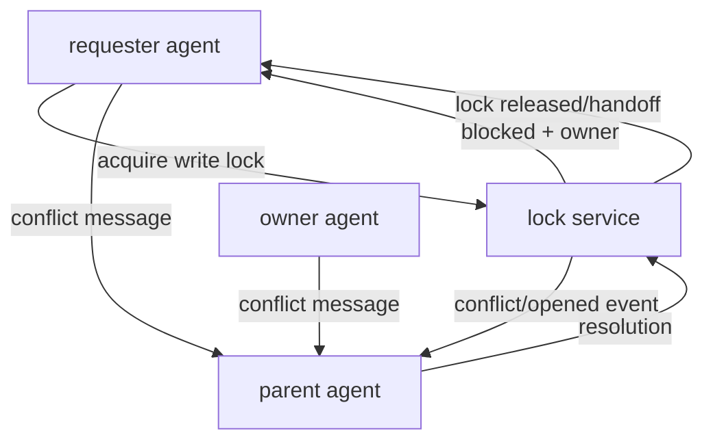

Awesome — **locks + conflict threads** is the piece that turns “multi-agent chaos” into an actual **operating system**.

What you want is basically:

* **resources are owned**
* **ownership is visible**
* **conflicts become conversations**
* **no deadlocks after crashes**
* **agents can keep working around contention**

Let’s make it real.

---

# Lock service as a first-class subsystem

## The lock contract (MVP)

* Locks are **exclusive-write** (simple first)
* Locks have **TTL + heartbeats** (crash-safe)
* Attempting to use a locked file returns:

  * current owner
  * existing conflict thread id (or opens one)
  * wait position / waiters list

Later we can add read/write locks, but start with “write lock only”.

---

# Events: this stays event-sourced

These events are enough:

```clojure
"lock/acquired"
"lock/released"
"lock/blocked"
"lock/heartbeat"

"conflict/opened"
"conflict/message"
"conflict/resolved"
```

Your reducer just updates:

* `state.locks`
* `state.conflicts`

The UI gets it for free.

---

# Conflict threads: structured conversations about resource ownership

When an agent hits a locked file, the system does **not** just fail.

It creates or reuses a *conflict thread*:

* participants: owner + requester + parent (arbiter)
* topic: the resource path
* goal: resolution decision



The key idea: **contention routes upward into hierarchy** where authority exists.

---

# Lock service API (async-first)

Make the lock service a little actor with a request channel:

* `acquire!`
* `release!`
* `heartbeat!`
* `who-holds!`
* `list!`
* `resolve-conflict!`

Each request returns on a reply channel (or promise-chan).

### Request/response shapes

```clojure
{:op :acquire :agent "agent-1.2" :path "frontend/src/App.tsx" :mode :write}
=> {:ok true :lock {...}}

{:op :acquire :agent "agent-2.1" :path "frontend/src/App.tsx" :mode :write}
=> {:ok false :error :locked :owner "agent-1.2" :conflict/id "cx-7"}
```

---

# `promethean.agent.locks` (MVP implementation skeleton)

**exclusive write locks + TTL + conflict creation**

```clojure
(ns promethean.agent.locks
  (:require
    [clojure.core.async :as a]
    [promethean.agent.events :as evt]))

(defn now-ms [] (System/currentTimeMillis))

(defn- new-conflict-id [] (str "cx-" (java.util.UUID/randomUUID)))

(defn start-lock-service!
  "Returns {:req-ch ... :stop! ... :state ...}

  lock-state:
    {:locks {path {:owner ... :since ... :expires-at ... :ttl-ms ... :waiters [...] :conflict/id ...}}
     :conflicts {id {:id ... :path ... :owner ... :waiters [...] :opened-at ... :resolved? ...}}}"
  [{:keys [emit! run-id ttl-ms sweep-ms]
    :or {ttl-ms 60000 sweep-ms 1000}}]
  (let [req-ch (a/chan 256)
        stop-ch (a/chan)
        state (atom {:locks {} :conflicts {}})]

    (defn emit!ev [m] (when emit! (emit! run-id m)))

    (defn expired? [lock]
      (<= (:expires-at lock) (now-ms)))

    (defn ensure-conflict! [path lock requester]
      (let [cid (or (:conflict/id lock) (new-conflict-id))
            cx  (get-in @state [:conflicts cid])]
        (when-not cx
          (swap! state assoc-in [:conflicts cid]
                 {:id cid
                  :path path
                  :owner (:owner lock)
                  :waiters []
                  :opened-at (now-ms)
                  :resolved? false})
          (emit!ev {:type "conflict/opened"
                    :conflict/id cid
                    :lock/path path
                    :lock/owner (:owner lock)
                    :lock/requester requester}))
        cid))

    (defn acquire! [{:keys [agent path mode]}]
      (let [locks (:locks @state)
            lock (get locks path)
            t (now-ms)]
        (cond
          (nil? lock)
          (let [lock' {:path path
                       :mode mode
                       :owner agent
                       :since t
                       :ttl-ms ttl-ms
                       :expires-at (+ t ttl-ms)
                       :waiters []
                       :conflict/id nil}]
            (swap! state assoc-in [:locks path] lock')
            (emit!ev {:type "lock/acquired"
                      :lock/path path :lock/owner agent :lock/ttl-ms ttl-ms})
            {:ok true :lock lock'})

          (expired? lock)
          (do
            ;; treat as released and acquire
            (swap! state update :locks dissoc path)
            (emit!ev {:type "lock/released"
                      :lock/path path :lock/owner (:owner lock) :reason "expired"})
            (acquire! {:agent agent :path path :mode mode}))

          (= (:owner lock) agent)
          (let [lock' (assoc lock :expires-at (+ t ttl-ms))]
            (swap! state assoc-in [:locks path] lock')
            (emit!ev {:type "lock/heartbeat"
                      :lock/path path :lock/owner agent})
            {:ok true :lock lock'})

          :else
          (let [cid (ensure-conflict! path lock agent)]
            (swap! state update-in [:locks path :waiters]
                   (fn [xs]
                     (let [xs (vec (or xs []))]
                       (if (some #{agent} xs) xs (conj xs agent)))))
            (emit!ev {:type "lock/blocked"
                      :lock/path path
                      :lock/owner (:owner lock)
                      :lock/requester agent
                      :conflict/id cid})
            {:ok false
             :error :locked
             :owner (:owner lock)
             :conflict/id cid
             :waiters (get-in @state [:locks path :waiters])}))))

    (defn release! [{:keys [agent path]}]
      (let [lock (get-in @state [:locks path])]
        (cond
          (nil? lock) {:ok true :released false}
          (not= (:owner lock) agent)
          {:ok false :error :not-owner :owner (:owner lock)}

          :else
          (do
            (swap! state update :locks dissoc path)
            (emit!ev {:type "lock/released" :lock/path path :lock/owner agent})
            {:ok true :released true
             :waiters (:waiters lock)
             :conflict/id (:conflict/id lock)}))))

    (defn resolve-conflict! [{:keys [conflict/id resolution]}]
      (swap! state assoc-in [:conflicts id :resolved?] true)
      (swap! state assoc-in [:conflicts id :resolution] resolution)
      (emit!ev {:type "conflict/resolved"
                :conflict/id id
                :resolution (pr-str resolution)})
      {:ok true})

    ;; sweeper: expire locks in background
    (a/go-loop []
      (let [[_ ch] (a/alts! [(a/timeout sweep-ms) stop-ch] :priority true)]
        (when-not (= ch stop-ch)
          (doseq [[path lock] (:locks @state)]
            (when (expired? lock)
              (swap! state update :locks dissoc path)
              (emit!ev {:type "lock/released"
                        :lock/path path
                        :lock/owner (:owner lock)
                        :reason "expired"})))
          (recur))))

    ;; request loop
    (a/go-loop []
      (let [[v ch] (a/alts! [req-ch stop-ch] :priority true)]
        (if (= ch stop-ch)
          :stopped
          (let [{:keys [op reply]} v
                resp (case op
                       :acquire (acquire! v)
                       :release (release! v)
                       :resolve-conflict (resolve-conflict! v)
                       :who-holds {:ok true :lock (get-in @state [:locks (:path v)])}
                       :list {:ok true :locks (:locks @state)}
                       {:ok false :error :unknown-op :op op})]
            (when reply (a/>! reply resp))
            (recur)))))

    {:req-ch req-ch
     :state state
     :stop! (fn [] (a/close! stop-ch))}))
```

This already hits your requirements:

* async-first ✅
* TTL crash safety ✅
* discoverable ownership ✅
* conflict thread creation ✅
* event-sourced ✅

---

# How tools integrate with locks (enforcement point)

You don’t want the LLM to “remember” to lock files.

You want the **tool runtime** to enforce it.

### Wrap file tools with lock checks

Behavior:

* `fs/write` requires lock ownership
* if not owned → return `{:error :locked ...}` **and** emit conflict events
* agent runtime marks itself `:blocked` and informs parent

**That’s the coordination loop you want.**

---

# Parent arbitration behavior (what the supervisor *does*)

When the parent gets `lock/blocked` or `conflict/opened`:

It chooses a resolution strategy:

## Resolution strategies

1. **Ask owner to release**

* best when changes are small / done

2. **Handoff lock**

* owner finishes quickly and hands it off

3. **Fork file**

* requester writes alternate file, later merge

4. **Merge plan**

* split file into smaller regions / tasks

These become explicit `conflict/resolved` outcomes.

Example:

```clojure
{:strategy :handoff
 :owner "agent-1.2"
 :requester "agent-2.1"
 :handoff-at "after next commit"
 :notes "owner finishing layout pass"}
```

---

# “Agents can open a special thread” — how to model it cleanly

Give conflict threads their own id space and treat them as “conversations”:

```clojure
{:thread/id "cx-7"
 :thread/type :conflict
 :thread/topic "frontend/src/App.tsx"
 :thread/participants #{"agent-1.2" "agent-2.1" "agent-1"}
```

And messages in that thread are still just `agent/message` events with `:thread/id`.

---

# The next missing piece: reconciliation (plan edits spawn/cancel agents)

Now that you have durability + locks, the next “OS” primitive is:

## Plan reconciliation loop

Inputs:

* plan events (`plan/updated`)
* agent state (`agent/status`)
* conflicts (`lock/blocked`)

Outputs:

* spawn child agents
* cancel child agents
* reassign tasks

This is the parent agent’s job.

---

# Minimal “spawn/join” interface (async subagents)

You want to be able to do:

* spawn N children at once
* collect results as they come back
* parent sleeps while children work

The cleanest API is:

```clojure
(spawn! runtime {:parent "agent-1" :spec child-spec})
=> {:agent/id "agent-1.2" :inbox ch :done-ch ch2}
```

Where `done-ch` emits when child completes.

---

# Why this is the correct order to build

You now have a build order that composes:

1. **events.jsonl writer** ✅
2. **reducer + tailer** ✅
3. **lock service** ✅ (this message)
4. **agent runtime spawn/supervise** ⬅️ next
5. **tool execution as jobs**
6. **bench suites + container orchestration**
7. **UI server**

At every step you’ll *see* progress in the UI.

---

# Next continuation (if you want me to keep going)

I can continue with either of these, in the same “drop-in module skeleton” style:

1. **`promethean.agent.runtime`**: spawn child agents + supervisor tree + sleep/wake
2. **`promethean.agent.bus`**: message routing rules (parent/child only by default, configurable)
3. **Tool job queue**: concurrency limits + retries + idempotency keys
4. **Plan reconciliation**: editable EDN plan ➜ spawns/cancels + progress tracking

If I had to pick the next one to unlock everything: **runtime spawn/supervise**.
