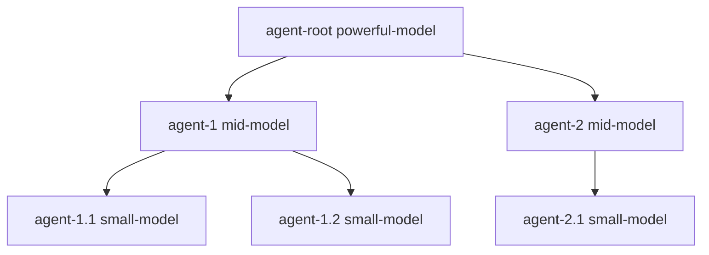

You’re describing a **supervisor-style, async-first, hierarchical agent runtime** with:

* **tree-shaped ownership + delegation**
* **high concurrency** (lots of subagents running at once)
* **strong isolation** (tools, prompts, model tiers, budgets)
* **coordination primitives** (messaging + file locks + conflict chats)
* **event-sourced durability** (never lose progress)
* **benchmarks that exercise the *same runtime*** you’ll use in production

That’s a coherent “operating system” shape.

Below is a zoomed-out design that keeps your *agent SDK vibe* but gives you the concurrency + persistence backbone.

---

## Async-first in Clojure: what to use

You want **coordination concurrency**, not just “run some things in parallel”.

### Best-fit primitives (in practice)

* **`core.async`** for:

  * agent inboxes
  * supervisor loops (“parent sleeps, wakes up”)
  * fan-out/fan-in of subagent tasks
  * cancel/timeout propagation
* **Thread pools / executors** for:

  * tool calls (IO + shell + docker)
  * model calls (HTTP requests)
* Optional: **virtual threads** (Java 21) for simpler “one task = one thread” style *without* blowing up OS threads.
  (Still keep `core.async` for coordination.)

**Rule of thumb:**
`core.async` = *control plane*
executors = *work plane*

---

## The runtime you want (supervisor tree + message graph)

Think in two graphs:

1. **Agent tree (authority / ownership / constraints)**
2. **Conversation graph (who can talk to who)**

### Agent tree



### Conversation graph defaults

* child → parent ✅
* parent → child ✅
* siblings ❌ (unless explicitly enabled)
* peer-to-peer ✅ (only via “bridge threads” / parent-mediated)

That keeps coordination sane while still allowing “agents can talk”.

---

## Agent lifecycle: “sleep and periodically wake up”

This maps really cleanly to a **supervisor loop**:

* Parent spawns subagents
* Parent sleeps (no polling burn)
* Parent wakes when:

  * child reports progress
  * child requests help / unlock
  * lock conflict happens
  * watchdog timer fires

Implementation shape:

* each agent has an **inbox channel**
* parent has a **supervisor loop** waiting on:

  * inbox messages
  * timer tick channel
  * child-done channel

---

## Model tiering by depth (the “increasing restriction” rule)

A policy object derived from the parent:

```clojure
{:depth 0 :allowed-models ["gpt-5.2" "qwen3:70b"] :budget {...} :tools :all}
{:depth 1 :allowed-models ["qwen3:32b"]           :budget {...} :tools :subset}
{:depth 2 :allowed-models ["qwen3:14b"]           :budget {...} :tools :tiny}
```

Key idea: **capability flows downward**, never upward.

* parent decides: `model`, `system-prompt`, `toolset`, `budget`
* child can *request* upgrades but cannot grant itself anything

---

## Messaging: ephemeral context + structured state updates

You want “special ephemeral context thread” for:

* status updates
* coordination
* “what I’m doing / what I need”
* conflict resolution

Do two message types:

1. **chat messages** (natural language)
2. **state messages** (EDN facts you can compute with)

Example state update:

```clojure
{:type :agent/state
 :agent-id "agent-1.2"
 :status :blocked
 :blocking {:kind :file-lock :path "frontend/src/App.tsx" :owner "agent-2.1"}
 :intent "Implement websocket message list"
 :progress {:done 2 :total 5}}
```

That gives you:

* conversation for humans
* machine-readable state for orchestration/UI

---

## File locking: do it like a tiny distributed system

The lock system wants:

* exclusive locks (write)
* shared locks (read) (optional later)
* TTL + heartbeats (so crashes don’t deadlock you)
* wait queues + escalation paths

### Data shape

```clojure
{:path "backend/src/foo.clj"
 :mode :write
 :owner "agent-1.1"
 :since 1730000000000
 :ttl-ms 60000
 :waiters ["agent-2.1" "agent-3.0"]}
```

### Conflict behavior (your “special conversation thread” idea)

If `agent-B` tries to lock a locked file:

* agent-B queries lock owner
* opens a “conflict thread”
* routes it to the **lowest common ancestor** (usually parent)
* parent resolves by:

  * asking owner to release
  * creating a merge plan
  * forking the file (temporary branch)
  * or coordinating sequencing

This is *exactly* the right place for “agents talk to each other” without chaos.

---

## The task tree DSL: yes, but treat it as an editable artifact

I think your instinct is right:

* you don’t want to *author* these all the time
* you **do** want the machine to output them
* you want to **edit them** and re-run

So: make it an **EDN plan file** that is *event-sourced* and *reconciled*.

### Plan = data, not code

```clojure
{:task/id "root"
 :goal "create and integrate a full stack web chat"
 :children
 [{:task/id "frontend"
   :goal "frontend websocket chat UI"
   :cwd "frontend"
   :acceptance [(sh "npm test") (sh "npm run typecheck")]}
  {:task/id "backend"
   :goal "clojure websocket chat server"
   :cwd "backend"
   :acceptance [(sh "clj -M:test")]}]}
```

Then the agent runtime runs **that plan**.
If you edit the plan, the supervisor reconciles it:

* add new nodes
* cancel removed nodes
* reassign nodes

This becomes your “human override” surface.

---

# What else belongs in this framework?

Here’s the missing stuff that makes it feel *real*:

## 1) Cancellation and preemption

When you edit the plan:

* cancel children cleanly
* release locks
* stop tool calls safely

## 2) Budgets (tokens, time, tool invocations)

Each agent gets a budget envelope:

* max tool calls
* max wall time
* max retries
* max “model spend”

## 3) Checkpointing + replay

If you want “never lose progress”, treat everything as events:

* `agent/spawned`
* `agent/message`
* `tool/requested`
* `tool/result`
* `lock/acquired`
* `lock/released`
* `task/state-changed`

Store these as **JSONL append-only logs**.

## 4) Deterministic “known good” execution modes

Benchmarks will want:

* fixed seeds
* fixed decoy selection
* identical container state

## 5) Observability (the UI is a first-class consumer)

Your UI should just “tail the event log” and reconstruct state.

---

# Benchmarking: the suite + interactive server + streaming results

You’re converging on “benchmark OS”, not just scripts.

## Reporting format: event log first, summary later

**Write JSONL as you go**:

```
reports/
  tool-calling/
    run-2026-01-25/
      events.jsonl
      summary.json
  coding-agent/
    run-2026-01-25/
      events.jsonl
      summary.json
```

Event log example:

```json
{"t":1730000,"type":"case/start","case":"mul/7x9","model":"qwen3"}
{"t":1730001,"type":"tool/call","tool":"mul","args":{"a":7,"b":9}}
{"t":1730002,"type":"tool/result","tool":"mul","ok":true,"value":63}
{"t":1730003,"type":"case/end","score":0.98}
```

If you crash, you still have the log.
On restart, you can **resume** by reading the last completed case.

---

# Coding-agent benchmark: “write a program that passes a suite”

Yes — and it should run on the same agent framework.

### How to keep tests flexible (login page example)

For UI: **don’t test IDs**, test *semantics*.

* Playwright:

  * `getByRole("textbox", { name: /email/i })`
  * `getByRole("button", { name: /login/i })`
* Accessibility tree is your stable anchor
* Allow alternative layout / components

For backend:

* use contract tests:

  * endpoint paths are strict (you said you’d specify them)
  * response shapes can be partial-match

For “echo server” / “chat app”:

* blackbox integration tests:

  * connect websocket
  * send message
  * assert it comes back / broadcasts

### Scoring should be layered

* **hard pass/fail**: test suite success
* **soft metrics**:

  * lint success
  * complexity limits
  * runtime constraints
  * diff size / churn
  * “number of retries / hallucinations”

You’ll get a model comparison that isn’t fragile.

---

# Container orchestration DSL (yes)

Don’t overbuild this early.
Start with an EDN spec that compiles to **docker compose** or direct `docker run`.

Example:

```clojure
{:containers
 [{:name "sut"
   :image "node:20"
   :workdir "/work"
   :mounts [{:host "." :container "/work"}]
   :cmd ["bash" "-lc" "npm test"]
   :env {"CI" "1"}}
  {:name "redis"
   :image "redis:7"
   :ports [{:container 6379 :host 6379}]
   :health {:cmd ["redis-cli" "ping"]}}]}
```

Then the benchmark runner can do:

* create network
* start deps
* run SUT container
* capture logs
* tear down

---

# MVP path (so this becomes real fast)

### Phase 1: core runtime skeleton

* agent tree
* inbox channels
* spawn/join
* message bus
* event log streaming

### Phase 2: locks + conflict threads

* lock service + TTL
* conflict resolution messages
* UI shows lock ownership

### Phase 3: benchmark suite runner

* event logs per suite
* resumable runs
* tool-calling + coding-agent suite

### Phase 4: interactive server UI

* HTTP + websocket “tail log”
* browse agent tree + conversations + locks + containers

---

If you want the next step, I can propose the **exact minimal set of namespaces + data structures** for:

* `agent-runtime` (supervisor + spawn)
* `agent-protocol` (message types)
* `event-log` (JSONL writer + tailer)
* `locks` (acquire/release/heartbeat)
* `bench-runner` (suite registry + resumable execution)

…and we keep it compatible with the macro DSL you already started.
