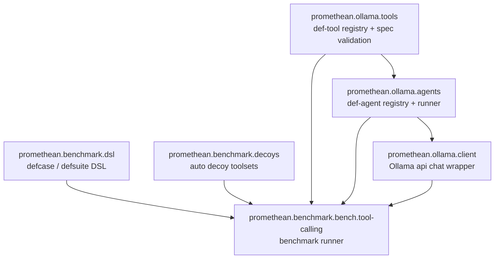

Alright — **macro-palooza**. 🦆🔥
Below is a **small “agent SDK” for Clojure** that:

* gives you a **reusable `promethean.ollama.*` module** (good for *real agents* + *benchmarks*)
* makes **tools / agents / cases** feel *natural to write*
* uses **`clojure.spec.alpha`** for argument validation
* plays perfectly with your **tool-choice benchmark + auto-decoys**

I’m going to drop **full file replacements** for the core DSL + runtime.

---

## Architecture



---

# 1) `promethean.ollama.client` — reusable Ollama API wrapper

**`src/promethean/ollama/client.clj`**

```clj
(ns promethean.ollama.client
  "Thin Ollama /api/chat wrapper using Java HttpClient.
  No extra deps besides cheshire.

  The goal: benchmarks and real agents share the same runtime."
  (:require
    [cheshire.core :as json])
  (:import
    (java.net URI)
    (java.net.http HttpClient HttpRequest HttpResponse$BodyHandlers)
    (java.time Duration)))

(def default-host "http://localhost:11434")

(defn- uri [host path]
  (URI/create (str (if (string? host) host default-host) path)))

(defn- http-client ^HttpClient []
  (-> (HttpClient/newBuilder)
      (.connectTimeout (Duration/ofSeconds 15))
      (.build)))

(defn chat!
  "Calls Ollama /api/chat (non-stream).
  Input:
    {:host \"http://localhost:11434\"
     :model \"qwen3\"
     :messages [{:role \"user\" :content \"hi\"}]
     :tools [...]              ;; tool schemas (OpenAI-style)
     :options {...}            ;; Ollama options
     :timeout-ms 300000
     :think true|false}        ;; optional local convention

  Returns decoded JSON response map."
  [{:keys [host model messages tools options timeout-ms think]
    :or {host default-host
         timeout-ms 300000}}]
  (let [body (cond-> {:model model
                      :stream false
                      :messages messages}
               (seq tools) (assoc :tools tools)
               (map? options) (assoc :options options)
               (some? think) (assoc :think think))
        req (-> (HttpRequest/newBuilder)
                (.uri (uri host "/api/chat"))
                (.timeout (Duration/ofMillis (long timeout-ms)))
                (.header "Content-Type" "application/json")
                (.POST (HttpRequest$BodyPublishers/ofString
                        (json/generate-string body)))
                (.build))
        resp (.send (http-client) req (HttpResponse$BodyHandlers/ofString))
        status (.statusCode resp)
        raw (.body resp)]
    (if (<= 200 status 299)
      (json/parse-string raw true)
      (throw (ex-info "Ollama /api/chat failed"
                      {:status status
                       :body raw
                       :request body})))))
```

---

# 2) `promethean.ollama.tools` — **def-tool**, params DSL, spec validation, registry

This is the main “OpenAI SDK-like tool system”.

**`src/promethean/ollama/tools.clj`**

```clj
(ns promethean.ollama.tools
  "Tool registry + OpenAI-style schema + argument validation (spec.alpha).

  You define tools via def-tool:

    (def-tool mul
      (doc \"Multiply two ints\")
      (domain :math)
      (tags :math :mul)
      (params
        [a :int \"Left\"]
        [b :int \"Right\"])
      (impl [{:keys [a b]}] (* a b))
      (bench
        (benchcase \"mul/7x9\"
          (prompt \"Compute 7 times 9.\")
          (args {:a 7 :b 9})
          (final-contains \"63\")
          (no-extras))))

  The same tools file can be loaded by:
  - benchmark runner
  - production agents"
  (:require
    [cheshire.core :as json]
    [clojure.spec.alpha :as s]
    [clojure.string :as str]))

;; ---------------------------
;; Registry
;; ---------------------------

(defonce ^:private !tools (atom {}))

(defn clear-tools! [] (reset! !tools {}))
(defn tools [] (->> @!tools vals (sort-by :name) vec))
(defn tool-by-name [nm] (get @!tools (str nm)))

(defn register-tool!
  "Registers tool map by :name. Returns tool."
  [tool]
  (when-not (string? (:name tool))
    (throw (ex-info "Tool :name must be a string" {:tool tool})))
  (swap! !tools assoc (:name tool) tool)
  tool)

;; ---------------------------
;; Type system (tiny)
;; ---------------------------

(def ^:private type->pred
  {:int int?
   :integer int?
   :number number?
   :float number?
   :double number?
   :string string?
   :bool boolean?
   :boolean boolean?
   :keyword keyword?
   :map map?
   :object map?
   :vec vector?
   :vector vector?
   :array sequential?
   :any (constantly true)})

(def ^:private type->json
  {:int "integer"
   :integer "integer"
   :number "number"
   :float "number"
   :double "number"
   :string "string"
   :bool "boolean"
   :boolean "boolean"
   :keyword "string"  ;; represent keywords as strings at schema boundary
   :map "object"
   :object "object"
   :vec "array"
   :vector "array"
   :array "array"
   :any "string"})

(defn- kwish [x]
  (cond
    (keyword? x) x
    (symbol? x) (keyword (name x))
    (string? x) (keyword x)
    :else (keyword (str x))))

(defn- normalize-tool-name [x]
  (cond
    (string? x) x
    (keyword? x) (name x)
    (symbol? x) (name x)
    (map? x) (:name x)
    :else (str x)))

(defn- parse-param
  "Param vector grammar:
    [a :int]
    [a :int \"desc\"]
    [a :int {:desc \"...\" :optional true}]
    [a :int \"desc\" {:optional true}]"
  [v]
  (let [[k t a b] v
        k (kwish k)
        t (kwish t)
        opts (cond
               (map? a) a
               (map? b) b
               :else {})
        desc (cond
               (string? a) a
               (string? b) b
               :else (or (:desc opts) ""))]
    {:key k
     :type t
     :desc desc
     :optional? (boolean (:optional opts))}))

(defn- params->schema+spec
  "Turns params into:
   - JSON schema (OpenAI tool schema shape)
   - spec object validating argument maps"
  [params]
  (let [ps (mapv parse-param params)
        required (->> ps (remove :optional?) (mapv (comp name :key)))
        allowed-keys (set (map :key ps))
        validators (into {}
                         (map (fn [{:keys [key type]}]
                                (let [pred (get type->pred type (constantly true))]
                                  [key pred])))
                         ps)
        required-keys (set (map :key (remove :optional? ps)))

        args-spec
        (s/and
          map?
          ;; required keys present
          (fn [m] (every? #(contains? m %) required-keys))
          ;; no unknown keys
          (fn [m] (every? (fn [[k _]] (contains? allowed-keys (kwish k))) m))
          ;; values pass type preds
          (fn [m]
            (every? (fn [[k v]]
                      (let [k* (kwish k)
                            pred (get validators k* (constantly true))]
                        (pred v)))
                    m)))

        schema
        {"type" "object"
         "additionalProperties" false
         "properties"
         (into {}
               (map (fn [{:keys [key type desc]}]
                      [(name key)
                       (cond-> {"type" (get type->json type "string")}
                         (seq desc) (assoc "description" desc))]))
               ps)
         "required" required}]
    {:args-spec args-spec
     :schema schema}))

(defn coerce-arguments
  "Ollama may return arguments as a map or a JSON string.
  Returns a keyword-keyed map when possible."
  [args]
  (cond
    (nil? args) {}
    (map? args) (into {} (map (fn [[k v]] [(kwish k) v]) args))
    (string? args)
    (try
      (let [m (json/parse-string args true)]
        (if (map? m)
          (into {} (map (fn [[k v]] [(kwish k) v]) m))
          {}))
      (catch Exception _ {}))
    :else {}))

(defn validate-tool-call
  "Validates {:name \"tool\" :arguments <map|json-string>} using the tool args-spec."
  [{:keys [name arguments]}]
  (let [tool (tool-by-name name)]
    (cond
      (nil? tool)
      {:ok false :error :unknown-tool :details {:name name}}

      :else
      (let [args (coerce-arguments arguments)
            spec (:args-spec tool)]
        (if (s/valid? spec args)
          {:ok true :arguments args}
          {:ok false
           :error :invalid-arguments
           :details {:name name
                     :arguments args
                     :explain (s/explain-str spec args)}})))))

(defn invoke-tool!
  "Invokes tool implementation. Returns {:ok true :value ...} or {:ok false ...}."
  [tool-name arguments]
  (let [tool (tool-by-name tool-name)]
    (if-not tool
      {:ok false :error :unknown-tool :details {:name tool-name}}
      (try
        (let [f (:impl tool)
              v (f (coerce-arguments arguments))]
          {:ok true :value v})
        (catch Throwable t
          {:ok false :error :tool-exception
           :details {:name tool-name
                     :message (.getMessage t)
                     :class (str (class t))}})))))

(defn tool->ollama-schema
  "Converts tool map to OpenAI-style schema Ollama accepts."
  [tool]
  {:type "function"
   :function {:name (:name tool)
              :description (:description tool)
              :parameters (:parameters tool)}})

(defn tools->ollama-schemas []
  (mapv tool->ollama-schema (tools)))

;; -------------------------------------------------------
;; Bench template DSL (optional metadata on tools)
;; -------------------------------------------------------

(defn- merge-template [m k v]
  (assoc m k v))

(defmacro prompt [s] `(hash-map :prompt ~s))
(defmacro system [s] `(hash-map :system ~s))
(defmacro messages [xs] `(hash-map :messages ~xs))
(defmacro args [m] `(hash-map :args ~m))
(defmacro arguments-subset [m] `(hash-map :arguments-subset ~m))
(defmacro policy [p] `(hash-map :policy ~p))
(defmacro no-extras [] `(hash-map :no_extras true))
(defmacro final-contains [s] `(hash-map :final {:contains ~s}))
(defmacro final-regex [r] `(hash-map :final {:regex ~r}))
(defmacro with-tools [& ts] `(hash-map :tools ~(vec (map normalize-tool-name ts))))
(defmacro penalties [{:keys [wrong_first extra_calls]}]
  `(hash-map :wrong_first_penalty ~wrong_first
             :extra_calls_penalty ~extra_calls))

(defmacro benchcase
  "Tool-owned benchmark template. Stored under :bench/prompt-templates.
  Usage:

    (benchcase \"mul/7x9\"
      (prompt \"Compute 7 times 9.\")
      (args {:a 7 :b 9})
      (final-contains \"63\")
      (no-extras))"
  [id & forms]
  (let [pairs (vec forms)]
    `(merge {:id ~id} ~@pairs)))

(defmacro bench
  "Directive payload for def-tool. Just returns vector of benchcase maps."
  [& cases]
  `(hash-map :bench/prompt-templates ~(vec cases)))

;; -------------------------------------------------------
;; def-tool (the fun part)
;; -------------------------------------------------------

(defn- directive? [x sym]
  (and (seq? x) (= (first x) sym)))

(defmacro def-tool
  "Define + register a tool.

  Directives:
    (doc \"...\")
    (domain :math)
    (tags :a :b)
    (params [a :int \"...\"] [b :int \"...\"] ...)
    (impl [args] ...)
    (bench (benchcase ...) ...)

  Returns a var bound to the registered tool map."
  [tool-name & body]
  (let [nm (name tool-name)
        ;; parse directives
        doc-str (or (some #(when (string? %) %) body)
                    (some #(when (directive? % 'doc) (second %)) body)
                    "")
        domain-kw (some #(when (directive? % 'domain) (second %)) body)
        tags-set (some #(when (directive? % 'tags) (set (rest %))) body)
        params-form (some #(when (directive? % 'params) (rest %)) body)
        impl-form (some #(when (or (directive? % 'impl) (directive? % 'run)) %) body)
        bench-form (some #(when (directive? % 'bench) % ) body)

        {:keys [args-spec schema]}
        (params->schema+spec (or params-form []))

        impl-fn
        (when impl-form
          (let [[_ argv & impl-body] impl-form]
            `(fn ~argv ~@impl-body)))

        bench-map
        (when bench-form
          (second (macroexpand-1 bench-form)))]

    `(def ~tool-name
       (register-tool!
         (merge
           {:name ~nm
            :description ~doc-str
            :domain ~domain-kw
            :tags ~(or tags-set #{})
            :parameters ~schema
            :args-spec ~args-spec
            :impl ~(or impl-fn `(fn [_#] (throw (ex-info "Tool has no impl" {:tool ~nm}))))}
           ~bench-map)))))

(defmacro doc [s] s)
(defmacro domain [k] k)
(defmacro tags [& _] nil)
(defmacro params [& _] nil)
(defmacro impl [& _] nil)
(defmacro run [& xs] `(impl ~@xs))
```

---

# 3) `promethean.ollama.agents` — **def-agent** + real runner loop

This is your “Agent SDK vibe” layer. Benchmarks can reuse it too.

**`src/promethean/ollama/agents.clj`**

```clj
(ns promethean.ollama.agents
  "Agent registry + tool loop runner.

  def-agent is meant to feel like OpenAI's Agent SDK:
    - model
    - instructions
    - tools
    - options
    - think

  You can run agents in production OR in benchmarks."
  (:require
    [clojure.spec.alpha :as s]
    [clojure.string :as str]
    [promethean.ollama.client :as client]
    [promethean.ollama.tools :as tools]))

;; ---------------------------
;; Registry
;; ---------------------------

(defonce ^:private !agents (atom {}))

(defn clear-agents! [] (reset! !agents {}))
(defn agents [] (->> @!agents vals (sort-by :name) vec))
(defn agent-by-name [nm] (get @!agents (str nm)))

(defn register-agent! [agent]
  (when-not (string? (:name agent))
    (throw (ex-info "Agent :name must be a string" {:agent agent})))
  (swap! !agents assoc (:name agent) agent)
  agent)

;; ---------------------------
;; Agent schema (spec)
;; ---------------------------

(s/def ::name string?)
(s/def ::model string?)
(s/def ::instructions string?)
(s/def ::think boolean?)
(s/def ::options map?)
(s/def ::tools (s/coll-of string? :kind vector?))
(s/def ::max-steps pos-int?)
(s/def ::timeout-ms pos-int?)

(s/def ::agent
  (s/keys :req-un [::name ::model]
          :opt-un [::instructions ::think ::options ::tools ::max-steps ::timeout-ms]))

(defn- normalize-tool-ref [x]
  (tools/normalize-tool-name x))

(defn agent-tools->schemas [agent]
  (let [names (set (or (:tools agent) []))
        subset (filter (fn [t] (contains? names (:name t))) (tools/tools))]
    (mapv tools/tool->ollama-schema subset)))

;; ---------------------------
;; Runtime: tool loop
;; ---------------------------

(defn- assistant->tool-calls [assistant-message]
  (or (:tool_calls assistant-message) []))

(defn- extract-call [tool-call]
  (let [f (:function tool-call)
        id (or (:id tool-call)
               (:tool_call_id tool-call)
               (:id f)
               (:tool_call_id f))]
    {:id (when (some? id) (str id))
     :name (:name f)
     :arguments (:arguments f)
     :raw tool-call}))

(defn- tool-result-message [{:keys [name tool_call_id content]}]
  (cond-> {:role "tool"
           :name name
           :tool_name name
           :content content}
    (some? tool_call_id) (assoc :tool_call_id tool_call_id)))

(defn- stringify [x] (if (string? x) x (pr-str x)))

(defn run!
  "Run an agent conversation until no tool calls or max-steps.

  Input:
    {:agent <agent map or agent name string>
     :host ...
     :messages [...]
     :tools <override tool schemas>
     :max-steps ...
     :timeout-ms ...}

  Returns:
    {:messages [...]
     :steps [...]
     :final_assistant {...}
     :stopped_reason :no_tool_calls | :max_steps}"
  [{:keys [agent host messages tools max-steps timeout-ms]}]
  (let [agent-map (cond
                    (string? agent) (agent-by-name agent)
                    (map? agent) agent
                    :else nil)
        _ (when-not (s/valid? ::agent agent-map)
            (throw (ex-info "Invalid agent map"
                            {:explain (s/explain-str ::agent agent-map)})))

        model (:model agent-map)
        think (:think agent-map)
        options (:options agent-map)
        max-steps (long (or max-steps (:max-steps agent-map) 4))
        timeout-ms (long (or timeout-ms (:timeout-ms agent-map) 300000))

        system-msg (when (seq (:instructions agent-map))
                     {:role "system" :content (:instructions agent-map)})

        tools-schemas (or tools
                          (when (seq (:tools agent-map)) (agent-tools->schemas agent-map))
                          (tools/tools->ollama-schemas))

        initial (cond-> []
                  (some? system-msg) (conj system-msg)
                  true (into (vec messages)))]
    (loop [msgs initial
           steps []
           i 0]
      (let [resp (client/chat! {:host host
                                :model model
                                :messages msgs
                                :tools tools-schemas
                                :think think
                                :options options
                                :timeout-ms timeout-ms})
            assistant (:message resp)
            msgs' (conj msgs assistant)
            tool-calls (mapv extract-call (assistant->tool-calls assistant))]
        (if (or (empty? tool-calls) (>= i (dec max-steps)))
          {:messages msgs'
           :steps steps
           :final_assistant assistant
           :raw_last_response resp
           :stopped_reason (if (empty? tool-calls) :no_tool_calls :max_steps)}
          (let [tool-results
                (mapv (fn [{:keys [name arguments id] :as c}]
                        (let [valid (tools/validate-tool-call {:name name :arguments arguments})
                              invoked (when (:ok valid)
                                        (tools/invoke-tool! name (:arguments valid)))]
                          (assoc c :valid valid :invoked invoked)))
                      tool-calls)

                tool-messages
                (mapv (fn [{:keys [name id invoked]}]
                        (tool-result-message
                          {:name name
                           :tool_call_id id
                           :content (stringify
                                      (if (:ok invoked) (:value invoked) invoked))}))
                      tool-results)

                step {:i i
                      :assistant assistant
                      :tool_calls tool-results
                      :tool_messages tool-messages
                      :raw resp}

                msgs'' (into msgs' tool-messages)]
            (recur msgs'' (conj steps step) (inc i))))))))

;; ---------------------------
;; def-agent (macro DSL)
;; ---------------------------

(defn- directive? [x sym]
  (and (seq? x) (= (first x) sym)))

(defmacro def-agent
  "Define + register an agent.

  Directives:
    (model \"qwen3\")
    (instructions \"...\")
    (tools mul add search_web)
    (options {:temperature 0})
    (think true)
    (max-steps 4)
    (timeout-ms 300000)

  Returns var bound to agent map."
  [agent-name & body]
  (let [nm (name agent-name)
        model (some #(when (directive? % 'model) (second %)) body)
        instructions (or (some #(when (string? %) %) body)
                         (some #(when (directive? % 'instructions) (second %)) body)
                         "")
        tools-form (some #(when (directive? % 'tools) (rest %)) body)
        tools-names (when tools-form (vec (map normalize-tool-ref tools-form)))
        think (some #(when (directive? % 'think) (second %)) body)
        options (some #(when (directive? % 'options) (second %)) body)
        max-steps (some #(when (directive? % 'max-steps) (second %)) body)
        timeout-ms (some #(when (directive? % 'timeout-ms) (second %)) body)]
    `(def ~agent-name
       (register-agent!
         (cond-> {:name ~nm
                  :model ~model
                  :instructions ~instructions}
           (some? ~tools-names) (assoc :tools ~tools-names)
           (some? ~think) (assoc :think ~think)
           (map? ~options) (assoc :options ~options)
           (some? ~max-steps) (assoc :max-steps ~max-steps)
           (some? ~timeout-ms) (assoc :timeout-ms ~timeout-ms))))))

(defmacro model [s] s)
(defmacro instructions [s] s)
(defmacro tools [& _] nil)
(defmacro options [m] m)
(defmacro think [b] b)
(defmacro max-steps [n] n)
(defmacro timeout-ms [n] n)
```

---

# 4) `promethean.benchmark.dsl` — cases & suites that feel like *writing a story*

This is the “natural language benchmark authoring” layer.

**`src/promethean/benchmark/dsl.clj`**

```clj
(ns promethean.benchmark.dsl
  "Benchmark DSL macros.

  You can write cases like:

    (defcase mul-choice
      (prompt \"Compute 7 times 9.\")
      (choose mul {:a 7 :b 9})
      (final-contains \"63\")
      (no-extras))

  or suites:

    (defsuite tool-choice-suite
      mul-choice
      (case
        (id \"math/add\")
        (prompt \"What is 3 plus 4?\")
        (choose add {:a 3 :b 4})
        (final-contains \"7\")))"
  (:require
    [clojure.edn :as edn]
    [clojure.java.io :as io]
    [clojure.string :as str]
    [promethean.ollama.tools :as tools]))

(defn- normalize-tool [x] (tools/normalize-tool-name x))

(defn- directive? [x sym]
  (and (seq? x) (= (first x) sym)))

(defmacro id [s] `(hash-map :id ~s))
(defmacro prompt [s] `(hash-map :prompt ~s))
(defmacro system [s] `(hash-map :system ~s))
(defmacro messages [xs] `(hash-map :messages ~xs))
(defmacro with-tools [& ts] `(hash-map :tools ~(vec (map normalize-tool ts))))

(defmacro no-extras [] `(hash-map :no_extras true))
(defmacro final-contains [s] `(hash-map :final {:contains ~s}))
(defmacro final-regex [r] `(hash-map :final {:regex ~r}))

(defmacro choose
  "Tool-choice expectation.
  (choose mul {:a 7 :b 9} {:policy :best :wrong-first-penalty 0.7})"
  ([tool args]
   `(choose ~tool ~args {}))
  ([tool args opts]
   `(hash-map :choose {:tool ~(normalize-tool tool)
                       :arguments-subset ~args
                       :policy ~(or (:policy opts) :best)
                       :wrong_first_penalty ~(or (:wrong-first-penalty opts) 0.70)
                       :extra_calls_penalty ~(or (:extra-calls-penalty opts) 0.80)})))

(defmacro calls
  "Strict tool call sequence expectation.
  Example:
    (calls
      (call mul {:a 7 :b 9})
      (call add {:a 1 :b 2}))"
  [& xs]
  `(hash-map :calls ~(vec xs)))

(defmacro call [tool args]
  `{:tool ~(normalize-tool tool) :arguments ~args})

(defmacro none
  "Expect NO tool calls."
  []
  `(hash-map :none true))

(defmacro expect
  "Merge expectation fragments into {:expect {...}}."
  [& xs]
  `(hash-map :expect (merge ~@xs)))

(defmacro case
  "Build a case map out of fragments."
  [& forms]
  (let [id-form (some #(when (directive? % 'id) %) forms)
        fallback-id (str "case-" (hash forms))]
    `(merge {:id ~(or (second id-form) fallback-id)}
            ~@forms)))

(defmacro defcase
  "Define a named case var."
  [nm & forms]
  `(def ~nm (case ~@forms)))

(defmacro defsuite
  "Define a suite var as a vector of cases.
  Accepts symbols (case vars) and inline (case ...) forms."
  [suite-name & entries]
  `(def ~suite-name
     (vec (map (fn [x#] (if (map? x#) x# (var-get (resolve x#))))
               ~(vec entries)))))

(defn export-suite!
  "Write EDN suite to disk for runners that read cases.edn."
  [path suite]
  (io/make-parents path)
  (spit path (pr-str (vec suite)))
  path)
```

---

# 5) **How it feels to use** (tools, agents, cases) ✨

## `tools.clj` (production + benchmark compatible)

```clj
(ns my.tools
  (:require
    [promethean.ollama.tools :refer [def-tool doc domain tags params impl bench benchcase prompt args final-contains no-extras]]))

(def-tool add
  (doc "Add two integers.")
  (domain :math)
  (tags :math :add)
  (params
    [a :int "Left"]
    [b :int "Right"])
  (impl [{:keys [a b]}] (+ a b))
  (bench
    (benchcase "add/3+4"
      (prompt "What is 3 plus 4?")
      (args {:a 3 :b 4})
      (final-contains "7")
      (no-extras))))

(def-tool mul
  (doc "Multiply two integers.")
  (domain :math)
  (tags :math :mul)
  (params
    [a :int "Left"]
    [b :int "Right"])
  (impl [{:keys [a b]}] (* a b))
  (bench
    (benchcase "mul/7x9"
      (prompt "Compute 7 times 9.")
      (args {:a 7 :b 9})
      (final-contains "63")
      (no-extras))))
```

## `agents.clj`

```clj
(ns my.agents
  (:require
    [promethean.ollama.agents :refer [def-agent model instructions tools options think max-steps]]
    [my.tools :as _]))

(def-agent mathy
  (model "qwen3")
  (instructions "You are a calm math assistant. Prefer tools for arithmetic.")
  (tools add mul)
  (think false)
  (options {:temperature 0})
  (max-steps 4))
```

## `cases.clj` (if you want hand-crafted suites)

```clj
(ns my.cases
  (:require
    [promethean.benchmark.dsl :refer :all]
    [my.tools :refer [add mul]]))

(defcase mul-choice
  (prompt "Compute 7 times 9.")
  (expect (choose mul {:a 7 :b 9})
          (final-contains "63")
          (no-extras)))

(defsuite tool-choice-suite
  mul-choice
  (case
    (id "math/add-choice")
    (prompt "What is 3 plus 4?")
    (expect (choose add {:a 3 :b 4})
            (final-contains "7")
            (no-extras))))
```

---

# 6) Why this hits your “reuse for real-world agents” requirement

✅ The tool registry + validation lives in **`promethean.ollama.tools`**
✅ The agent loop runner lives in **`promethean.ollama.agents/run!`**
✅ Benchmarks *just* become **another consumer** of the same runtime

So you’re not writing “benchmark code” and “production code” separately — the benchmark is pressure-testing the *same* core runtime.

---

# 7) Next upgrade I’d add (if you want “really crazy”)

These are the next “power macros” that make authoring *effortless*:

### A) Ultra-short `def-tool` form

```clj
(def-tool mul
  "Multiply two integers"
  {:domain :math :tags #{:math :mul}}
  [a :int b :int]
  (* a b))
```

### B) Tool-case sugar for templates

```clj
(def-tool mul
  ...
  (cases
    (=> "Compute 7 times 9" {:a 7 :b 9} "63")))
```

### C) Agent “builder feel”

```clj
(def-agent mathy
  (->agent
    (model "qwen3")
    (tools add mul)
    (instructions "Prefer tools")
    (options {:temperature 0})))
```

If you want, I’ll ship those as a **second layer** that compiles down into the current stable directive forms (so you can keep both “explicit” and “sugar” styles).

Just say the word and I’ll stack the macros even harder.
