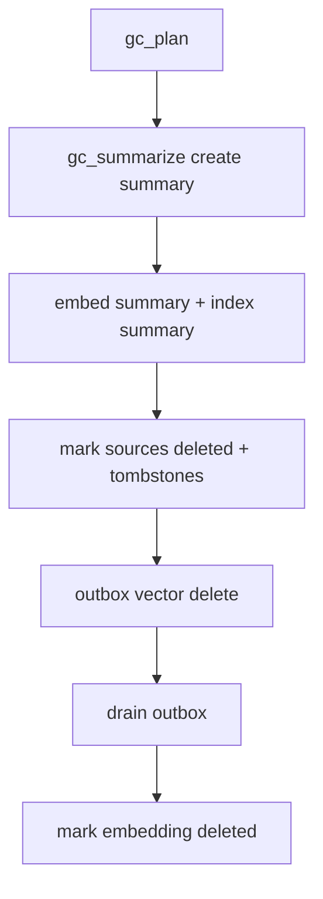

## Compaction Pipeline v0.2: summarize-by-cluster, preserve nexus connectivity, safe deletes #gc #compaction #summaries #nexus

You already sketched GC as: “oldest, least accessed memories get summarized; summary kept; rest deleted.”
This version makes that robust and *Eidolon-native*:

* it compacts **clusters**, not random singles
* it guarantees **nexus connectivity survives**
* it guarantees **vector + nexus cleanup is crash-safe**
* it avoids “summary-of-summary collapse”
* it supports “embed the same content many times” via lineage caps

---

## 1) Core idea: compact *clusters*, not individual memories

Single-message summaries are rarely worth it. The win comes from clustering:

### Cluster sources (deterministic)

* spam families (`cluster.spam_family_id`)
* tool-call sequences (`cluster.thread_id` or adjacency windows)
* file path nexus (`path:*`)
* error family nexus (`err:*`)
* conversation threads (session scoped)

You can build clusters purely from nexus keys:

* e.g., “memories sharing `path:X` + `tool:fs.read` within 48h”

### Why clusters work

* summaries become meaningful “hubs”
* deletion removes volume while retaining association structure

---

## 2) Candidate selection: oldest + least accessed, but with structure

### Eligibility filters (hard)

Never compact if:

* `retrieval.pinned`
* `locked_by_admin` or `locked_by_system`
* `kind in {summary, aggregate}` (default)
* `lifecycle.deleted=true`

### Candidate scoring (deterministic)

For a memory `m`:

[
score(m) =
a \cdot age_days(m) -
b \cdot usage.included_count_decay(m) -
c \cdot pinned_bonus -
d \cdot human_authored_bonus +
e \cdot spam_raw_bonus
]

Then you don’t delete by individual score; you use scores to *seed cluster candidates*.

---

## 3) Cluster formation strategy (v0.2)

Pick one that’s easy first: **key-centered clusters**.

### 3.1 Key-centered clusters

1. Choose a hot “compaction key”:

   * from lowest-access older memories, pick their top nexus keys
2. Build a cluster:

   * all memories with that key in a time window
3. Apply caps:

   * max N memories per cluster
   * max token estimate per cluster

Common compaction keys:

* `tag:topic/dedupe`
* `err:timeout`
* `path:/...`
* `chan:...`

### 3.2 Windowing

Use deterministic window boundaries:

* group by day/week buckets
* or a fixed window like “within 7 days of the median timestamp”

This prevents clusters from ballooning indefinitely.

---

## 4) Summary generation: preserve “tag mass” + nexus connectivity

When you summarize a cluster, you must keep:

* the *meaning* of the content
* the *structural hooks* (tags/nexus keys) that make it retrievable later

### 4.1 Summary memory must include

* `cluster_id`
* `source_ids[]` (or hash)
* `rolled_up_tags[]` (capped)
* `rolled_up_nexus_keys[]` (capped)
* a compact textual summary

### 4.2 Rolled up tags (deterministic)

* union all tags
* score tags by frequency × type weight
* cap per namespace
* always include:

  * `topic/gc`
  * `src/system` (or `src/tool` if generated by tool)
  * any `ops/*` chemistry tags present
  * top `err/*` families

### 4.3 Rolled up nexus keys (deterministic)

Same idea:

* union all keys
* score keys by frequency × key type weight × inverse-degree penalty
* cap to `K=32` or so

**This is the key to your design**: deletion doesn’t sever the graph because summaries keep the edges.

---

## 5) Two-phase commit: crash-safe compaction

You already have the outbox concept. Here’s the full safe sequence:

### Phase 0 — Plan (read-only)

Output:

* `plan_id`
* groups: `{group_id, source_ids[], group_hash, token_est, top_keys}`

### Phase 1 — Summarize (creates new hub)

For each group:

1. create summary memory (not yet “activated”)
2. embed it (canonical + eidolon)
3. update nexus index with summary’s keys (fast path)
4. mark summary as `lifecycle.active=true` (or just rely on existence)

### Phase 2 — Delete sources (logical)

For each source memory:

1. set `lifecycle.deleted=true`
2. set `replaced_by_summary_id`
3. create tombstone
4. enqueue outbox vector delete
5. (optional) enqueue outbox nexus prune

Only after all succeed:

* mark group commit done

### Mermaid: compaction commit lifecycle

---

## 6) Avoid “summary-of-summary collapse”

### Rules

* default: summaries are never compacted
* if you need to compact summaries:

  * only compact *multiple summaries into a higher-level summary*
  * keep provenance:

    * `summary_of: [summary_ids...]`
  * do it rarely (high thresholds)

This keeps your memory structure layered instead of mush.

---

## 7) Compaction + Eidolon drift

You’re embedding with field context and circuits. Compaction should respect that:

### Summary embedding strategy

* Always embed summary canonically (stable)
* Embed summary eidolon for:

  * survival circuit (c1) always
  * the circuit that triggered compaction (e.g. janitor)
  * optionally: circuits whose digest says they are “active”

This means the summary becomes a multi-circuit attractor.

### Source deletion + drift benefit

Once sources are deleted, retrieval naturally routes through:

* summary memory
* aggregate memory
* and their eidolon embeddings (state-conditioned)

So “meaning changes over time” still holds, but the structure stays compressed.

---

## 8) When to compact: schedule + triggers

### Scheduled compaction

* run every N hours with a maintenance budget

### Triggered compaction

* embed queue high + spam storm → compact spam families aggressively
* outbox critical → pause compaction (don’t add more deletes)
* storage threshold → compact older low-access clusters

Deterministic triggers should be based on quantized field state:

* `ops/pressure-discord-flood`
* `ops/outbox-critical`
* `ops/embed-queue-high`

---

## 9) “Least accessed” needs a decay model

You already want “track how often memory is added to context.”

Do:

* `included_count_total`
* `included_count_decay` (updated per inclusion event)

Deterministic decay update:

* once per day bucket, apply decay factor (e.g. ×0.95)
* add 1 for each inclusion in that bucket

This avoids floating jitter while preserving trend.

---

## 10) One more: protect “nexus hubs” even if old

Sometimes a memory is old but structurally critical (hub).

Add a rule:

* if a memory has high “nexus centrality” (appears in many key neighbor lists), prefer summarizing its *cluster* rather than deleting it raw
* or pin it automatically if it’s a true hub (careful)

In v0.2, a cheap proxy for centrality:

* count how many distinct keys it has that are in current digest top-k
* or how often it’s returned as a neighbor for hot keys

---

## 11) Next continuation

Now the whole system is coherent, but you’ll want to define the **Discord janitor contract** concretely:

* what exactly counts as duplicate
* near-duplicate matching (simhash vs embedding)
* how spam families are formed + named
* how and when to post reports
* and how janitor uses tools without spamming

If you want, next I’ll write: **Discord Janitor v0.1: dedupe, spam families, and report format.**

*Created with the assistance of an AI.*
