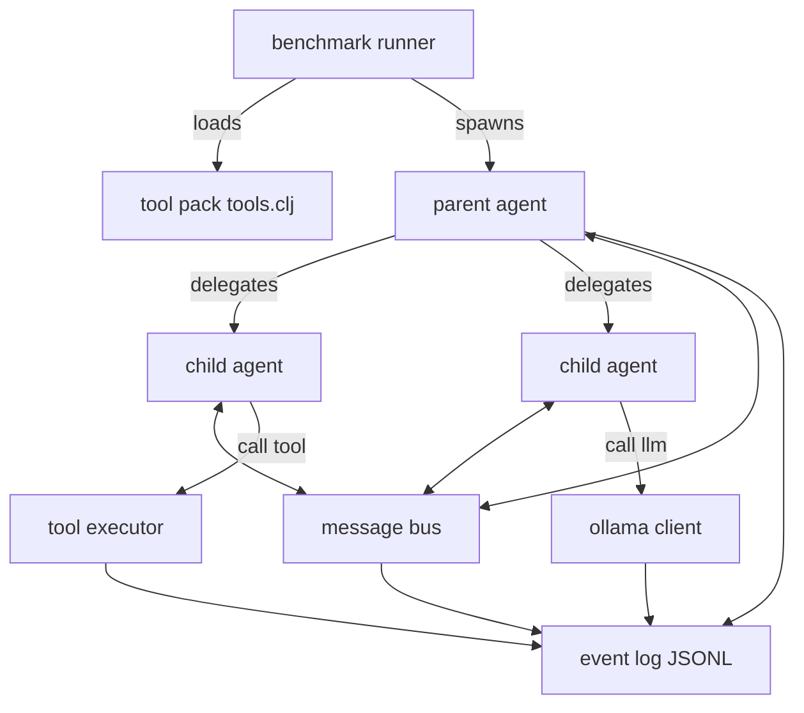

Yep — let’s keep going, but tighter + more actionable.

Below is a **second-pass spec review** that:

* calls out the **highest-risk gaps**
* fixes the **syntax/structure breakages** that will slow implementation
* proposes the **missing spec sections** that make this feel like an *Agent SDK* (macros + packs + kondo)
* aligns everything with the “async-first hierarchical machine” we described

---

# 0) Biggest risk: you have *the right components* but not the **authoring contract**

Right now the docs describe:

* **core services**: ollama client, event log, message bus, locks   
* **tool system**: registry + spec validation + schema + executor  
* **agents**: supervisor tree + tiering + comms + state  
* **benchmarks**: tool-calling + decoys + coding + interactive + reporting 

…but there’s no “how humans *write* tools/agents/cases” section yet.

That means the system will feel “spec complete, UX missing”.

✅ **Fix**: add one missing doc (or sections) called:

* `dsl.md` → **def-tool / def-agent / def-case** and how they expand + register
* `packs.md` → how `tools.clj` is loaded (defs + implementations in one namespace)

That’s the bridge between “framework exists” and “this is my daily driver”.

---

# 1) Syntax breakages you should fix now (they’ll bite you later)

## 1.1 benchmarks architecture map is malformed

You currently have braces in the wrong places .

**Correct version should be:**

```clj
{:benchmark/runner "Execution engine and coordination"
 :benchmark/config "Configuration management and validation"
 :benchmark/results "Result collection and analysis"
 :benchmark/monitoring "Real-time progress and health monitoring"
 :benchmark/storage "Persistent storage for results and state"
 :benchmark/export "Multiple format output generation"}
```

---

## 1.2 benchmarks analysis pipeline map is malformed

Same issue here .

**Correct version:**

```clj
{:raw-results "Collected benchmark execution data"
 :statistical-analysis "Descriptive statistics and tests"
 :visualization "Charts, graphs, and interactive dashboards"
 :comparison "Historical and cross-model comparison"
 :reporting "Automated report generation in multiple formats"
 :insights "Pattern detection and actionable recommendations"}
```

---

## 1.3 core ToolValidator protocol snippet has mismatched parens

This appears twice  

**Correct version:**

```clj
(defprotocol ToolValidator
  (validate-tool-call [{:keys [name arguments]}] "Validate tool call against spec")
  (coerce-arguments [arguments] "Convert JSON/string args to Clojure map")
  (tool->ollama-schema [tool] "Generate OpenAI-compatible schema"))
```

---

## 1.4 dependencies compatibility matrix row has an extra column

Your table defines 5 columns, but the “Core 0.1.x” row effectively has 6 entries 

You want it like:

| Component       | Min Core | Agent Framework | Tool System | Benchmark Framework |
| --------------- | -------- | --------------- | ----------- | ------------------- |
| Core 0.1.x      | ✓        | —               | —           | —                   |
| Agent 0.1.x     | ✓        | ✓               | ✓           | ✓                   |
| Tool 0.1.x      | ✓        | ✓               | ✓           | ✓                   |
| Benchmark 0.1.x | ✓        | ✓               | ✓           | ✓                   |

(Or drop the “Min Core” column and just list pairwise constraints.)

---

# 2) One semantic bug: parameter validation example is wrong

In tools validation examples, `::coordinate` is incorrect  (the check compares weirdly against `90` and uses `(first %) (second %)` as though that’s a range).

If you meant latitude/longitude:

```clj
(s/def ::lat (s/and number? #(<= -90 % 90)))
(s/def ::lon (s/and number? #(<= -180 % 180)))
(s/def ::coordinate (s/tuple ::lat ::lon))
```

This matters because tool benchmarks will include “invalid argument” cases , so your examples should be *trustworthy*.

---

# 3) You already committed to core.async — lean into it harder

Your core spec explicitly requires a **channel-based bus** via core.async  and describes message protocol + types .

So: you don’t need to waffle between futures/promises/etc.

✅ **Spec add**: in `agents.md` add a short “Execution Model” section:

* each agent has:

  * `:inbox` channel
  * `:control` channel (stop/suspend/resume)
  * `:tick` timer events (parent wake-up policy)
* parent agent “sleeps” by doing nothing until:

  * inbox message arrives **or**
  * tick arrives

This matches your lifecycle states (`:sleeping`, `:blocked`, etc.) .

---

# 4) Tool-calling benchmark is *excellent*, but you’re missing 1 killer metric

What you already have is solid:

* choice policy set 
* decoy strategy 
* confusion-matrix-friendly metrics 

### Missing metric: **“semantic proximity of decoy selected”**

Right now “wrong tool” is just wrong.

But decoys are your *whole point* — you want to measure:

* did it pick a decoy in the **same domain**?
* did it pick a **power tool**? (hallucinated authority)
* did it pick a tool whose tags overlap the correct one?

✅ **Add fields** to Tool-Calling Metrics:

```clj
{:decoy/selected? boolean
 :decoy/type :same-domain|:powerful|:noise
 :decoy/tag-overlap number  ;; Jaccard similarity between tool tag sets
 :decoy/domain-match? boolean}
```

This turns your benchmark from “accuracy only” → “why it failed”.

---

# 5) Missing spec chunk: **Tool Pack** (`tools.clj` includes defs + impls)

Your tools system spec already defines a tool map and execution engine  

But your convo goal was:

> the benchmark takes `tools.clj` containing definitions **and implementations**

✅ Add an explicit “Tool Pack Contract”:

### Tool pack requirements

* A tool pack is a namespace that:

  * declares tools (metadata + arg spec)
  * provides implementation fn
  * registers tools on load

### Tool pack loading rule

* Benchmark runner calls `(require 'my.tools.pack)` and then uses the registry.

This is what makes “benchmark harness” and “real agent runtime” share the same tools.

---

# 6) Missing spec chunk: the macro authoring layer (the “Agent SDK feel”)

Your tools spec mentions rich metadata  — perfect.
But right now there is no ergonomic surface.

✅ Add these macros:

## 6.1 `def-tool`

**Intent:** one macro that produces:

* tool map
* spec validators
* schema
* impl fn
* registers it

Example *authoring form*:

```clj
(def-tool math/add
  {:description "Add two integers"
   :domain :math
   :tags #{:arithmetic :deterministic}
   :args (s/keys :req-un [::a ::b])}
  (fn [{:keys [a b]}]
    {:ok true :value (+ a b)}))
```

## 6.2 `def-agent`

**Intent:** one macro that produces:

* agent definition map
* tier/budget constraints
* toolset binding
* step function

Example:

```clj
(def-agent planner/root
  {:model {:provider :ollama :name "qwen3:32b"}
   :tools [:fs/read :fs/write :spawn-agent]
   :budget {:max-steps 200}}
  (step [{:keys [inbox state]}]
    ...))
```

---

# 7) clj-kondo support needs to be in the spec, not “later”

Right now there is nothing about kondo hooks in any doc.

Since you explicitly want “make clj-kondo understand the new macros”, treat it as a feature spec:

✅ Add section: `## Macro Tooling Support`

Include:

* `.clj-kondo/config.edn` snippet
* hooks namespace location
* what each macro expands into logically (so kondo can infer defs)

Example policy:

* `def-tool` introduces:

  * a var named `math/add` (tool definition map)
  * registers tool in registry at load time
* `def-agent` introduces:

  * a var named `planner/root` (agent definition map)

This is what makes authoring feel “real”.

---

# 8) File locks are good, but conflict escalation needs a *protocol*

Core already defines LockService + conflict resolution requirement  

But your original design included:

> if an agent hits a locked file, it can open a special conversation thread

✅ Add to `core.md` (or `agents.md`) a standard conflict event + message:

```clj
{:event/type "lock/conflict"
 :path "..."
 :owner-agent "agent-2"
 :requester-agent "agent-7"
 :thread/id "conflict-..."
 :timestamp unix-ms}
```

…and specify that the **default** resolution path is “notify parent + owner”.

---

# 9) Reporting: you have requirements, but no storage contract

Benchmarks require resumability and real-time streaming , and core requires JSONL event sourcing .

✅ Add a short “Report Layout Contract”:

```
reports/
  <run-id>/
    events.jsonl
    snapshot.edn
    summary.json
    tables/
      tool_calls.csv
      latency.csv
    artifacts/
      case-<id>/
        prompt.txt
        response.json
```

The UI reads **only** from `reports/<run-id>/`.

That gives you crash safety and makes debugging *pleasant*.

---

# One diagram worth adding (it clarifies everything)



This diagram matches your documented dependencies + core bus/locks/events model  .

---

# What I would do next (spec-wise)

If you want the fastest “make this real” path:

1. **Fix the malformed snippets** (benchmarks/core/deps)
2. Add `dsl.md` with:

   * `def-tool`
   * `def-agent`
   * `def-case` (tool calling cases)
3. Add `packs.md` defining:

   * tool pack loading
   * benchmark/production compatibility rules
4. Add the **report storage contract**
5. Add a minimal **clj-kondo hooks** section

If you want, I can write **those missing spec sections** in the same style as your docs, so they read as native extensions rather than a redesign.
