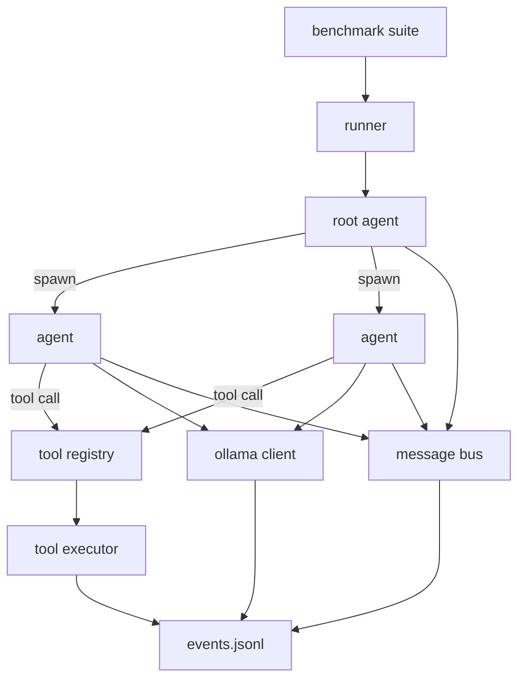

Alright — continuing the spec review, but now we’re going to **turn this into something you can actually *live in***: fewer “conceptual blobs”, more **authoring contracts**, **valid Clojure-ish examples**, and a couple **foundational fixes** that will save you pain.

---

# 1) More hard fixes hiding in the specs (beyond what we already covered)

## 1.1 `core.md` starts with a stray quote

Your `core.md` literally begins with `'# Core Framework Specification` 
That leading `'` will make this annoying if you ever parse/ingest these docs.

✅ Fix it to:

```md
# Core Framework Specification
```

---

## 1.2 `BusMessage` protocol methods are missing the instance argument

Right now:

```clj
(defprotocol BusMessage
  (message-type [] ...)
  (target [] ...)
  ...)
```

That’s not how protocols work (methods need the “this”). It appears in core.md .

✅ Fix shape:

```clj
(defprotocol BusMessage
  (message-type [msg] "Returns message type keyword")
  (target [msg] "Returns target recipient(s)")
  (payload [msg] "Returns message payload")
  (metadata [msg] "Returns optional metadata"))
```

---

## 1.3 Your “Clojure snippet blocks” keep *almost* being valid EDN

Your benchmark maps are malformed in multiple spots  
This is more than aesthetics: if your docs become **ingestible** into your system later (very plausible), you’ll want these to be actually parseable.

✅ Rule of thumb: if you put `clj` fences in docs, **prefer real EDN**.

---

## 1.4 `dependencies.md` compatibility matrix is definitely broken

The row:
`| Core 0.1.x | ✓ | ✓ | ✓ | ✓ | ✓ |`
has too many columns .

✅ Fix it (the way you intended):

| Component       | Min Core | Agent Framework | Tool System | Benchmark Framework |
| --------------- | -------- | --------------- | ----------- | ------------------- |
| Core 0.1.x      | ✓        | —               | —           | —                   |
| Agent 0.1.x     | ✓        | ✓               | —           | —                   |
| Tool 0.1.x      | ✓        | —               | ✓           | —                   |
| Benchmark 0.1.x | ✓        | ✓               | ✓           | ✓                   |

---

## 1.5 `tools.md` coordinate validation is wrong

Your current coordinate rule is not a valid lat/lon constraint .

✅ Replace with:

```clj
(s/def ::lat (s/and number? #(<= -90 % 90)))
(s/def ::lon (s/and number? #(<= -180 % 180)))
(s/def ::coordinate (s/tuple ::lat ::lon))
```

---

# 2) The “missing spine” across all specs: a single canonical **tool definition object**

Right now, tool definition appears as:

* a registry entry in `core.md` 
* a richer doc schema in `tools.md` 
* and implicitly as “callable thing with schema + implementation” in benchmark land 

But there is **no single canonical tool map** that every layer agrees on.

### Fix: define one canonical “tool object”

I’d make `tools.md` the source of truth and require *everywhere* to use this shape:

```clj
{:tool/name        "math/add"
 :tool/description "Add two integers"
 :tool/domain      :math
 :tool/tags        #{:arithmetic :deterministic}
 :tool/version     "0.1.0"

 ;; validation/coercion
 :tool/args-spec   ::math-add-args
 :tool/ret-spec    ::math-add-ret
 :tool/coerce      :json|:edn|:none

 ;; runtime integration
 :tool/schema      {...OpenAI/Ollama function schema...}
 :tool/impl        (fn [args ctx] ...)
 :tool/timeout-ms  5000
 :tool/side-effects? false
 :tool/idempotent?  true

 ;; benchmark hints
 :tool/decoy-profile :normal|:powerful|:same-domain|:noise}
```

Once you do that, **benchmarks**, **agents**, **ollama schema generation**, and **tool validation** all stop fighting each other.

---

# 3) Benchmarks: you’re 90% there — add “why it failed” telemetry

Your tool-calling metrics are solid .

But your decoy system is *the whole point* , and currently failures collapse into “wrong tool”.

✅ Add decoy diagnostics (this is the missing 10%):

```clj
{:decoy/selected?       boolean
 :decoy/type            :same-domain|:powerful|:noise
 :decoy/domain-match?   boolean
 :decoy/tag-overlap     number   ;; jaccard(tags(selected), tags(correct))
 :decoy/name-similarity number   ;; optional, string similarity
 :decoy/arg-shape-similarity number}
```

Now you can answer questions like:

* *“does the model pick high-authority tools under uncertainty?”*
* *“does it get baited by name similarity?”*
* *“does it learn domain boundaries?”*

---

# 4) You need a “Tool Pack” contract because your benchmark requirement demands it

The entire conversation goal was:

> benchmark accepts `tools.clj` with tool definitions **AND implementations**

Right now you *hint* at tool execution engine 
…but you don’t formalize the **unit of reuse**.

✅ Add to `tools.md` (or new doc): **Tool Pack**

### Tool Pack rules

* A tool pack is a **namespace** that, on `require`, registers tools into the tool registry.
* Tool pack must contain:

  * `def-tool` forms (definitions + impl)
  * any supporting specs (args/ret)
* Benchmark runner loads tool packs via symbol:

  * `:bench/tools-pack 'my.tools.core`

### Tool Pack mode support

To reuse packs in real agents and benchmarks:

* tools may include multiple implementations:

  * `:tool/impl {:real f :bench f}`
  * OR `impl` takes a context `ctx` and branches safely.

This is how you avoid “benchmark tools mutate your filesystem” problems *without duplicating tool definitions*.

---

# 5) Agents: you described the hierarchy, but not the *sleep/wake mechanic*

You already have lifecycle states 
and the supervisor interface 

But the thing you described in the conversation is more specific:

> parent agent sleeps, wakes periodically while children still running, can go multiple levels deep

That needs to be a formal **scheduler contract**, not just prose.

✅ Add an “execution loop” section:

```clj
{:agent/id "root"
 :agent/status :sleeping
 :agent/inbox <chan>
 :agent/tick-ms 250
 :agent/wake-on #{:msg :lock-conflict :child-complete :tick}}
```

And define:

* **sleeping** = agent loop is idle, waiting on `alts!` of inbox/tick/control
* **waking** = step executes until it yields `:sleep` or runs out of work
* **blocked** = waiting on a lock dependency (also evented)

This makes your hierarchy deterministic instead of magical.

---

# 6) File locks: you have the lock service, but not the escalation thread protocol

You have lock service interface in core.md 
and the “conflict resolution requirement” 

But your conversation adds a powerful behavior:

> agent hits locked file → it can open special conversation thread

✅ Add an **event contract**:

```clj
{:event/type "lock/conflict"
 :timestamp  unix-ms
 :path       "src/foo.clj"
 :mode       :write
 :owner      "agent-2"
 :requester  "agent-7"
 :thread/id  "conflict:src/foo.clj:agent-2:agent-7"}
```

And a default policy:

* requester notifies parent
* parent may:

  * wait
  * force a “handoff thread”
  * or reassign work

This turns “locks exist” into “multi-agent collaboration exists”.

---

# 7) The macro layer: the specs still don’t contain *the thing you actually want to write*

Right now, nowhere in your uploaded specs do `def-tool` or `def-agent` exist as authoring primitives.

So: this part is missing from the spec set.

✅ Minimum macro surface to make it “Agent SDK-ish”:

## 7.1 `def-tool`

**Goal:** tool authoring looks like one form.

```clj
(def-tool math/add
  {:description "Add two integers"
   :domain :math
   :tags #{:arithmetic :deterministic}
   :args (s/keys :req-un [::a ::b])
   :ret  (s/keys :req-un [::value])}
  [{:keys [a b]} ctx]
  {:ok true :value (+ a b)})
```

This gives you:

* schema generation
* validation
* tool registry install
* benchmark metadata in one place

## 7.2 `def-agent`

**Goal:** agent authoring is declarative + runtime friendly.

```clj
(def-agent planner/root
  {:model {:provider :ollama :name "qwen3:32b"}
   :tools [:math/add :fs/read :fs/write :agent/spawn]
   :budget {:max-steps 200 :max-tool-calls 100}}
  (step [ctx]
    ...))
```

That’s the “natural” feel you were aiming for.

---

# 8) clj-kondo: this must be specified, not “we’ll figure it out”

Since you explicitly want kondo support, it needs to be in docs as a first-class requirement.

At minimum:

* `.clj-kondo/config.edn` declares macro hooks
* `hooks` rewrite `def-tool` → `def`
* `hooks` rewrite `def-agent` → `def`

Because otherwise authoring will feel cursed.

---

# 9) The single biggest strategic recommendation

You’re building *two* things at once:

1. **A real agent runtime**
2. **A benchmark suite**

The trick is: **benchmarks should run the same runtime**, just with:

* a special tool pack
* a special “judge/scorekeeper” agent
* extra event capture

Your dependency graph already points that way 
so lean in hard.

✅ “Benchmarks are just agent runs with a different supervisor + report sink.”

That’s the cleanest conceptual unification you can get.

---

# 10) One diagram to crystalize the full system



This matches your “core is foundation of trust” model  and your async/message bus requirement .

---

## If you want the *next* continuation

Next step I’d write the **actual concrete spec sections** to paste into your existing files:

* add “Tool Pack” section to `tools.md`
* add “Scheduler + sleep/wake” section to `agents.md`
* fix all malformed EDN snippets in `benchmarks.md`
* fix protocol syntax in `core.md`
* add “Decoy diagnostics” to benchmark metrics
* add “kondo hook contract” appendix

…and we can do it as **full-file replacements** (no diffs), so you can drop them into your repo cleanly.
