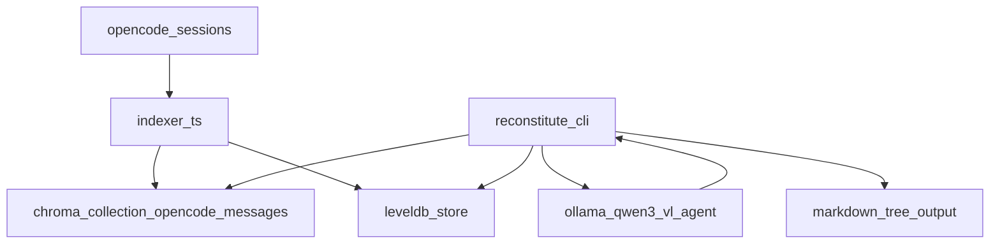

1. **Index everything** from OpenCode sessions → Chroma (semantic search)
2. **Store exact chat-replay artifacts** (OpenCode → Ollama message arrays) in **LevelDB**
3. `reconstitute <path>` runs iterative loops:

   * semantic search for that path + related questions
   * build an **Ollama-ready `messages[]` context**
   * run a local agent (`qwen3-vl:8b-instruct`) with tool-calls to:

     * extract/record more paths
     * answer your fixed questions
     * accumulate descriptions per-path
4. Export a **markdown tree** mirroring the recovered folder structure

OpenCode gives you session/messages via the JS SDK (`session.list()`, `session.messages()`), so your indexer can be deterministic and incremental. ([OpenCode][1])
Ollama embeddings come from `POST /api/embed`, and you can batch inputs. ([Ollama Docs][2])
Ollama tool-calling expects `assistant.tool_calls[]` followed by `tool` role messages with `tool_name`. ([Ollama Docs][3])
Chroma JS client supports `collection.upsert()` and `collection.query()` with metadata filters and includes. ([UNPKG][4])
Your embedding model requirement (“32k context”) matches the `num_ctx: 32768` config shown for Qwen3-Embedding-8B. ([Ollama][5])



---

## Data model (recommended)

### Chroma collection: `opencode_messages_v1`

**One record per OpenCode message** (or per “expanded turn” if you choose).

* `id`: `${sessionId}:${messageIndex}`
* `document`: a normalized text string (good for debugging + embeddings)
* `embedding`: from `qwen3-embedding:8b`
* `metadata` (small, queryable):

  * `session_id`
  * `session_title`
  * `message_index`
  * `role` (user/assistant/tool-ish)
  * `created_at` (epoch ms)
  * `paths` (string[] or a compact joined string)
  * optional: `project`, `cwd`, etc

### LevelDB (source of truth for replay)

Store the **exact Ollama-ready replay fragments** and indexing bookkeeping:

* `sess:${sessionId}:meta` → session info
* `sess:${sessionId}:order` → array of `${sessionId}:${messageIndex}` ids
* `msg:${id}:ollama` → `OllamaMessage[]` (JSON)
* `msg:${id}:hash` → hash of source message to skip reindex
* cache keys with TTL:

  * `cache:embed:${model}:${sha256(text)}`
  * `cache:search:${sha256(query+filter)}`
  * `cache:chat:${sha256(messages+toolsVersion)}`

---

## OpenCode → Ollama message conversion (practical “exactness”)

Ollama wants:

* normal chat messages: `{ role: "user"|"assistant"|"system", content: "..." }`
* tool calling:

  1. assistant message with `tool_calls`
  2. then tool results: `{ role: "tool", tool_name, content }` ([Ollama Docs][3])

OpenCode messages come back as `{ info: Message, parts: Part[] }[]`. ([OpenCode][1])
Each `Part` often includes `type: "text"` (and OpenCode uses that same shape for prompting). ([OpenCode][1])

So conversion strategy:

* **Accumulate `text` parts** into one `content` string for that message
* **Detect tool call-ish parts** (best-effort based on keys like `name`, `arguments`, `input`, `output`)

  * emit an `assistant` message with `tool_calls`
  * emit one or more `tool` messages with outputs

If a part type is unknown, **don’t drop it**:

* include a lossless JSON block inside the `content` so replay still contains the information.

This keeps reconstruction robust even if OpenCode adds new part types later.

---

# Script 1 — index *every* OpenCode session into Chroma + LevelDB

Save as `scripts/index-opencode-sessions.ts`

```ts
import { createOpencodeClient } from "@opencode-ai/sdk";
import { ChromaClient, IncludeEnum } from "chromadb";
import { Level } from "level";
import crypto from "node:crypto";

type OllamaMessage =
  | { role: "system" | "user" | "assistant"; content: string }
  | {
      role: "assistant";
      content?: string;
      tool_calls?: Array<{
        type: "function";
        function: { index: number; name: string; arguments: Record<string, unknown> };
      }>;
    }
  | { role: "tool"; tool_name: string; content: string };

type Env = {
  OPENCODE_BASE_URL: string;
  CHROMA_URL: string;
  CHROMA_COLLECTION: string;
  LEVEL_DIR: string;

  OLLAMA_BASE_URL: string;
  OLLAMA_EMBED_MODEL: string;
  OLLAMA_NUM_CTX: number;

  BATCH_SIZE: number;
  EMBED_TTL_MS: number;
};

function env(): Env {
  return {
    OPENCODE_BASE_URL: process.env.OPENCODE_BASE_URL ?? "http://localhost:4096",
    CHROMA_URL: process.env.CHROMA_URL ?? "http://localhost:8000",
    CHROMA_COLLECTION: process.env.CHROMA_COLLECTION ?? "opencode_messages_v1",
    LEVEL_DIR: process.env.LEVEL_DIR ?? ".reconstitute/level",

    OLLAMA_BASE_URL: process.env.OLLAMA_BASE_URL ?? "http://localhost:11434",
    OLLAMA_EMBED_MODEL: process.env.OLLAMA_EMBED_MODEL ?? "qwen3-embedding:8b",
    OLLAMA_NUM_CTX: Number(process.env.OLLAMA_NUM_CTX ?? "32768"),

    BATCH_SIZE: Number(process.env.BATCH_SIZE ?? "32"),
    EMBED_TTL_MS: Number(process.env.EMBED_TTL_MS ?? `${1000 * 60 * 60 * 24 * 30}`), // 30d
  };
}

function sha256(s: string): string {
  return crypto.createHash("sha256").update(s).digest("hex");
}

async function ttlGet<T>(db: Level<string, any>, key: string): Promise<T | null> {
  try {
    const v = await db.get(key);
    if (!v) return null;
    if (typeof v.expiresAt === "number" && Date.now() > v.expiresAt) return null;
    return v.value as T;
  } catch {
    return null;
  }
}

async function ttlSet<T>(db: Level<string, any>, key: string, value: T, ttlMs: number) {
  await db.put(key, { value, expiresAt: Date.now() + ttlMs });
}

async function ollamaEmbedMany(baseUrl: string, model: string, numCtx: number, inputs: string[]) {
  // Ollama: POST /api/embed, supports input: string[] :contentReference[oaicite:8]{index=8}
  const resp = await fetch(`${baseUrl}/api/embed`, {
    method: "POST",
    headers: { "Content-Type": "application/json" },
    body: JSON.stringify({
      model,
      input: inputs,
      truncate: true,
      options: { num_ctx: numCtx },
    }),
  });

  if (!resp.ok) throw new Error(`Ollama embed failed: ${resp.status} ${await resp.text()}`);
  const json = await resp.json();
  return json.embeddings as number[][];
}

function flattenForEmbedding(ollamaMsgs: OllamaMessage[]): string {
  const lines: string[] = [];
  for (const m of ollamaMsgs) {
    if (m.role === "tool") {
      lines.push(`[tool:${m.tool_name}] ${m.content}`);
    } else if (m.role === "assistant" && "tool_calls" in m && m.tool_calls?.length) {
      for (const tc of m.tool_calls) {
        lines.push(`[tool_call:${tc.function.name}] ${JSON.stringify(tc.function.arguments)}`);
      }
    } else {
      lines.push(`[${m.role}] ${("content" in m && m.content) ? m.content : ""}`);
    }
  }
  return lines.join("\n");
}

function extractPathsLoose(text: string): string[] {
  // cheap heuristic; real extraction happens in agent loop via record_path tool
  const paths = new Set<string>();
  const re = /(^|[\s"'`(])((?:\.{0,2}\/)?(?:[A-Za-z0-9_.-]+\/)+[A-Za-z0-9_.-]+)(?=$|[\s"'`),.:;])/g;
  for (const m of text.matchAll(re)) paths.add(m[2]);
  return [...paths];
}

function opencodeMessageToOllamaParts(entry: any): OllamaMessage[] {
  const info = entry?.info ?? {};
  const parts: any[] = entry?.parts ?? [];

  // best-effort role mapping
  const roleRaw = info.role ?? info.type ?? "assistant";
  const role: "user" | "assistant" | "system" =
    roleRaw === "user" ? "user" : roleRaw === "system" ? "system" : "assistant";

  const textChunks: string[] = [];
  const toolCalls: Array<{ name: string; args: Record<string, unknown> }> = [];
  const toolResults: Array<{ name: string; output: string }> = [];

  for (const p of parts) {
    if (p?.type === "text" && typeof p.text === "string") {
      textChunks.push(p.text);
      continue;
    }

    // best-effort tool call
    const toolName = p?.tool_name ?? p?.name ?? p?.tool?.name ?? p?.function?.name;
    const toolArgs = p?.arguments ?? p?.args ?? p?.input ?? p?.tool?.input ?? p?.function?.arguments;
    const toolOut = p?.output ?? p?.result ?? p?.content ?? p?.tool?.output;

    if (toolName && toolArgs && typeof toolArgs === "object" && !Array.isArray(toolArgs)) {
      toolCalls.push({ name: String(toolName), args: toolArgs as Record<string, unknown> });
      if (typeof toolOut === "string") toolResults.push({ name: String(toolName), output: toolOut });
      else if (toolOut != null) toolResults.push({ name: String(toolName), output: JSON.stringify(toolOut) });
      continue;
    }

    // unknown part: keep losslessly in text
    textChunks.push(`[opencode_part:${p?.type ?? "unknown"}] ${JSON.stringify(p)}`);
  }

  const msgs: OllamaMessage[] = [];

  const content = textChunks.join("\n").trim();
  if (toolCalls.length) {
    msgs.push({
      role: "assistant",
      content: content || undefined,
      tool_calls: toolCalls.map((tc, i) => ({
        type: "function",
        function: { index: i, name: tc.name, arguments: tc.args },
      })),
    });
    for (const tr of toolResults) msgs.push({ role: "tool", tool_name: tr.name, content: tr.output });
  } else {
    msgs.push({ role, content: content });
  }

  return msgs;
}

function unwrap<T>(resp: any): T {
  return (resp && typeof resp === "object" && "data" in resp) ? (resp.data as T) : (resp as T);
}

async function main() {
  const E = env();

  const client = createOpencodeClient({ baseUrl: E.OPENCODE_BASE_URL });
  const chroma = new ChromaClient({ path: E.CHROMA_URL });
  const collection = await chroma.getOrCreateCollection({ name: E.CHROMA_COLLECTION });

  const db = new Level<string, any>(E.LEVEL_DIR, { valueEncoding: "json" });

  const sessions = unwrap<any[]>(await client.session.list());
  console.log(`Found ${sessions.length} sessions`);

  for (const s of sessions) {
    const sessionId = s.id;
    const sessionTitle = s.title ?? "";
    const messages = unwrap<any[]>(await client.session.messages({ path: { id: sessionId } }));

    await db.put(`sess:${sessionId}:meta`, { id: sessionId, title: sessionTitle });
    const idsInOrder: string[] = [];

    const docsToEmbed: string[] = [];
    const metas: any[] = [];
    const ids: string[] = [];
    const ollamaBlobs: Record<string, OllamaMessage[]> = {};

    for (let i = 0; i < messages.length; i++) {
      const entry = messages[i];
      const msgId = entry?.info?.id ?? `${sessionId}:msg:${i}`;
      const createdAt = entry?.info?.createdAt ? new Date(entry.info.createdAt).getTime() : Date.now();

      const ollamaMsgs = opencodeMessageToOllamaParts(entry);
      const doc = flattenForEmbedding(ollamaMsgs);
      const docHash = sha256(JSON.stringify(entry));

      const rowId = `${sessionId}:${i}`;
      idsInOrder.push(rowId);

      // incremental skip: if same hash, skip upsert/embed
      const prevHash = await db.get(`msg:${rowId}:hash`).catch(() => null);
      if (prevHash === docHash) {
        continue;
      }

      // store replay blob in LevelDB (source of truth)
      ollamaBlobs[rowId] = ollamaMsgs;

      const paths = extractPathsLoose(doc);

      ids.push(rowId);
      docsToEmbed.push(doc);
      metas.push({
        session_id: sessionId,
        session_title: sessionTitle,
        message_id: msgId,
        message_index: i,
        role: entry?.info?.role ?? entry?.info?.type ?? "assistant",
        created_at: createdAt,
        paths: paths.join("|"),
      });

      await db.put(`msg:${rowId}:hash`, docHash);
    }

    await db.put(`sess:${sessionId}:order`, idsInOrder);

    // embed + upsert in batches
    for (let start = 0; start < docsToEmbed.length; start += E.BATCH_SIZE) {
      const batchDocs = docsToEmbed.slice(start, start + E.BATCH_SIZE);
      const batchIds = ids.slice(start, start + E.BATCH_SIZE);
      const batchMetas = metas.slice(start, start + E.BATCH_SIZE);

      const embeddings: number[][] = [];
      for (const d of batchDocs) {
        const ck = `cache:embed:${E.OLLAMA_EMBED_MODEL}:${sha256(d)}`;
        const cached = await ttlGet<number[]>(db, ck);
        if (cached) embeddings.push(cached);
        else {
          // we'll fill via one call below
          embeddings.push([] as any);
        }
      }

      // find which need embedding
      const needIdx: number[] = [];
      const needDocs: string[] = [];
      embeddings.forEach((e, idx) => {
        if (!e || !Array.isArray(e) || e.length === 0) {
          needIdx.push(idx);
          needDocs.push(batchDocs[idx]);
        }
      });

      if (needDocs.length) {
        const got = await ollamaEmbedMany(E.OLLAMA_BASE_URL, E.OLLAMA_EMBED_MODEL, E.OLLAMA_NUM_CTX, needDocs);
        for (let j = 0; j < needIdx.length; j++) {
          const idx = needIdx[j];
          embeddings[idx] = got[j];
          const ck = `cache:embed:${E.OLLAMA_EMBED_MODEL}:${sha256(batchDocs[idx])}`;
          await ttlSet(db, ck, got[j], E.EMBED_TTL_MS);
        }
      }

      // upsert to chroma
      await collection.upsert({
        ids: batchIds,
        embeddings,
        documents: batchDocs,
        metadatas: batchMetas,
      });

      // persist replay blobs for these ids
      for (const id of batchIds) {
        if (ollamaBlobs[id]) await db.put(`msg:${id}:ollama`, ollamaBlobs[id]);
      }

      console.log(`Upserted ${batchIds.length} rows to ${E.CHROMA_COLLECTION}`);
    }
  }

  await db.close();
  console.log("Done.");
}

main().catch((e) => {
  console.error(e);
  process.exit(1);
});
```

### Notes

* The embed call uses `options.num_ctx` and batching (`input: string[]`). ([Ollama Docs][2])
* `num_ctx: 32768` matches your 32k requirement for Qwen3 embedding. ([Ollama][5])
* This stores Ollama replay blobs in LevelDB so search can return **ready-to-use `messages[]`**.

---

# Script 2 — semantic search that returns an Ollama-ready `messages[]` context

Save as `scripts/search-opencode-sessions.ts`

```ts
import { ChromaClient, IncludeEnum } from "chromadb";
import { Level } from "level";
import crypto from "node:crypto";

type OllamaMessage =
  | { role: "system" | "user" | "assistant"; content: string }
  | {
      role: "assistant";
      content?: string;
      tool_calls?: Array<{
        type: "function";
        function: { index: number; name: string; arguments: Record<string, unknown> };
      }>;
    }
  | { role: "tool"; tool_name: string; content: string };

type Env = {
  CHROMA_URL: string;
  CHROMA_COLLECTION: string;
  LEVEL_DIR: string;

  OLLAMA_BASE_URL: string;
  OLLAMA_EMBED_MODEL: string;
  OLLAMA_NUM_CTX: number;

  WINDOW: number;
};

function env(): Env {
  return {
    CHROMA_URL: process.env.CHROMA_URL ?? "http://localhost:8000",
    CHROMA_COLLECTION: process.env.CHROMA_COLLECTION ?? "opencode_messages_v1",
    LEVEL_DIR: process.env.LEVEL_DIR ?? ".reconstitute/level",

    OLLAMA_BASE_URL: process.env.OLLAMA_BASE_URL ?? "http://localhost:11434",
    OLLAMA_EMBED_MODEL: process.env.OLLAMA_EMBED_MODEL ?? "qwen3-embedding:8b",
    OLLAMA_NUM_CTX: Number(process.env.OLLAMA_NUM_CTX ?? "32768"),

    WINDOW: Number(process.env.WINDOW ?? "2"),
  };
}

function sha256(s: string): string {
  return crypto.createHash("sha256").update(s).digest("hex");
}

async function ollamaEmbedOne(baseUrl: string, model: string, numCtx: number, input: string) {
  const resp = await fetch(`${baseUrl}/api/embed`, {
    method: "POST",
    headers: { "Content-Type": "application/json" },
    body: JSON.stringify({
      model,
      input,
      truncate: true,
      options: { num_ctx: numCtx },
    }),
  });
  if (!resp.ok) throw new Error(`Ollama embed failed: ${resp.status} ${await resp.text()}`);
  const json = await resp.json();
  return (json.embeddings?.[0] ?? []) as number[];
}

function parseArgs() {
  const argv = process.argv.slice(2);
  const query = argv.join(" ").trim();
  if (!query) {
    console.error(`Usage: tsx scripts/search-opencode-sessions.ts "your query"`);
    process.exit(2);
  }
  const limit = Number(process.env.LIMIT ?? "20");
  const threshold = process.env.THRESHOLD ? Number(process.env.THRESHOLD) : null;
  const where = process.env.WHERE ? JSON.parse(process.env.WHERE) : null; // chroma "where" metadata filter
  return { query, limit, threshold, where };
}

async function main() {
  const E = env();
  const { query, limit, threshold, where } = parseArgs();

  const db = new Level<string, any>(E.LEVEL_DIR, { valueEncoding: "json" });
  const chroma = new ChromaClient({ path: E.CHROMA_URL });
  const collection = await chroma.getOrCreateCollection({ name: E.CHROMA_COLLECTION });

  const qEmb = await ollamaEmbedOne(E.OLLAMA_BASE_URL, E.OLLAMA_EMBED_MODEL, E.OLLAMA_NUM_CTX, query);

  const results = await collection.query({
    queryEmbeddings: [qEmb],
    nResults: limit,
    where: where ?? undefined,
    include: [IncludeEnum.Metadatas, IncludeEnum.Documents, IncludeEnum.Distances],
  });

  const ids = results.ids?.[0] ?? [];
  const metadatas = results.metadatas?.[0] ?? [];
  const distances = results.distances?.[0] ?? [];

  // pick hits (threshold is "max distance" because Chroma returns distances; smaller is better)
  const hits = ids
    .map((id, i) => ({ id, meta: metadatas[i] ?? null, distance: distances[i] ?? null }))
    .filter((h) => (threshold == null ? true : (h.distance != null && h.distance <= threshold)));

  // Build windowed context
  const needed = new Set<string>();
  for (const h of hits) {
    const sid = String(h.meta?.session_id ?? "").trim();
    const idx = Number(h.meta?.message_index ?? NaN);
    if (!sid || Number.isNaN(idx)) continue;

    for (let j = Math.max(0, idx - E.WINDOW); j <= idx + E.WINDOW; j++) {
      needed.add(`${sid}:${j}`);
    }
  }

  // sort deterministically by session then index
  const neededSorted = [...needed].sort((a, b) => {
    const [sa, ia] = a.split(":");
    const [sb, ib] = b.split(":");
    if (sa < sb) return -1;
    if (sa > sb) return 1;
    return Number(ia) - Number(ib);
  });

  const contextMessages: OllamaMessage[] = [];
  for (const id of neededSorted) {
    const blob = await db.get(`msg:${id}:ollama`).catch(() => null);
    if (!blob) continue;
    for (const m of blob as OllamaMessage[]) contextMessages.push(m);
  }

  const out = {
    query,
    where,
    limit,
    threshold,
    hits,
    context_messages: contextMessages,
  };

  console.log(JSON.stringify(out, null, 2));
  await db.close();
}

main().catch((e) => {
  console.error(e);
  process.exit(1);
});
```

---

## How this becomes `reconstitute <path>`

Once those two scripts exist, your CLI is just an orchestration layer:

* `reconstitute index` → runs the indexer
* `reconstitute search "<query>"` → calls search and returns `context_messages`
* `reconstitute <targetPath>`:

  * generates your question set
  * for each question:

    * calls **search** to get `context_messages`
    * calls Ollama chat (`qwen3-vl:8b-instruct`) with tool calling
    * tool calls mutate:

      * recorded paths set
      * per-path description strings
      * notes chroma collection

Tool calling message format and the `tool` followups need to match Ollama’s documented structure. ([Ollama Docs][3])

---

## Tool definitions you listed (shape that Ollama expects)

Ollama wants tools described as JSON-schema functions (`type: "function"`, `function: { name, description, parameters }`). ([Ollama Docs][3])
So your tool list becomes a static array you pass into `ollama.chat(...)`.

If you want, I can paste the full `tools` array + a minimal agent loop runner that:

* keeps looping until no new tool calls
* supports your exact tools (`record_path`, `search_sessions`, etc.)
* appends tool results back as `{ role: "tool", tool_name, content }`

…but the two scripts above are the foundation that makes `reconstitute` possible: **index everything** + **return Ollama-ready context from semantic search**.

---

## Setup checklist

* Make sure OpenCode server is reachable (default `http://localhost:4096`). ([OpenCode][1])
* Make sure Ollama is reachable (default `http://localhost:11434/api`). ([Ollama Docs][6])
* Pull models:

  * `qwen3-embedding:8b` (or your chosen tag)
  * `qwen3-vl:8b-instruct`
* Chroma server running and reachable

> If you’re running big contexts, Ollama documents increasing context length via config/env and `num_ctx` parameters; larger contexts cost more memory. ([Ollama Docs][7])


[1]: https://opencode.ai/docs/sdk/ "SDK | OpenCode"
[2]: https://docs.ollama.com/api/embed?utm_source=chatgpt.com "Generate embeddings"
[3]: https://docs.ollama.com/capabilities/tool-calling "Tool calling - Ollama"
[4]: https://app.unpkg.com/chromadb%401.8.1/files/dist/chromadb.d.ts "UNPKG"
[5]: https://ollama.com/ryanshillington/Qwen3-Embedding-8B%3Alatest/blobs/db8fbfd0cb28 "ryanshillington/Qwen3-Embedding-8B/params"
[6]: https://docs.ollama.com/api/introduction?utm_source=chatgpt.com "Introduction"
[7]: https://docs.ollama.com/context-length "Context length - Ollama"
