# Overview

```
1. **Intake & Associate**
```

Find or create the task; never work off-board; do not edit the board file directly—tasks drive the board.  

```
2. **Clarify & Scope**
```

Anchor on the kanban card as the single source of truth and, before advancing, do the solo pass:

- Confirm the desired outcomes so the card reflects the slice you intend to deliver.
- Capture acceptance criteria or explicit exit signals on the task so "done" is unambiguous.
- Note any uncertainties, risks, or open questions directly on the task to surface follow-ups early.
- Record the scoped plan and supporting notes on the linked task before moving to step 3.

```
3. **Breakdown & Size**
```

Break into small, testable slices; assess **complexity, scope, and Level of Effort (LoE)** and assign a Fibonacci score from **1, 2, 3, 5, 8, 13** on the task card. Scores of **13+ ⇒ must split**; **8 ⇒ continue refinement before implementation**; **≤5 ⇒ eligible to implement**. Any score **>5** must cycle back through clarification/breakdown until the slice is small enough to implement, capturing the updated score on the task card. 

4. **Ready Gate** _(hard stop before code)_
   Only proceed if:

   - A matching task is **In Progress** (or you move it there), and WIP rules aren’t violated. 
   - The slice is scored **≤5** and fits capacity after planning; otherwise continue refinement/splitting. 

```
5. **Implement Slice**
```

Do the smallest cohesive change that can clear gates defined in agent docs (e.g., no new ESLint errors; touched packages build; tests pass). 
When the scope is larger than the available session, carve off a reviewable subset and explicitly document what remains (e.g.,
inventory lingering files, capture blockers, link references). 

```
6. **Review → Test → Document**
```

Move through _In Review_, _Testing_ and _Document_ then _Done_ per board flow, recording evidence and summaries. 

# Kanban as a Finite State Machine (FSM)

We treat the board as an FSM over tasks.

- **States (C)**: the board’s columns.
- **Initial state (S)**: **Incoming** (new tasks land here).
- **Transitions (T)**: moves between columns.
- **Rules R(Tₙ, t)**: predicates over task `t` that permit or block transition `Tₙ`.
- **Single source of status**: each task has exactly one column/status at a time.
- **Board is law**: never edit the board file directly; tasks drive board generation.
- **WIP**: a transition fails if the target state’s WIP cap is full.

### FSM diagram

```mermaid
flowchart TD

  %% ====== Lanes ======
  subgraph Brainstorm
    IceBox["🧊 Ice Box"]
    Incoming["💭 Incoming"]
  end

  subgraph Planning
    Accepted["✅ Accepted"]
    Breakdown["🧩 Breakdown"]
    Blocked["🚧 Blocked"]
  end

  subgraph Execution
    Ready["🛠 Ready"]
    Todo["🟢 To Do"]
    InProgress["🟡 In Progress"]
    Testing["🧪 Testing"]
    InReview["🔍 In Review"]
    Document["📚 Document"]
    Done["✅ Done"]
  end

  subgraph Abandoned
    Rejected["❌ Rejected"]
  end

  %% ====== Forward flow ======
  IceBox --> Incoming
  Incoming --> Accepted
  Incoming --> Rejected
  Incoming --> IceBox
  Accepted --> Breakdown
  Breakdown --> Ready
  Ready --> Todo
  Todo --> InProgress
  InProgress --> InReview
  InReview --> Testing
  Testing --> Document
  Document --> Done

  %% ====== Cycles back to Planning / queue ======
  Ready --> Breakdown
  Todo --> Breakdown
  InProgress --> Breakdown
  InReview --> Breakdown
  Testing --> InProgress

  %% ====== Session-end, no-PR handoff ======
  InProgress --> Todo
  Document --> InReview

  %% ====== Review crossroads (re-open work) ======
  InReview --> InProgress
  InReview --> Todo
  Testing --> InReview

  %% ====== Defer / archive loops ======
  Accepted --> IceBox
  Breakdown --> IceBox
  Rejected --> IceBox

  %% ====== Blocked (narrow, explicit dependency) ======
  Breakdown --> Blocked
  Blocked --> Breakdown
```



### Minimal transition rules (only what matters)

- START STATES = Ice Box | Incoming

  - All new tasks must start in either **Ice Box** (for future work) or **Incoming** (for immediate triage)
  - This constraint is enforced by the CLI to ensure proper workflow adherence
  - Tasks cannot be created directly in active columns (todo, in_progress, etc.)

- **Incoming → Accepted | Rejected | Ice Box**
  Relevance/priority triage; allow defer to Ice Box.

- **Ice Box → Incoming**
  When deferred work is ready for triage and prioritization.

- **Accepted → Breakdown | Ice Box**
  Ready to analyze, or consciously deferred.

- **Breakdown → Ready | Rejected | Ice Box | Blocked**
  Scoped & feasible → Ready; non-viable → Rejected; defer → Ice Box;
  **→ Blocked** only for a true inter-task dependency with **bidirectional links** (Blocking ⇄ Blocked By).

- **Ready → Todo**
  Prioritized into the execution queue (respect WIP).

- **Todo → In Progress**
  Pulled by a worker (respect WIP).

- **In Progress → In Review**
  Coherent, reviewable change exists.

- **In Review → Testing**
  Review approved; proceed to testing phase.

- **Testing → Document**
  Testing complete; proceed to documentation.

- **In Progress → Todo** _session-end handoff; no PR required_
  Capacity limit reached without a reviewable change. Record artifacts/notes + next step; move to **Todo** if WIP allows; else remain **In Progress** and mark a minor blocker.
  Artifacts must include partial outputs (e.g., audit logs, findings lists, reproduction steps) so a follow-on slice can resume immediately.

- **In Progress → Breakdown**
  Slice needs re-plan or is wrong shape.

- **In Review → In Progress** _(preferred)_
  Changes requested; current assignee free; **In Progress** WIP allows.

- **In Review → Todo** _(fallback)_
  Changes requested; assignee busy **or** **In Progress** WIP full.

- **Testing → In Review**
  Testing failed or needs review adjustments; return to review phase.

- **Document → Done | In Review**
  Docs/evidence complete → Done; otherwise → In Review for another pass.

- **Done → (no mandatory back edge)**
  Follow-ups are modeled as new tasks (optionally seeded from Done).

- **Blocked → Breakdown** _(unblock event)_
  Fires when any linked blocker advances e.g., to In Review/Done or evidence shows dependency removed; return to Breakdown to re-plan.

### Blocking policy

- **Minor blockers**: record briefly on the task; continue with other eligible work; resolve asynchronously.
  - Uncertainty over a single aspect of an assignment which does not prevent completion of other aspects of the assignment
- **Major blockers**: halt work on that task; capture evidence + attempt remediation
  - A triggered transition rule would result in a column begin over it's WIP limit
  - An agent's current task has only blocked sub tasks

## 🌊 Fluid Kanban Rule Evolution

Kanban is a fluid process that adapts to changing development environments while maintaining core principles.

### When Rules Must Change

A rule should be changed when:

1. **Progress is blocked** despite valid work being ready
2. **Team composition changes** significantly (new contributors, new agent types)
3. **Process discovery** reveals better ways of working
4. **Scaling requirements** exceed current capacity constraints

### Rule Change Process

1. **Identify the constraint**: Which specific rule is preventing forward progress?
2. **Document the rationale**: Why must this rule change now? What's the impact?
3. **Propose a new rule**: Clear, measurable, and time-bound
4. **Implement temporarily**: Test the change with explicit review date
5. **Evaluate and formalize**: Either revert, adjust, or make permanent

### WIP Limit Evolution Example

**Original Rule**: 2 tasks in review per human developer
**Reality**: 1 human + 6-18 AI agents contributing simultaneously
**Constraint**: Review bottleneck blocking all flow
**Solution**:

- Review: 2 → 6 (human review bandwidth for AI work)
- In Progress: 3 → 10 (multi-agent parallel work capacity)
- Document: 2 → 4 (maintain flow proportion)

### Guiding Principles for a Supportive Board

- **The board serves the team, not the other way around**
- **Work gets done, sometimes outside formal processes - and that's okay**
- **Retrospective card movement is a ritual of acknowledgment, not compliance**
- **Failed checks are learning opportunities, not violations**
- **We think better when we're calm** - even urgent work deserves a thoughtful response
- **Focus on capacity and flow** - "We may have taken on more work than we can handle, let's reevaluate priorities"

- **Rules enable flow, they don't dictate activity**
- **Change is temporary unless proven valuable**
- **Document every change with clear rationale**
- **Review changes regularly** (monthly for significant rule changes)
- **Maintain the spirit** of the rule even when adapting the letter
