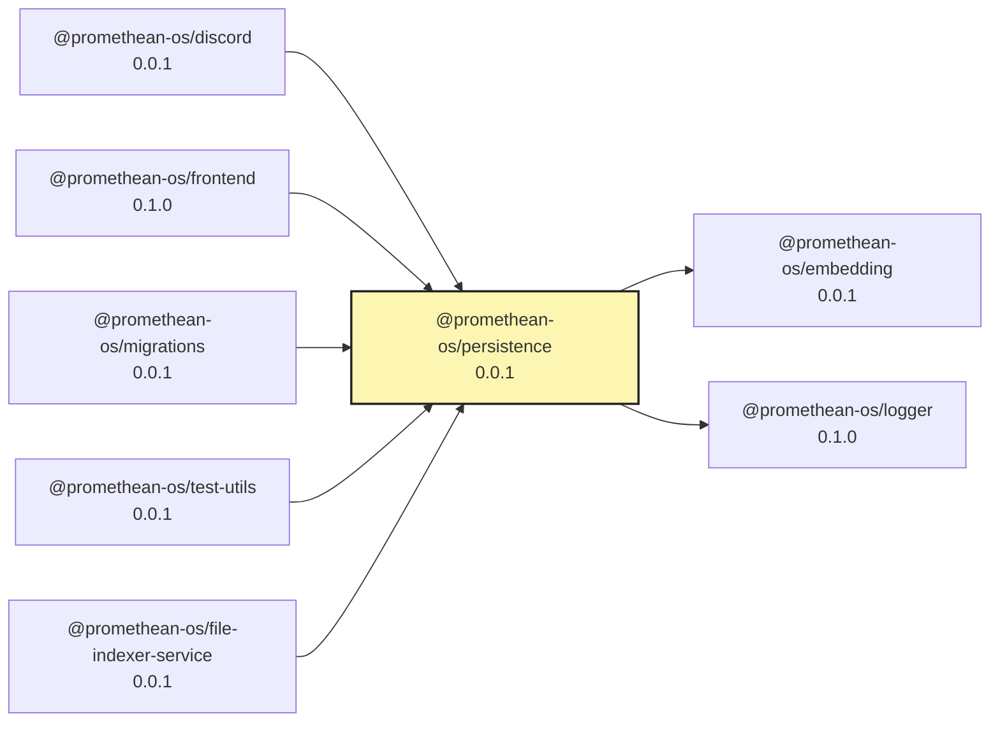

<!-- READMEFLOW:BEGIN -->

# @promethean-os/persistence

[TOC]

## Install

```bash
pnpm -w add -D @promethean-os/persistence
```

## Quickstart

```ts
import { openLevelCache, openLmdbCache } from '@promethean-os/persistence';

const levelCache = await openLevelCache({ path: '.cache/level' });
const lmdbCache = openLmdbCache({ path: '.cache/lmdb' });
```

## Caches

-   Unified entrypoint: import caches from `@promethean-os/persistence`.
-   Exported factories: `openLevelCache`, `openLmdbCache`.
-   Exported types: `LevelCache`, `LevelCacheOptions`, `LevelPutOptions`, `LevelMillis`, `LmdbCache`, `LmdbCacheOptions`, `LmdbPutOptions`, `LmdbMillis`, `LmdbCacheStats`.
-   Deprecation: `@promethean-os/level-cache` and `@promethean-os/lmdb-cache` are thin re-exports and will be removed in a future release; use persistence directly for new code.
-   Choosing backends: prefer LevelDB for lightweight/local setups; use LMDB when higher concurrency or compression is needed.

## Commands

-   `build`
-   `clean`
-   `typecheck`
-   `test`
-   `lint`
-   `lisp`
-   `coverage`
-   `format`

## License

GPL-3.0-only

### Package graph



<!-- READMEFLOW:END -->
