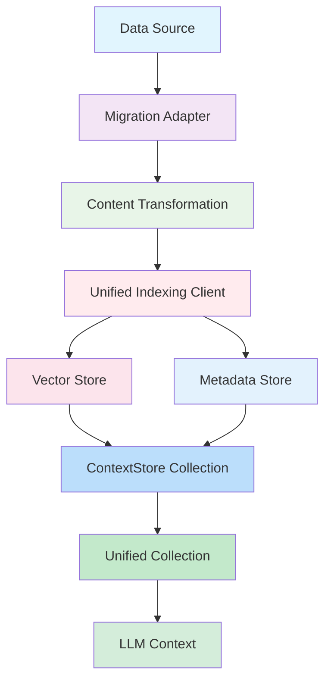

# Unified Indexer Service Architecture

## Overview

The Unified Indexer Service provides a centralized solution for indexing, searching, and retrieving content from multiple heterogeneous data sources (files, Discord, OpenCode, Kanban) through a unified interface that integrates seamlessly with the existing ContextStore.

## High-Level Architecture

```
┌─────────────────────────────────────────────────────────────────────────────────┐
│                    UNIFIED INDEXER SERVICE                          │
├─────────────────────────────────────────────────────────────────────────────────┤
│  ┌─────────────────┐  ┌─────────────────┐  ┌─────────────────┐  │
│  │  Data Sources   │  │   Search Engine │  │  ContextStore   │  │
│  │                 │  │                 │  │                 │  │
│  │ • Files         │  │ • Semantic      │  │ • Collections   │  │
│  │ • Discord       │  │ • Keyword       │  │ • Search       │  │
│  │ • OpenCode      │  │ • Hybrid        │  │ • Context      │  │
│  │ • Kanban        │  │ • Weighting      │  │ • Compilation  │  │
│  └─────────────────┘  └─────────────────┘  └─────────────────┘  │
│         │                     │                     │                 │
│         ▼                     ▼                     ▼                 │
│  ┌─────────────────────────────────────────────────────────────────┐     │
│  │            UNIFIED INDEXING CLIENT                │     │
│  │                                                 │     │
│  │ • Vector Store (ChromaDB)                      │     │
│  │ • Metadata Store (MongoDB)                    │     │
│  │ • Embedding Service                            │     │
│  └─────────────────────────────────────────────────────────┘     │
└─────────────────────────────────────────────────────────────────────────┘
```

## Core Components

### 1. UnifiedIndexerService

**Purpose**: Main orchestrator that manages all data sources and provides unified interface.

**Responsibilities**:

-   Service lifecycle management (initialize, start, stop)
-   Periodic synchronization of all data sources
-   Health monitoring and statistics collection
-   Context compilation for LLM consumption
-   Error handling and recovery

**Key Methods**:

```typescript
class UnifiedIndexerService {
    async initialize(): Promise<void>;
    async start(): Promise<void>;
    async stop(): Promise<void>;
    async search(query: SearchQuery): Promise<SearchResponse>;
    async getContext(queries: string[], options): Promise<ContextMessage[]>;
    async getStatus(): Promise<ServiceStatus>;
    async getStats(): Promise<UnifiedIndexerStats>;
}
```

### 2. CrossDomainSearchEngine

**Purpose**: Advanced search capabilities with intelligent ranking and analytics.

**Features**:

-   Semantic search using vector embeddings
-   Hybrid search combining semantic + keyword matching
-   Source and type weighting
-   Temporal boosting for recent content
-   Result deduplication and grouping
-   Detailed analytics and score explanations

**Search Pipeline**:

```
Query Input → Query Expansion → Multi-Source Search → Result Enhancement →
Advanced Filtering → Context Compilation → Analytics Generation → Final Output
```

### 3. Migration Adapters

**Purpose**: Transform domain-specific data to unified content model.

**Available Adapters**:

-   **UnifiedFileIndexer** - File system indexing with configurable patterns
-   **UnifiedDiscordIndexer** - Discord messages and attachments
-   **UnifiedOpenCodeIndexer** - Sessions, events, and messages
-   **UnifiedKanbanIndexer** - Tasks and boards

**Adapter Pattern**:

```typescript
class UnifiedXIndexer {
    constructor(unifiedClient: UnifiedIndexingClient);
    async indexX(data: XData): Promise<void>;
    async indexBatchX(data: XData[]): Promise<void>;
}
```

### 4. ContextStore Integration

**Purpose**: Seamless integration with existing context management system.

**Integration Points**:

-   Uses existing `DualStoreManager` collections
-   Compatible with `contextStore.compileContext()` patterns
-   Maintains backward compatibility
-   Provides unified collection for cross-domain search

**Collection Strategy**:

```
┌─────────────────────────────────────────┐
│           CONTEXTSTORE                 │
├─────────────────────────────────────────┤
│  ┌─────────────┐  ┌─────────────┐  │
│  │   Sources    │  │   Unified    │  │
│  │             │  │   Collection │  │
│  │ • files     │  │             │  │
│  │ • discord   │  │ • All       │  │
│  │ • opencode  │  │   Sources    │  │
│  │ • kanban    │  │   Combined   │  │
│  └─────────────┘  └─────────────┘  │
│         │                   │         │
│         ▼                   ▼         │
│  ┌─────────────────────────────────┐  │
│  │     LLM Consumption        │  │
│  │                             │  │
│  │ • Formatted Messages        │  │
│  │ • Context Limits           │  │
│  │ • Role Assignment          │  │
│  └─────────────────────────────────┘  │
└─────────────────────────────────────────┘
```

## Data Flow Architecture

### Indexing Flow



### Search Flow


## Configuration Architecture

### Hierarchical Configuration

```typescript
interface UnifiedIndexerServiceConfig {
    // 1. Storage Layer Configuration
    indexing: {
        vectorStore: VectorStoreConfig; // ChromaDB/Pinecone/Weaviate
        metadataStore: MetadataStoreConfig; // MongoDB/PostgreSQL/SQLite
        embedding: EmbeddingConfig; // Model and dimensions
        cache: CacheConfig; // TTL and size limits
        validation: ValidationConfig; // Strictness and limits
    };

    // 2. ContextStore Configuration
    contextStore: {
        collections: {
            files: string; // Source collection names
            discord: string;
            opencode: string;
            kanban: string;
            unified: string; // Combined collection
        };
        formatTime: TimeFormatter; // Timestamp formatting
        assistantName: string; // LLM identity
    };

    // 3. Data Source Configuration
    sources: {
        files: FileSourceConfig; // Paths and patterns
        discord: DiscordConfig; // Provider/tenant settings
        opencode: OpenCodeConfig; // Session management
        kanban: KanbanConfig; // Board/task settings
    };

    // 4. Operational Configuration
    sync: SyncConfig; // Intervals and batching
}
```

## Performance Architecture

### Indexing Performance

**Batch Processing Strategy**:

-   Configurable batch sizes (50-1000 items)
-   Parallel processing with concurrency limits
-   Memory-efficient streaming for large datasets
-   Progress tracking and error recovery

**Caching Strategy**:

-   Multi-level caching (L1: in-memory, L2: Redis)
-   TTL-based expiration
-   LRU eviction for memory management
-   Cache warming for frequent queries

### Search Performance

**Search Optimization**:

-   Vector index pre-warming
-   Query result caching
-   Parallel source querying
-   Result streaming for large sets
-   Intelligent result pagination

**Memory Management**:

-   Bounded collections with size limits
-   Garbage collection for expired entries
-   Memory pressure monitoring
-   Graceful degradation under load

## Security Architecture

### Input Validation

**Content Validation**:

```typescript
interface ValidationRules {
    maxLength: number; // Max content size (1MB default)
    allowedTypes: ContentType[]; // Permitted content types
    requiredFields: string[]; // Mandatory metadata fields
    sanitization: SanitizationRule[]; // XSS/injection protection
}
```

**Access Control**:

-   Source-based access permissions
-   Content-type restrictions
-   Query rate limiting
-   Audit logging for all operations

### Data Protection

**Encryption at Rest**:

-   Vector store encryption support
-   Metadata store field-level encryption
-   Key rotation capabilities
-   Secure key management

**Network Security**:

-   TLS for all external connections
-   API key authentication
-   Request signing for sensitive operations
-   IP allowlisting for services

## Reliability Architecture

### Fault Tolerance

**Circuit Breaker Pattern**:

```typescript
class CircuitBreaker {
    private state: 'CLOSED' | 'OPEN' | 'HALF_OPEN';
    private failureCount: number;
    private lastFailureTime: number;

    async execute<T>(operation: () => Promise<T>): Promise<T> {
        if (this.state === 'OPEN') {
            throw new Error('Circuit breaker is OPEN');
        }
        // Execute with monitoring
    }
}
```

**Retry Logic**:

-   Exponential backoff with jitter
-   Maximum retry limits per operation
-   Different strategies for different error types
-   Dead letter queue for failed operations

### Health Monitoring

**Health Checks**:

```typescript
interface HealthCheck {
    component: string;
    status: 'healthy' | 'degraded' | 'unhealthy';
    latency: number;
    errorRate: number;
    lastCheck: number;
    details: Record<string, any>;
}
```

**Metrics Collection**:

-   Request/response latency
-   Error rates by component
-   Resource utilization (CPU, memory, storage)
-   Business metrics (content indexed, search queries)

## Scalability Architecture

### Horizontal Scaling

**Service Clustering**:

-   Leader election for coordination
-   Distributed task assignment
-   Shared state synchronization
-   Load balancing across instances

**Data Partitioning**:

-   Time-based partitioning for recent content
-   Source-based partitioning for isolation
-   Geographic partitioning for latency
-   Consistent hashing for even distribution

### Vertical Scaling

**Resource Scaling**:

-   Auto-scaling based on queue depth
-   Resource pool management
-   Burst capacity handling
-   Graceful degradation patterns

## Integration Patterns

### Event-Driven Architecture

**Event Types**:

```typescript
interface IndexerEvents {
    'source:connected': (source: string) => void;
    'source:disconnected': (source: string, error: Error) => void;
    'content:indexed': (content: IndexableContent) => void;
    'sync:started': (source: string) => void;
    'sync:completed': (source: string, stats: any) => void;
    'sync:failed': (source: string, error: Error) => void;
    'search:completed': (query: string, results: SearchResult[]) => void;
}
```

**Message Queue Integration**:

-   Async processing for heavy operations
-   Priority queues for different content types
-   Dead letter queue handling
-   Exactly-once processing guarantees

### Plugin Architecture

**Extensibility Points**:

```typescript
interface IndexerPlugin {
    name: string;
    version: string;
    initialize(config: PluginConfig): Promise<void>;
    index(content: IndexableContent): Promise<void>;
    search(query: SearchQuery): Promise<SearchResult[]>;
    cleanup(): Promise<void>;
}
```

**Custom Source Adapters**:

-   Plugin interface for new data sources
-   Configuration-driven adapter loading
-   Runtime adapter registration
-   Hot-swapping capabilities

## Deployment Architecture

### Container Orchestration

**Docker Compose Configuration**:

```yaml
version: '3.8'
services:
    unified-indexer:
        build: .
        environment:
            - MONGODB_URL=mongodb://mongo:27017
            - CHROMA_DB_URL=http://chroma:8000
            - EMBEDDING_FUNCTION=text-embedding-ada-002
        depends_on:
            - mongodb
            - chroma
        volumes:
            - ./config:/app/config
            - ./logs:/app/logs
        restart: unless-stopped

    mongodb:
        image: mongo:6.0
        volumes:
            - mongo_data:/data/db

    chroma:
        image: chromadb/chroma:latest
        volumes:
            - chroma_data:/chroma/chroma
```

### Kubernetes Deployment

**Resource Management**:

```yaml
apiVersion: apps/v1
kind: Deployment
metadata:
    name: unified-indexer
spec:
    replicas: 3
    selector:
        matchLabels:
            app: unified-indexer
    template:
        spec:
            containers:
                - name: unified-indexer
                  image: promethean/unified-indexer:latest
                  resources:
                      requests:
                          memory: '512Mi'
                          cpu: '250m'
                      limits:
                          memory: '2Gi'
                          cpu: '1000m'
                  env:
                      - name: MONGODB_URL
                        valueFrom:
                            secretKeyRef:
                                name: db-credentials
                                key: url
```

## Monitoring Architecture

### Observability Stack

**Metrics Collection**:

-   Prometheus metrics exposition
-   Custom business metrics tracking
-   Performance histogram collection
-   Error rate and type tracking

**Logging Strategy**:

```typescript
interface LogEntry {
    timestamp: string;
    level: 'DEBUG' | 'INFO' | 'WARN' | 'ERROR';
    component: string;
    operation: string;
    duration?: number;
    metadata: Record<string, any>;
    error?: Error;
}
```

**Distributed Tracing**:

-   OpenTelemetry integration
-   Request correlation IDs
-   Cross-service trace propagation
-   Performance bottleneck identification

### Alerting Strategy

**Alert Types**:

-   Service health degradation
-   Error rate thresholds
-   Performance SLA breaches
-   Resource exhaustion warnings

**Notification Channels**:

-   Slack integration for ops alerts
-   Email for critical issues
-   PagerDuty for emergency responses
-   Dashboard widgets for real-time status

This architecture provides a comprehensive, scalable, and maintainable foundation for unified content indexing and search across the Promethean OS ecosystem.
