<!-- READMEFLOW:BEGIN -->
# @promethean-os/utils


[TOC]


## Install

```bash
pnpm -w add -D @promethean-os/utils
```

## Quickstart

```ts
// usage example
```

## Commands

- `build`
- `clean`
- `typecheck`
- `test`
- `lint`
- `coverage`
- `format`

## License

GPL-3.0-only


### Package graph

```mermaid
flowchart LR
  _promethean_os_utils["@promethean-os/utils\n0.0.1"]
  _promethean_os_benchmark["@promethean-os/benchmark\n0.1.0"]
  _promethean_os_file_indexer["@promethean-os/file-indexer\n0.0.1"]
  _promethean_os_frontend["@promethean-os/frontend\n0.1.0"]
  _promethean_os_github_sync["@promethean-os/github-sync\n0.1.0"]
  _promethean_os_level_cache["@promethean-os/level-cache\n0.1.0"]
  _promethean_os_lmdb_cache["@promethean-os/lmdb-cache\n0.1.0"]
  _promethean_os_platform["@promethean-os/platform\n0.0.1"]
  _promethean_os_trello["@promethean-os/trello\n0.1.0"]
  _promethean_os_file_indexer_service["@promethean-os/file-indexer-service\n0.0.1"]
  _promethean_os_mcp_kanban_bridge["@promethean-os/mcp-kanban-bridge\n0.1.0"]
  _promethean_os_boardrev["@promethean-os/boardrev\n0.1.0"]
  _promethean_os_buildfix["@promethean-os/buildfix\n0.1.0"]
  _promethean_os_codemods["@promethean-os/codemods\n0.1.0"]
  _promethean_os_codepack["@promethean-os/codepack\n0.1.0"]
  _promethean_os_cookbookflow["@promethean-os/cookbookflow\n0.1.0"]
  _promethean_os_pipeline_core["@promethean-os/pipeline-core\n0.1.0"]
  _promethean_os_docops["@promethean-os/docops\n0.0.0"]
  _promethean_os_piper["@promethean-os/piper\n0.1.0"]
  _promethean_os_readmeflow["@promethean-os/readmeflow\n0.1.0"]
  _promethean_os_semverguard["@promethean-os/semverguard\n0.1.0"]
  _promethean_os_simtasks["@promethean-os/simtasks\n0.1.0"]
  _promethean_os_sonarflow["@promethean-os/sonarflow\n0.1.0"]
  _promethean_os_testgap["@promethean-os/testgap\n0.1.0"]
  _promethean_os_symdocs["@promethean-os/symdocs\n0.1.0"]
  _promethean_os_kanban["@promethean-os/kanban\n0.2.0"]
  _promethean_os_benchmark --> _promethean_os_utils
  _promethean_os_file_indexer --> _promethean_os_utils
  _promethean_os_frontend --> _promethean_os_utils
  _promethean_os_github_sync --> _promethean_os_utils
  _promethean_os_level_cache --> _promethean_os_utils
  _promethean_os_lmdb_cache --> _promethean_os_utils
  _promethean_os_platform --> _promethean_os_utils
  _promethean_os_trello --> _promethean_os_utils
  _promethean_os_file_indexer_service --> _promethean_os_utils
  _promethean_os_mcp_kanban_bridge --> _promethean_os_utils
  _promethean_os_boardrev --> _promethean_os_utils
  _promethean_os_buildfix --> _promethean_os_utils
  _promethean_os_codemods --> _promethean_os_utils
  _promethean_os_codepack --> _promethean_os_utils
  _promethean_os_cookbookflow --> _promethean_os_utils
  _promethean_os_pipeline_core --> _promethean_os_utils
  _promethean_os_docops --> _promethean_os_utils
  _promethean_os_piper --> _promethean_os_utils
  _promethean_os_readmeflow --> _promethean_os_utils
  _promethean_os_semverguard --> _promethean_os_utils
  _promethean_os_simtasks --> _promethean_os_utils
  _promethean_os_sonarflow --> _promethean_os_utils
  _promethean_os_testgap --> _promethean_os_utils
  _promethean_os_symdocs --> _promethean_os_utils
  _promethean_os_kanban --> _promethean_os_utils
  classDef focal fill:#fdf6b2,stroke:#222,stroke-width:2px;
  class _promethean_os_utils focal;
```




<!-- READMEFLOW:END -->
