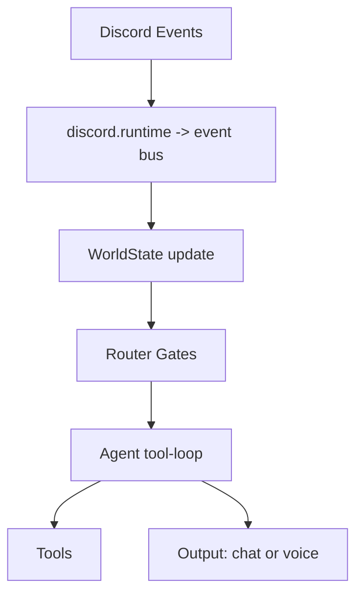

Yep — the clean way is **2 repos**:

1. **`octave-commons/promethean-agent-system`** = the reusable library (tools, agents, router, benchmarks, etc.)
2. **`octave-commons/promethean-duck`** = the Discord app that *depends on* the library and defines Duck via DSL

I can see you already have `octave-commons/promethean` public. ([GitHub][1])
I *don’t* see `octave-commons/promethean-agent-system` in public search right now, so assume it’s not created yet (or private). ([GitHub][1])

---

## 1) Repo dependency: git deps (fastest) + later Clojars (optional)

### In `promethean-duck/deps.edn`

Pin the agent-system by SHA (or tag) so Duck doesn’t break on library changes:

```clojure
{:deps
 {octave-commons/promethean-agent-system
  {:git/url "https://github.com/octave-commons/promethean-agent-system.git"
   :sha "PUT_SHA_HERE"}

  ;; Discord JVM stack
  net.dv8tion/JDA {:mvn/version "6.1.3"} ;; current stable line is 6.1.x :contentReference[oaicite:2]{index=2}

  org.clojure/core.async {:mvn/version "1.6.681"}}}
```

JDA 6.1.3 is listed as a recent release (Dec 2025) on mvnrepository. ([Maven Repository][2])
JDA supports receiving audio via `AudioReceiveHandler` (useful for a voice pipeline later). ([docs.jda.wiki][3])

---

## 2) Creating the repos (what you’d run)

### Create + push `promethean-agent-system`

Assuming you unzip the scaffold into a folder:

```bash
# in your local folder containing the agent-system code
git init
git add -A
git commit -m "Initial agent-system scaffold"

gh repo create octave-commons/promethean-agent-system --public --source . --remote origin --push
git tag v0.1.0
git push --tags
```

### Create `promethean-duck`

```bash
mkdir promethean-duck && cd promethean-duck
clojure -Ttools install-latest :lib io.github.seancorfield/clj-new :as clj-new
clojure -Tclj-new app :name octave-commons/promethean-duck
cd promethean-duck
gh repo create octave-commons/promethean-duck --public --source . --remote origin --push
```

(If you prefer `duck` as the repo name, swap it.)

---

## 3) Make clj-kondo “just work” for Duck (no local macro config)

Right now we stuck macro linting in the consumer `.clj-kondo/config.edn`. The better pattern is:

### In `promethean-agent-system`

Add:

`resources/clj-kondo.exports/octave-commons/promethean-agent-system/config.edn`

```clojure
{:lint-as
 {promethean.tool/def-tool clojure.core/def
  promethean.agent.dsl/def-agent clojure.core/def
  promethean.agent.dsl/def-agent-proto clojure.core/def
  promethean.discord.dsl/def-discord-bot clojure.core/def
  promethean.discord.dsl/def-command clojure.core/def}}
```

Then in the Duck repo, just:

`.clj-kondo/config.edn`

```clojure
{:config-paths ["octave-commons/promethean-agent-system"]}
```

That’s the “library exports kondo config” flow.

---

## 4) The Discord DSL module you want (lives in agent-system)

Add a new namespace set like:

* `promethean.discord.dsl` (macros)
* `promethean.discord.runtime` (JDA wiring + event -> bus)
* `promethean.discord.tools` (stock tools: send message, join voice, speak, etc.)

### DSL goals

* Define a bot + handlers declaratively
* Handlers can call tools / spawn agent loops
* Voice/text are just “sources” feeding the same agent runtime

### Example DSL surface (what Duck repo would write)

```clojure
(ns duck.bot
  (:require
    [promethean.discord.dsl :refer [def-discord-bot def-command]]
    [promethean.tool :refer [def-tool]]
    [promethean.proto :as proto]
    [promethean.ollama.tools :as base-tools]))

;; Duck-specific “fun” tools
(def-tool quack
  {:proto proto/tool-base
   :description "Duck says QUACK in chat"
   :inputSchema {:type "object" :properties {:n {:type "integer"}} :required []}}
  (fn [{:keys [discord]} args]
    ;; discord ctx will provide a send primitive
    ((:discord/send! discord) {:text (apply str (repeat (long (or (get args "n") 1)) "QUACK "))})))

(def-discord-bot duck
  {:token (System/getenv "DISCORD_TOKEN")
   :intents [:guilds :guild-messages :message-content :guild-voice-states]
   :tools  [base-tools/overlay_text base-tools/play_sfx quack]
   :agent  {:agent/id "duck"
            :agent/model "PetrosStav/gemma3-tools:4b" ; or whatever ollama name you use
            :agent/prompt "You are Duck. Be funny. Be brief. Use tools when it improves the bit."}}

  (def-command ping
    {:type :slash
     :name "ping"}
    (fn [ctx _] ((:discord/reply! (:discord ctx)) {:text "quack"})))

  (def-command heckle
    {:type :message
     :match #"(?i)\bduck\b"}
    (fn [ctx {:keys [content]}]
      ;; route message content into your tool-loop, allow a couple tool calls,
      ;; then speak in chat or voice depending on mode
      (promethean.discord.runtime/respond! ctx {:text content}))))
```

That gives you the *“Duck is defined in the Duck repo using DSL”* property, while the implementation stays inside the reusable agent-system.

---

## 5) How the Discord runtime plugs into the agent runtime (shape)

Keep it boring and reliable:



* Discord events become **inputs** into the same loop you already scaffolded
* You can start with **text only** and still be “live” immediately
* Voice becomes another module (or another event source) when ready

---

## 6) Discord library choice (why JDA)

* `discljord` is great for Discord API, async-first — but it explicitly says **no voice (for now)**. ([GitHub][4])
* JDA is actively maintained and supports voice APIs (including receive handlers). ([Maven Repository][2])

So: **JDA for voice**, and you wrap it in your own DSL so you never “feel” the interop.

---

## 7) What I’d implement first in `promethean.discord.runtime` (small but shippable)

**Tonight-friendly milestone order:**

1. connect + log in + respond to `/ping`
2. message handler (`@Duck`, keyword match)
3. tool runner in Discord context (`discord/send!`, `discord/reply!`)
4. a tiny set of fun tools (`play_sfx`, `quack`, `overlay_text` mapped to chat)
5. optional: join voice + play *pre-recorded* clips (no STT yet)

Then you can layer STT/TTS as tools (local services) without rewriting the bot core.

---

If you want the next step to be *maximally concrete*: tell me what repo name you want for Duck (`promethean-duck` vs `duck`), and I’ll lay out the exact namespace/file tree and the minimal `def-discord-bot` macro contract so you can start coding immediately.

[1]: https://github.com/octave-commons/promethean/blob/main/AGENTS.md?utm_source=chatgpt.com "AGENTS.md - octave-commons/promethean"
[2]: https://mvnrepository.com/artifact/net.dv8tion/JDA?utm_source=chatgpt.com "JDA - net.dv8tion"
[3]: https://docs.jda.wiki/net/dv8tion/jda/api/audio/AudioReceiveHandler.html?utm_source=chatgpt.com "AudioReceiveHandler (JDA 6.2.1_39e87d5 API)"
[4]: https://github.com/discljord/discljord?utm_source=chatgpt.com "discljord/discljord: A Clojure wrapper library for the Discord ..."
