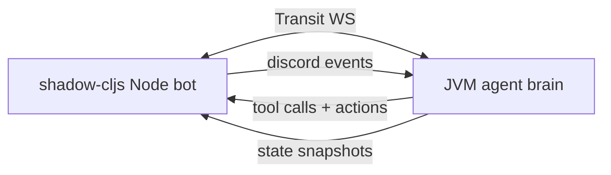

Yep — if the Discord process is **ClojureScript on Node (shadow-cljs :node-script)**, the smoothest path to JVM Clojure is:

* **shared `*.cljc` protocol + validation**
* **WebSocket (or TCP) boundary**
* **Transit encoding** (keeps keywords/maps pleasant)

That gives you a clean “brain/IO split” where JVM owns agent policy + planning, and the CLJS Node bot owns Discord IO + realtime side-effects.



## Why WS + Transit is the smoothest for CLJS↔CLJ

* Works for **streaming** events (chat, voice chunks later, partial transcripts).
* Lets you do **RPC + pub/sub** over the same pipe.
* With Transit you keep Clojure-y data without fighting JSON stringification.

---

## Shadow-cljs setup for a Discord bot (CLJS on Node)

### `shadow-cljs.edn`

This uses `:npm-deps` so you don’t even need a hand-written `package.json` at first. shadow will install npm deps automatically. ([ClojureVerse][1])

```clojure
{:source-paths ["src"]
 :dependencies [[thheller/shadow-cljs "2.28.12"]
                [org.clojure/clojurescript "1.11.132"]
                [com.cognitect/transit-cljs "0.8.280"]
                [org.clojure/core.async "1.6.681"]]

 :builds
 {:duck
  {:target :node-script
   :output-to "dist/duck.js"
   :main duck.main/main
   :js-options {:js-provider :shadow}
   :compiler-options {:infer-externs :auto}
   :npm-deps {"discord.js" "14.25.1"
              "@discordjs/voice" "0.18.0"
              "ws" "8.16.0"}}}}
```

Notes:

* `discord.js` latest shown as **14.25.1** on npm/docs. ([npm][2])
* discord.js docs currently indicate **Node 22.12+** requirement. ([discord.js][3])
* Voice support is via `@discordjs/voice`. ([Discord.js Guide][4])

### Minimal CLJS entrypoint `duck.main`

```clojure
(ns duck.main
  (:require
    ["discord.js" :as djs]
    [duck.ws :as ws]
    [cljs.core.async :as a :refer [go <! >! chan put!]]))

(defn main []
  (let [token (or (.. js/process -env -DISCORD_TOKEN)
                  (throw (js/Error. "Missing DISCORD_TOKEN")))
        ;; WS client to JVM brain
        brain (ws/connect! {:url (or (.. js/process -env -BRAIN_WS_URL)
                                     "ws://127.0.0.1:8787/ws")})
        client (new (.-Client djs)
                    (clj->js {:intents [(.. djs -GatewayIntentBits -Guilds)
                                        (.. djs -GatewayIntentBits -GuildMessages)
                                        (.. djs -GatewayIntentBits -MessageContent)
                                        (.. djs -GatewayIntentBits -GuildVoiceStates)]}))]

    (.on client (.. djs -Events -ClientReady)
         (fn []
           (js/console.log "Duck online")
           (ws/send! brain {:op :duck/ready
                            :payload {:user (.. client -user -tag)}})))

    (.on client (.. djs -Events -MessageCreate)
         (fn [msg]
           (when (and (not (.-bot (.-author msg)))
                      (re-find #"(?i)\bduck\b" (.-content msg)))
             (ws/send! brain {:op :discord/message
                              :payload {:channel-id (.-id (.-channel msg))
                                        :author (.-id (.-author msg))
                                        :content (.-content msg)}}))))

    ;; actions from brain -> discord side effects
    (ws/on-message! brain
      (fn [{:keys [op payload]}]
        (case op
          :tool/chat-send
          (let [{:keys [channel-id text]} payload]
            (-> (.fetch (.-channels client) channel-id)
                (.then (fn [ch] (.send ch text)))))
          (js/console.log "Unhandled op" op payload))))

    (.login client token)))
```

---

## The CLJ↔CLJS protocol: put it in `.cljc`

This is where you keep everything stable and “agent-system reusable”.

### `promethean/protocol.cljc`

Use `clojure.spec.alpha` (works in CLJ + CLJS) to validate envelopes on both ends.

```clojure
(ns promethean.protocol
  (:require [clojure.spec.alpha :as s]))

(s/def ::id string?)
(s/def ::op keyword?)
(s/def ::reply-to (s/nilable ::id))
(s/def ::payload map?)
(s/def ::msg (s/keys :req-un [::id ::op ::payload]
                     :opt-un [::reply-to]))
```

Envelope shape:

```clojure
{:id "uuid"
 :op :discord/message
 :payload {...}
 :reply-to nil}
```

---

## WebSocket transport with Transit (CLJS client)

### `duck/ws.cljs`

```clojure
(ns duck.ws
  (:require ["ws" :default WebSocket]
            [cognitect.transit :as transit]
            [cljs.core.async :as a :refer [chan put!]]))

(defn- writer [] (transit/writer :json))
(defn- reader [] (transit/reader :json))

(defn connect! [{:keys [url]}]
  (let [ws (new WebSocket url)
        in (chan 256)
        out (chan 256)
        w (writer)
        r (reader)]
    (set! (.-onopen ws)
          (fn [] (js/console.log "WS connected" url)))
    (set! (.-onmessage ws)
          (fn [ev]
            (let [m (transit/read r (.-data ev))]
              (put! in m))))
    (a/go-loop []
      (when-let [m (<! out)]
        (.send ws (transit/write w m))
        (recur)))
    {:ws ws :in in :out out}))

(defn send! [c m]
  (put! (:out c)
        (assoc m :id (str (random-uuid)))))

(defn on-message! [c f]
  (a/go-loop []
    (when-let [m (<! (:in c))]
      (f m)
      (recur))))
```

This is the bit that makes CLJS↔CLJ feel “native”.

---

## JVM side: minimal WS server (brain)

Pick whatever server you like (http-kit / aleph / undertow). The important part is: **Transit in/out**, and pump messages into your agent system.

Also, note: `@discordjs/voice` can receive audio via a `VoiceReceiver`, but audio receive isn’t guaranteed stable (Discord doesn’t document it). ([discord.js][5])

---

## Where the DSL fits

Because you’re in CLJS:

* write macros in **Clojure** (`.clj`), used by CLJS via `:require-macros` / `:refer-macros`
* runtime is CLJS (`.cljs`)

So your reusable agent-system can ship:

* `promethean.discord.dsl` (macros like `def-discord-bot`, `def-command`)
* `promethean.discord.runtime` (CLJS Node runtime that wraps discord.js + ws client)
* `promethean.protocol` (cljc)

Then Duck repo is almost entirely declarative.

---

## If the goal is “Duck live tonight”

Start **text-only**:

1. Discord message events → brain WS
2. Brain returns `:tool/chat-send` actions
3. CLJS bot executes them

Then add voice tomorrow (join channel + TTS playback + optional receive).

If you want, I’ll draft the *exact* DSL surface for `def-discord-bot` + `def-command` so your Duck repo is basically a config file with a few handler bodies.

[1]: https://clojureverse.org/t/js-dependencies-in-practice/691?utm_source=chatgpt.com "JS Dependencies: In Practice - shadow-cljs"
[2]: https://www.npmjs.com/package/discord.js?source=post_page-----7b5fe27cb6fa----------------------&utm_source=chatgpt.com "discord.js"
[3]: https://discord.js.org/docs?utm_source=chatgpt.com "discord.js (14.25.1)"
[4]: https://discordjs.guide/voice?utm_source=chatgpt.com "Installation | discord.js"
[5]: https://discord.js.org/docs/packages/voice/main/VoiceReceiver%3AClass?utm_source=chatgpt.com "VoiceReceiver (voice - main)"
