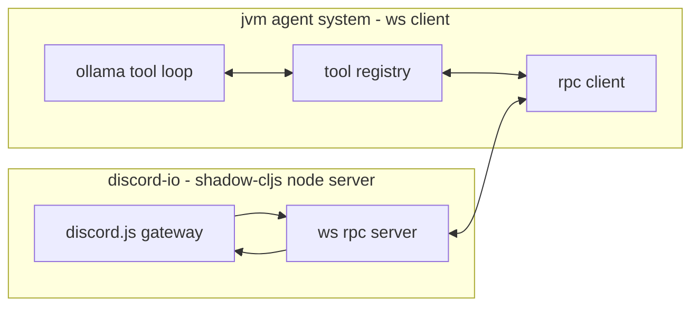

Yep — flipping it so **Discord (CLJS/Node) is the WS server** and the **JVM agent system is the WS client** is *perfect* for “Discord is a tool” and keeps your Ollama/tool-loop front and center.



## What you’re actually building

### 1) `discord-io` exposes *remote tools* over WS RPC

The server owns:

* Discord connection
* permissions + intents
* rate-limits
* normalization of Discord messages
* optional caching / indexing for search

### 2) `promethean-agent-system` treats Discord as normal `def-tool` tools

On JVM, each Discord tool is a `def-tool` whose **implementation** is: `rpc/call -> await -> return`.

That means your existing Ollama “tools + tool_choice + tool loop” machinery stays the centerpiece.

---

## Tool surface (channel + DM + search + attachments)

### Core tools (MVP)

1. **Send**

* `discord.send`

  * args: `{:channel-id string :text string :reply-to-message-id? string}`
  * returns: `{:message-id string :ts string}`

2. **Fetch channel history**

* `discord.channel.messages`

  * args: `{:channel-id string :limit int :before? msg-id :after? msg-id :around? msg-id :cache? boolean}`
  * notes:

    * discord.js supports `limit/cache/before/after/around`, and `before/after/around` are mutually exclusive. ([discord.js][1])

3. **Fetch DM history**

* `discord.dm.messages`

  * args: `{:user-id string :limit int :before? msg-id}`
  * server: open/create DM channel, then fetch like a normal channel

4. **“Search” (windowed)**

* `discord.search.window`

  * args: `{:scope :channel|:dm :channel-id? :user-id? :query string :limit int :before? msg-id}`
  * implementation:

    * Discord’s actual search API for bots is *not* generally available; it’s been “planned” for a long time but low priority. ([GitHub][2])
    * so you fetch pages (up to 100 at a time) and filter client-side, paging via `before`. (Discord fetch itself caps batch sizes; plan on pagination.) ([discord.js][3])

### Attachment helpers

5. **Fetch attachment bytes (optional)**

* `discord.attachment.base64`

  * args: `{:url string}`
  * returns: `{:content-type string :base64 string}`
  * useful when Discord CDN links aren’t accessible to your Ollama host, or you want to keep everything local.

---

## Normalized message shape (returned by tools and pushed as events)

The server should normalize discord.js `Message` objects into a stable data contract:

```clojure
{:message-id "..."
 :channel-id "..."
 :guild-id "..."         ; nil for DM
 :author {:id "..." :name "..."}
 :content "..."
 :ts "2026-01-26T21:04:11.123Z"
 :attachments [{:url "..."
                :filename "..."
                :content-type "image/png"
                :width 512 :height 512}]}
```

* discord.js exposes message `attachments` as a collection. ([discord.js][4])
* `content_type` exists on the attachment object (API types). ([discord-api-types documentation][5])

**Important intent note:** discord.js docs call out that some message fields (including attachments/embeds/content) may require privileged intents in guild contexts depending on how you’re receiving/refetching messages. ([discord.js][4])
So for reliability: enable the intents you actually need for your bot’s behavior.

---

## “If it encounters an image attachment, add it to context”

On the JVM side, when building the next LLM input, do:

* for each normalized message:

  * add a text part with author + content
  * if any attachment has `content-type` starting with `image/`:

    * add an image content part

Ollama’s OpenAI-compatible `v1/chat/completions` supports:

* `tools`
* `tool_choice`
* image content parts, including **image URLs** or **base64** ([Ollama Documentation][6])

So you can do either:

* **URL path**: use the attachment URL as an image URL
* **base64 path**: call `discord.attachment.base64` first, then embed it

---

## RPC protocol (server = discord-io, client = JVM)

### Calls

```clojure
{:id "uuid"
 :op :rpc/call
 :payload {:method :discord/channel.messages
           :args {...}}}
```

### Returns

```clojure
{:id "uuid2"
 :op :rpc/ret
 :reply-to "uuid"
 :payload {:ok true
           :value {...}}}
```

### Events (push from server)

```clojure
{:id "uuid"
 :op :event/discord.message
 :payload <normalized-message>}
```

---

## Mapping into your `def-tool` DSL on the JVM

You want a macro that feels like a normal tool, but routes remotely:

```clojure
(defmacro def-remote-tool [sym {:keys [description args-spec method]}]
  `(def-tool ~sym
     {:description ~description
      :args-spec ~args-spec
      :rpc/method ~method}
     (fn [{:keys [rpc]} args]
       (rpc/call! rpc ~method args))))
```

Then your Discord suite is just declarations:

```clojure
(def-remote-tool discord.channel.messages
  {:description "Fetch messages from a channel"
   :args-spec ::discord/channel-messages
   :method :discord/channel.messages})

(def-remote-tool discord.send
  {:description "Send a message"
   :args-spec ::discord/send
   :method :discord/send})
```

Where `::discord/channel-messages` etc are `clojure.spec.alpha` specs in a shared `.cljc` namespace (so you can validate args and also generate schema-ish docs).

---

## What the discord-io server actually does (discord.js side)

* Implement `channel.messages.fetch(options)`:

  * supports `{limit, cache, before, after, around}` with the mutual-exclusion constraint. ([discord.js][1])
* Normalize messages including attachments (and content-type if available). ([discord.js][4])
* Maintain an **LRU cache** per channel of the last N normalized messages:

  * speeds up `discord.search.window` (filter the cache first, then paginate if needed)
* Push `:event/discord.message` for new messages as they come in.

---

## Minimal “tonight” milestone (still Ollama-first)

1. `discord-io` WS server + discord.js login
2. RPC methods:

   * `:discord/send`
   * `:discord/channel.messages`
3. Push `:event/discord.message`
4. JVM client:

   * on event → build context → call Ollama with tools list → if it chooses `discord.send`, execute it

That’s already *Duck live* + *tool-using* + *history-aware*.

If you want, next message I can write the exact **tool specs** (`s/keys` etc), and the **method table** for the WS server (method keyword → handler fn), plus the normalization code for messages/attachments.

[1]: https://discord.js.org/docs/packages/discord.js/main/FetchMessagesOptions%3AInterface "FetchMessagesOptions (discord.js - main) | discord.js"
[2]: https://github.com/discord/discord-api-docs/discussions/3216?utm_source=chatgpt.com "Search Bar Functionality · discord discord-api-docs"
[3]: https://discord.js.org/docs/packages/discord.js/main/MessageManager%3Aclass?utm_source=chatgpt.com "MessageManager (discord.js - main)"
[4]: https://discord.js.org/docs/packages/discord.js/main/Message%3AClass "Message (discord.js - main) | discord.js"
[5]: https://discord-api-types.dev/api/discord-api-types-v10/interface/APIAttachment?utm_source=chatgpt.com "APIAttachment | API | discord-api-types documentation"
[6]: https://docs.ollama.com/api/openai-compatibility "OpenAI compatibility - Ollama"
