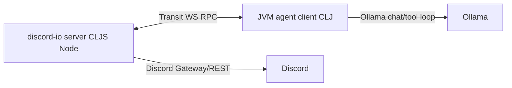

Yeah — **this is the right way to “use the ollama/tool loop”**:

* The **JVM agent** runs the Ollama-driven reasoning + tool-loop.
* Discord becomes an **external tool server** (in CLJS/Node) that the agent calls for:

  * send message
  * fetch history (channel + DM)
  * search (best-effort)
  * fetch attachments (and optionally inline images into context)

And flipping it so **Discord is the WS server** and **JVM is the client** is totally fine (often nicer operationally, since the IO edge is “always-on” and the brain can reconnect).

## Architecture



* Discord-IO **publishes events** (new messages) → JVM ingests.
* JVM **calls Discord tools** (fetch, search, send) → Discord-IO executes side-effects.

## Why this fits Ollama + tool-calling

Your tool-calling loop stays exactly as-is: it just sees “tools”. The Discord tools are **remote tools** whose implementation is “RPC to the discord-io server”.

## RPC envelope (shared `.cljc`)

Keep one envelope for both directions:

```clojure
{:id "uuid"
 :op :rpc/call | :rpc/ret | :event/discord
 :payload {...}
 :reply-to "uuid-or-nil"}
```

Use Transit on the wire so keywords/maps feel native.

## Discord tools you asked for

### Channel-level retrieval

* `discord.channel.messages`

  * args: `{channel-id limit before after around}`
  * mirrors discord.js fetch options where `before/after/around` are mutually exclusive. ([discord.js][1])

* `discord.channel.scroll`

  * sugar over `messages` with `before=<oldest-seen-id>`

### DM-level retrieval

* `discord.dm.messages`

  * args: `{user-id limit before}`
  * server will open/create DM channel then fetch.

### Search

Discord “true search” for bots is **not generally available/stable**; there’s been discussion of a *preview* endpoint. ([GitHub][2])
So implement `discord.search` as:

1. **If preview search is available** → use it
2. else → **fetch window(s)** + filter client-side (fast enough for “recent context”)

Tool:

* `discord.search`

  * args: `{scope :channel|:dm channel-id? user-id? query limit before after}`
  * returns `{messages [...]}`

### Sending

* `discord.send`

  * args: `{channel-id text reply-to?}`

### Attachments + images into context

Return normalized messages like:

```clojure
{:id "..."
 :author {:id "..." :name "..."}
 :content "..."
 :ts "..."
 :attachments [{:url "https://cdn.discordapp.com/..."
                :content-type "image/png"
                :filename "x.png"}]}
```

Then your JVM “context builder” rule:

* If `attachment.content-type` starts with `image/`:

  * add as **vision content part** to the LLM message
  * prefer URL-first (no download) if your model/runtime supports it

Ollama’s OpenAI-compatible API supports **image content** including **base64** and **image URLs**. ([Ollama Documentation][3])
And Ollama’s native chat API supports sending images as base64 arrays. ([GitHub][4])

So you can do either:

* **URL path** (cleanest) → pass Discord CDN URL as `image_url`
* **base64 path** → add a `discord.attachment.base64` tool if you need private/non-public media

## “Discord is a tool” in your DSL

Add a helper macro in the agent-system (JVM side) that defines **remote tools**:

```clojure
(def-remote-tool discord.channel.messages
  {:description "Fetch recent messages from a channel"
   :args-spec ::discord/channel-messages} ; spec.alpha
  :rpc/method :discord/channel.messages)
```

Under the hood it expands to `def-tool` with an implementation that does `rpc/call!` over the WS client and blocks/awaits (core.async) for a reply.

### clj-kondo support

Export lint rules for the new macro from the library (so every consumer repo “just works”):

`resources/clj-kondo.exports/octave-commons/promethean-agent-system/config.edn`

```clojure
{:lint-as
 {promethean.remote/def-remote-tool clojure.core/def}}
```

## Discord-IO server (CLJS/Node) responsibilities

* connect to Discord via discord.js
* maintain a **message cache** per channel (recent N) to make “search in window” cheap
* implement RPC methods:

  * `:discord/channel.messages`
  * `:discord/dm.messages`
  * `:discord/search`
  * `:discord/send`
  * optionally `:discord/attachment.base64`
* publish events:

  * `{:op :event/discord.message :payload {...}}`

And yes: shadow-cljs with `:npm-deps` is a normal way to wire discord.js in CLJS. ([Shadow CLJS][5])

## JVM client specifics

Use a WS client library (e.g. http-kit supports WS in its unified async/channel API). ([GitHub][6])
Then:

* `rpc/call!` sends `{:op :rpc/call ...}`
* waits for matching `:reply-to`
* returns payload or error

## Tonight-ready cut

To get “Duck text live” *fast* while keeping this architecture:

1. Implement only:

   * `discord.send`
   * `discord.channel.messages` (limit 20)
   * event push for `messageCreate`
2. In JVM agent:

   * on `event/discord.message`, build a tiny context
   * call Ollama
   * output `discord.send`

Then add `search`, DM tools, and image ingestion next.

If you want, I can write the **exact RPC method table** (names + args + return shapes) and the **normalization function** that turns discord.js message objects into the stable format your agent system uses (including attachments → vision content parts).

[1]: https://discord.js.org/docs/packages/discord.js/main/FetchMessagesOptions%3AInterface?utm_source=chatgpt.com "FetchMessagesOptions (discord.js - main)"
[2]: https://github.com/discord/discord-api-docs/discussions/3216?utm_source=chatgpt.com "Search Bar Functionality · discord discord-api-docs"
[3]: https://docs.ollama.com/api/openai-compatibility?utm_source=chatgpt.com "OpenAI compatibility"
[4]: https://github.com/ollama/ollama/blob/main/docs/api.md?utm_source=chatgpt.com "ollama/docs/api.md at main"
[5]: https://shadow-cljs.github.io/docs/UsersGuide.html?utm_source=chatgpt.com "Shadow CLJS User's Guide"
[6]: https://github.com/http-kit/http-kit?utm_source=chatgpt.com "http-kit/http-kit: Simple, high-performance event-driven ..."
