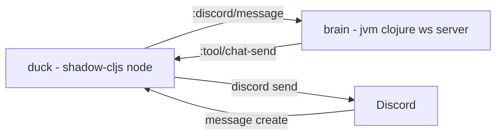

Cool — **text-only Duck tonight** becomes very doable if we treat Discord (CLJS/Node) as an IO adapter that talks to the JVM “brain” over **Transit WebSockets**.

## Architecture



* **Duck (CLJS/Node)**: discord.js client, filters messages, sends events to brain, executes “actions” coming back.
* **Brain (CLJ/JVM)**: agent runtime + tools + policies; outputs actions like `:tool/chat-send`.

---

## Protocol (shared `.cljc`)

Put this in **`promethean-agent-system/src/promethean/protocol.cljc`** so both sides share it.

```clojure
(ns promethean.protocol
  (:require [clojure.spec.alpha :as s]))

;; envelope
(s/def ::id string?)
(s/def ::op keyword?)
(s/def ::reply-to (s/nilable ::id))
(s/def ::payload map?)
(s/def ::msg (s/keys :req-un [::id ::op ::payload]
                     :opt-un [::reply-to]))

;; common ops (extend as you grow)
(s/def ::channel-id string?)
(s/def ::content string?)
(s/def ::discord-message
  (s/keys :req-un [::channel-id ::content]))

(s/def ::text string?)
(s/def ::chat-send
  (s/keys :req-un [::channel-id ::text]))
```

### Message shapes

* Duck → Brain

```clojure
{:id "uuid"
 :op :discord/message
 :payload {:channel-id "123" :content "duck help"}}
```

* Brain → Duck

```clojure
{:id "uuid"
 :op :tool/chat-send
 :payload {:channel-id "123" :text "QUACK."}
 :reply-to "uuid-from-request"}
```

---

## Transit WS helpers (CLJ + CLJS)

### `promethean.transport.transit` (CLJC)

`promethean-agent-system/src/promethean/transport/transit.cljc`

```clojure
(ns promethean.transport.transit
  (:require [cognitect.transit :as transit])
  #?(:clj  (:import [java.io ByteArrayInputStream ByteArrayOutputStream])))

(defn write-str [x]
  #?(:cljs (transit/write (transit/writer :json) x)
     :clj  (let [out (ByteArrayOutputStream.)
                 w   (transit/writer out :json)]
             (transit/write w x)
             (.toString out "UTF-8"))))

(defn read-str [s]
  #?(:cljs (transit/read (transit/reader :json) s)
     :clj  (let [in (ByteArrayInputStream. (.getBytes ^String s "UTF-8"))
                 r  (transit/reader in :json)]
             (transit/read r))))
```

---

## Discord DSL (macros) in agent-system

### `promethean.discord.dsl` (Clojure macros)

`promethean-agent-system/src/promethean/discord/dsl.clj`

```clojure
(ns promethean.discord.dsl)

(defmacro def-command
  [id {:keys [type name match] :as opts} handler-fn]
  `(merge
     {:cmd/id ~(name id)
      :cmd/type ~type
      :cmd/name ~name
      :cmd/match ~match
      :cmd/handler ~handler-fn}
     ~opts))

(defmacro def-discord-bot
  [id {:keys [token intents brain-ws-url] :as opts} & commands]
  `(def ~id
     (merge
       {:bot/id ~(name id)
        :bot/token ~token
        :bot/intents ~intents
        :bot/brain-ws-url ~brain-ws-url
        :bot/commands ~(vec commands)}
       (dissoc ~opts :token :intents :brain-ws-url))))
```

This keeps the Duck repo “mostly declarative”.

---

## Duck (CLJS/Node) runtime

### 1) WS client (CLJS)

`promethean-agent-system/src/promethean/discord/ws.cljs`

```clojure
(ns promethean.discord.ws
  (:require ["ws" :default WebSocket]
            [cljs.core.async :as a :refer [chan put! <! go-loop]]
            [promethean.transport.transit :as tr]))

(defn connect! [{:keys [url]}]
  (let [ws  (new WebSocket url)
        in  (chan 256)
        out (chan 256)]
    (set! (.-onopen ws) (fn [] (js/console.log "[duck] ws open" url)))
    (set! (.-onmessage ws)
          (fn [ev]
            (put! in (tr/read-str (.-data ev)))))
    (go-loop []
      (when-let [m (<! out)]
        (.send ws (tr/write-str m))
        (recur)))
    {:ws ws :in in :out out}))

(defn send! [c m]
  (put! (:out c) (assoc m :id (str (random-uuid)))))

(defn on-message! [c f]
  (go-loop []
    (when-let [m (<! (:in c))]
      (f m)
      (recur))))
```

### 2) Discord runner (CLJS)

`promethean-agent-system/src/promethean/discord/runtime.cljs`

```clojure
(ns promethean.discord.runtime
  (:require ["discord.js" :as djs]
            [cljs.core.async :as a]
            [promethean.discord.ws :as ws]))

(defn- intents->js [intents]
  (mapv (fn [k]
          (case k
            :guilds (.. djs -GatewayIntentBits -Guilds)
            :guild-messages (.. djs -GatewayIntentBits -GuildMessages)
            :message-content (.. djs -GatewayIntentBits -MessageContent)
            (throw (js/Error. (str "Unknown intent " k)))))
        intents))

(defn start! [{:keys [bot/token bot/intents bot/brain-ws-url bot/commands] :as bot}]
  (let [token (or token (.. js/process -env -DISCORD_TOKEN))
        brain-url (or brain-ws-url (.. js/process -env -BRAIN_WS_URL) "ws://127.0.0.1:8787/ws")
        brain (ws/connect! {:url brain-url})
        client (new (.-Client djs) (clj->js {:intents (intents->js intents)}))]

    ;; brain -> discord actions
    (ws/on-message! brain
      (fn [{:keys [op payload]}]
        (case op
          :tool/chat-send
          (let [{:keys [channel-id text]} payload]
            (-> (.fetch (.-channels client) channel-id)
                (.then (fn [ch] (.send ch text)))))
          (js/console.log "[duck] unhandled op" op payload))))

    ;; discord -> brain events
    (.on client (.. djs -Events -ClientReady)
         (fn [] (js/console.log "[duck] ready")))

    (.on client (.. djs -Events -MessageCreate)
         (fn [msg]
           (when-not (.-bot (.-author msg))
             (let [content (.-content msg)
                   channel-id (.-id (.-channel msg))]
               ;; run local command filters (cheap) then forward to brain
               (doseq [c commands]
                 (when (and (= (:cmd/type c) :message)
                            (or (nil? (:cmd/match c))
                                (re-find (:cmd/match c) content)))
                   ((:cmd/handler c)
                    {:discord {:msg msg :client client :brain brain}}
                    {:channel-id channel-id :content content})))
               (ws/send! brain {:op :discord/message
                                :payload {:channel-id channel-id
                                          :content content}})))))

    (.login client token)
    {:client client :brain brain}))
```

---

## Duck repo: almost pure DSL

In **`promethean-duck/src/duck/bot.cljs`**:

```clojure
(ns duck.bot
  (:require [promethean.discord.runtime :as discord])
  (:require-macros [promethean.discord.dsl :refer [def-discord-bot def-command]]))

(def-discord-bot duck
  {:token nil
   :intents [:guilds :guild-messages :message-content]
   :brain-ws-url nil}

  (def-command ping
    {:type :message
     :match #"(?i)^\s*/ping\s*$"}
    (fn [{:keys [discord]} {:keys [channel-id]}]
      ;; local quick reply (no brain)
      (-> (.fetch (.. discord -client -channels) channel-id)
          (.then (fn [ch] (.send ch "quack"))))))

  (def-command summon
    {:type :message
     :match #"(?i)\bduck\b"}
    (fn [_ctx _evt]
      ;; do nothing locally; brain will handle :discord/message
      nil)))

(defn main [] (discord/start! duck))
```

In **`promethean-duck/src/duck/main.cljs`**:

```clojure
(ns duck.main
  (:require [duck.bot :as bot]))

(defn main [] (bot/main))
```

---

## Brain stub (JVM Clojure) for tonight

This is the smallest thing that proves the pipe works.

`promethean-agent-system/src/promethean/brain/server.clj` (or in a separate JVM service repo)

```clojure
(ns promethean.brain.server
  (:require
    [org.httpkit.server :as http]
    [promethean.transport.transit :as tr]
    [clojure.spec.alpha :as s]
    [promethean.protocol :as p]))

(defn- reply [ws {:keys [id op payload]}]
  ;; super dumb “brain”: if content contains duck, respond
  (when (= op :discord/message)
    (let [{:keys [channel-id content]} payload
          text (if (re-find #"(?i)\bduck\b" content)
                 "QUACK. (brain online)"
                 nil)]
      (when text
        (.send ws (tr/write-str {:id (str (java.util.UUID/randomUUID))
                                :op :tool/chat-send
                                :payload {:channel-id channel-id :text text}
                                :reply-to id}))))))

(defn ws-handler [req]
  (http/with-channel req ws
    (http/on-receive ws
      (fn [raw]
        (let [m (tr/read-str raw)]
          (when (s/valid? ::p/msg m)
            (reply ws m)))))))

(defn start! [{:keys [port] :or {port 8787}}]
  (http/run-server
    (fn [req]
      (case (:uri req)
        "/ws" (ws-handler req)
        {:status 404 :body "not found"}))
    {:port port}))
```

Run brain:

```bash
clojure -M -e "(require 'promethean.brain.server) ((resolve 'promethean.brain.server/start!) {:port 8787})"
```

Run Duck:

```bash
DISCORD_TOKEN=... BRAIN_WS_URL=ws://127.0.0.1:8787/ws npx shadow-cljs run duck.main/main
```

---

## What you’ll get tonight

* Duck joins Discord (text), listens for messages
* For any message containing “duck”, JVM brain replies `QUACK...`
* You now have the “spine” that supports:

  * tool-calling loops
  * benchmarks
  * routing/gating
  * multi-agent later

If you want, next step I’d write is a **tool-execution loop** where the brain can return either:

* direct `:tool/chat-send`
* or `{ :op :tool/call :payload {:name "overlay_text" ...}}` and Duck executes it (in text mode: just translate to chat)

#duck #promethean
