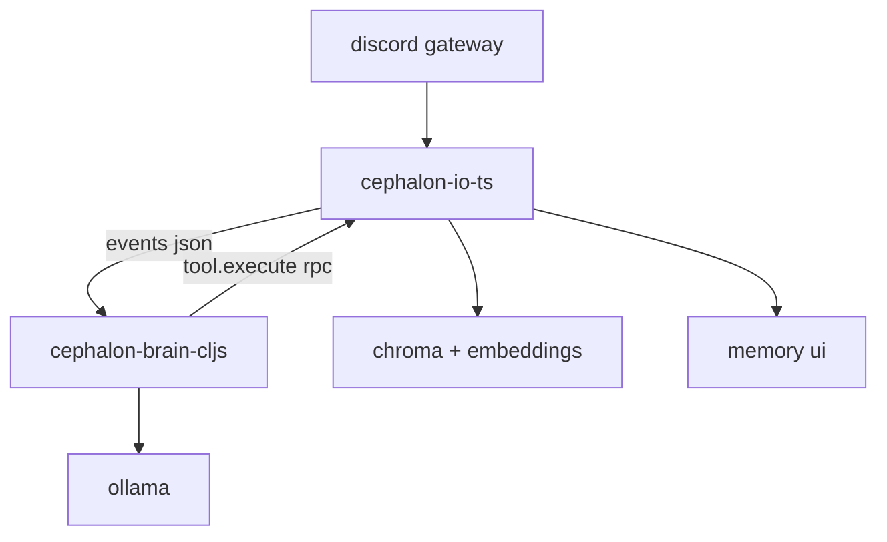

([Past chat][1])([Past chat][2])([Past chat][3])([Past chat][4])([Past chat][4])([Past chat][5])([Past chat][6])([Past chat][7])([Past chat][2])([Past chat][8])([Past chat][3])([Past chat][4])([Past chat][3])([Past chat][4])([Past chat][3])([Past chat][9])([Past chat][10])([Past chat][11])([Past chat][12])([Past chat][13])

## What I found in your zips

### `cephalon_cljs.zip`

It’s a **real skeleton**, not the full MVP:

* `promethean.main` boots a tiny ECS loop (`world.cljs`, `tick.cljs`)
* `context/assembler.cljs` only builds headers (no budgeting / retrieval / dedupe yet)
* No effects runner yet; no session scheduler; no tool loop

So: **the CLJS repo is the chassis**.

### `cephalon_notes.zip`

This is where the *actual* plan lives. The big “source of truth” docs are:

* `docs/notes/cephalon/shadow-cljs-game-loop.md`
  => the “Cephalon as a game loop” architecture: world atom, tick cadence, effects runner, event ingestion, deterministic scheduling
* `docs/notes/cephalon/cephalon-mvp-spec.md`
  => what “MVP working” means (lanes, sessions, memory, tools, reliability)
* `docs/notes/cephalon/v1-effects-runner.md`
  => concrete design for effect queue + async handling without turning your whole brain into callback soup
* `docs/notes/cephalon/cephalon-context-assembly.md`
  => persistent/recent/related budgets + safety margin + dedupe + shrink strategy (this matches the TS assembler you pasted)
* `docs/notes/cephalon/cephalon-tool-call-validation.md`
  => strict “tool_call envelope” + schema validation + failure recovery patterns
* `docs/notes/cephalon/cephalon-storage-schema.md` + `cephalon-memory-strategy.md`
  => durable memory model, pinning, clustering/summaries, retention/decay, access stats

### `promethean-agent-system.tar.gz`

You’ve already got **battle-tested parsing/loop patterns** in CLJ:

* `src/promethean/llm/parse.clj` has robust “accept the model’s messy formatting” parsing logic
* `src/promethean/llm/loop.clj` is a clean “tool loop” pattern you can port directly to CLJS

That’s a *huge* “lesson export” source.

---

## The smartest migration shape (keep TS, grow CLJS)

You’re basically describing a **two-layer system**:

* **TS stays alive** as the *IO/tool host* (Discord, Chroma/embeddings, existing tool executor + UI)
* **CLJS becomes the brain** (scheduler, session policy, context assembly, tool loop, agent “game loop”)

You can do that in one of two ways:

### Option A (lowest risk): TS as a sidecar process, CLJS talks over WS/HTTP

This avoids ESM/CJS headaches and lets you swap pieces gradually.



**Why this matches your docs:** your `shadow-cljs-game-loop.md` + `v1-effects-runner.md` want the brain to be a deterministic event/effect machine. Putting IO behind an RPC boundary makes effects clean.

### Option B (fewer moving parts): TS as an npm library imported by CLJS (shadow-cljs)

This works *if* you package TS to a format shadow-cljs can `require` reliably (often CJS output, or dynamic `import()`).

**I’d still start with Option A** until the MVP is fully stable, then collapse if you want.

---

## What “write the rest in CLJS” concretely means

From your notes, CLJS should own these responsibilities:

### 1) World loop + effect runner (core reliability)

From `v1-effects-runner.md` + `shadow-cljs-game-loop.md`:

* a single `world*` atom
* `dispatch!` for events
* `emit-effect!` for effects
* effect runner drains a queue, executes side effects, re-dispatches results as events

This is the backbone that prevents “async spaghetti”.

### 2) Session scheduling + lanes + credits (stop tool chaos)

From `cephalon-mvp-spec.md`:

* sessions live in lanes (reactive / scheduled / proactive)
* each lane has budget/credits
* scheduler chooses *who gets a turn* deterministically
* prevents one channel/server from monopolizing the brain

This is also where your TS implementation currently has a few sharp edges (more below).

### 3) Context assembly (budgets, dedupe, shrink)

From `cephalon-context-assembly.md`:

* deterministic token budgeting:

  * system/dev headers
  * persistent pinned memories
  * recent window
  * related retrieval
  * safety margin
* dedupe by memory id + normalized hash
* shrink strategy: drop low related, then cluster summaries, then trim recent

Your TS `assembler.ts` is already close to the doc; CLJS should port it nearly 1:1.

### 4) Tool loop (model -> tool_call -> tool_result -> model -> final)

From `cephalon-tool-call-validation.md` + agent-system `loop.clj`:

* strict tool-call envelope format (but tolerant parser)
* schema validate arguments
* enforce max tool iterations
* ensure tool results are appended back into context in a “tool” role-equivalent way
* recover from malformed calls (ask model to retry, or auto-fix if safe)

### 5) Memory minting + storage contract

From `cephalon-storage-schema.md` + `cephalon-memory-strategy.md`:

* every event/tool/assistant output becomes memory (with hashes, timestamps, source)
* access stats updated per context assembly
* clustering/summaries exist but can be “later MVP++”

---

## How to “consume the TS” cleanly (recommended RPC contract)

If you go with Option A (sidecar), make TS expose a tiny surface:

### Event stream (TS -> CLJS)

All events as JSON:

```json
{
  "id": "evt-uuid",
  "type": "discord.message.created",
  "ts": 1738450000000,
  "payload": { "...": "..." }
}
```

### RPC (CLJS -> TS)

Single `rpc.call` message:

```json
{
  "id": "rpc-uuid",
  "op": "rpc.call",
  "method": "tool.execute",
  "args": {
    "name": "discord.channel.messages",
    "arguments": { "channelId": "123", "limit": 20 }
  }
}
```

And response:

```json
{
  "id": "rpc-uuid",
  "op": "rpc.result",
  "ok": true,
  "result": { "...tool result..." }
}
```

This matches your existing “RPC client” patterns elsewhere in Promethean, and maps perfectly onto CLJS effects:

* `:effect/tool-execute` emits RPC
* `:event/tool-result` comes back in

**Key detail:** Discord IDs should be treated as strings end-to-end (BigInt safety).

---

## “Lessons” from the TS implementation you should port (and a couple bugs to avoid)

### Lessons worth keeping

* **Turn-queue per session** (your `turnQueues` map): prevents concurrent turns stomping each other
* **Tool registry as single source of truth** (schema + handler together): avoids drift
* **Tolerant parsing**: accept markdown fences, “CALL name args” styles, etc (your CLJ `parse.clj` is great here)
* **Safe JSON stringify** for logging (BigInt + circular)

### A few TS sharp edges (worth fixing or not reproducing)

These matter because they affect “always running” behavior:

* **Tick routing mismatch**: in your TS `SessionManager`, `system.tick` routes to maintenance sessions, but `main.ts` generates tick events from the conversational session and expects Duck behavior there. Result: ticks may never drive the conversational brain unless routing rules changed.
* **Scheduling doesn’t automatically resume** after a turn completes unless another event comes in. A clean pattern is: `session.turn.completed` triggers `schedule()` again (your docs basically imply this).
* **Tool call parsing / IDs**: if tool calls get new random IDs instead of preserving the model’s call id, tool-result association gets fuzzy (and memory linking gets worse).

Even if you keep TS alive, you’ll want the CLJS brain to implement the *doc version* of these.

---

## A concrete build order (so you get a working CLJS brain fast)

This is the shortest path to “CLJS does the thinking, TS does the doing”:

### Milestone 1: CLJS world loop + effects runner

* implement `dispatch!`, `emit!`, effect queue
* add a WS client to TS sidecar
* ingest `discord.message.created` into world as events

### Milestone 2: Session manager + scheduler (reactive lane only)

* create session entities (per channel or per “persona”)
* enqueue message events
* pick next runnable session deterministically
* run a “turn” effect

### Milestone 3: Tool loop + minimal context

* context = system prompt + last N events
* call Ollama from CLJS
* parse tool call
* execute tool by RPC to TS
* feed result back into loop
* send final message via tool

At this point you have a working MVP brain, even with no Chroma.

### Milestone 4: Port full context assembly + memory queries

* implement budgets/dedupe/shrink from `cephalon-context-assembly.md`
* either:

  * query memory via TS RPC (recommended first), or
  * implement CLJS memory store backed by the same DB/Chroma

### Milestone 5: Add scheduled/proactive lanes

* `system.tick` becomes a scheduler event (not a hand-made special case)
* lane budgets prevent spam and keep it “chaotic but safe”

---

## If you want one guiding rule

**Keep the CLJS brain pure:** it emits *effects*; it doesn’t “do IO”.
That single constraint is what makes the rest of your design (and the notes) click.

---

If you want the next step to be concrete, I can take **`shadow-cljs-game-loop.md` + `v1-effects-runner.md`** and turn it into an actual namespace/file scaffold that drops straight into `cephalon_cljs/packages/cephalon/src/`, with:

* `promethean.cephalon.world`
* `promethean.cephalon.dispatch`
* `promethean.cephalon.effects.runner`
* `promethean.cephalon.adapters.ws` (RPC + event stream)

…and wired into your existing `promethean.main` tick loop.

#cephalon #shadow-cljs #clojurescript #promethean #agent-systems

[1]: https://chatgpt.com/c/697687f5-4650-8327-bcf6-e2b0f753d9f3 "Ollama Benchmark Setup"
[2]: https://chatgpt.com/c/68cf8b24-2480-832a-a41d-76688aca26ff "GitHub repo issue search"
[3]: https://chatgpt.com/c/6979b693-4960-832e-b131-600bed4327a6 "Branch · Branch · Linear Contract Draft"
[4]: https://chatgpt.com/c/6977f4be-5d04-8333-81d2-401d47b53a59 "Linear Contract Draft"
[5]: https://chatgpt.com/c/68bb5408-c650-8329-8b45-70e2ffaebb67 "Fastify websocket route fix"
[6]: https://chatgpt.com/c/68afff56-0158-8320-9d3f-313ed5d67afa "Clojure performance comparison"
[7]: https://chatgpt.com/c/6900e006-ad9c-832e-b240-b5f91c302ef1 "Learn Clojure fast"
[8]: https://chatgpt.com/c/68eb23bd-2934-8325-9108-3c0279f6a23b "Reconnecting conversation"
[9]: https://chatgpt.com/c/68b483eb-35d8-8328-894e-8aece8aeab8d "Repo structure design"
[10]: https://chatgpt.com/c/68b6eee0-ab98-8331-b159-46e333728b3a "Types in Clojure"
[11]: https://chatgpt.com/c/688822db-cab4-8323-a5db-694c0a8118fc "TypeScript AVA compatibility fix"
[12]: https://chatgpt.com/c/691e5d39-d5e8-8328-963c-014c02790f01 "Simpler SonarQube alternatives"
[13]: https://chatgpt.com/c/17b82638-683b-4442-a0dc-67bd9bd67b60 "Crawl arXiv with Sails.js"
