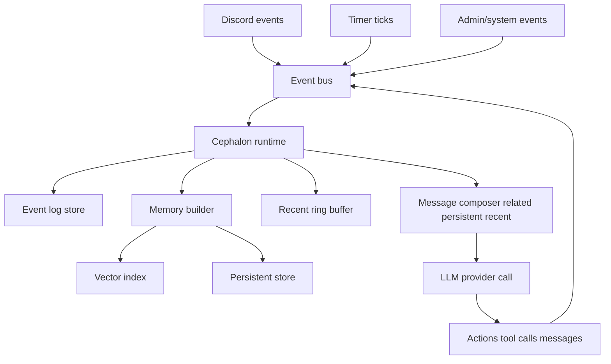

# Cephalon MVP spec notes #cephalon #agents #eidolon

Below is a concrete way to *make your description executable* without losing the vibe: “always running mind” + “many sessions / facets” + “vector memory + persistent memory + recent events” + “event subscriptions with locks”.

---

## 1) Core model

### Terms

* **Event**: anything that happens in the world or the system (Discord message, timer tick, tool result, internal reflection, admin command).
* **Message**: an LLM-provider message object (`role`, `content`, plus modality/tool fields).
* **Memory**: a *message + metadata* that is *indexed* (vector ANN + filters) and can be retrieved later.

> Every `memory` is derived from an `event`.
> Some events produce *multiple* memories (e.g., tool call + tool result + assistant summary).

### Memory record (canonical)

A single schema that can represent `user`, `assistant`, `system`, `developer`, `tool_call`, `think`, `image`:

* `id` (uuid)
* `timestamp` (ms)
* `cephalon_id` (e.g. `"Duck"`)
* `session_id` (facet/aspect id)
* `event_id` (source event)
* `role` (`user|assistant|system|developer|tool`)
* `kind` (`message|tool_call|tool_result|think|image|summary|admin`)
* `content` (text, structured payload, or pointer to blob)
* `source`

  * `type` (`discord|cli|timer|system|admin|sensor`)
  * `channel_id` / `guild_id` / etc when relevant
* `permissions` (visibility + tool-scope constraints)
* `tags` (freeform)
* `embedding` (vector pointer + model id + embedding timestamp)
* `links` (optional edges: `replies_to`, `refines`, `summarizes`, `duplicates`, `contradicts`)

---

## 2) The `[related, persistent, recent]` assembly pipeline

### Invariant

LLM calls always get:

1. **related**: retrieved memories, similarity-ranked, time-weighted, filtered
2. **persistent**: pinned/curated memories (tools/admin/system)
3. **recent**: last N events for the active session (+ optionally cross-session highlights)

Plus the necessary **system/developer** scaffolding.

### Message assembly (recommended order)

When sending to an LLM provider:

1. `system` (hard-locked, system-critical)
2. `developer` (your cephalon contract + safety/constraints)
3. `system` (session facet “personality / role”, if you use it)
4. **persistent** (pinned memories, ordered by priority)
5. **related** (top K retrieved, ordered by score)
6. **recent** (last N events/messages for *this session*)
7. the current `user` input (or the current world-event prompt, if autonomous tick)

This keeps your “always running loop” coherent: persistent identity first, then retrieved context, then the live stream.

---

## 3) Retrieval scoring that matches your description

You want:

* similarity-ranked
* weighted toward recency
* timestamped
* still allows “old but extremely relevant” to surface

A simple scoring function (works well in practice):

[
score(m) = sim(q, m)\cdot \left(1 + \alpha \cdot e^{-\Delta t / \tau}\right)\cdot w_{kind}\cdot w_{source}
]

Where:

* (sim(q, m)) is cosine similarity between query embedding and memory embedding
* (\Delta t) is age in hours/days
* (\tau) is your recency half-life knob (e.g. 7 days)
* (w_{kind}) boosts/penalizes categories (`summary` > raw chatter, etc.)
* (w_{source}) boosts trusted sources (admin/system > random meme channel)

**Practical defaults**

* `K_related`: 12–40 (depends on context window)
* `tau`: 3–14 days
* `alpha`: 0.25–1.0 (how hard you favor recency)
* `w_kind`:

  * `system/dev`: excluded from retrieval (they’re not “related”)
  * `summary`: 1.3
  * `tool_result`: 1.1
  * `assistant/user`: 1.0
  * `think`: 0.6 (helpful but can drift)
  * `discord_meme`: 0.7 (unless the facet is “meme brain”)

---

## 4) Persistent memory: tools, locks, and lifecycle

### Three tiers of “persistence”

1. **System-locked**: cannot be removed by the cephalon (safety + invariants)
2. **Admin-locked**: operator-enforced (project constraints, subscription locks)
3. **Tool-managed**: cephalon can propose/curate via tools, within policy

### Minimal tool surface (MVP)

* `memory.pin(memory_id | summary_blob, priority, expires_at?)`
* `memory.unpin(memory_id)` *(blocked if admin/system locked)*
* `memory.summarize(scope)` → produces a `summary` memory (also indexable)
* `memory.forget(memory_id)` *(soft-delete / visibility-restrict, not hard erase unless admin)*

**Key idea:** persistent memories should be *small and stable*. Everything else stays retrievable.

---

## 5) Sessions as “facets” sharing Eidolon state

### What is shared vs per-session?

**Shared (Cephalon-wide / Eidolon-influenced)**

* identity + long-term goals
* global preferences
* long-term summaries
* reputational state / self-evals
* global memory budget + policies
* “subscriptions allowed” envelope

**Per-session (facet/aspect)**

* `recent` ring buffer
* subscription filters (within allowed envelope)
* tool permissions set
* local working notes / scratch
* tone/persona prompt
* “attention focus” (what it’s tracking right now)

This matches your “multiple sessions running at once but same proper name” model.

### Cross-session influence (lightweight MVP)

Instead of trying to merge everything, do:

* each session writes **high-signal summaries** to shared persistent
* shared state publishes **signals** back to sessions (e.g., “priority increased”, “goal changed”, “alert”)

Think: shared state is the “body chemistry”; sessions are competing attentional processes.

---

## 6) Event subscriptions with hard locks

You’ve got:

* system hard locks (system-critical events)
* admin hard locks (operator-enforced)
* free subscriptions (agent chooses)

Model this as:

* `subscription_policy` (cephalon-wide): allow/deny envelope
* `subscription_set` (per session): chosen within envelope
* `forced_subscriptions` (system/admin): always applied

### MVP forced Discord channels

Your MVP cephalon is always subscribed to new-message events in these channels on Discord:

* `bots` — `343299242963763200`
* `duck-bots` — `450688080542695436`
* `general` — `343179912196128792`
* `memes` — `367156652140658699`

Represent as an event filter like:

* `source.type == "discord"`
* `event.name == "message.created"`
* `channel_id in {...}`

---

## 7) Runtime loop that feels like a “ticking mind”

A minimal loop that still *feels alive*:

1. **Ingest events** (subscriptions)
2. **Normalize → store** event log
3. **Derive memories** (message/tool/summary/think)
4. **Embed + index** relevant memories
5. **Tick decision**: should we act now?

   * if yes: compose `[related,persistent,recent]` and call LLM
   * if no: update internal state and wait
6. **Emit actions** (Discord message, tool call, subscription update, self-note)
7. Repeat

### Decision triggers (MVP)

* new Discord message in forced channels
* timer tick (e.g., every 10–60s) for “background reflection”
* tool completion
* admin command

---

## 8) Diagram (Obsidian-friendly Mermaid)

---

## 9) Concrete MVP build order (tight and shippable)

### Phase 1 — “Alive in Discord”

* event bus + discord ingestion
* event log + memory records
* per-session recent ring buffer
* simple message composer (persistent + recent only)
* one facet session that can reply in `duck-bots`

### Phase 2 — “Related memory”

* embeddings pipeline + vector ANN store
* retrieval scoring with recency weighting
* assemble `[related,persistent,recent]`
* basic memory pin/summarize tools

### Phase 3 — “Multiple sessions”

* define session facets (Id/Ego/Superego or your own)
* shared state (Eidolon) + cross-session signals
* per-session subscriptions with admin/system locks enforced

### Phase 4 — “Many tiny baby models”

* route tasks: small models handle tagging/summarization/routing
* main model handles synthesis + outward actions
* budget + arbitration rules (don’t let the swarm spam)
