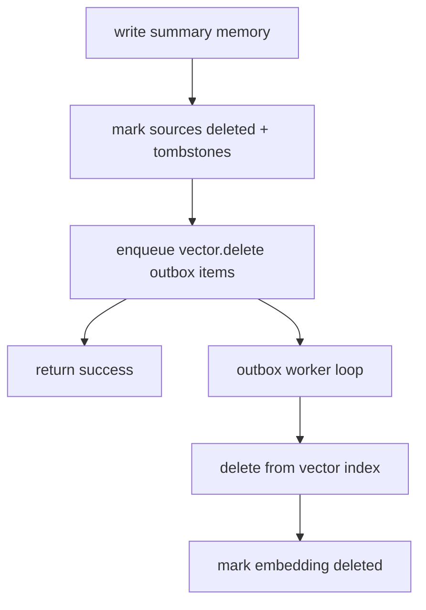

# Storage layout + retention + migrations (events/memories/summaries/tombstones/vectors) #cephalon #storage #retention #migrations

Below is a concrete storage model that supports:

* **append-only events**
* **memories that can be summarized + deleted**
* **aggregates for spam families**
* **context inclusion logs** (for access-driven GC)
* **hard deletes coordinated with vector ANN**
* **rolling schema migrations**

I’ll assume MongoDB-ish docs, but the shapes map cleanly to Postgres JSONB too.

---

## 1) Collections and responsibilities

### `events` (append-only ledger)

* Source of truth for “what happened”
* Can be retained longer than memories
* May store full content or a redacted stub depending on policy

### `memories` (retrievable context objects)

* What the LLM sees (messages, summaries, aggregates, tool results)
* Embedding pointers + retrieval metadata live here
* Subject to GC + deletion

### `aggregates` (spam families and other rollups)

* Tracks deduped bot spam as *data*
* Optionally mints/upserts an “aggregate memory” into `memories`

### `contexts` (inclusion logs)

* Every assembled context writes what it included + token cost
* Drives `included_count_decay` and GC decisions

### `tombstones` (proof of deletion + provenance)

* Minimal records linking deleted memory → summary that replaced it
* Not retrievable into context, not embedded

### `outbox` (optional, but strongly recommended)

* Guarantees vector-index deletes happen even if the process crashes mid-commit

---

## 2) Document schemas (full replacements)

### 2.1 `events`

```json
{
  "_id": "uuid",
  "ts": 0,
  "type": "discord.message.created",
  "source": {
    "type": "discord",
    "guild_id": "string",
    "channel_id": "string",
    "message_id": "string",
    "author_id": "string",
    "author_is_bot": true
  },
  "payload": {
    "content": "string",
    "embeds": [],
    "attachments": []
  },
  "hashes": {
    "content_hash": "sha256",
    "normalized_hash": "sha256"
  },
  "dedupe": {
    "exact_dup_of_event_id": "uuid|null",
    "spam_family_id": "string|null"
  },
  "schema_version": 1
}
```

**Retention knob:** `payload.content` can be dropped/redacted for bot spam once aggregated (keep hashes + metadata).

---

### 2.2 `memories`

```json
{
  "_id": "uuid",
  "ts": 0,
  "cephalon_id": "Duck",
  "session_id": "janitor",
  "event_id": "uuid|null",

  "role": "assistant",
  "kind": "message", 
  "subkind": "discord|summary|aggregate|tool_result",

  "content": {
    "text": "string",
    "normalized_text": "string|null",
    "snippets": ["string"]
  },

  "source": {
    "type": "discord|system|tool|admin",
    "guild_id": "string|null",
    "channel_id": "string|null",
    "author_id": "string|null",
    "author_is_bot": true
  },

  "cluster": {
    "cluster_id": "string|null",
    "thread_id": "string|null",
    "spam_family_id": "string|null"
  },

  "retrieval": {
    "pinned": false,
    "locked_by_admin": false,
    "locked_by_system": false,
    "weight_kind": 1.0,
    "weight_source": 1.0
  },

  "usage": {
    "included_count_total": 0,
    "included_count_decay": 0.0,
    "last_included_at": 0
  },

  "embedding": {
    "status": "none|ready|stale|deleted",
    "model": "string|null",
    "vector_id": "string|null",
    "dims": 0,
    "embedded_at": 0
  },

  "lifecycle": {
    "deleted": false,
    "deleted_at": 0,
    "replaced_by_summary_id": "uuid|null"
  },

  "hashes": {
    "content_hash": "sha256",
    "normalized_hash": "sha256|null"
  },

  "schema_version": 1
}
```

Notes:

* `kind=summary` and `kind=aggregate` are first-class memories (high-signal).
* `lifecycle.replaced_by_summary_id` is set only during compaction.

---

### 2.3 `aggregates`

```json
{
  "_id": "string", 
  "ts_first": 0,
  "ts_last": 0,

  "aggregate_type": "discord.bot_spam_family",
  "guild_id": "string",
  "channel_id": "string",

  "fingerprints": {
    "exact_hash": "sha256|null",
    "simhash64": "0x..."
  },

  "dup_count": 0,
  "example_event_ids": ["uuid"],
  "example_snippets": ["string"],
  "recognition_signals": ["string"],

  "memory_id": "uuid|null", 
  "schema_version": 1
}
```

* `memory_id` lets you upsert a stable “aggregate memory” for retrieval.

---

### 2.4 `contexts` (inclusion logs)

```json
{
  "_id": "uuid",
  "ts": 0,
  "cephalon_id": "Duck",
  "session_id": "janitor",
  "window_tokens": 262144,

  "included": [
    {"memory_id": "uuid", "tokens": 123, "bucket": "persistent|related|recent"}
  ],

  "schema_version": 1
}
```

This is the raw evidence for “least accessed”.

---

### 2.5 `tombstones`

```json
{
  "_id": "uuid",
  "source_memory_id": "uuid",
  "deleted_at": 0,
  "summary_memory_id": "uuid",
  "content_hash": "sha256",
  "schema_version": 1
}
```

Not embedded, never retrieved. Pure provenance.

---

### 2.6 `outbox` (vector delete / side-effect queue)

```json
{
  "_id": "uuid",
  "ts": 0,
  "type": "vector.delete",
  "payload": {
    "memory_id": "uuid",
    "vector_id": "string",
    "embedding_model": "string"
  },
  "status": "pending|done|failed",
  "attempts": 0,
  "last_error": "string|null",
  "schema_version": 1
}
```

---

## 3) Indexes you actually need

### `memories`

* Candidate scan for GC:

  * `(lifecycle.deleted, retrieval.pinned, retrieval.locked_by_admin, retrieval.locked_by_system, kind, ts, usage.included_count_decay)`
* Recent per session:

  * `(cephalon_id, session_id, ts desc)`
* Channel filtering:

  * `(source.channel_id, ts desc)`
* Cluster replacement:

  * `(cluster.cluster_id, kind, ts desc)`
* Hash dedupe:

  * `(hashes.normalized_hash)` and `(hashes.content_hash)`

### `aggregates`

* `(guild_id, channel_id, fingerprints.exact_hash)`
* `(guild_id, channel_id, fingerprints.simhash64)` (or bucketed fields if you do LSH)

### `contexts`

* `(cephalon_id, session_id, ts desc)`
* Optional: materialize usage updates so you don’t query contexts often.

---

## 4) Retention policy (events vs memories)

You said: “oldest, least accessed memories get summarized; summary kept; rest deleted.”

That can be true **for memories** while still keeping a thin audit trail.

### Suggested tiers

1. **events**: keep longer, but redact payload for spam
2. **memories**: compact aggressively (your rule)
3. **tombstones**: keep long (tiny)
4. **aggregates**: keep long (these are the cleaned facts)

### Policy knobs (EDN)

* `events.retention_days_full_payload`
* `events.retention_days_metadata_only`
* `memories.compact.age_min_days`
* `memories.compact.access_threshold`
* `tombstones.retention_days` (likely large)

---

## 5) Compaction commit: make it crash-safe

### The failure you must handle

If you delete from `memories` but fail to delete from vector ANN, retrieval can “ghost” the deleted item.

### Crash-safe pattern (recommended)

**Two-phase delete with outbox:**

1. Write `summary memory` (new)
2. For each source memory:

   * set `lifecycle.deleted=true`, `replaced_by_summary_id=summary_id`
   * write a `tombstone`
   * enqueue `outbox vector.delete` (memory_id + vector_id)
3. A worker loop drains `outbox` and purges vectors
4. Once vector deletion confirmed, set:

   * `embedding.status="deleted"` (or clear vector_id)
   * optionally hard-delete the memory doc later (if you want true hard delete)

This gives you:

* immediate logical deletion (won’t be retrieved)
* eventual physical cleanup in ANN

### Mermaid: commit + outbox



---

## 6) Avoid “summary of summary of summary” collapse

This matters once you compact for months.

### Rules

* Never compact `kind=summary` by default.
* If you must compact summaries, do it at a **much higher threshold** and preserve provenance.

### A simple approach

* `locks.never-delete-kinds` includes `summary` and `aggregate`
* If context overflow happens, you substitute clusters **with existing summaries**, not by generating new summaries mid-flight.

---

## 7) Migrations (rolling, zero drama)

### 7.1 Additive changes (easy)

* Add new fields with defaults
* Update writers first
* Readers tolerate missing fields

### 7.2 Breaking changes (still manageable)

Use `schema_version` and **lazy migration on read**:

* On read:

  * if `schema_version < current`, transform in memory
  * optionally write back (background) when convenient

### 7.3 Migration playbook

1. Deploy code that can read old + new
2. Deploy writers that write new
3. Backfill with a controlled job (optional)
4. Flip “require new” gates later

---

## 8) One more operational detail: allowlisted Discord output

For anything that posts messages, keep an allowlist by channel id (and rate limit) in policy. That keeps your janitor from becoming the next bot problem on Discord.
