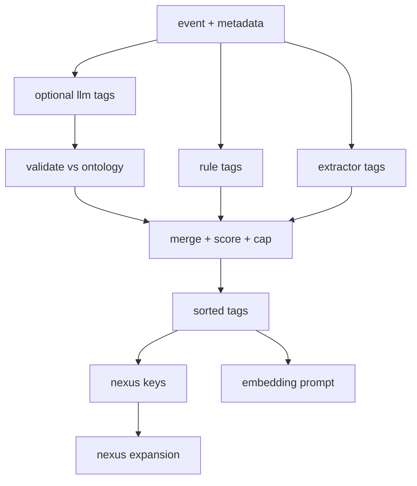

## Deterministic tags v0.1: ontology, generator pipeline, validators, and nexus integration #tags #nexus #eidolon

You want `generated_tags` to do **two jobs** at once:

1. Help embeddings “carry circumstance” (Eidolon lens)
2. Create **nexus keys** so retrieval can expand structurally (daimoi walkers)

So tags need to be:

* **deterministic**
* **bounded** (small, stable set per memory)
* **typed** (so they’re usable as keys, not vibes)
* **composable** (so meaning can drift by recombining tags over time)

---

## 1) Tag ontology: small, typed, and hierarchical

### 1.1 Tag format

Use a typed, path-like tag namespace:

* `src/discord`
* `src/tool`
* `tool/discord.send_message`
* `tool/fs.read`
* `chan/343179912196128792`
* `file/ext/clj`
* `net/domain/github.com`
* `err/null-pointer`
* `ops/incident`
* `ops/health-red`
* `topic/visibility`
* `topic/dedupe`
* `risk/destructive`
* `risk/side-effect`
* `circuit/c1-survival` *(optional tag mirror, useful for nexus)*

This gives you a clean “tag → nexus key” mapping: `tag:<tag>`.

### 1.2 EDN ontology file (authoritative allowlist)

Save as `eidolon/tags.edn`:

```clojure
{:tag-version 1

 ;; hard namespaces + examples
 :namespaces
 {:src    {:desc "source type" :examples ["src/discord" "src/tool" "src/system"]}
  :tool   {:desc "tool name" :examples ["tool/fs.read" "tool/http.get"]}
  :chan   {:desc "discord channel id" :examples ["chan/343179912196128792"]}
  :file   {:desc "file-related" :examples ["file/ext/clj" "file/path/docs/agile/boards/kanban.md"]}
  :net    {:desc "network-related" :examples ["net/domain/github.com" "net/proto/https"]}
  :err    {:desc "error fingerprint family" :examples ["err/timeout" "err/oom"]}
  :ops    {:desc "ops and health status" :examples ["ops/incident" "ops/health-green"]}
  :topic  {:desc "semantic topic bucket" :examples ["topic/dedupe" "topic/rag"]}
  :risk   {:desc "tool risk class" :examples ["risk/side-effect" "risk/destructive"]}
  :circuit {:desc "circuit lens marker" :examples ["circuit/c1-survival"]}}

 ;; optional controlled vocabulary for topic/ and err/
 :vocab
 {:topic #{"dedupe" "rag" "gc" "embedding" "visibility" "ws" "lsp" "discord" "kanban" "build" "deploy"}
  :err   #{"timeout" "oom" "conn-reset" "null-pointer" "auth" "rate-limit" "disk-full"}}}
```

If you keep `topic/*` controlled, you prevent tag drift from turning into entropy.

---

## 2) Deterministic tag generator: rules first, model last

### 2.1 Three-tier pipeline

1. **Rule tags (always deterministic)**
2. **Extractor tags (still deterministic)**
3. **LLM tag suggestions (optional, constrained + validated)**

Only tier 3 risks nondeterminism, so you:

* run it with greedy decoding
* validate against ontology
* and treat it as *advisory* (can be omitted entirely)

### 2.2 What “deterministic” means here

Given the same input event + same stored state snapshot:

* tags come out identical
* ordering is stable
* count is bounded

That’s easy if you:

* sort tags lexicographically at the end
* cap to `N` per category
* use stable tie-breakers

---

## 3) Rule tags (tier 1): free signal from metadata

These tags require **no text understanding**.

### 3.1 Source tags

* If discord message: `src/discord`, `chan/<id>`, `author/bot|author/human`
* If tool call: `src/tool`, `tool/<toolname>`
* If file path known: `file/path/<path>` *(optional, see below)*, `file/ext/<ext>`
* If URL known: `net/domain/<domain>`, `net/proto/<proto>`

### 3.2 Risk tags (from tool registry)

* `risk/read-only`
* `risk/side-effect`
* `risk/destructive`

These tags are extremely valuable for nexus expansion and safety gating.

---

## 4) Extractor tags (tier 2): deterministic text-derived features

This is where you get “topic-ish” tags without relying on a model.

### 4.1 Deterministic extractors (cheap)

* File extensions / path segments: `topic/kanban`, `topic/visibility` (from known directories)
* Error fingerprints: normalize stack traces into families
* CI/deploy tokens: `topic/build`, `topic/deploy`
* “protocol-ish”: `net/domain/*`, `net/proto/*`

### 4.2 Error fingerprinting (important)

Instead of embedding raw stack traces as tags, derive:

* `err/<family>` where family is stable:

  * timeout patterns
  * connection reset
  * null pointer
  * OOM
  * auth/permission

You can build this as a deterministic regex library.

---

## 5) LLM tag suggestions (tier 3): constrained, validated, optional

If you want richer `topic/*` without building tons of rules, you can let the model propose tags—but you **never trust it**.

### 5.1 LLM output format (strict, small)

Model must output JSON only:

```json
{"topic":["dedupe","discord"],"err":[]}
```

Then you:

* intersect `topic` with `:vocab.topic`
* intersect `err` with `:vocab.err`
* discard unknowns
* cap counts
* sort

### 5.2 Determinism tips

* temperature 0
* greedy decode
* repair loop if it outputs junk
* if repair fails: ignore tier 3 for that memory

Tier 3 becomes a “nice-to-have,” never a dependency.

---

## 6) Tag selection + capping (stable + predictable)

### 6.1 Category caps (example)

* `src/*`: up to 2
* `tool/*`: up to 1
* `chan/*`: up to 1
* `file/ext/*`: up to 1
* `net/domain/*`: up to 1
* `err/*`: up to 2
* `ops/*`: up to 2
* `topic/*`: up to 5
* `risk/*`: up to 1
* `circuit/*`: up to 1 *(if you mirror circuit into tags)*

### 6.2 Stable scoring

If you need to choose among many candidate `topic/*` tags, score deterministically:

* +3 if from rule mapping (path/tool/channel)
* +2 if from deterministic extractor
* +1 if from LLM suggestion
* tie-breaker: lexicographic

Then pick top-N.

---

## 7) Tags as nexus keys (activation + daimoi expansion)

Every stored memory gets `tags[]` and `nexus_keys[]`:

* `tag:<tag>`
* `tool:<toolname>`
* `path:<file_path>` *(optional)*
* `url:<canonical_url>`
* `chan:<id>`
* `err:<family>`

### 7.1 Why tags are perfect nexus keys

They form **shared fields** across many memories *without* requiring exact textual overlap.

A single query hit that activates `tag:topic/dedupe` can pull:

* prior dedupe rules
* past janitor reports
* compaction summaries
* spam family aggregates

### 7.2 Daimoi expansion (bounded)

* seeds = topK vector hits (canonical + eidolon lanes)
* keys = union of their nexus keys (weighted)
* expand to neighbors by key
* stop on hop budget and token budget

---

## 8) GC + summaries: tags must survive deletion

When you compact:

* source memories deleted
* summary memory created

**Rule:** the summary must carry forward the “tag mass” of what it replaced.

### 8.1 Tag roll-up on summary

Compute summary tags as:

* union of source tags
* then cap per category with deterministic scoring
* always include:

  * `topic/gc`
  * `src/system` (or `src/tool`, depending how you generate it)
  * any `err/*` families present

This ensures you don’t lose nexus connectivity after deletion.

### 8.2 Optional: tag statistics store

To keep long-term “field chemistry,” maintain:

* counts of `tag:*` activations over time buckets
* counts of `err:*` families
* per-channel pressure tags

That becomes part of your Field Digest input.

---

## 9) Mermaid: tag pipeline end-to-end



---

## 10) Drop-in “Tagger facet” prompt (if you want tier 3)

```text
SYSTEM:
You are a tag suggester. Output JSON only.

OUTPUT:
{"topic":[...], "err":[...]}

RULES:
- Only use allowed topic words and err words.
- Prefer 1-5 topic tags.
- If unsure, output empty lists.
- Do not invent new words.

ALLOWED TOPIC:
dedupe, rag, gc, embedding, visibility, ws, lsp, discord, kanban, build, deploy

ALLOWED ERR:
timeout, oom, conn-reset, null-pointer, auth, rate-limit, disk-full

INPUT:
<normalized text + tiny metadata summary>
```

Then your validator does the rest.

---

## 11) One concrete example (how it looks in your embedding prompt)

Given a bot spam message in `memes`, you might emit tags like:

* `src/discord`
* `author/bot`
* `chan/367156652140658699`
* `topic/dedupe`
* `topic/discord`
* `topic/build`
* `risk/read-only`

And nexus keys like:

* `tag:src/discord`
* `tag:topic/dedupe`
* `chan:367156652140658699`

Even after compaction, the **summary** keeps `topic/dedupe` and `chan/...`, so the same nexus routes still work.

---

If you want to continue, the next piece that “locks” this system is the **field digest generator** as a deterministic transformer:

* inputs: tag stats, health signals, queue depths, active incidents
* output: a stable digest that won’t churn every second
* plus how that digest becomes both:

  * part of embedding prompts
  * part of query prompts (so retrieval entangles with state)

*Created with the assistance of an AI.*
