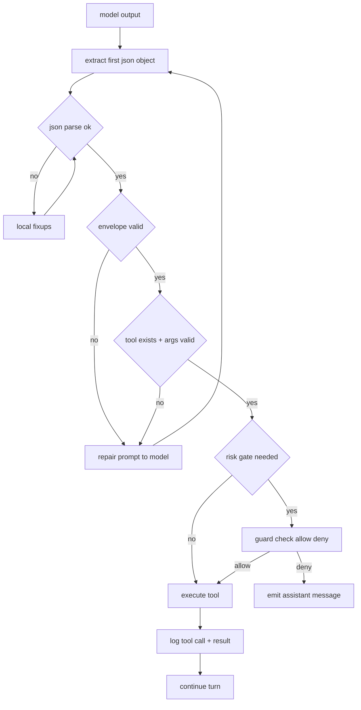

## 1) One envelope, one decision

Define exactly two output modes:

* **Mode A: tool call** (JSON object)
* **Mode B: assistant message** (plain text)

Everything else is invalid and gets repaired.

### Tool call envelope (single canonical shape)

```json
{
  "type": "tool_call",
  "name": "memory.gc_plan",
  "args": { "age_min_days": 14 }
}
```

Rules:

* Must be a **single JSON object**.
* No arrays at top-level.
* No markdown fences.
* No extra keys beyond `type/name/args` (unless you *explicitly* allow `idempotency_key` / `trace_id`).

---

## 2) Output extraction (streaming-safe)

Even with “JSON-only” prompting, small models will sometimes emit:

* leading whitespace + prose
* code fences
* multiple JSON objects
* trailing commentary

So your extractor should do:

1. Find the **first `{`**
2. Parse the **first complete JSON object** (balanced braces, string-aware)
3. Ignore everything after that (or treat as invalid if strict)

### Minimal JS brace-balanced extractor (string-aware)

```js
export function extractFirstJsonObject(text) {
  const start = text.indexOf("{");
  if (start === -1) return null;

  let i = start;
  let depth = 0;
  let inStr = false;
  let escape = false;

  for (; i < text.length; i++) {
    const ch = text[i];

    if (inStr) {
      if (escape) { escape = false; continue; }
      if (ch === "\\") { escape = true; continue; }
      if (ch === "\"") inStr = false;
      continue;
    }

    if (ch === "\"") { inStr = true; continue; }
    if (ch === "{") depth++;
    if (ch === "}") depth--;

    if (depth === 0) {
      const jsonSlice = text.slice(start, i + 1);
      return jsonSlice;
    }
  }

  return null; // incomplete
}
```

---

## 3) Validation layers (fast → strict)

### 3.1 JSON parse

* `JSON.parse(jsonSlice)` must succeed.

### 3.2 Envelope validation

* `obj.type === "tool_call"`
* `typeof obj.name === "string" && obj.name.length > 0`
* `obj.args` is object (not null/array)

### 3.3 Tool allowlist

* `obj.name` must be in the tool registry.
* Validate args with a per-tool schema (zod / jsonschema / custom).

Example per-tool validator idea (zod-ish):

```js
const toolSchemas = {
  "memory.gc_plan": (args) => {
    if (!Number.isInteger(args.age_min_days)) return false;
    if (!Number.isFinite(args.access_threshold)) return false;
    return true;
  }
};
```

---

## 4) Deterministic “local fixups” before you bother the model

A bunch of failures are *formatting*, not reasoning. Try these first:

* strip markdown fences if present:

  * remove leading `json and trailing `
* trim leading/trailing junk
* replace smart quotes with normal quotes
* if it looks like JSON but uses single quotes, rewrite carefully (only if safe)

Keep these fixups conservative; don’t try to be clever with arbitrary broken JSON.

---

## 5) Repair loop (LLM reformat) that converges

When validation fails, you ask the model for a *single job*: “rewrite into the exact JSON envelope”.

### Repair prompt pattern

* Provide:

  * the invalid output
  * the schema in plain language
  * **hard constraint**: “output JSON only”

Example repair instruction (put this in a dedicated system/developer message for the repair call):

* Output **only** one JSON object
* No markdown
* Must match: `{type:"tool_call", name:string, args:object}`

### Retry budget

Use a small finite budget:

* `max_repairs = 2`
* then degrade gracefully:

  * treat it as Mode B (assistant text)
  * or ask for “assistant message only, no tools” for this turn

That prevents infinite loops.

---

## 6) Tool gating (prevent bad side effects)

Classify tools by risk:

* **read-only**: safe (memory retrieval, planning, search)
* **side-effect**: sending a message, writing state
* **destructive**: delete, purge, compaction commit

Then apply a gate:

### Gate A: second-pass “intent check”

Before executing **side-effect/destructive** tools, run a tiny classifier pass:

Input: tool name + args + short recent context
Output: `ALLOW` or `DENY` + reason (machine-readable)

This can be the same model with a very tight prompt, or a separate “guard” model.

### Gate B: idempotency keys

For side-effect tools, require:

* `idempotency_key = hash(tool_name, args, event_id)`
  so retries don’t double-post or double-delete.

### Gate C: dry-run for destructive operations

For compaction:

* `memory.compact_commit` must reference an existing `plan_id` and `group_id`
* ensure the group is unchanged since plan time (store a `group_hash`)
* if mismatch → deny and re-plan

---

## 7) “Discord post” safety without human confirmation spam

You want the cephalon cleaning bot spam as a real job, including posting reports, especially in Discord.

Do:

* **rate limits** per session + per channel
* **allowlisted channels** for bot output
* “report-only” mode default; deletion requires admin lock or explicit enable

This keeps the janitor useful without becoming the next spam source.

---

## 8) Execution pipeline (all together)



---

## 9) What to log (so you can debug + improve reliability)

For each attempted tool call:

* raw model output
* extracted JSON slice
* validation failure reason (first failure)
* repair attempts + outcomes
* whether gate denied/allowed
* idempotency key
* tool result

This becomes the dataset you use to:

* tune prompts
* add local fixups
* adjust tool schemas
* measure “2B tool-call success rate” over time

