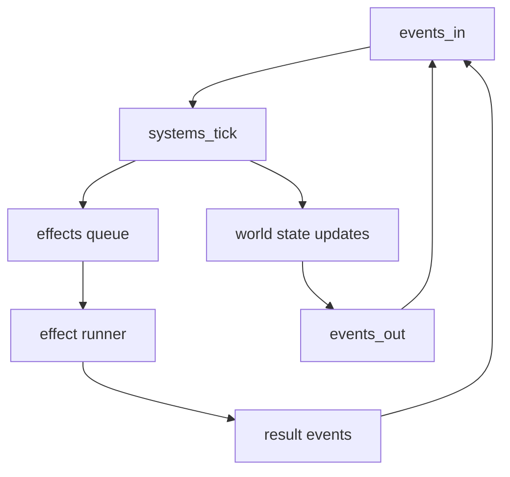

([Past chat][1])([Past chat][1])([Past chat][2])([Past chat][3])([Past chat][3])

# Cephalon TS ➜ shadow-cljs carryover notes #cephalon #shadow-cljs #promethean

You’ve already got the *right* shape in the CLJS version: an ECS-ish “world” plus an **effects queue** (`:effects`) where side effects happen outside the pure systems loop. That is the perfect place to import almost everything that made the TypeScript version “work”.

Below is the “lesson extraction” I’d apply, plus a concrete port map into the CLJS world you uploaded.

---

## The big architectural lesson

### Keep CLJS as the *simulation core*, make IO “effects”

Your `promethean.ecs.tick/world` setup is exactly where the TS implementation got messy over time (because everything is `await`-driven inside turn processors).

So: **never do real IO inside systems**.

Instead, model IO as effects like:

* `:llm/chat` ➜ runner calls Ollama/OpenAI, emits `:llm/chat.result` event
* `:tool/exec` ➜ runner calls a tool handler, emits `:tool/result`
* `:discord/send` / `:discord/fetch` ➜ runner hits Discord client, emits `:discord/...` events
* `:memory/insert` / `:memory/search` / `:memory/pin` ➜ runner updates store(s), emits `:memory/...`

Your CLJS already emits `{:effect/type :llm/chat ...}` in `sys-cephalon`. That’s the exact seam to port the TS “tool loop” and “tool registry” cleanly.

---

## Lessons from the TS version worth porting verbatim

### 1) Single source of truth tool registry (schema + handler)

In TS, `TOOL_REGISTRY` prevents drift between:

* what the model is told (“tool schema”)
* what you actually implement (“handler”)

Port that idea as a CLJS map:

* registry is data (schemas + handler fns)
* “tool definitions for LLM” is derived from registry
* “executor dispatch” is derived from registry

This stops the classic failure mode: “model calls `discord.send_message` but tool is named `discord.send`”.

### 2) Tool loop state machine (not recursion, not ad-hoc awaits)

The TS `TurnProcessor` loop is the correct behavior:

* assemble context
* call LLM
* if tool calls: append assistant tool_calls → execute tools → append tool results → repeat
* else: final content

In CLJS, represent this explicitly as a **turn state** component on the session entity (or a per-turn entity), eg:

* `:turn/state :awaiting-llm | :awaiting-tools | :final`
* `:turn/messages [...]`
* `:turn/pending-tool-calls [...]`
* `:turn/max-iterations n`

Then systems just move state forward and emit effects; effect-runner returns results as events.

### 3) Native tool calling first, “markdown parsing” only as a salvage path

Your TS provider tries:

1. `message.tool_calls` (native)
2. parse markdown wrapped JSON (fallback)

That’s the correct ordering.

But: you have a *better* spec in your docs (`cephalon-tool-call-validation.md` + `ollama-adapter-tool-calling.md`) than the current TS regex. Port the **spec + validator + repair** approach, not the regex approach.

### 4) Session scheduling as *explicit policy* (credits + lane budgets)

The TS `SessionManager` has the right intent:

* queues per session
* credits / refill
* lane budgets (interactive/operational/maintenance)
* staleness boosts

Your CLJS version currently does “take 5, block until any llm result exists”.
Port the TS scheduler as **a system that chooses which sessions get a turn** each tick, based on:

* queue length
* time since last turn
* credits
* lane budgets

This gives you “chaotic but safe” *without* relying on the model behaving.

### 5) Feedback loop prevention on output

TS `TurnProcessor` has a good guardrail:

* don’t reply into the same channel that triggered the event (or at least prevent echo)
* ignore bot authors or specific author IDs if configured

Port this as policy-checked output effects:

* system emits `:discord/send` effect only if allowed
* runner executes it

### 6) Observability: everything emits events

TS publishes:

* `session.turn.started`
* `tool.result`
* `session.turn.completed`
* `session.turn.error`

In CLJS, do the same conceptually:

* every effect should produce a result event (success/failure + timing)
* every turn should have a correlation id (`turn-id`) so logs can be grouped

---

## Pain points / “drift bugs” to avoid when porting

These are exactly the kinds of issues that disappear when you move to “pure systems + effect runner”:

1. **Tick routing mismatch**
   TS `findTargetSessions` routes `system.tick` only to `maintenance`, but your “always running duck mind” prompt is tied to the conversational/interactive intent.
   ➡️ In CLJS, fix by attaching `:event/session-id` *or* adding subscription filters so tick goes where you intend.

2. **Split-brain memory**
   TS uses `InMemoryMemoryStore` for minting + `ChromaMemoryStore` for lookup; if you don’t insert minted memories into Chroma, `memory.lookup` becomes mostly empty.
   ➡️ In CLJS: define a “multi-sink memory store” effect: insert → (append log + embed + upsert vector).

3. **Tool naming drift**
   Docs/headers mention `discord.send_message` while tool is `discord.send`.
   ➡️ Registry-derived tool list + validator prevents this.

4. **Call-id mismatch**
   TS creates new UUIDs in different places; if you want traceability, `callId` must be stable through tool-call → tool-result → minted memory.
   ➡️ In CLJS: assign `call-id` once when parsing tool calls; keep it everywhere.

5. **Markdown tool-call parsing fragility**
   Regex breaks on nested JSON, multiple calls, or slightly malformed fences.
   ➡️ Use the validator/repair pipeline you documented (parse → validate → repair → retry), not regex matching.

---

## Concrete port map: TS modules ➜ CLJS namespaces

### Core loop

* TS: `SessionManager` + `TurnProcessor`
* CLJS target:

  * `promethean.sessions.scheduler` (system)
  * `promethean.turn.state` (data model helpers)
  * `promethean.turn.system` (system that advances turn state)

### Tools

* TS: `TOOL_REGISTRY` + `ToolExecutor`
* CLJS target:

  * `promethean.tools.registry` (schemas + handlers)
  * `promethean.tools.validate` (spec validation + repair)
  * `promethean.tools.system` (system: when LLM returns tool calls → emit tool effects)

### LLM provider

* TS: `OllamaProvider.completeWithTools`
* CLJS target:

  * `promethean.llm.ollama` (effect runner implementation)
  * `promethean.llm.parse` (native tool_calls parse + salvage parse)
  * `promethean.llm.system` (system that requests chats via effects)

### Memory

* TS: minting + store(s)
* CLJS target:

  * `promethean.memory.mint` (event → memory)
  * `promethean.memory.store` (multi-sink insert/search/pin)
  * `promethean.context.assembler` (you already have this; upgrade it)

### Discord

* TS: `DiscordApiClient` tools
* CLJS target:

  * `promethean.discord.effects` (effect types)
  * `promethean.discord.runner` (executes discord effects via JS client)
  * tools in registry call discord by emitting effects, not doing IO

---

## Suggested “parity milestones” checklist

### Milestone 1 — Minimal working loop

* [ ] Implement **effect runner** that can execute `:llm/chat` and emit `:llm/chat.result`
* [ ] Turn system: `:idle` → `:awaiting-llm` → `:idle`
* [ ] Log correlation: `turn-id` attached to events/effects

### Milestone 2 — Tool calling end-to-end

* [ ] Tool registry in CLJS (schema + handler)
* [ ] LLM result parsing supports `tool_calls`
* [ ] Emit `:tool/exec` effects + consume `:tool/result` events
* [ ] Tool loop iteration cap (like TS maxIterations)

### Milestone 3 — Discord + memory basics

* [ ] `discord.list.servers`, `discord.list.channels`, `discord.channel.messages`, `discord.send`
* [ ] Mint memories from discord events
* [ ] Insert minted memories into vector store (or a stubbed embedding pipeline)

### Milestone 4 — Scheduling + “autonomous tick”

* [ ] Credits + refill
* [ ] Lane budgets + staleness boost
* [ ] Tick event routed intentionally (interactive vs maintenance)
* [ ] Output gating (anti-echo / anti-bot-loop)

---

## Diagram: target CLJS runtime flow (systems + effects)

---

## If you want “one thing” to lift first

Lift the **TS tool registry pattern** into CLJS immediately.

Everything else becomes easier once:

* tool names are canonical
* schemas are derived, not duplicated
* execution dispatch is derived, not duplicated

That’s the highest leverage “lesson” from the working TS version.

---

If you tell me which CLJS repo is the target (the one in `cephalon_cljs.zip` looks like `packages/cephalon`), I can propose the *exact* namespace/file layout (full file contents, not diffs) for:

* effect runner
* ollama chat effect impl
* tool registry + validator
* turn state machine system

[1]: https://chatgpt.com/c/697e89a2-c2f8-8329-a669-79ddf0b1534e "Cephalon MVP Overview"
[2]: https://chatgpt.com/c/697687f5-4650-8327-bcf6-e2b0f753d9f3 "Ollama Benchmark Setup"
[3]: https://chatgpt.com/c/68cf8b24-2480-832a-a41d-76688aca26ff "GitHub repo issue search"
