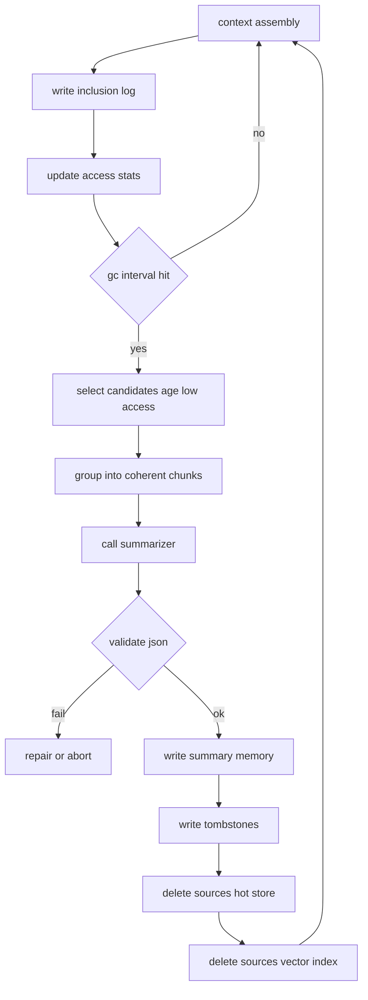

# Continuation: dedupe rules + summary GC contract + tool schemas #cephalon #memory #gc #dedupe #summaries

## 1) Dedupe normalization rules

You want this to be *useful cleanup*, not “silence everything”.

### 1.1 Normalize function (text)

Apply in this order:

1. **Unicode + whitespace**

   * NFKC normalize
   * convert CRLF → LF
   * collapse runs of spaces/tabs
   * trim

2. **Strip volatile noise**

   * remove timestamps like `2026-01-31 12:34:56`, `12:34 PM`, etc
   * remove counters like `(#1234)` or `run=987` *(only if the prefix/suffix pattern is known to be spammy)*

3. **URL canonicalization**

   * lowercase scheme/host
   * remove tracking params (`utm_*`, `ref`, `fbclid`, etc)
   * optionally drop fragments (`#...`) for known spam URLs
   * keep path + meaningful query params

4. **Mentions & IDs**

   * replace user mentions `<@123>` → `<@user>`
   * replace channel mentions `<#123>` → `<#channel>`
   * replace role mentions `<@&123>` → `<@role>`
   * keep author id separately (don’t lose it; just don’t let it break dedupe)

5. **Attachments / embeds signature**

   * keep `(attachment_count, attachment_types, primary_embed_url, embed_title_hash)`
   * do *not* include raw embed fields that are noisy

> Important: keep a **raw copy** of the original message for audit/debug, but use `normalized_content` for dedupe and similarity.

### 1.2 Exact-dupe key

A stable key that ignores irrelevant drift:

* `dup_key = hash(author_kind, normalized_content, attachment_sig, embed_sig)`

Where `author_kind` is something like:

* `"bot"` if message author is a bot
* `"human"` otherwise

This lets you dedupe bot spam harder without accidentally deduping human repetition too aggressively.

### 1.3 Near-dupe key (SimHash)

Compute SimHash on:

* tokens of `normalized_content`
* plus a small embed/url signature

Then if:

* same channel
* within a time window (e.g. 10 min)
* Hamming distance <= threshold (e.g. 3–6 bits)
  → treat as the same “spam family”.

---

## 2) Aggregation records (so spam becomes *data*, not *memory pollution*)

Instead of storing repeated messages as separate memories, store one “aggregate” object:

* `aggregate_id`
* `first_event_id`
* `last_event_id`
* `dup_count`
* `time_span`
* `authors_seen` (optional)
* `example_event_ids` (cap at e.g. 10)
* `normalized_fingerprint` (exact hash + simhash)
* `classification` (spam category)

Then:

* only the aggregate becomes a **memory** (optionally embedded)
* the raw duplicates become “events” that are linkable but not retrievable

This gives you:

* clean ANN index
* useful stats (“this project spams 4k msgs/day”)
* reversible debugging (you can still inspect examples)

---

## 3) Summary GC contract (the part that deletes history safely)

You described:

* track how often each memory is included in context
* occasionally summarize oldest + least accessed
* keep summary, delete the rest

### 3.1 Access tracking: two counters + one timestamp

For each memory:

* `included_count_total`
* `included_count_decay` (exponential decay)
* `last_included_at`

Update per context assembly:

[
included_count_decay \leftarrow included_count_decay \cdot e^{-\Delta t/\tau} + 1
]

Pick `tau` ~ 14–30 days.

### 3.2 GC candidate query

Select memories where:

* `age > AGE_MIN`
* `included_count_decay < ACCESS_THRESHOLD`
* `not pinned`
* `not admin_locked`
* `not system_locked`
* `not already summarized` *(or not summarized recently)*

Then group candidates by a coherence heuristic:

* same channel + same day
* same thread/reply chain
* same spam family aggregate
* or embedding cluster (later)

### 3.3 Summary is a first-class memory with provenance

Create a summary memory with fields:

* `kind: "summary"`
* `time_range`
* `topic`
* `bullet_events[]`
* `decisions[]`
* `open_loops[]`
* `spam_patterns[]`
* `source_memory_ids[]`
* `deletes_source: true`

You index/embed the summary so it’s retrievable.

### 3.4 Deletion step (hard delete + tombstone)

If you really want deletion, do it in two steps:

1. **Write summary memory**
2. **Write tombstones** for each source memory:

   * `deleted_at`
   * `replaced_by_summary_id`
   * `content_hash` *(no content)*
3. **Remove from hot store**
4. **Remove from vector index**
5. **Remove blobs** (attachments) if you store them

Tombstones prevent “dangling references” and let you answer:

* “why can’t I find that message anymore?”

without storing the original content.

---

## 4) The summary prompt template (structured + retrieval-friendly)

This is the shape that tends to work well with small models because it’s rigid and checklist-like.

### 4.1 Summary input pack

Give the summarizer:

* a list of source memories (or aggregates)
* minimal metadata (timestamps, channel, author_kind)
* *no giant raw logs if it’s spam*: sample only, plus stats

### 4.2 Required output shape

The model must output **only JSON**, something like:

```json
{
  "topic": "string",
  "time_range": {"start": 0, "end": 0},
  "summary": [
    "bullet 1",
    "bullet 2"
  ],
  "spam_patterns": [
    {"pattern": "string", "count_estimate": 0, "signals": ["string"]}
  ],
  "decisions": ["string"],
  "open_loops": ["string"],
  "entities": ["string"],
  "source_ids": ["uuid", "uuid"]
}
```

### 4.3 A good “contract style” instruction (for your developer/system msg)

* do not invent facts
* if uncertain, write `"unknown"`
* preserve counts only if observed, otherwise estimate and label as estimate
* include “how to recognize this spam pattern” (signals)

This turns summaries into *actionable filters* later.

---

## 5) Tool-call schemas (tight enough for 2B reliability)

A pattern that reduces model confusion is a single envelope:

### 5.1 Tool call envelope

```json
{
  "type": "tool_call",
  "name": "memory.summarize_and_compact",
  "args": { }
}
```

### 5.2 Minimal tool set for your GC workflow

* `memory.context_log_write(context_id, memory_ids_with_token_costs)`
* `memory.gc_plan(limit_tokens, age_min_days, access_threshold)`
* `memory.summarize(source_ids, format="json_v1")`
* `memory.compact_commit(summary_json, source_ids)`
* `memory.compact_abort(plan_id, reason)`

**Design note:** `summarize` produces data; `compact_commit` performs deletion.
That separation makes it much safer and easier to validate.

---

## 6) Mermaid: end-to-end GC compaction loop



---

## 7) “Spam cleanup job” output: what the bot should *say/do*

To make the cleanup visible and valuable (without spamming the channel itself), have a dedicated session that posts periodic reports (or DMs an admin):

* top spam families by `dup_count`
* which sources were compacted into summaries
* any new patterns discovered (signals)
* suggested filters/subscriptions to reduce future noise

That gives the cephalon *real work* and a reason to improve.

---

If you want the next chunk to be even more concrete, I can write:

* a precise `normalize_discord_message()` spec (including patterns to strip)
* a SimHash/MinHash strategy for near-dupe clustering
* the exact JSON Schema you validate tool calls + summary outputs against
* a “compaction policy file” format so you can tune GC without redeploying
