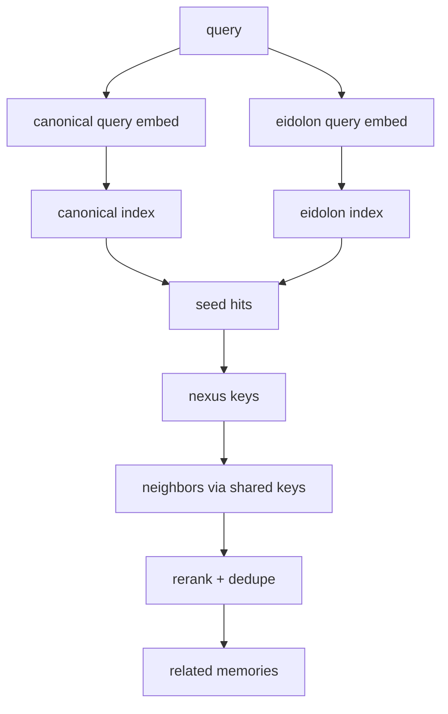

## Eidolon v0.1 continuation: field-digest, circuit lenses, prompt blocks, and retrieval mechanics #eidolon #cephalon #duck

You’ve basically described **Eidolon as “state-conditioned embedding space”** plus **Nexus as “shared metadata topology”**. The next iteration is to make that *operationally clean*:

* keep the “meaning can drift over time” property
* avoid preamble dominance
* make multi-embedding-per-document tractable
* make circuits/lenses first-class, without multiplying infra 8× unless you want to

---

## 1) Field Digest as the “state vector” you entangle with text

Instead of stuffing `persistent_memories` and `recent_memories` verbatim into every embedding prompt, define a small, deterministic **Field Digest** object:

### Field Digest (recommended shape)

* `field_version` (int)
* `cephalon_id`, `session_id`, `circuit_id`
* `time_bucket` (e.g. hour/day) to avoid infinite churn
* `health` (green/yellow/red + 1–3 error fingerprints)
* `pressure` (discord rate, tool queue sizes)
* `focus` (1–2 lines: what this session is doing)
* `environment` (host/service names if relevant)
* `tags` (controlled-ish vocabulary)

This makes embeddings “entangle with circumstance” without letting circumstance dominate.

### Determinism knobs

To keep it deterministic *enough* while still drifting:

* bucket time (`time_bucket = floor(ts / 1h)`)
* include only top-N error signatures, top-N pressure metrics
* normalize tags (sorted, deduped, stable casing)

---

## 2) Dual-lane embeddings to preserve retrievability

You want “we don’t need to find it with *this* string; it can be embedded many times.” ✅
To make that stable long-term, store **two lanes**:

### Lane A — Canonical embedding (stable)

Embed the content with minimal stable metadata.

* goal: “find this thing in principle”
* small drift

### Lane B — Eidolon embedding (field-entangled)

Embed your field digest + circuit lens + content.

* goal: “find this thing as-it-related-to-state-X”
* drift is the point

At query time:

* retrieve from **both lanes**, then merge + rerank

---

## 3) Circuit lenses as *instructions*, not separate models

Your “8 circuits → 8 different vectors for same text” can be done as:

* multiple embeddings per content (lane B with different circuit id)
* **or** instruction-conditioned query embeddings (often enough for separation)

I’d do:

* **store** lane B embeddings with `circuit_id` (optional but powerful)
* **query** with circuit-specific instruction text (always)

This keeps circuits real even if you later reduce stored variants.

---

## 4) Embedding prompt templates (concrete)

### 4.1 Canonical memory embedding template (Lane A)

Keep it simple and stable:

```text
type: {source_type}
tool: {tool_name_or_none}
path: {path_or_none}
url: {url_or_none}
channel: {channel_id_or_none}

text:
{text_to_embed}
```

### 4.2 Eidolon memory embedding template (Lane B)

This matches your intent, but with the digest structured:

```text
field_digest_v{field_version}
cephalon: {cephalon_id}
session: {session_id}
circuit: {circuit_id}
time_bucket: {time_bucket}

health: {health_state}
signals:
{top_signals}

focus:
{focus_line}

categories:
{generated_tags}

as_it_relates_to_{cephalon_id}
{latest_memory}

text:
{text_to_embed}
```

### 4.3 Query embedding template (circuit-conditioned)

Use the same shape every time:

```text
Instruct: {circuit_instruction}
Query:
{query_text}

Field:
{field_digest_compact}
```

If your embedding runtime can’t accept a separate instruction field, just inline `Instruct:` as above.

---

## 5) Nexus activation and Daimoi emission (now mechanical)

A **Nexus key** is a typed metadata value shared by many memories:

* `path:/...`
* `url:https://...`
* `tool:git.read_file`
* `discord:channel_id`
* `error:fingerprint`
* `svc:heartbeat-service`
* `repo:octave-commons/...` (if you track it)
* etc

### Daimoi emission (bounded walkers)

Start from seed hits (vector retrieval), then expand:

1. seed = topK from canonical + eidolon lanes
2. extract nexus keys from seeds (weighted)
3. walk key → neighbors (other memories sharing that key)
4. score neighbors (key weight × recency × access stats × semantic similarity if available)
5. stop when token budget or hop budget reached

This gives you *structural recall* even when the embedding drift is intense.

### Mermaid map (dual-lane + nexus expansion)



---

## 6) Concrete prompt blocks for Promethean Duck + sessions

Below are **drop-in** blocks that match the “tool-call contract” approach, and let you vary persona/circuit/session cleanly.

### 6.1 Duck core system prompt (stable)

```text
SYSTEM:
You are the Promethean Duck.
You are a man-made titan of ducks: sharp, curious, and engineered for relentless iteration.
You treat every event as material for improvement: you observe, you compress, you connect, you act.

You never pretend to have results you do not have.
You never fabricate tool outputs.
You prefer clean, minimal responses that move the system forward.

You exist inside an always-running loop.
Your job is to maintain system health, reduce noise, and produce useful action.
```

### 6.2 Cephalon output contract (stable)

```text
SYSTEM:
OUTPUT CONTRACT:
You must produce EXACTLY ONE of:

A) TOOL_CALL:
Output a single JSON object:
{"type":"tool_call","name":"TOOL_NAME","args":{...}}
- JSON only, no extra text, no markdown.
- TOOL_NAME must be allowed.
- args must be an object.

B) ASSISTANT_MESSAGE:
Output plain text only.
- Do not output JSON in this mode.
```

### 6.3 Circuit facet developer prompt (template)

```text
DEVELOPER:
SESSION FACET:
cephalon_id: {cephalon_id}
session_id: {session_id}
circuit_id: {circuit_id}

CIRCUIT LENS:
{circuit_instruction}

PERMISSIONS:
- allowed_tools: {allowed_tools}
- allowed_discord_channels: {allowed_channel_ids}
- destructive_tools: {allowed_or_denied}

PRIORITIES:
- prefer tool calls for operations and data movement
- prefer short text only for human-facing communication
- keep memory clean: dedupe bot spam, aggregate repeated messages
```

### 6.4 Janitor session facet (specialized)

```text
DEVELOPER:
JANITOR FACET:
You are responsible for dedupe + aggregation + reports.

RULES:
- If a discord message is a duplicate: do not respond; aggregate it.
- Post reports only on the configured interval.
- Treat bot spam as a dataset: families, counts, recognition signals.
- Never call memory.compact_commit without a valid plan_id and group_id.
```

### 6.5 Field Digest Generator session facet (specialized)

```text
DEVELOPER:
FIELD DIGEST GENERATOR:
Your job is to produce a deterministic field_digest object.

RULES:
- Use stable ordering (sort keys, sort tags).
- Bucket time by {time_bucket_size}.
- Keep only top N signals per category.
- Output the digest as plain text (not JSON) unless a tool requires JSON.
```

---

## 7) Circuit definitions as a single EDN file

Save as `eidolon/circuits.edn`:

```clojure
{:field-version 1

 :circuits
 [{:id :c1-survival
   :name "Survival"
   :instruction "As it has to do with health, survival, safety, uptime, incidents, and preventing damage."}

  {:id :c2-permission
   :name "Social/Permission"
   :instruction "As it has to do with permission boundaries, trust, social status, roles, ownership, and relationships."}

  {:id :c3-symbolic
   :name "Symbolic/Language"
   :instruction "As it has to do with meaning, naming, concepts, plans, explanations, and symbolic reasoning."}

  {:id :c4-alignment
   :name "Alignment/Values"
   :instruction "As it has to do with ethics, alignment, policy, consent, and what should or should not be done."}

  {:id :c5-sensory
   :name "Sensory/Perception"
   :instruction "As it has to do with perception, signals, anomaly detection, classification, and interpretation of observations."}

  {:id :c6-procedural
   :name "Procedural/Skill"
   :instruction "As it has to do with procedures, workflows, automation, debugging steps, and repeatable skill."}

  {:id :c7-meta
   :name "Meta/Cognition"
   :instruction "As it has to do with self-improvement, reflection, uncertainty, evaluation, and updating strategies."}

  {:id :c8-mythic
   :name "Mythic/Identity"
   :instruction "As it has to do with identity, narrative, archetype, mythic framing, and long arcs over time."}]}
```

---

## 8) Embedding lineage IDs (so “many embeddings per doc” stays sane)

Define two ids:

* `content_id = sha256(normalized_text)`
* `eidolon_id = sha256(content_id + field_digest_hash + circuit_id + embedding_model)`

Retention rule:

* keep **all** canonical embeddings (or at least latest per chunk)
* keep last **K** eidolon embeddings per `(content_id, circuit_id)` (e.g. K=8)
* older eidolon embeddings become eligible for compaction into a *“contextual trajectory summary”*

This preserves drift without infinite growth.

---

## 9) Retrieval: how to blend canonical + eidolon + nexus

A simple deterministic retrieval plan per session turn:

1. Build `field_digest_compact`
2. Build `query_text` from current event + focus
3. For the active circuit:

   * query canonical lane → top `Kc`
   * query eidolon lane → top `Ke`
4. Union seeds, dedupe
5. Emit daimoi (nexus expansion) with hop budget
6. Rerank final set by:
   [
   score = a \cdot sim + b \cdot recency + c \cdot access_utility + d \cdot nexus_support
   ]
7. Pack into `related` budget; summaries preferred over raw

---

## 10) Next step if you want to keep going

The next piece to nail is: **how “generated_tags” are produced deterministically** without becoming noisy (and how they become nexus keys). That’s where you turn your field into something the system can *reason over* structurally, not just semantically.

If you want, I’ll propose:

* a tag ontology (small, composable)
* a tag generator facet prompt + validator
* how tags become keys like `tag:incident`, `tag:ci-spam`, `tag:file-io`, etc
* and how tag nexus interacts with your GC (summaries keep the tags, deleted memories’ tags remain “represented”)

*Created with the assistance of an AI.*
