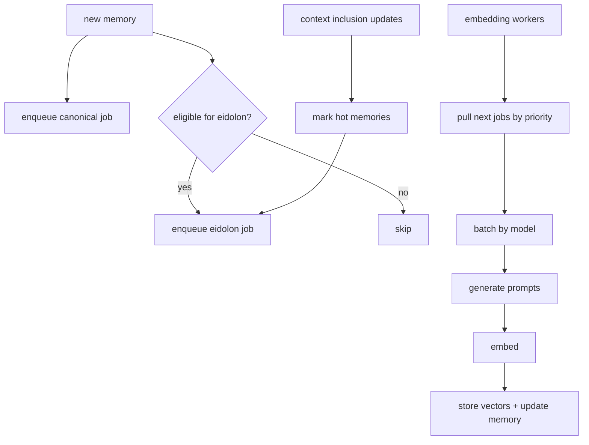

## Embedding Scheduler v0.1: cost-aware, state-aware, deterministic #embeddings #scheduler #eidolon #qwen3-embedding:0.6b

You want to embed **everything the agent has seen**, possibly many times as context changes. That’s workable if embedding becomes a *scheduled service* with:

* deterministic priorities
* bounded backlogs
* lineage caps (so “many times” doesn’t become “infinite”)
* backpressure behavior during flood
* summary/aggregate preference (so you embed *compressed meaning*, not raw noise)

---

## 1) The embedding work types

Define embedding jobs as explicit units:

### Job types

* `embed.canonical(memory_id)`
* `embed.eidolon(memory_id, circuit_id, field_digest_hash)`
* `embed.summary(memory_id)` *(usually canonical + eidolon, but you can treat as high-priority)*
* `embed.aggregate(memory_id)` *(same)*
* `embed.reembed_content(content_id, reason)` *(optional “refresh lane” job)*

Each job yields:

* `vector_id`
* `embedding_model`
* `dims`
* `embedded_at`

---

## 2) Deterministic priority policy

You want embedding to be “always on” but never starve interactive turns.

So: **embedding lane** is maintenance, with its own budget, and jobs have priorities.

### Priority tiers (example)

1. **P0**: summaries + aggregates (because they’re compression anchors)
2. **P1**: human-authored messages + tool results that look durable (files, structured outputs)
3. **P2**: discord messages (non-bot) in subscribed channels
4. **P3**: bot spam raw messages (usually skip or only embed aggregate)
5. **P4**: re-embeds due to field change (optional, low)

Deterministic priority score uses only deterministic features:

* memory kind/subkind
* source type (tool vs discord)
* author_is_bot
* tags/risk class
* whether it’s already embedded
* whether it’s in hot activation lists (field digest top-k)
* recency bucket

---

## 3) Canonical vs Eidolon scheduling

### Rule: canonical is the “base layer”

If a memory is not embedded at all:

* schedule canonical first

### Eidolon embeddings are “decorations”

Schedule eidolon embeddings only when:

* memory is hot (frequently retrieved / included)
* memory is high value (summary/aggregate, tool output)
* or you’re in a circuit that benefits from drift tracking

This keeps index size sane.

---

## 4) Lineage caps (the “many embeddings per doc” control)

You defined:

* `content_id = sha256(normalized_text)`
* `eidolon_id = sha256(content_id + field_digest_hash + circuit_id + model_id)`

Now enforce caps:

### Suggested caps

* canonical: keep 1 per `(content_id, model_id)` *(or keep latest if model changes)*
* eidolon: keep up to `K=8` per `(content_id, circuit_id, model_id)` across time

### When scheduling eidolon embed

If count >= K:

* don’t schedule a new one unless:

  * it’s a **chemistry shift** (health red, flood, new incident)
  * or the memory is summary/aggregate (always allowed)
* otherwise: skip

This makes drift meaningful instead of constant.

---

## 5) Backpressure modes (when embedding queue explodes)

When pressure is high (discord flood, outbox critical, embed queue high):

### Degrade steps

1. Stop scheduling eidolon embeddings (Lane B) except summaries
2. Stop embedding raw bot messages entirely
3. Only embed:

   * summaries
   * aggregates
   * tool results
4. If still overloaded:

   * delay canonical embeddings for low-value memories

This matches your first job: clean bot spam. Under flood, you embed the aggregate, not the spam.

---

## 6) Job queue design

### 6.1 One queue, deterministic ordering

Store jobs in a collection:

* `embedding_jobs`

Fields:

* `job_id`
* `memory_id`
* `job_type`
* `priority`
* `ts_enqueued`
* `dedupe_key` (so duplicates collapse)
* `status: pending|running|done|failed`
* `attempts`
* `last_error`

### 6.2 Dedupe key (critical)

Example:

* canonical: `dedupe_key = "canonical:<memory_id>:<model>"`
* eidolon: `dedupe_key = "eidolon:<memory_id>:<circuit>:<field_digest_hash>:<model>"`

This ensures:

* multiple sessions can enqueue the same job safely
* you don’t embed the same thing twice due to races

---

## 7) “Hotness” as a deterministic signal

Hotness should not be “LLM vibes.” Use:

* `usage.included_count_decay`
* “appears in field digest top-k keys/tags”
* “seed hit rate” (how often it’s in vector topK)
* “nexus activation frequency”

Then:

* schedule eidolon embeddings for hot memories preferentially

This gives you the effect you want: the field entangles with things that actually matter.

---

## 8) Embedding batching strategy (throughput)

You mentioned `qwen3-embedding` with 32k context. That suggests you might embed fairly large chunks, but you’ll still want batching:

### Batch by

* model id
* job type (canonical vs eidolon)
* and (optional) similar prompt templates

Batch size:

* set by GPU memory and server throughput
* deterministic: always take oldest/highest priority jobs first

### Failure behavior

* mark job failed with error
* exponential backoff
* after N failures → poison queue or downgrade

---

## 9) Chunking policy (so “everything is accessible” without insane vectors)

For large tool results (files, HTTP responses), you should chunk deterministically.

### Deterministic chunking rules

* fixed max chars per chunk (or tokens)
* overlap X%
* stable chunk ids:

  * `chunk_id = sha256(content_id + chunk_index + chunk_text_hash)`

Store each chunk as its own memory (or memory fragment) with:

* `parent_content_id`
* `chunk_index`
* `chunk_span`

Then embeddings apply to chunks, not huge blobs.

Summaries can be per:

* document
* cluster
* or “chunks by topic”

---

## 10) Embedding prompt generation is part of the scheduler

To embed Lane B, you need:

* current field digest
* latest memory
* tags

So the scheduler must:

1. fetch field_digest for (cephalon, session, circuit, bucket)
2. render prompt
3. call embedding model

This can be done inside the worker.

---

## 11) Mermaid: scheduling + workers



---

## 12) Policy config (EDN) for embedding scheduler

```clojure
{:embedding
 {:models
  {:default "qwen3-embedding:0.6b"
   :dims 1024}

  :queue
  {:max-pending 50000
   :batch-size 32
   :max-attempts 5}

  :priority
  {:summary 100
   :aggregate 90
   :tool-result 70
   :human 60
   :discord 40
   :bot-raw 10
   :reembed 5}

  :caps
  {:eidolon-per-content-per-circuit 8
   :canonical-per-content 1}

  :backpressure
  {:disable-eidolon-when-queue "high"
   :skip-bot-raw-when-pressure "med"
   :only-summary-aggregate-when-pressure "flood"}}}
```

---

## Next continuation

Now you can embed everything deterministically, but you still need the **GC/compaction pipeline to integrate with embedding + nexus**:

* when you delete memories, you must:

  * enqueue vector deletes
  * prune hot nexus keys
  * ensure summaries are embedded and become the new hubs
* and you need a policy for *when to summarize* that uses access stats and cluster structure

If you want, next I’ll write: **Compaction Pipeline v0.2: summarize-by-cluster + preserve nexus connectivity + safe deletes.**

*Created with the assistance of an AI.*
