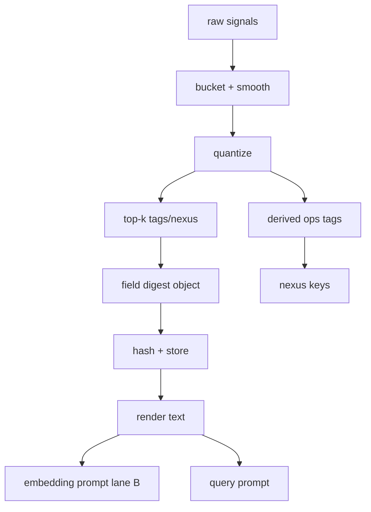

## Field Digest v0.1: deterministic “state vector” that doesn’t churn #eidolon #field_digest #nexus

You want a **small, stable, deterministic transformer** that turns “whatever the cephalon knows right now” into a **Field Digest** that:

* changes *when it should* (incidents, pressure, new focus)
* doesn’t change every tick (no embedding churn)
* can be hashed and used as a lineage key
* can be fed into both **embedding** and **query** prompts

---

## 1) What the Field Digest is (operational definition)

A **Field Digest** is a *quantized, time-bucketed summary of the system’s circumstantial state*.

* It is **not** a narrative summary of recent messages.
* It is **not** a dump of persistent memories.
* It is an engineered “feature vector” in text form.

The digest is the thing you entangle with text to create an Eidolon embedding:

* “This text, as seen under these conditions.”

---

## 2) Inputs: what feeds the digest

Think of inputs as a set of **signal channels**. Most are numeric and must be quantized.

### 2.1 Always-available signals (cheap)

* `time_bucket` (e.g. 1h or 15m)
* `cephalon_id`, `session_id`, `circuit_id`
* `focus` (short string / “current contract” label)
* `subscriptions` (channel IDs or event filters)

### 2.2 Health signals

* heartbeat state: green/yellow/red
* top error fingerprints (stable families like `err/timeout`, `err/oom`)
* recent restarts / kills / timeouts (counts, bucketed)

### 2.3 Pressure signals

* discord event rate per subscribed channel (bucketed)
* maintenance backlog:

  * outbox pending count + oldest age bucket
  * embedding queue depth bucket
  * gc queue depth bucket (if you add it)

### 2.4 Memory topology signals

* top activated tags in last bucket (from context inclusion logs)
* top activated nexus keys (paths/domains/tools)
* top spam families (counts)

> Key idea: **digest is mostly structured telemetry + top-k categorical signals**.

---

## 3) Stability: time bucketing + quantization + smoothing

This is where “deterministic but evolving” becomes real.

### 3.1 Time bucketing

Pick one per use-case:

* **Embedding digests**: bucket by hour (or 30m)
* **Query digests**: bucket by 5–15m (more reactive)

That means:

* the same content embedded multiple times within the same bucket can reuse the digest
* digest hash stays stable for that bucket unless an “override” is triggered (see below)

### 3.2 Quantization (turn noisy numbers into stable categories)

Examples:

* `discord_rate`:

  * 0–10/min → `low`
  * 10–60/min → `med`
  * 60–300/min → `high`
  * 300+/min → `flood`

* `outbox_oldest_age`:

  * < 5m → `fresh`
  * 5–30m → `stale`
  * 30m–4h → `old`
  * 4h+ → `critical`

### 3.3 Smoothing (optional, still deterministic)

Use EWMA *inside the bucket* but output only quantized classes at bucket boundary.

This avoids:

* a single spike flipping the digest repeatedly

---

## 4) Digest schema (the thing you hash)

Keep it small and predictable. This is a good v0.1 shape:

* `field_version`
* `time_bucket`
* `cephalon_id`, `session_id`, `circuit_id`
* `health`
* `pressure`
* `focus`
* `top_signals`
* `tags_top`
* `nexus_top`

### 4.1 Canonical digest object (JSON-ish shape)

(You can store as JSON in DB, and render as text for prompts.)

```js
{
  field_version: 1,
  time_bucket: "2026-01-31T20:00:00Z/1h",
  cephalon_id: "Duck",
  session_id: "janitor",
  circuit_id: "c1-survival",

  focus: "dedupe and aggregate bot spam; maintain health",

  health: {
    state: "green|yellow|red",
    err_families_top: ["timeout", "rate-limit"],
    restarts_bucket: 0
  },

  pressure: {
    discord: { overall: "med", per_channel: {"367156652140658699":"high"} },
    maintenance: {
      outbox: { pending: "low|med|high", oldest: "fresh|stale|old|critical" },
      embed_queue: "low|med|high",
      gc_queue: "low|med|high"
    }
  },

  tags_top: ["topic/dedupe", "src/discord", "ops/health-green"],
  nexus_top: ["chan/367156652140658699", "tool/discord.send_message", "net/domain/github.com"]
}
```

### 4.2 Digest hash

Compute:

* `field_digest_hash = sha256(canonical_json(digest_object))`

Where `canonical_json` means:

* stable key order
* stable array order (already sorted)
* no extra fields

---

## 5) Override triggers (when digest is allowed to change mid-bucket)

To avoid “wait until bucket boundary” during real incidents:

### 5.1 Override conditions

If any of these change, regenerate digest immediately:

* `health.state` changes (green→yellow→red)
* a new `err_family` enters top-k
* `pressure.discord.overall` crosses `high` threshold
* `maintenance.outbox.oldest` becomes `critical`
* `focus` changes (contract switch)

This gives you reactivity without high-frequency churn.

---

## 6) Field Digest generator as a deterministic transformer

### 6.1 Inputs it reads

* latest heartbeat snapshot(s)
* counters aggregated in time buckets (events/min, tool calls/min)
* maintenance queue snapshots
* “top activated tags/nexus keys” from context logs (also bucketed)

### 6.2 Outputs it writes

* `field_digests` table/collection keyed by:

  * `(cephalon_id, session_id, circuit_id, time_bucket)`
* and returns `field_digest_text` for embedding/query prompts

---

## 7) Implementation sketch (JS-first, no magic)

### 7.1 Quantizers

```js
function bucketRatePerMin(x) {
  if (x <= 10) return "low";
  if (x <= 60) return "med";
  if (x <= 300) return "high";
  return "flood";
}

function bucketCount(x) {
  if (x <= 10) return "low";
  if (x <= 100) return "med";
  return "high";
}

function bucketAgeMs(ms) {
  const m = ms / 60000;
  if (m < 5) return "fresh";
  if (m < 30) return "stale";
  if (m < 240) return "old";
  return "critical";
}
```

### 7.2 Stable top-k extraction

```js
function topKFromMap(mapObj, k) {
  // mapObj: {key: count}
  return Object.entries(mapObj)
    .sort((a, b) => (b[1] - a[1]) || (a[0] < b[0] ? -1 : 1))
    .slice(0, k)
    .map(([key]) => key);
}
```

### 7.3 Digest builder

```js
function buildFieldDigest({
  nowTs,
  bucketSpec,              // {sizeMs, label}
  ids,                     // {cephalon_id, session_id, circuit_id}
  focus,
  healthSnapshot,          // {state, errFamiliesCounts, restartsInBucket}
  pressureSnapshot,        // {discordRates, outbox, embedQueue, gcQueue}
  activationStats          // {tagsCounts, nexusCounts}
}) {
  const timeBucketStart = Math.floor(nowTs / bucketSpec.sizeMs) * bucketSpec.sizeMs;
  const timeBucket = `${new Date(timeBucketStart).toISOString()}/${bucketSpec.label}`;

  const tags_top = topKFromMap(activationStats.tagsCounts, 8);
  const nexus_top = topKFromMap(activationStats.nexusCounts, 8);

  const perChannel = {};
  for (const [chan, rate] of Object.entries(pressureSnapshot.discordRates.perChannel || {})) {
    perChannel[chan] = bucketRatePerMin(rate);
  }

  const digest = {
    field_version: 1,
    time_bucket: timeBucket,
    cephalon_id: ids.cephalon_id,
    session_id: ids.session_id,
    circuit_id: ids.circuit_id,

    focus: focus,

    health: {
      state: healthSnapshot.state,
      err_families_top: topKFromMap(healthSnapshot.errFamiliesCounts || {}, 3),
      restarts_bucket: healthSnapshot.restartsInBucket || 0
    },

    pressure: {
      discord: {
        overall: bucketRatePerMin(pressureSnapshot.discordRates.overall || 0),
        per_channel: perChannel
      },
      maintenance: {
        outbox: {
          pending: bucketCount(pressureSnapshot.outbox.pending || 0),
          oldest: bucketAgeMs(pressureSnapshot.outbox.oldestAgeMs || 0)
        },
        embed_queue: bucketCount(pressureSnapshot.embedQueue || 0),
        gc_queue: bucketCount(pressureSnapshot.gcQueue || 0)
      }
    },

    tags_top,
    nexus_top
  };

  return digest;
}
```

### 7.4 Render digest into text (for prompts)

```js
function renderDigestText(d) {
  const lines = [];
  lines.push(`field_digest_v${d.field_version}`);
  lines.push(`time_bucket: ${d.time_bucket}`);
  lines.push(`cephalon: ${d.cephalon_id}`);
  lines.push(`session: ${d.session_id}`);
  lines.push(`circuit: ${d.circuit_id}`);
  lines.push("");
  lines.push(`focus: ${d.focus}`);
  lines.push("");
  lines.push(`health: ${d.health.state}`);
  if (d.health.err_families_top.length) {
    lines.push(`err_top: ${d.health.err_families_top.join(", ")}`);
  }
  lines.push(`restarts_bucket: ${d.health.restarts_bucket}`);
  lines.push("");
  lines.push(`pressure_discord: ${d.pressure.discord.overall}`);
  for (const [chan, lvl] of Object.entries(d.pressure.discord.per_channel)) {
    lines.push(`pressure_chan_${chan}: ${lvl}`);
  }
  lines.push(`outbox_pending: ${d.pressure.maintenance.outbox.pending}`);
  lines.push(`outbox_oldest: ${d.pressure.maintenance.outbox.oldest}`);
  lines.push(`embed_queue: ${d.pressure.maintenance.embed_queue}`);
  lines.push(`gc_queue: ${d.pressure.maintenance.gc_queue}`);
  lines.push("");
  lines.push(`tags_top: ${d.tags_top.join(", ")}`);
  lines.push(`nexus_top: ${d.nexus_top.join(", ")}`);
  return lines.join("\n");
}
```

This text is:

* stable ordered
* bounded
* easy to diff
* easy to hash

---

## 8) How digest enters embeddings (Lane B) without preamble dominance

Use it as a **compact block**, then ensure `text_to_embed` is the largest part.

### Lane B embedding payload

```text
{system_defined_embedding_prompt}

{field_digest_text}

as_it_relates_to_{cephalon_id}
{latest_memory}

categories:
{generated_tags}

text:
{text_to_embed}
```

**Important knob:** cap `field_digest_text` to something like 40–80 lines max.

---

## 9) How digest enters queries (entangles retrieval with state)

For retrieval, the digest is often *more valuable* than for embedding, because it “steers” similarity toward state-relevant items.

### Query payload

```text
Instruct: {circuit_instruction}
Query:
{query_text}

Field:
{field_digest_text_compact}
```

Where `field_digest_text_compact` is the same digest but with fewer lines (drop per-channel details unless needed).

---

## 10) Digest becomes a Nexus key

You don’t want `field_digest_hash` itself to be a nexus key (too unique), but you **do** want digest components to become keys:

* `health/green|yellow|red`
* `pressure/discord/high`
* `pressure/outbox/critical`
* `focus/dedupe` *(if you normalize focus into a tag)*
* `circuit/c1-survival`

So the digest generator should also output *derived tags* (tier 1-ish tags), e.g.:

* `ops/health-green`
* `ops/pressure-discord-high`
* `ops/outbox-critical`

Those become stable “chemistry” keys for daimoi expansion.

---

## 11) Policy config (EDN) for digest generation

Add something like `eidolon/field_digest.edn`:

```clojure
{:field-digest
 {:version 1

  :time-buckets
  {:embedding {:size-ms 3600000 :label "1h"}
   :query     {:size-ms 900000  :label "15m"}}

  :caps
  {:tags-top 8
   :nexus-top 8
   :err-top 3
   :per-channel 6}

  :thresholds
  {:discord-rate {:low 10 :med 60 :high 300}
   :count {:low 10 :med 100}
   :age-minutes {:fresh 5 :stale 30 :old 240}}

  :override-triggers
  {:health-state-change? true
   :new-err-family? true
   :pressure-crossing? true
   :focus-change? true}}}
```

---

## 12) One more diagram: digest lifecycle



---

## Next continuation (if you want it)

The next “locking” move is to define **Field State persistence**:

* what lives in shared Eidolon state vs per-session state
* how sessions update shared state without stepping on each other
* how you prevent “digest thrash” from multiple sessions updating counters

That’s where Eidolon stops being a metaphor and becomes a real, shared body.

*Created with the assistance of an AI.*
