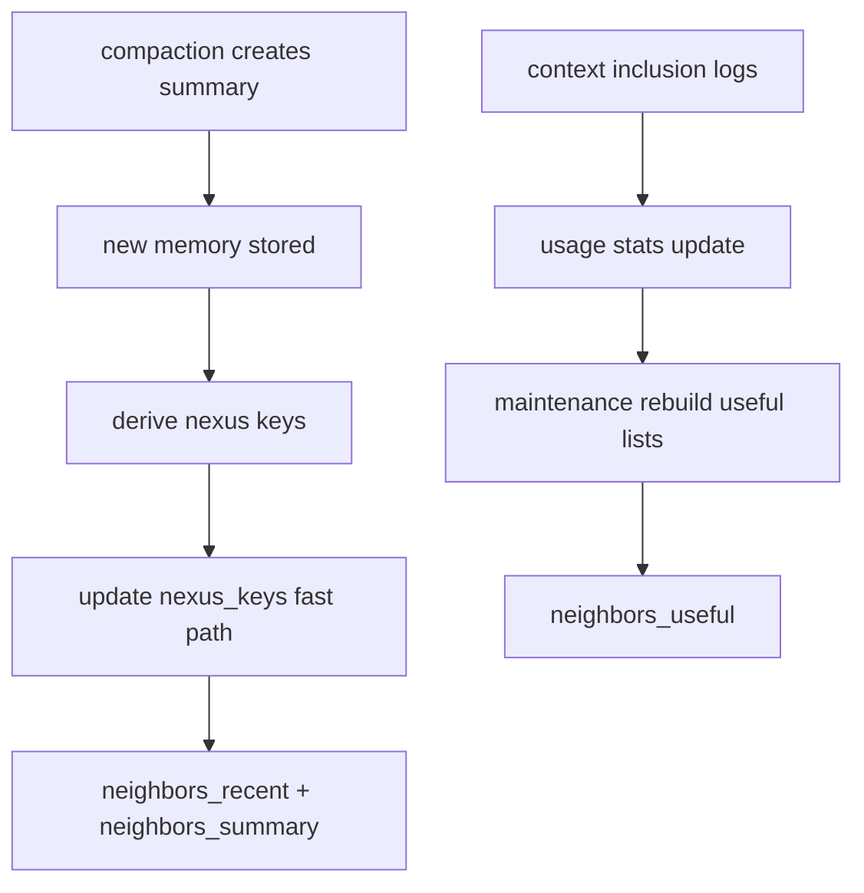

## Nexus Index v0.1: scalable metadata graph for “everything the agent has seen” #nexus #index #metadata #retrieval

Your premise is strong: **don’t index “files” or “websites” as special categories**—index *tool calls and their results*, plus *all events*. Then “files/websites” are just nexus keys (path/url) that naturally become hubs.

To make that scale, the Nexus Index needs to be:

* incremental
* bounded
* summary/aggregate-aware
* cheap to query (neighbors + degree)
* safe under GC (no ghost links)

---

## 1) What the Nexus Index stores (minimum viable)

For each nexus key `K`, you want:

* `degree` (how many memories reference it)
* neighbor lists (IDs of memories) for fast expansion:

  * `recent_neighbors` (newest first)
  * `useful_neighbors` (highest inclusion/utility first)
  * `summary_neighbors` (prefer summaries/aggregates)
* optional: `co_keys` (keys frequently co-occurring with K)

You do **not** need full adjacency lists for everything to start—bounded lists are enough for daimoi.

---

## 2) Key space design (typed strings)

Use the typed key format you already started:

* `tag:topic/dedupe`
* `tool:discord.send_message`
* `path:/home/err/...`
* `url:https://...`
* `net:domain/github.com`
* `chan:367156652140658699`
* `err:timeout`
* `repo:octave-commons/gates-of-aker`
* `hash:content/<sha256>` *(optional, for dedupe hubs)*

### Canonicalization rules (critical)

* lower-case domains
* normalize URLs (strip tracking params, normalize scheme)
* normalize paths (resolve `..`, consistent separators)
* normalize tags (sorted, consistent casing)
* normalize tool names (one canonical registry)

Deterministic keys are what makes nexus “real”.

---

## 3) Index documents (bounded adjacency)

### 3.1 `nexus_keys` collection

```json
{
  "_id": "tool:discord.send_message",
  "key_type": "tool",
  "degree": 12345,

  "neighbors_recent": [
    {"memory_id":"uuid","ts":0,"kind":"summary","score":0.0}
  ],

  "neighbors_useful": [
    {"memory_id":"uuid","ts":0,"kind":"summary","score":12.3}
  ],

  "neighbors_summary": [
    {"memory_id":"uuid","ts":0,"kind":"summary","score":0.0}
  ],

  "stats": {
    "ts_first": 0,
    "ts_last": 0
  },

  "schema_version": 1
}
```

### 3.2 Bounds

Set hard caps per list:

* `neighbors_recent`: 200–2000
* `neighbors_useful`: 200–2000
* `neighbors_summary`: 200–2000

You can tune later; the point is *bounded memory*.

---

## 4) Incremental update: “index on write” (fast path)

Whenever you store a memory, you already know its nexus keys:

* tags → `tag:*`
* metadata → `tool:*`, `chan:*`, `path:*`, `url:*`, `err:*`

So on memory insert:

1. for each key:

   * increment `degree`
   * update `ts_last`
   * upsert into `neighbors_recent` (dedupe memory_id)
   * if memory kind is summary/aggregate: upsert into `neighbors_summary`

### 4.1 Deterministic neighbor insertion

* `neighbors_recent` sorted by `ts desc`
* stable tie-break: `memory_id`

Dedupe by `memory_id`.

---

## 5) “Useful neighbors” maintenance (slow path)

`neighbors_useful` depends on inclusion stats, which update after context assembly.

So:

* the fast path does NOT touch `neighbors_useful`
* a maintenance job periodically refreshes `neighbors_useful` for “hot keys”

### Hot key selection

A key is “hot” if:

* high degree AND frequently activated in the last buckets
* appears in field digest top-k
* used by recent daimoi walkers

Then rebuild useful list as:

* top memories by `usage.included_count_decay` among memories with that key
* prefer summaries/aggregates
* exclude deleted

---

## 6) GC + compaction interactions (avoid ghost links)

### 6.1 Logical deletion rule

If a memory is `lifecycle.deleted=true`, it must be excluded at query time.

But you also want to prevent neighbor lists from filling with deleted IDs over time.

### 6.2 Practical strategy

* do **not** try to surgically remove IDs from every key on deletion (expensive)
* instead:

  * query-time filter out deleted
  * maintenance compacts neighbor lists for hot keys:

    * remove deleted
    * replace raw nodes with summary/aggregate when available
    * trim to cap

This is exactly like your compaction philosophy: lazily clean what gets used.

### 6.3 Optional outbox for index cleanup

If you want stronger hygiene, emit an outbox item:

* `nexus.prune_memory(memory_id, keys[])`
  and let a low-priority worker prune IDs from keys (still bounded work).

---

## 7) Summary/aggregate preference: keep the graph compressed

You don’t want nexus expansion to pull:

* 400 copies of the same bot spam
* 80 raw tool outputs from last month

So the nexus index should:

* naturally route walkers toward **summaries** and **aggregates**

### Implementation rule

Whenever you insert a summary/aggregate memory:

* for every key it carries:

  * ensure it is in `neighbors_summary`
  * also consider bumping it into `neighbors_recent` (it’s new and high-signal)

And when you rebuild `neighbors_useful`:

* apply kind weights:

  * summary: +3
  * aggregate: +2
  * human msg: +1
  * bot raw: -2

This means daimoi quickly find compressed representations.

---

## 8) Key degree and IDF penalty (cheap to compute)

You already store `degree` per key. That makes:

* `penalty = 1 / sqrt(1 + log(1 + degree))`

available instantly. Daimoi walkers can use it without scanning.

---

## 9) Co-key stats (optional but powerful)

If you store co-occurrence, you can do “second-order nexus”:

* from `key A`, discover frequent companions `key B`
* then expand by B without needing vector similarity

This is how you get “associative leaps.”

### Minimal co-key store (bounded)

For each key K:

* store top 32 co-keys by count (within time bucket)

But v0.1 can skip this.

---

## 10) Example: discord spam family forms a nexus

Imagine repeated bot messages:

* same `chan:*`
* same `tag:topic/dedupe`
* same `tool:*` (if produced by a bot pipeline)
* same `hash:content/*` or `spam_family_id`

Those keys become high-degree. To prevent them from dominating:

* IDF penalty dampens them
* summary/aggregate neighbors are preferred
* janitor circuit can override weights to intentionally chase them

So the system can clean spam without being drowned by it.

---

## 11) Nexus Index query API (what daimoi needs)

Daimoi asks for:

* `getNeighbors(key, limit, prefer="summary|useful|recent")`
* `getDegree(key)`
* optionally `getCoKeys(key)`

Implementation:

* choose the neighbor list based on prefer
* filter deleted at read time
* return at most `limit`

That’s it.

---

## 12) Mermaid: how nexus index stays updated



---

## Next continuation

Now you can retrieve “everything,” but you also need to **control cost**:

* incremental embedding scheduling (what gets embedded now vs later)
* how you batch embeddings per model
* how you handle “same content embedded many times” with lineage caps
* how you avoid embedding junk (or do you intentionally embed junk but rely on aggregates)

If you want, next I’ll write: **Embedding Scheduler v0.1: cost-aware, state-aware, deterministic.**

*Created with the assistance of an AI.*
