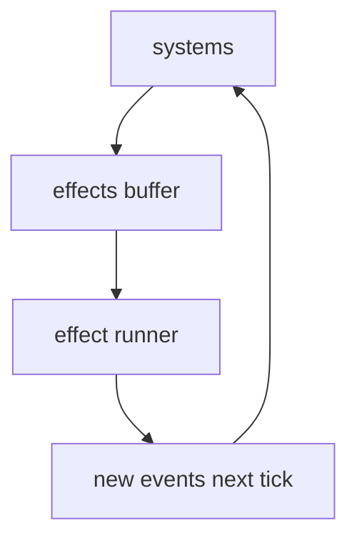

# Implementation details v0: ECS keys + system signatures + effect pipeline (pure `shadow-cljs`) #ecs #shadowcljs #promethean

You’ll go fastest if you treat **systems as mostly pure** and push side effects through a **command buffer** (“effects”), like a game engine. That keeps the simulation deterministic, debuggable, and replayable—even though you’re talking to OpenAI-compatible APIs and Discord.

---

## 1) World shape (the minimum that scales)

```clojure
{:tick 0
 :time-ms 0

 ;; ECS
 :entities {eid {comp-key comp-val ...} ...}

 ;; Event plumbing
 :events/in  []     ;; ingested this tick
 :events/out []     ;; emitted this tick (for adapters / logging)
 :effects    []     ;; side-effect commands produced by systems

 ;; Shared env (adapters + stores)
 :env {:bus          bus
       :stores       {:mem mem-store
                      :nexus nexus-store
                      :vectors vector-store
                      :outbox outbox-store}
       :clients      {:openai openai-client
                      :discord discord-client}
       :config       config
       :debug        {:enabled true ...}}}
```

**Rule:** Systems read `:events/in`, update ECS, and append to `:effects` and `:events/out`.
A single “effects runner” executes effects and produces new events next tick.

---

## 2) Component keys (concrete, start here)

### 2.1 Cephalon entity

```clojure
:cephalon/name              ;; "Duck"
:cephalon/policy            ;; budgets, model prefs, caps
:cephalon/shared-state      ;; field base views, counters, chemistry tags
:cephalon/sessions          ;; set of session eids
```

### 2.2 Session entity (facets/aspects)

```clojure
:session/name               ;; "janitor" | "planner" | "c1-survival" etc
:session/cephalon           ;; cephalon eid
:session/circuit            ;; :c1-survival .. :c8-mythic
:session/subscriptions      ;; hard-locked + soft filters
:session/queue              ;; persistent queue of event ids (or events)
:session/recent             ;; ring buffer of rendered “recent” memories
:session/persistent         ;; pinned memory ids / pointers (facet-level)
:session/focus              ;; stable short label
:session/budgets            ;; per-tick tool/llm budgets
:session/status             ;; :idle|:ready|:blocked
```

### 2.3 Sentinel entity

```clojure
:sentinel/name
:sentinel/contract          ;; input schema, output schema, validator, tools allowed
:sentinel/state             ;; :pending|:running|:validating|:retry|:done|:failed
:sentinel/input             ;; e.g. {:path "..."}
:sentinel/retries           ;; {:attempt 0 :max 5}
:sentinel/last-result       ;; last candidate output
```

### 2.4 Memory (store-first, ECS optional mirror)

If you mirror in ECS, keep it light:

```clojure
:memory/id
:memory/kind
:memory/tags
:memory/nexus-keys
:memory/lifecycle
```

…but I’d keep full memory in `:stores/mem` and only hold ids in ECS.

### 2.5 Eidolon jobs (embedding, compaction)

```clojure
:job/type          ;; :embed/canonical :embed/eidolon :gc/plan :gc/commit ...
:job/priority
:job/status        ;; :pending|:running|:done|:failed
:job/dedupe-key
:job/payload
```

### 2.6 Daimoi walker entity (optional)

```clojure
:daimoi/budget
:daimoi/state
:daimoi/seeds
:daimoi/candidates
```

---

## 3) Event types (canonical list, data-driven)

Events are plain maps. Start with these namespaces:

### 3.1 External ingress

* `:discord.message/new`
* `:fs.file/created`
* `:fs.file/modified`
* `:timer/tick`

### 3.2 Internal pipeline

* `:memory/created` (after normalization + tagging)
* `:eidolon/indexed` (nexus updated)
* `:embedding/job.enqueued`
* `:embedding/job.done`
* `:cephalon/session.ready`
* `:llm/response`
* `:tool/called`
* `:tool/result`

### 3.3 Sentinel workflow

* `:sentinel/start`
* `:sentinel/validated`
* `:sentinel/retry`
* `:sentinel/done`

---

## 4) Systems list (ordered, deterministic)

This is the “game loop” ordering I’d start with:

1. `sys.route-events->sessions`
2. `sys.memory.ingest` (normalize → tags → nexus keys → store)
3. `sys.eidolon.index` (update nexus index, schedule embeds)
4. `sys.sentinel.step`
5. `sys.session.scheduler` (fairness + budgets)
6. `sys.cephalon.step` (context assemble → LLM effect)
7. `sys.embedding.worker.step`
8. `sys.compaction.step`
9. `sys.olympia.step`
10. `sys.debug.stats`

Then at the end of tick:

* `sys.effects.flush` (exec effects → emit events for next tick)

---

## 5) Effect pipeline (the key implementation move)

### 5.1 Effect shapes

Effects are just data; runner knows how to execute them.

```clojure
{:effect/type :llm/chat
 :effect/id   "uuid"
 :model "qwen3-vl-2b"
 :messages [...]
 :tools [...]
 :tool-choice "auto"
 :meta {:session-eid ... :cephalon-eid ...}}

{:effect/type :fs/read
 :path "docs/notes/..."
 :meta {...}}

{:effect/type :fs/write
 :path "docs/notes/..."
 :content "..."
 :meta {...}}

{:effect/type :discord/send
 :channel-id "..."
 :content "..."
 :meta {...}}
```

### 5.2 Runner contract

Runner executes effects and produces **events** (not direct state mutation):

* `:llm/chat` → `:llm/response`
* `:fs/read` → `:fs/read.result`
* `:fs/write` → `:fs/write.result`
* `:discord/send` → `:discord/send.result`

This keeps systems pure and replayable.

### Mermaid: effect loop



---

## 6) Core system signatures (concrete)

All systems have the same signature:

```clojure
(defn sys-x [world] world')
```

They only:

* read from `world`
* return updated `world` with new `:entities`, `:events/out`, `:effects`

---

## 7) `sys.cephalon.step`: the “brain tick” in detail

### 7.1 High-level logic

For each session that is `:ready` and within budgets:

1. Pull next event(s) from session queue into `recent` ring buffer
2. Build query text from those events
3. Compute field digest (or fetch cached)
4. Retrieve `related`:

   * vector search canonical + eidolon
   * daimoi expansion via nexus neighbors
5. Assemble messages:

   * `[...related ...persistent ...recent]`
6. Emit effect `:llm/chat`
7. Mark session `:blocked` until response arrives

### 7.2 Context assembly function signature

```clojure
(defn build-context
  [{:keys [stores config]} {:keys [cephalon session]} recent-events]
  ;; => {:messages [...] :tools [...] :meta {...}}
)
```

### 7.3 Messages are “memory view objects”

Keep an internal shape close to OpenAI-compatible:

```clojure
{:role "system" :content "..."}
{:role "user" :content "..."}
{:role "assistant" :content "..."}
{:role "tool" :tool_call_id "..." :content "..."}
```

But store them as **memories** after the fact.

---

## 8) `sys.memory.ingest`: the canonical ingestion pipeline

This system consumes `:events/in` and turns relevant ones into **memories**.

### 8.1 Steps per event

1. normalize → `memory/text`, stable metadata
2. dedupe check (discord message id, content hash, spam family)
3. deterministic tags (rule + extractor tiers)
4. derive nexus keys from tags + metadata
5. store memory (effect or direct store call; I’d do effect `:mem/put` if you want full purity)
6. emit `:memory/created`

### 8.2 Dedupe (discord MVP)

* primary: discord message id (exact)
* secondary: normalized content hash within a time window (near duplicates handled later)

**First job** (janitor) can build spam families over time:

* `spam_family_id = sha256(channel + normalized_text_pattern)`
* aggregate memory per family per bucket

---

## 9) `sys.sentinel.step`: contract-driven state machine

### 9.1 Sentinel loop

For each sentinel entity:

* `:pending` → emit `:fs/read` effect
* on `:fs/read.result` → build prompt → emit `:llm/chat` effect
* on `:llm/response` → validate → either

  * `:fs/write` effect and `:done`, or
  * retry with a stricter prompt and `:retry`

### 9.2 Contract data model (MVP)

```clojure
{:contract/id :frontmatter/v1
 :contract/input {:kind :fs/markdown :path "..."}
 :contract.output {:kind :fs/markdown+frontmatter}
 :contract.validator :validator/frontmatter-v1
 :contract.tools #{:fs/read :fs/write :llm/chat}
 :contract.model "qwen3-vl-2b"}
```

Validators should be pure functions.

---

## 10) `sys.eidolon.index`: nexus + embedding scheduling

Consumes `:memory/created` events:

* update nexus index (fast path)
* enqueue embedding jobs based on policy + backpressure
* emit `:embedding/job.enqueued`

This is where your ECS “simulation” meets the graph reality.

---

## 11) `sys.embedding.worker.step`: batched embeddings

* pull pending embedding jobs by priority
* batch by model
* emit `:llm/embed` effects (or `:openai/embed` effects)
* on results, store vectors + mark jobs done

Keep embeddings as “store-level,” not ECS-level, unless you need live visualization.

---

## 12) Dev workflow wiring: “debug enabled running instance”

### 12.1 Debug components

Add lightweight components/entities for observability:

* `:debug/counters` entity
* `:debug/last-events` ring buffer
* `:debug/system-times` per tick

### 12.2 Tap points

* after routing
* after memory ingest
* after cephalon context build
* after LLM response
* after tool execution

In CLJS, prefer `tap>` + a custom inspector (and keep logs bounded).

---

## 13) Immediate next code to write (I’d do this next)

If you want “implementation details” to move forward, the next concrete deliverable is:

1. `sys.effects.flush` runner (executes effects, emits events)
2. `sys.route-events->sessions`
3. `sys.memory.ingest` (normalize/tags/nexus)
4. One working sentinel: `docs/notes` frontmatter contract
5. One cephalon session “janitor” that only posts a report (no tools yet)

   * prove `[related persistent recent]` assembly

That’s a full vertical slice that “feels alive.”

---

## Pick the next file to concretely define

I can go one level deeper and write **complete initial file contents** (not diffs) for:

* `promethean.main.cljs` (daemon entrypoint + tick loop + wiring)
* `promethean.sys.effects.flush.cljs` (effect runner with OpenAI+FS+Discord)
* `promethean.runtimes.sentinel.cljs` (frontmatter sentinel)
* `promethean.runtimes.cephalon.cljs` (session stepping + LLM call effect)

If you tell me which one you want first, I’ll write it as a full file you can drop into the repo.
