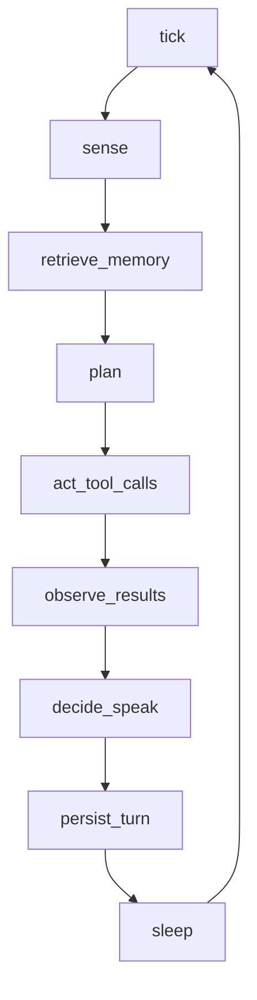

([Past chat][1])([Past chat][1])([Past chat][1])([Past chat][1])([Past chat][2])

Yeah — if **Cephalon “in all its glory”** is the north star, that’s valid.

The trap is trying to jump straight to “glory mode” as one monolith. The way you actually get there is: **define the glory behaviors as a small set of end-to-end “golden paths,” then build the runtime so those paths are boringly reliable**.

Below is a default definition + a build path that gets you to something that *feels* like the bot you’re describing while still being shippable in slices.

---

## Define “all its glory” as 5 concrete capabilities

Think of these as checkboxes that become true over time.

1. **Always_on_loop**

   * ticks on a schedule
   * can pause/resume
   * never wedges itself (timeouts, retries, circuit_breaker)

2. **Tool_native_agent**

   * discovers environment via tools (not prompt magic)
   * tool calls are validated, logged, replayable
   * idempotent where possible

3. **Memory_that_matters**

   * short_term_context (what’s happening now)
   * long_term_memory (facts + preferences + summaries)
   * retrieval that’s predictable (not “hope the embed works”)

4. **Durable_everything**

   * every turn is persisted (input, tool_calls, tool_results, output)
   * can reconstitute state after crash
   * can rebuild `.reconstituted/...` artifacts from logs

5. **Safety_by_construction**

   * permissions + scopes per tool
   * rate limits + escalation gates
   * “can’t do dumb stuff fast”

If Cephalon hits these, it *is* the “more than clawd bot” thing — because it’s not just witty output, it’s a **self-maintaining system**.

---

## The core loop architecture (what you’re actually building)

This is the heart. Everything else is “just” better implementations of each node.

---

## Build Cephalon by milestones (each one is a shippable win)

### Milestone_1: Golden_path_bot

**Goal:** one server, one channel, repeatable behavior loop.

**Definition_of_done**

* lists channels
* reads last 100 messages from 1 channel
* writes a short summary message
* stores memory: `channel_summary + active_topics + notable_users`
* repeats every N minutes without crashing

**Must_have_engineering**

* strict tool schema validation
* structured logging for every step
* deterministic turn persistence (jsonl is fine)
* a “repair” pass when the model outputs malformed tool calls

This is your first “real world” artifact.

---

### Milestone_2: Reliable_tool_calling_runtime

**Goal:** stop losing runs to dumb failures.

**Add**

* retries with backoff for network tools
* timeouts everywhere
* circuit_breaker per tool
* rate_limit + budget (messages_per_hour, tokens_per_hour)
* idempotency keys for actions (so retries don’t spam)

If you do nothing else but ship this layer, businesses understand it immediately.

---

### Milestone_3: Durable_memory_and_reconstitution

**Goal:** crash-proof + recoverable + searchable.

**Add**

* durable store for turns + memories (sqlite or mongo)
* `reconstitute` command:

  * rebuild `.reconstituted/cephalon/` from session logs
  * emit “missing pieces” report
* retrieval policy:

  * recent summaries first
  * then stable memories
  * then semantic search (optional)

This is where your “people lose stuff when GLM is coding” pain turns into a product.

---

### Milestone_4: Multi_world_cephalon

**Goal:** multiple daimoi / multiple contexts / real autonomy.

**Add**

* per-guild or per-project identity
* task scheduler (proactive tasks with cool-downs)
* olympia benchmark hooks (success_rate, tool_fail_rate, cost)
* policy layer with permission escalation:

  * safe_read_only default
  * write actions require explicit unlock

Now you’re in “glory mode” without it being fragile.

---

## The shortest path to *feeling* like Cephalon is alive

Do this in order:

1. **Make the bot do something every tick** (even if small)
2. **Make it never crash silently** (always logs + persists)
3. **Make it remember one thing per tick** (memory growth)
4. **Make it choose where to look next** (channel discovery)
5. **Make it ask for permissions when needed** (social realism)

That sequence produces the *vibe* you’re aiming for.

---

## What to do this week (concrete checklist)

### Day_1_2: Golden_path_demo

* one server config
* one channel selection strategy
* one summary template
* one memory record format

### Day_3_4: Turn_persistence + replay

* persist: input, tool_calls, tool_results, output
* add a `replay_turn` dev command that reruns a saved turn (no discord writes)

### Day_5_7: Make_it_unkillable

* timeouts + retries + circuit_breaker
* rate limiting
* repair loop for tool call formatting

End of week: you have something you can screen-record in 2 minutes that looks *real*.

---

## A framing shift that helps with the “real world” feeling

A business doesn’t have to “care about the whole vision” to hire you.

They hire you when you can say:

* “I built an always-on agent runtime that uses tools reliably.”
* “It persists every turn and can reconstitute state after crashes.”
* “It has budgets, rate limits, and a permissions model.”

That’s real-world language for the exact thing you’re building.

---

If you want a single decision to make right now: **commit to Milestone_1 as the v1 release**, and treat everything else as upgrades. That gets you momentum *and* keeps the glory intact.

[1]: https://chatgpt.com/c/697fa31a-ea6c-832b-bd84-5144694c7cdc "Ollama LLM Integration Issues"
[2]: https://chatgpt.com/c/697687f5-4650-8327-bcf6-e2b0f753d9f3 "Ollama Benchmark Setup"
