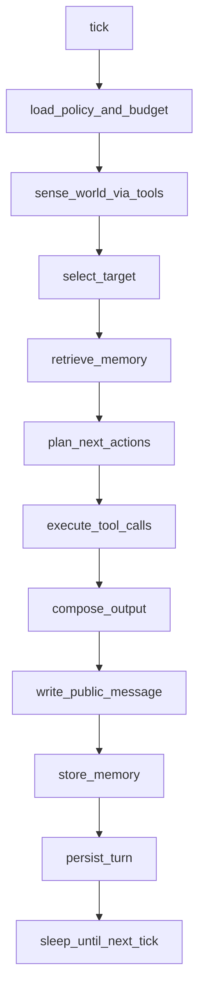
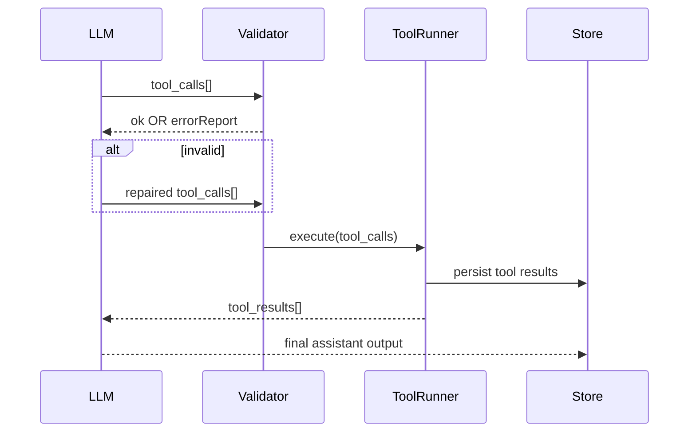

## Cephalon v1 as a real, shippable “alive loop”

You said “continue” — so here’s the next layer down: **the contracts + data shapes + loop rules** that make Milestone_1 not just “works once”, but **boringly repeatable**.

---

## v1 scope that proves the whole concept

### Definition of done

Cephalon can, on a timer:

1. **discover**: list channels
2. **choose**: pick 1 channel deterministically (policy-based)
3. **read**: fetch last 100 messages
4. **summarize**: produce a short public summary message
5. **remember**: store structured memory about that channel
6. **persist**: save the full turn to disk/db
7. **survive**: if tools fail or model outputs junk, it recovers and tries again next tick

### Explicit non-goals (v1)

* multi-agent orchestration
* cross-server “personality arcs”
* deep semantic retrieval
* complex task planning
* training / eval harness beyond basic metrics

This is how you avoid “glory mode” becoming vapor.

---

## The “boring” core: turn persistence as the spine

Everything hangs on this: **every tick produces a TurnRecord** even if it fails.

### TurnRecord (suggested shape)

```js
{
  turnId: "uuid",
  sessionId: "uuid",
  startedAt: 173...,
  endedAt: 173...,
  tick: 421,
  mode: "proactive",
  intent: "channel_scan_and_summarize",
  inputs: {
    trigger: { type: "timer", intervalMs: 60000 },
    env: { guildId, channelId: null }
  },
  context: {
    selectedChannelId: "...",
    retrievedMemoryIds: ["..."],
    budget: { maxToolCalls: 6, maxTokens: 1200 }
  },
  llm: {
    model: "...",
    messages: [ /* exact chat messages sent */ ],
    rawResponse: { /* raw provider payload */ }
  },
  toolCalls: [
    { name, args, callId, startedAt, endedAt, status, error, result }
  ],
  outputs: {
    publicMessages: [{ channelId, content }],
    memories: [{ id, type, payload }]
  },
  metrics: {
    toolSuccessRate: 0.83,
    tokenEstimate: 900,
    failures: ["tool.timeout:discord.readMessages"]
  }
}
```

If you do only one thing “enterprise-grade”, do this.

---

## The loop contract (how Cephalon thinks without going off the rails)

### Deterministic tick phases

This is the order, always:



### Budget rules (simple but strict)

* max tool calls per tick (e.g. 6)
* max wall-clock time per tick (e.g. 15s)
* max “writes” per tick (e.g. 1 message)
* max consecutive failures before cool-down (e.g. 3 → sleep longer)

This is how you get “alive” without “spam cannon”.

---

## Tool calling that doesn’t implode

### Tool call lifecycle

1. LLM proposes tool call(s)
2. **validate** against schema
3. if invalid: **repair loop** (LLM gets a small error report)
4. execute tools with timeouts/retries
5. log tool results
6. feed results back to LLM for final response



### The repair loop (the “delimiter fixer” generalized)

When tool calls fail validation, you do **one** targeted repair attempt with a very tight prompt:

* list exactly what’s wrong (missing field, wrong type, unknown tool)
* instruct to output **only** the corrected tool_calls JSON
* if it fails again → fallback behavior (skip that action, continue tick)

This keeps the system from getting stuck “arguing with itself”.

---

## Memory that matters (v1)

### Memory types (start with 3)

1. `channel.summary`
2. `channel.topics`
3. `channel.people`

Each memory item is **small, structured, and timestamped**.

Example:

```js
{
  id: "uuid",
  type: "channel.summary",
  scope: { guildId, channelId },
  createdAt: 173...,
  ttlDays: 14,
  payload: {
    summary: "Mostly discussing build failures and new agent behaviors.",
    mood: "playful_technical",
    notable: ["new release mentioned", "recurring error pattern: missing delimiters"]
  },
  provenance: { turnId: "uuid" }
}
```

### Retrieval policy (v1)

* fetch last `N` memories for the channel (e.g. 5)
* optionally: one “global” memory about the guild
* **no embeddings required** in v1

The first win is *predictability*, not cleverness.

---

## Selecting a channel like a creature, not a coin flip

### Simple selection heuristic (v1)

Compute a score per channel:

[
score = w_1 \cdot recency + w_2 \cdot activity - w_3 \cdot recentVisits - w_4 \cdot muted
]

Where:

* `recency` = time since last message (higher = more recent)
* `activity` = messages in last 24h
* `recentVisits` = how often Cephalon picked it recently
* `muted` = policy flag

This makes exploration feel intentional.

---

## Safety-by-construction (so “chaotic” stays safe)

### Two-mode tool permissions

* `read_only` (default): list channels, read messages, search, fetch metadata
* `write_limited`: post summary messages (only in allowed channels)

Add a third later:

* `write_enabled`: reactions, threads, DMs, etc.

And enforce:

* **write requires allowlist**
* **max 1 write per tick**
* **cooldown per channel**

This prevents the one thing that ruins bots: accidental spam.

---

## The minimal “glory prompt” for v1 behavior

You want the vibe of discovery, not a back-and-forth assistant.

### System intent (high level)

* “You are an always-on agent. Each tick you must do one small useful action.”
* “Use tools to learn; do not assume.”
* “Prefer read actions; write at most once; store one memory.”
* “If confused, summarize what you learned and store a memory anyway.”

### Tick objective template

* Discover → Summarize → Remember

This produces consistent behavior even when the model is “lazy”.

---

## What makes this *job-relevant* immediately

When you can say:

* “Built a durable autonomous agent loop with strict tool-call validation.”
* “Every tick persisted; replayable runs; crash recovery.”
* “Budgeting, rate limits, and permission gating for safe autonomy.”

…that is extremely legible to hiring managers.

---

## Next concrete deliverables (the stuff you can ship)

### Deliverable A: `cephalon-demo`

* runs against one Discord server
* posts a summary every 5 minutes in a configured channel
* writes `turns.jsonl` locally

### Deliverable B: `turn-replay`

* reads a saved TurnRecord
* replays the LLM call + tool calls in “dry run” mode
* outputs the final message but does not post

### Deliverable C: `cephalon doctor`

* prints last 20 ticks, failures, tool success rate, last memory written

These three make it feel *real* fast.

---

If you want me to keep going *in the most useful direction*, the next layer is:

* a **folder layout** for the runtime (modules/interfaces)
* the **exact prompt + tool schema** for Milestone_1
* the **policy config format** (read-only vs write-limited, allowlists, budgets)

Say the word and I’ll drop those as copy/pasteable file contents (no diffs).
