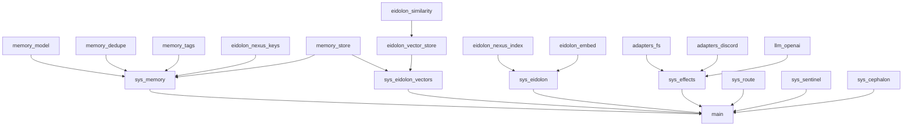

([Past chat][1])([Past chat][1])([Past chat][1])([Past chat][1])([Past chat][1])

## Phase 1 is the right move

You’ve already picked the only consolidation target that makes Phase 1 measurable: **`services/cephalon-cljs/` becomes canonical**, and you **migrate (not delete) `packages/cephalon-cljs/` into it** with unit/integration/e2e coverage. 

What’s missing now is: **a dependency-aware migration order + a test-first harness that doesn’t fight CLJS compile.** Here’s the “continue” as an execution plan you can just start running.

---

## Dependency-aware migration order

Your module list is good; the one tweak is to migrate **pure/leaf modules first**, then “world systems”, then wiring.

### Suggested order inside your Waves

1. **Wave 1: Planning + Contracts**

* Redis RPC envelope schema + tests
* Test utilities + mocks
* Align npm deps in `services/cephalon-cljs` (needed for adapters + Discord client + OpenAI sdk)

2. **Wave 2: Pure core libs (fast unit tests, no IO)**

* `memory/model.cljs`
* `memory/dedupe.cljs`
* `memory/tags.cljs`
* `contracts/markdown_frontmatter.cljs`
* `eidolon/similarity.cljs`
* `eidolon/nexus_keys.cljs`

3. **Wave 3: Stateful-but-in-memory libs**

* `memory/store.cljs`
* `eidolon/nexus_index.cljs`
* `eidolon/vector_store.cljs`
* `eidolon/embed.cljs`

4. **Wave 4: IO adapters + LLM**

* `adapters/fs.cljs`
* `adapters/discord.cljs`
* `llm/openai.cljs`

5. **Wave 5: Systems**

* `sys/route.cljs`
* `sys/memory.cljs`
* `sys/eidolon.cljs`
* `sys/eidolon_vectors.cljs`
* `sys/sentinel.cljs`
* `sys/effects.cljs`
* `sys/cephalon.cljs`

6. **Wave 6: Wire + E2E**

* Update `services/cephalon-cljs/src/promethean/main.cljs` to use migrated sys modules (and preserve TS bridge callsite)

### Mermaid map (Obsidian friendly)

---

## Wave 1 specifics

### 1) Sync `services/cephalon-cljs/package.json` deps (compile blockers)

To migrate adapters + llm without weird runtime failures, `services/cephalon-cljs` needs the same deps that `packages/cephalon-cljs` had:

* `openai`
* `discord.js`
* `chokidar`

(Keep your existing `@promethean-os/cephalon-ts` + `fastify` if they’re already used in services.)

Also: your constraint “no new features” still allows this because it’s **dependency parity** needed to compile/run the migrated modules.

### 2) Define the Redis RPC envelope schema (schema only)

Keep it boring and versioned:

**Envelope fields (suggested)**

* `:rpc/v` integer (start at `1`)
* `:rpc/id` string uuid
* `:rpc/ts` number ms
* `:rpc/kind` `:req` or `:res`
* `:rpc/op` keyword (e.g. `:rpc/call`, `:rpc/cast`, `:rpc/reply`)
* `:rpc/payload` map (freeform, but must be a map)
* `:rpc/meta` map (optional)
* responses add either:

  * `:rpc/ok true` + `:rpc/result <any>`
  * `:rpc/ok false` + `:rpc/error {:code keyword :message string :data map?}`

**Tests (minimum)**

* valid request passes spec
* valid response ok passes spec
* valid response error passes spec
* invalid: missing `:rpc/id` fails
* invalid: `:rpc/kind` not in `#{:req :res}` fails

> Keep it strictly “envelope”, no encoding/transport yet. Later your Redis transport just wraps this as JSON/Transit.

### 3) Test utilities

Add a small helper namespace in `services/cephalon-cljs/test/promethean/test_utils.cljs`:

* `deferred` / `await-promise` helpers for async `cljs.test`
* “fake client” builders:

  * fake OpenAI client that captures payloads passed to `.create`
  * fake discord client that simulates ready + send
  * fake fs promises (`readFile`, `writeFile`)

---

## “Tests first” without compile pain

For each migrated module, do this pattern:

1. **Create the target namespace file in `services/cephalon-cljs/src/promethean/...` with only the `ns` form + `declare` stubs** for public fns.
2. Write the tests (they compile because symbols exist, but fail).
3. Copy the real implementation from `packages/cephalon-cljs` into the services file.
4. Tests pass.

That keeps “tests first” *and* keeps shadow compiling continuously.

---

## Minimal test checklist per module

### Pure modules

* `memory/model`

  * `base-memory` always has required keys; defaults (`:memory/tags []`, etc.)
* `memory/dedupe`

  * discord event produces deterministic dedupe key
  * content hash key triggers when message-id missing
* `memory/tags`

  * discord message includes `src/discord`
  * fs created/modified tags correct
  * regex tags (`ops/error`, `dev/build`) work
* `contracts/markdown_frontmatter`

  * good YAML frontmatter passes
  * missing required keys fails

### In-memory stores

* `memory/store`

  * `put-memory!` increments `:put`
  * dedupe key collision increments `:deduped` and does not overwrite
  * `inc-usage!` updates usage and stats
* `eidolon/nexus-index`

  * upsert adds/removes keys correctly
  * neighbors returns shared counts
* `eidolon/vector-store`

  * upsert then search returns ranked IDs
  * deleted meta removes from results
* `eidolon/similarity`

  * cosine basics (same vector = 1, orthogonal = 0)
  * recency bonus decreases with age

### Adapters + LLM

* `llm/openai`

  * `chat!` builds payload with optional fields only when provided
  * `embed!` passes `{model input}`
* `adapters/fs`

  * `read-file!` calls underlying `readFile` with utf8
  * `write-file!` returns `{:ok true :path ...}`
* `adapters/discord`

  * `send-message!` rejects when not ready
  * when ready, calls fetch/send chain

### Systems (integration-y)

* `sys/route`

  * event routes only to sessions whose filters match
* `sys/memory`

  * discord event produces memory, tags, dedupe-key, nexus-keys, stores it, emits `:memory/created`
* `sys/effects`

  * effect queue enqueues pending, starts up to max inflight, emits `.result` or `.error` events
* `sys/sentinel`

  * given fs created event, emits read effect, then llm effect, then write effect (using synthetic result events)

---

## Wiring into `services/cephalon-cljs/src/promethean/main.cljs`

Goal: **main becomes composition only**:

* build `env` with adapters + OpenAI client + stores + indexes + vector store
* init world entities (cephalon + sessions)
* systems vector becomes the migrated sys modules (not inline versions)
* preserve any TS bridge call (your current `cephalon-ts/start-memory-ui!`) exactly where it already happens

No “new behavior”; just assembling the migrated behavior in the canonical service.

---

## What I would do next (smallest batch that moves reality)

1. Add deps parity (`openai`, `discord.js`, `chokidar`) in `services/cephalon-cljs`
2. Add `promethean.rpc.envelope` + tests
3. Migrate + test these in order:

   * `memory/model`, `memory/dedupe`, `memory/tags`, `memory/store`
4. After that, you’ll already have a meaningful green bar and can move into eidolon + sys.

---

#cephalon #clojurescript #tdd #promethean #architecture

[1]: https://chatgpt.com/c/697fa31a-ea6c-832b-bd84-5144694c7cdc "Ollama LLM Integration Issues"
