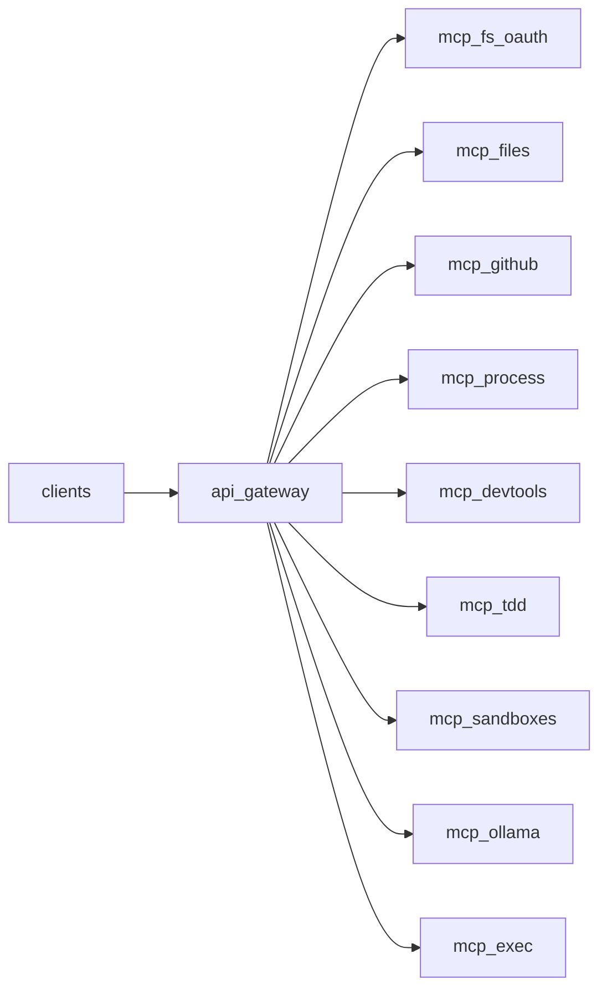

# mcp migration overview

## goal
Migrate everything except oauth from `orgs/riatzukiza/promethean/services/mcp` into independent `services/mcp-*` services, all proxied behind `services/api-gateway`, matching the deployment pattern used by `services/mcp-fs-oauth`.

This is not just splitting an mcp server. The legacy `promethean/services/mcp` is also a spec and runtime for defining workflows with composable tools and packaging them as mcp servers. The migration must preserve that capability.

## non goals
- Replacing oauth provider implementation (oauth remains in `services/mcp-fs-oauth`).
- Renaming tool ids in a way that breaks existing workflows.

## current state
- `services/api-gateway` proxies all mcp traffic to a single upstream `MCP_FS_OAUTH_URL`.
  - `/api/mcp/*` is proxied to the upstream with `/api` stripped.
  - root oauth endpoints (`/authorize`, `/token`, `/.well-known/*`, `/login*`, `/auth/*`) are also proxied to the same upstream.
- `services/mcp-fs-oauth` provides oauth + mcp endpoint at `/mcp`.
- `services/mcp-files` exists but currently runs auth-free and exposes `fs_*` tool ids.
- legacy monolith `orgs/.../services/mcp` exposes many non oauth toolpacks (github, process manager, pnpm, nx, tdd, sandboxes, ollama, etc).

## target state
- `services/api-gateway` becomes a mux for mcp services.
  - root oauth endpoints remain pinned to `mcp-fs-oauth`.
  - tool traffic is routed by service name, eg `/api/mcp/github/* -> services/mcp-github`.
- each `services/mcp-*` service:
  - exposes mcp at `/mcp`.
  - does not implement oauth flows.
  - validates authorization according to the auth strategy (see auth spec).
  - preserves tool ids (or provides aliases).

## key constraints
- keep oauth isolated in `services/mcp-fs-oauth`.
- keep tool ids stable for workflows.
- avoid `fs_tree` heavy scans for repo discovery; prefer glob and grep.
- gateway streaming must remain correct for `text/event-stream` mcp responses.

## phased plan

### phase 0 inventory
- generate a tool id to service mapping (see tool id spec doc).
- identify shared runtime code that should live in packages (optional if `@workspace/mcp-runtime` already covers it).

### phase 1 api gateway mux
- keep existing single upstream behavior for backward compatibility.
- add mux routing for `/api/mcp/:service/*`.
- configure service url map via env.

### phase 2 migrate toolpacks
- migrate github toolpack first (largest surface area).
- then process manager.
- then devtools (pnpm nx apply_patch).
- then tdd.
- then sandboxes.
- then ollama.
- then exec (hardened).

### phase 3 cutover and cleanup
- flip clients and workflow specs to use mux paths.
- keep legacy `/api/mcp/* -> fs-oauth` during transition.
- once no callers rely on it, decide whether to:
  - keep it as alias to `fs-oauth`, or
  - remove it to force explicit routing.

## deliverables
- new spec docs in `spec/2026-02-08-mcp-*.md`.
- a route table and env var contract for the gateway.
- service skeletons for each toolpack.
- contract tests ensuring tool list and invoke behavior is stable.
